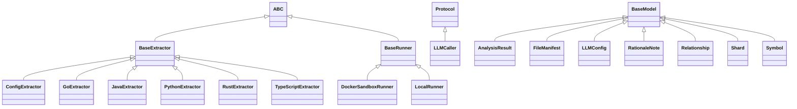

```mermaid
classDiagram
  BaseModel <|-- AnalysisResult
  ABC <|-- BaseExtractor
  ABC <|-- BaseRunner
  BaseExtractor <|-- ConfigExtractor
  BaseRunner <|-- DockerSandboxRunner
  BaseModel <|-- FileManifest
  BaseExtractor <|-- GoExtractor
  BaseExtractor <|-- JavaExtractor
  Protocol <|-- LLMCaller
  BaseModel <|-- LLMConfig
  BaseRunner <|-- LocalRunner
  BaseExtractor <|-- PythonExtractor
  BaseModel <|-- RationaleNote
  BaseModel <|-- Relationship
  BaseExtractor <|-- RustExtractor
  BaseModel <|-- Shard
  BaseModel <|-- Symbol
  BaseExtractor <|-- TypeScriptExtractor
```
