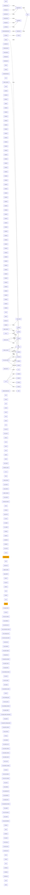

```mermaid
flowchart LR
  __greet["greet"]
  _github_scripts_update_homebrew_tap_py["update-homebrew-tap"]
  ABC["ABC"]
  AnalysisResult["AnalysisResult"]
  BaseExtractor["BaseExtractor"]
  BaseModel["BaseModel"]
  BaseRunner["BaseRunner"]
  ConfigExtractor["ConfigExtractor"]
  DockerSandboxRunner["DockerSandboxRunner"]
  FileManifest["FileManifest"]
  GoExtractor["GoExtractor"]
  JavaExtractor["JavaExtractor"]
  LLMCaller["LLMCaller"]
  LLMConfig["LLMConfig"]
  LocalRunner["LocalRunner"]
  Protocol["Protocol"]
  PythonExtractor["PythonExtractor"]
  RationaleNote["RationaleNote"]
  Relationship["Relationship"]
  RustExtractor["RustExtractor"]
  Shard["Shard"]
  Symbol["Symbol"]
  TypeScriptExtractor["TypeScriptExtractor"]
  __future__["__future__"]
  ast["ast"]
  bin_rekipedia_js["rekipedia"]
  certifi["certifi"]
  child_process["child_process"]
  concurrent_futures["concurrent"]
  importlib["importlib"]
  importlib_metadata["importlib"]
  markdown["markdown"]
  pathspec["pathspec"]
  pyfiglet["pyfiglet"]
  rekipedia["rekipedia"]
  rekipedia_analysis_cross_repo_search["rekipedia"]
  rekipedia_analysis_graph_analysis["rekipedia"]
  rekipedia_analysis_graph_export["rekipedia"]
  rekipedia_analysis_impact["rekipedia"]
  rekipedia_analysis_refactor_detector["rekipedia"]
  rekipedia_analysis_refactor_enricher["rekipedia"]
  rekipedia_analysis_refactor_writer["rekipedia"]
  rekipedia_cli["rekipedia"]
  rekipedia_cli_ask["rekipedia"]
  rekipedia_cli_context["rekipedia"]
  rekipedia_cli_diff["rekipedia"]
  rekipedia_cli_embed["rekipedia"]
  rekipedia_cli_export["rekipedia"]
  rekipedia_cli_hook["rekipedia"]
  rekipedia_cli_impact["rekipedia"]
  rekipedia_cli_init["rekipedia"]
  rekipedia_cli_mcp_cmd["rekipedia"]
  rekipedia_cli_mcp_server["rekipedia"]
  rekipedia_cli_refactor["rekipedia"]
  rekipedia_cli_scan["rekipedia"]
  rekipedia_cli_search["rekipedia"]
  rekipedia_cli_serve["rekipedia"]
  rekipedia_cli_update["rekipedia"]
  rekipedia_cli_watch["rekipedia"]
  rekipedia_exporters_json_export["rekipedia"]
  rekipedia_exporters_markdown_export["rekipedia"]
  rekipedia_extractors["rekipedia"]
  rekipedia_extractors_base["rekipedia"]
  rekipedia_extractors_config_extractor["rekipedia"]
  rekipedia_extractors_go_extractor["rekipedia"]
  rekipedia_extractors_java_extractor["rekipedia"]
  rekipedia_extractors_python_extractor["rekipedia"]
  rekipedia_extractors_rust_extractor["rekipedia"]
  rekipedia_extractors_typescript_extractor["rekipedia"]
  rekipedia_llm_client["rekipedia"]
  rekipedia_models_contracts["rekipedia"]
  rekipedia_orchestrator["rekipedia"]
  rekipedia_orchestrator_agent_hints["rekipedia"]
  rekipedia_orchestrator_run_ask["rekipedia"]
  rekipedia_orchestrator_run_digest["rekipedia"]
  rekipedia_orchestrator_run_update["rekipedia"]
  rekipedia_orchestrator_sharding["rekipedia"]
  rekipedia_orchestrator_snapshot["rekipedia"]
  rekipedia_orchestrator_snapshotter["rekipedia"]
  rekipedia_rag_embedder["rekipedia"]
  rekipedia_rag_scan_meta["rekipedia"]
  rekipedia_sandbox_runner["rekipedia"]
  rekipedia_sandbox_tasks_analyze_shard["rekipedia"]
  rekipedia_server_app["rekipedia"]
  rekipedia_storage_sqlite_store["rekipedia"]
  rekipedia_synthesis_diagram_builder["rekipedia"]
  rekipedia_synthesis_page_builder["rekipedia"]
  rekipedia_synthesis_planner["rekipedia"]
  rekipedia_synthesis_slug_utils["rekipedia"]
  rekipedia_watcher["rekipedia"]
  rekipedia_watcher_watcher["rekipedia"]
  shutil["shutil"]
  sqlite3["sqlite3"]
  sqlite_utils["sqlite_utils"]
  src_rekipedia___main___py["__main__"]
  src_rekipedia_analysis_cross_repo_search_py["cross_repo_search"]
  src_rekipedia_analysis_graph_analysis_py["graph_analysis"]
  src_rekipedia_analysis_graph_export_py["graph_export"]
  src_rekipedia_analysis_impact_py["impact"]
  src_rekipedia_analysis_refactor_detector_py["refactor_detector"]
  src_rekipedia_analysis_refactor_enricher_py["refactor_enricher"]
  src_rekipedia_analysis_refactor_writer_py["refactor_writer"]
  src_rekipedia_cli___init___py["__init__"]
  src_rekipedia_cli_ask_py["ask"]
  src_rekipedia_cli_context_py["context"]
  src_rekipedia_cli_diff_py["diff"]
  src_rekipedia_cli_embed_py["embed"]
  src_rekipedia_cli_export_py["export"]
  src_rekipedia_cli_hook_py["hook"]
  src_rekipedia_cli_impact_py["impact"]
  src_rekipedia_cli_init_py["init"]
  src_rekipedia_cli_mcp_cmd_py["mcp_cmd"]
  src_rekipedia_cli_mcp_server_py["mcp_server"]
  src_rekipedia_cli_refactor_py["refactor"]
  src_rekipedia_cli_scan_py["scan"]
  src_rekipedia_cli_search_py["search"]
  src_rekipedia_cli_serve_py["serve"]
  src_rekipedia_cli_update_py["update"]
  src_rekipedia_cli_watch_py["watch"]
  src_rekipedia_exporters_json_export_py["json_export"]
  src_rekipedia_exporters_markdown_export_py["markdown_export"]
  src_rekipedia_extractors___init___py["__init__"]
  src_rekipedia_extractors_base_py["base"]
  src_rekipedia_extractors_config_extractor_py["config_extractor"]
  src_rekipedia_extractors_go_extractor_py["go_extractor"]
  src_rekipedia_extractors_java_extractor_py["java_extractor"]
  src_rekipedia_extractors_python_extractor_py["python_extractor"]
  src_rekipedia_extractors_rust_extractor_py["rust_extractor"]
  src_rekipedia_extractors_typescript_extractor_py["typescript_extractor"]
  src_rekipedia_llm_client_py["client"]
  src_rekipedia_models_contracts_py["contracts"]
  src_rekipedia_orchestrator_agent_hints_py["agent_hints"]
  src_rekipedia_orchestrator_run_ask_py["run_ask"]
  src_rekipedia_orchestrator_run_digest_py["run_digest"]
  src_rekipedia_orchestrator_run_update_py["run_update"]
  src_rekipedia_orchestrator_sharding_py["sharding"]
  src_rekipedia_orchestrator_snapshot_py["snapshot"]
  src_rekipedia_orchestrator_snapshotter_py["snapshotter"]
  src_rekipedia_rag_embedder_py["embedder"]
  src_rekipedia_rag_scan_meta_py["scan_meta"]
  src_rekipedia_sandbox_runner_py["runner"]
  src_rekipedia_sandbox_tasks_analyze_shard_py["analyze_shard"]
  src_rekipedia_server_app_py["app"]
  src_rekipedia_storage_sqlite_store_py["sqlite_store"]
  src_rekipedia_synthesis_diagram_builder_py["diagram_builder"]
  src_rekipedia_synthesis_page_builder_py["page_builder"]
  src_rekipedia_synthesis_planner_py["planner"]
  src_rekipedia_synthesis_slug_utils_py["slug_utils"]
  src_rekipedia_watcher_watcher_py["watcher"]
  stat["stat"]
  tempfile["tempfile"]
  tests_fixtures_mini_py_repo_core_py["core"]
  tests_fixtures_mini_ts_repo_src_index_ts["index"]
  tests_test_agent_hints_py["test_agent_hints"]
  tests_test_ask_py["test_ask"]
  tests_test_ask_coverage_py["test_ask_coverage"]
  tests_test_confidence_py["test_confidence"]
  tests_test_context_cmd_py["test_context_cmd"]
  tests_test_conversation_memory_py["test_conversation_memory"]
  tests_test_coverage_boost_py["test_coverage_boost"]
  tests_test_cross_repo_search_py["test_cross_repo_search"]
  tests_test_diff_cmd_py["test_diff_cmd"]
  tests_test_embedder_py["test_embedder"]
  tests_test_graph_analysis_py["test_graph_analysis"]
  tests_test_graph_api_py["test_graph_api"]
  tests_test_graph_api_edges_py["test_graph_api_edges"]
  tests_test_graph_export_py["test_graph_export"]
  tests_test_graph_filter_py["test_graph_filter"]
  tests_test_homebrew_formula_py["test_homebrew_formula"]
  tests_test_hook_py["test_hook"]
  tests_test_hub_nodes_py["test_hub_nodes"]
  tests_test_impact_py["test_impact"]
  tests_test_importance_export_py["test_importance_export"]
  tests_test_init_py["test_init"]
  tests_test_knowledge_gaps_py["test_knowledge_gaps"]
  tests_test_mcp_server_py["test_mcp_server"]
  tests_test_multilang_extractors_py["test_multilang_extractors"]
  tests_test_page_builder_py["test_page_builder"]
  tests_test_page_builder_relationships_py["test_page_builder_relationships"]
  tests_test_planner_py["test_planner"]
  tests_test_python_coverage_boost2_py["test_python_coverage_boost2"]
  tests_test_python_extractor_py["test_python_extractor"]
  tests_test_qa_history_py["test_qa_history"]
  tests_test_rag_py["test_rag"]
  tests_test_rationale_py["test_rationale"]
  tests_test_refactor_cmd_py["test_refactor_cmd"]
  tests_test_refactor_detector_py["test_refactor_detector"]
  tests_test_refactor_enricher_py["test_refactor_enricher"]
  tests_test_refactor_writer_py["test_refactor_writer"]
  tests_test_run_ask_py["test_run_ask"]
  tests_test_sandbox_coverage_py["test_sandbox_coverage"]
  tests_test_scan_py["test_scan"]
  tests_test_scan_progress_py["test_scan_progress"]
  tests_test_serve_coverage_py["test_serve_coverage"]
  tests_test_server_py["test_server"]
  tests_test_sharding_py["test_sharding"]
  tests_test_snapshot_diff_py["test_snapshot_diff"]
  tests_test_snapshotter_py["test_snapshotter"]
  tests_test_sqlite_store_py["test_sqlite_store"]
  tests_test_typescript_extractor_py["test_typescript_extractor"]
  tests_test_update_py["test_update"]
  tests_test_v073_features_py["test_v073_features"]
  tests_test_watcher_py["test_watcher"]
  tests_test_wiki_frontmatter_py["test_wiki_frontmatter"]
  textwrap["textwrap"]
  tqdm["tqdm"]
  traceback["traceback"]
  tree_sitter["tree_sitter"]
  tree_sitter_go["tree_sitter_go"]
  tree_sitter_java["tree_sitter_java"]
  tree_sitter_rust["tree_sitter_rust"]
  turso["turso"]
  unittest_mock["unittest"]
  urllib_request["urllib"]
  utils["utils"]
  watchdog_events["watchdog"]
  watchdog_observers["watchdog"]
  webbrowser["webbrowser"]
  xml_etree["xml"]
  yaml["yaml"]
  zipfile["zipfile"]

  _github_scripts_update_homebrew_tap_py -->|imports| urllib_request
  bin_rekipedia_js -->|imports| child_process
  src_rekipedia___main___py -->|imports| rekipedia_cli
  src_rekipedia_analysis_cross_repo_search_py -->|imports| __future__
  src_rekipedia_analysis_cross_repo_search_py -->|imports| concurrent_futures
  src_rekipedia_analysis_cross_repo_search_py -->|imports| rekipedia_storage_sqlite_store
  src_rekipedia_analysis_cross_repo_search_py -->|imports| rekipedia_watcher_watcher
  src_rekipedia_analysis_graph_analysis_py -->|imports| __future__
  src_rekipedia_analysis_graph_analysis_py -->|imports| rekipedia_models_contracts
  src_rekipedia_analysis_graph_export_py -->|imports| __future__
  src_rekipedia_analysis_graph_export_py -->|imports| xml_etree
  src_rekipedia_analysis_impact_py -->|imports| __future__
  src_rekipedia_analysis_refactor_detector_py -->|imports| __future__
  src_rekipedia_analysis_refactor_enricher_py -->|imports| __future__
  src_rekipedia_analysis_refactor_enricher_py -->|imports| concurrent_futures
  src_rekipedia_analysis_refactor_enricher_py -->|imports| rekipedia_llm_client
  src_rekipedia_analysis_refactor_enricher_py -->|imports| rekipedia_models_contracts
  src_rekipedia_analysis_refactor_writer_py -->|imports| __future__
  src_rekipedia_analysis_refactor_writer_py -->|imports| importlib_metadata
  src_rekipedia_analysis_refactor_writer_py -->|imports| rekipedia_models_contracts
  src_rekipedia_cli___init___py -->|imports| __future__
  src_rekipedia_cli___init___py -->|imports| rekipedia_cli_ask
  src_rekipedia_cli___init___py -->|imports| rekipedia_cli_context
  src_rekipedia_cli___init___py -->|imports| rekipedia_cli_diff
  src_rekipedia_cli___init___py -->|imports| rekipedia_cli_embed
  AnalysisResult -->|inherits| BaseModel
  BaseExtractor -->|inherits| ABC
  BaseRunner -->|inherits| ABC
  ConfigExtractor -->|inherits| BaseExtractor
  DockerSandboxRunner -->|inherits| BaseRunner
  FileManifest -->|inherits| BaseModel
  GoExtractor -->|inherits| BaseExtractor
  JavaExtractor -->|inherits| BaseExtractor
  LLMCaller -->|inherits| Protocol
  LLMConfig -->|inherits| BaseModel

  style src_rekipedia_sandbox_tasks_analyze_shard_py fill:#f4a700,stroke:#c47d00,color:#000
  style tests_fixtures_mini_ts_repo_src_index_ts fill:#f4a700,stroke:#c47d00,color:#000
```
