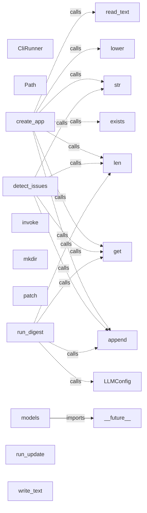

```mermaid
flowchart LR
  CliRunner["CliRunner"]
  LLMConfig["LLMConfig"]
  Path["Path"]
  __future__["__future__"]
  append["append"]
  create_app["create_app"]
  detect_issues["detect_issues"]
  exists["exists"]
  get["get"]
  invoke["invoke"]
  len["len"]
  lower["lower"]
  mkdir["mkdir"]
  patch["patch"]
  read_text["read_text"]
  rekipedia_models["models"]
  run_digest["run_digest"]
  run_update["run_update"]
  str["str"]
  write_text["write_text"]

  rekipedia_models -->|imports| __future__
  create_app -.->|calls| append
  create_app -.->|calls| exists
  create_app -.->|calls| get
  create_app -.->|calls| len
  create_app -.->|calls| lower
  create_app -.->|calls| read_text
  create_app -.->|calls| str
  detect_issues -.->|calls| append
  detect_issues -.->|calls| get
  detect_issues -.->|calls| len
  detect_issues -.->|calls| str
  run_digest -.->|calls| LLMConfig
  run_digest -.->|calls| append
  run_digest -.->|calls| get
  run_digest -.->|calls| len

```
