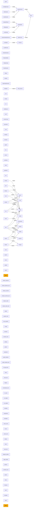

```mermaid
flowchart LR
  __greet["greet"]
  ABC["ABC"]
  AnalysisResult["AnalysisResult"]
  BaseExtractor["BaseExtractor"]
  BaseModel["BaseModel"]
  BaseRunner["BaseRunner"]
  ConfigExtractor["ConfigExtractor"]
  DockerSandboxRunner["DockerSandboxRunner"]
  FileManifest["FileManifest"]
  GoExtractor["GoExtractor"]
  JavaExtractor["JavaExtractor"]
  LLMCaller["LLMCaller"]
  LLMConfig["LLMConfig"]
  LocalRunner["LocalRunner"]
  Protocol["Protocol"]
  PythonExtractor["PythonExtractor"]
  RationaleNote["RationaleNote"]
  Relationship["Relationship"]
  RustExtractor["RustExtractor"]
  Shard["Shard"]
  Symbol["Symbol"]
  TypeScriptExtractor["TypeScriptExtractor"]
  bin_rekipedia_js["rekipedia"]
  child_process["child_process"]
  database_sql["sql"]
  embed["embed"]
  github_com_go_chi_chi_v5["v5"]
  github_com_go_chi_chi_v5_middleware["middleware"]
  github_com_google_uuid["uuid"]
  github_com_philippgille_chromem_go["chromem-go"]
  github_com_pterm_pterm["pterm"]
  github_com_sashabaranov_go_openai["go-openai"]
  github_com_spf13_cobra["cobra"]
  github_com_unrealandychan_rekipedia_cmd_rekipedia_cmd["cmd"]
  github_com_unrealandychan_rekipedia_internal_analysis["analysis"]
  github_com_unrealandychan_rekipedia_internal_config["config"]
  github_com_unrealandychan_rekipedia_internal_exporter["exporter"]
  github_com_unrealandychan_rekipedia_internal_extractor["extractor"]
  github_com_unrealandychan_rekipedia_internal_graph["graph"]
  github_com_unrealandychan_rekipedia_internal_llm["llm"]
  github_com_unrealandychan_rekipedia_internal_models["models"]
  github_com_unrealandychan_rekipedia_internal_orchestrator["orchestrator"]
  github_com_unrealandychan_rekipedia_internal_rag["rag"]
  github_com_unrealandychan_rekipedia_internal_server["server"]
  github_com_unrealandychan_rekipedia_internal_storage["storage"]
  github_com_unrealandychan_rekipedia_internal_synthesis["synthesis"]
  github_com_unrealandychan_rekipedia_pkg_fsutil["fsutil"]
  github_com_yuin_goldmark["goldmark"]
  go_ast["ast"]
  go_cmd_rekipedia_cmd_ask_go["ask"]
  go_cmd_rekipedia_cmd_context_go["context"]
  go_cmd_rekipedia_cmd_diff_go["diff"]
  go_cmd_rekipedia_cmd_embed_go["embed"]
  go_cmd_rekipedia_cmd_export_go["export"]
  go_cmd_rekipedia_cmd_hook_go["hook"]
  go_cmd_rekipedia_cmd_impact_go["impact"]
  go_cmd_rekipedia_cmd_init_go["init"]
  go_cmd_rekipedia_cmd_refactor_go["refactor"]
  go_cmd_rekipedia_cmd_root_go["root"]
  go_cmd_rekipedia_cmd_scan_go["scan"]
  go_cmd_rekipedia_cmd_search_go["search"]
  go_cmd_rekipedia_cmd_serve_go["serve"]
  go_cmd_rekipedia_cmd_update_go["update"]
  go_cmd_rekipedia_cmd_watch_go["watch"]
  go_cmd_rekipedia_main_go["main"]
  go_internal_analysis_refactor_detector_go["refactor_detector"]
  go_internal_analysis_refactor_detector_test_go["refactor_detector_test"]
  go_internal_analysis_refactor_enricher_go["refactor_enricher"]
  go_internal_analysis_refactor_enricher_test_go["refactor_enricher_test"]
  go_internal_analysis_refactor_writer_go["refactor_writer"]
  go_internal_analysis_refactor_writer_test_go["refactor_writer_test"]
  go_internal_config_loader_go["loader"]
  go_internal_exporter_exporter_test_go["exporter_test"]
  go_internal_exporter_json_exporter_go["json_exporter"]
  go_internal_extractor_config_go["config"]
  go_internal_extractor_extractor_go["extractor"]
  go_internal_extractor_extractor_test_go["extractor_test"]
  go_internal_extractor_golang_go["golang"]
  go_internal_extractor_python_go["python"]
  go_internal_extractor_typescript_go["typescript"]
  go_internal_graph_graph_analysis_go["graph_analysis"]
  go_internal_graph_graph_analysis_test_go["graph_analysis_test"]
  go_internal_graph_hub_gap_test_go["hub_gap_test"]
  go_internal_llm_client_go["client"]
  go_internal_llm_client_test_go["client_test"]
  go_internal_orchestrator_helpers_go["helpers"]
  go_internal_orchestrator_orchestrator_test_go["orchestrator_test"]
  go_internal_orchestrator_run_ask_go["run_ask"]
  go_internal_orchestrator_run_digest_go["run_digest"]
  go_internal_orchestrator_run_update_go["run_update"]
  go_internal_orchestrator_sharding_go["sharding"]
  go_internal_orchestrator_snapshotter_go["snapshotter"]
  go_internal_rag_embedder_go["embedder"]
  go_internal_rag_vector_store_go["vector_store"]
  go_internal_server_server_go["server"]
  go_internal_server_server_test_go["server_test"]
  go_internal_storage_aliases_go["aliases"]
  go_internal_storage_store_go["store"]
  go_internal_storage_store_test_go["store_test"]
  go_internal_synthesis_diagram_builder_go["diagram_builder"]
  go_internal_synthesis_page_builder_go["page_builder"]
  go_internal_synthesis_planner_go["planner"]
  go_internal_synthesis_synthesis_test_go["synthesis_test"]
  go_parser["parser"]
  go_token["token"]
  golang_org_x_sync_errgroup["errgroup"]
  gopkg_in_yaml_v3["yaml"]
  html_template["template"]
  modernc_org_sqlite["sqlite"]
  syscall["syscall"]
  tests_fixtures_mini_ts_repo_src_index_ts["index"]

  bin_rekipedia_js -->|imports| child_process
  go_cmd_rekipedia_cmd_ask_go -->|imports| github_com_pterm_pterm
  go_cmd_rekipedia_cmd_ask_go -->|imports| github_com_spf13_cobra
  go_cmd_rekipedia_cmd_ask_go -->|imports| github_com_unrealandychan_rekipedia_internal_models
  go_cmd_rekipedia_cmd_ask_go -->|imports| github_com_unrealandychan_rekipedia_internal_orchestrator
  go_cmd_rekipedia_cmd_ask_go -->|imports| syscall
  go_cmd_rekipedia_cmd_context_go -->|imports| github_com_spf13_cobra
  go_cmd_rekipedia_cmd_diff_go -->|imports| github_com_spf13_cobra
  go_cmd_rekipedia_cmd_embed_go -->|imports| github_com_pterm_pterm
  go_cmd_rekipedia_cmd_embed_go -->|imports| github_com_spf13_cobra
  go_cmd_rekipedia_cmd_embed_go -->|imports| github_com_unrealandychan_rekipedia_internal_rag
  go_cmd_rekipedia_cmd_export_go -->|imports| github_com_spf13_cobra
  go_cmd_rekipedia_cmd_export_go -->|imports| github_com_unrealandychan_rekipedia_internal_exporter
  go_cmd_rekipedia_cmd_export_go -->|imports| github_com_unrealandychan_rekipedia_internal_models
  go_cmd_rekipedia_cmd_export_go -->|imports| github_com_unrealandychan_rekipedia_internal_storage
  go_cmd_rekipedia_cmd_hook_go -->|imports| github_com_spf13_cobra
  go_cmd_rekipedia_cmd_impact_go -->|imports| github_com_spf13_cobra
  go_cmd_rekipedia_cmd_impact_go -->|imports| github_com_unrealandychan_rekipedia_internal_storage
  go_cmd_rekipedia_cmd_init_go -->|imports| github_com_pterm_pterm
  go_cmd_rekipedia_cmd_init_go -->|imports| github_com_spf13_cobra
  go_cmd_rekipedia_cmd_init_go -->|imports| github_com_unrealandychan_rekipedia_internal_config
  go_cmd_rekipedia_cmd_refactor_go -->|imports| github_com_pterm_pterm
  go_cmd_rekipedia_cmd_refactor_go -->|imports| github_com_spf13_cobra
  go_cmd_rekipedia_cmd_root_go -->|imports| github_com_pterm_pterm
  go_cmd_rekipedia_cmd_root_go -->|imports| github_com_spf13_cobra
  AnalysisResult -->|inherits| BaseModel
  BaseExtractor -->|inherits| ABC
  BaseRunner -->|inherits| ABC
  ConfigExtractor -->|inherits| BaseExtractor
  DockerSandboxRunner -->|inherits| BaseRunner
  FileManifest -->|inherits| BaseModel
  GoExtractor -->|inherits| BaseExtractor
  JavaExtractor -->|inherits| BaseExtractor
  LLMCaller -->|inherits| Protocol
  LLMConfig -->|inherits| BaseModel

  style go_cmd_rekipedia_main_go fill:#f4a700,stroke:#c47d00,color:#000
  style tests_fixtures_mini_ts_repo_src_index_ts fill:#f4a700,stroke:#c47d00,color:#000
```
