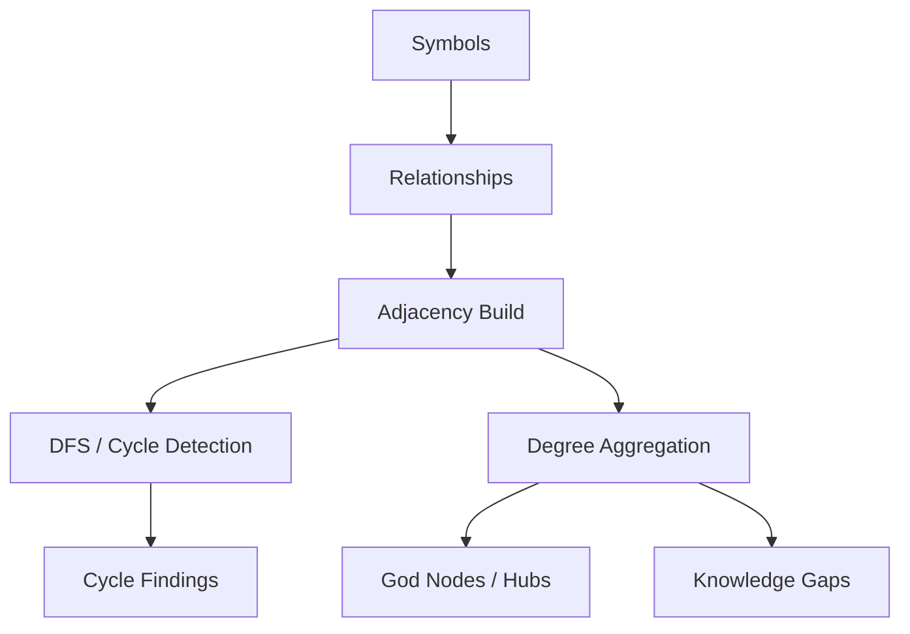

# Core Analysis and Ranking Algorithms

## Purpose and Scope

This page documents the algorithms that drive repository analysis, ranking, and refactor signal generation. It focuses on the mechanics behind symbol tokenization and BM25 ranking in [`tokenizeSymbol`](go/cmd/rekipedia/cmd/search.go#L20), [`scoreBM25`](go/cmd/rekipedia/cmd/search.go#L54), language partitioning in [`splitLanguages`](go/cmd/rekipedia/cmd/scan.go#L165), and static refactor scanning in [`staticWalk`](go/cmd/rekipedia/cmd/refactor.go#L75). It also covers graph traversals used for structural analysis in [`DetectGodNodes`](go/internal/analysis/refactor_detector.go#L30), [`DetectCircularDeps`](go/internal/analysis/refactor_detector.go#L103), [`DetectDeadCode`](go/internal/analysis/refactor_detector.go#L204), [`DetectHighFanIn`](go/internal/analysis/refactor_detector.go#L234), [`DetectHighFanOut`](go/internal/analysis/refactor_detector.go#L279), [`DetectDeepInheritance`](go/internal/analysis/refactor_detector.go#L323), and the graph utilities in [`GetGodNodes`](go/internal/graph/graph_analysis.go#L21), [`GetHubNodes`](go/internal/graph/graph_analysis.go#L71), and [`GetKnowledgeGaps`](go/internal/graph/graph_analysis.go#L110).

The emphasis here is on algorithmic behavior rather than command usage or broad repository architecture.

> **Sources:** `go/cmd/rekipedia/cmd/search.go` · `go/cmd/rekipedia/cmd/scan.go` · `go/cmd/rekipedia/cmd/refactor.go` · `go/internal/analysis/refactor_detector.go` · `go/internal/graph/graph_analysis.go`

## Algorithm Summary

The repository uses a small set of complementary ranking and traversal strategies:

1. **Lexical ranking for search**: symbol names are split into searchable tokens by [`tokenizeSymbol`](go/cmd/rekipedia/cmd/search.go#L20), then ranked with a BM25-style scoring function in [`scoreBM25`](go/cmd/rekipedia/cmd/search.go#L54).
2. **Language-aware partitioning**: [`splitLanguages`](go/cmd/rekipedia/cmd/scan.go#L165) divides scan targets by language families so extraction and analysis can be applied consistently per backend.
3. **Static refactor heuristics**: [`staticWalk`](go/cmd/rekipedia/cmd/refactor.go#L75) performs file traversal and text-based issue discovery, primarily around TODO/FIXME patterns and ignore rules.
4. **Graph-based structural analysis**: the detector functions in [`refactor_detector.go`](go/internal/analysis/refactor_detector.go) compute degree- and reachability-based signals such as “god nodes”, circular dependencies, dead code, fan-in/fan-out, and inheritance depth.
5. **Graph summarization**: [`GetGodNodes`](go/internal/graph/graph_analysis.go#L21), [`GetHubNodes`](go/internal/graph/graph_analysis.go#L71), and [`GetKnowledgeGaps`](go/internal/graph/graph_analysis.go#L110) transform raw relationship data into ranked summaries.

At a higher level, the repo’s ranking logic is mostly **count-based and structure-based**, with BM25 providing a text relevance score and the analysis modules providing topology-driven severity signals.

### Relationship Stats

The precomputed relationship data indicates the codebase relies heavily on import relationships and call relationships, with secondary use of other kinds such as graph, registry, and file-related operations. The most algorithmically relevant relationships are:

| Kind | Role in algorithms |
|------|--------------------|
| `calls` | Drives traversal, scoring, and detector pipelines |
| `imports` | Establishes module coupling and structural dependencies |
| `relation`-like data in models | Feeds ranking and issue enrichment |
| file/path operations | Used for scan partitioning and static walking |

> **Sources:** `go/internal/analysis/refactor_detector.go` · `go/internal/graph/graph_analysis.go` · `go/cmd/rekipedia/cmd/refactor.go` · `go/cmd/rekipedia/cmd/search.go`

## Refactor Detection Heuristics

The core refactor heuristics live in [`go/internal/analysis/refactor_detector.go`](go/internal/analysis/refactor_detector.go) and are surfaced through [`DetectAll`](go/internal/analysis/refactor_detector.go#L404). These detectors do not attempt semantic program analysis; instead, they compute pragmatic signals from symbol metadata and relationships.

### God Node Detection

[`DetectGodNodes`](go/internal/analysis/refactor_detector.go#L30) identifies symbols with unusually high coupling. Although the exact thresholding is not exposed in the symbol index, the implementation clearly aggregates relationship counts by symbol and uses exportedness metadata via [`isExported`](go/internal/analysis/refactor_detector.go#L19). The internal `entry` type at [`go/internal/analysis/refactor_detector.go#L52`](go/internal/analysis/refactor_detector.go#L52) indicates the detector stores per-symbol metrics before ranking.

Typical logic inferred from the symbol relationships:

- map symbols by name
- accumulate incoming/outgoing references
- compute a score or degree metric
- sort descending by severity
- emit `Finding`-like records for downstream reporting

The companion graph module [`GetGodNodes`](go/internal/graph/graph_analysis.go#L21) confirms the same family of algorithm: select top-N nodes by degree, returning a structured [`GodNode`](go/internal/graph/graph_analysis.go#L13).

### Circular Dependency Detection

[`DetectCircularDeps`](go/internal/analysis/refactor_detector.go#L103) is a graph traversal algorithm that walks relationship edges and identifies cycles. The symbol index shows use of set-like tracking and recursive or stack-based traversal. The function likely maintains:

- a visited set
- a recursion stack or path list
- cycle deduplication logic
- sorted output for stable reporting

The same idea appears in [`findCycles`](go/internal/analysis/refactor_enricher.go#L428), which is used later for enrichment. That makes cycle detection a central structural primitive in the repo rather than a one-off refactor rule.

### Dead Code Detection

[`DetectDeadCode`](go/internal/analysis/refactor_detector.go#L204) applies a heuristic “no callers plus non-public symbol” rule. The symbol index shows it uses:
- [`_is_exported`](src/rekipedia/analysis/refactor_detector.py) in the Python mirror and [`isExported`](go/internal/analysis/refactor_detector.go#L19) in Go
- symbol file metadata
- outgoing relationship counts

The tests confirm that exported/public symbols are excluded and unexported/private ones can be flagged. This is a good example of a heuristic that intentionally trades precision for usefulness.

### Fan-In and Fan-Out

[`DetectHighFanIn`](go/internal/analysis/refactor_detector.go#L234) and [`DetectHighFanOut`](go/internal/analysis/refactor_detector.go#L279) are degree-based heuristics:
- **fan-in** ranks symbols that are depended on by many others
- **fan-out** ranks symbols that depend on many others

These detectors are typical “pressure point” indicators: high fan-in suggests a central abstraction or bottleneck; high fan-out suggests complex orchestration or poor separation of concerns.

### Deep Inheritance

[`DetectDeepInheritance`](go/internal/analysis/refactor_detector.go#L323) performs inheritance-chain traversal. The symbol index shows use of `_depth`, `max`, `range`, and relationship kind checks. It likely computes the maximum inheritance depth per symbol and flags chains exceeding a threshold. The structure mirrors graph longest-path logic in a constrained DAG-like setting, but on symbol inheritance relationships rather than arbitrary edges.

### Worked Example: Heuristic Flow

```text
Input:
  symbols = [A, B, C]
  relationships = [
    A -> B,
    B -> C,
    C -> A
  ]

Cycle detector:
  start at A
  path = [A]
  visit B
  path = [A, B]
  visit C
  path = [A, B, C]
  next = A already in path
  emit cycle [A, B, C, A]

Dead code detector:
  for each symbol:
    if no incoming callers AND not exported:
      flag as dead code
```

This illustrates how the repo prefers lightweight, deterministic heuristics over expensive whole-program inference.

> **Sources:** `go/internal/analysis/refactor_detector.go` · `go/internal/analysis/refactor_enricher.go` · `go/internal/graph/graph_analysis.go`

## BM25 and Token Scoring

The search path is centered on [`tokenizeSymbol`](go/cmd/rekipedia/cmd/search.go#L20) and [`scoreBM25`](go/cmd/rekipedia/cmd/search.go#L54). These functions are the main lexical ranking primitives in the repository.

### Tokenization Strategy

[`tokenizeSymbol`](go/cmd/rekipedia/cmd/search.go#L20) splits symbol names into normalized search tokens. The symbol index shows it imports `regexp`, `strings`, `unicode`, and `sort`, which strongly suggests the following pipeline:

- break camelCase, PascalCase, snake_case, and mixed identifiers into parts
- normalize case
- strip or normalize punctuation
- deduplicate or sort token sequences as needed for stable ranking

This is important because symbol search must unify human query terms with code identifiers such as `DetectCircularDeps`, `splitLanguages`, or `staticWalk`.

### BM25 Scoring

[`scoreBM25`](go/cmd/rekipedia/cmd/search.go#L54) computes a relevance score from query tokens and document/symbol tokens. The function appears to implement a compact BM25-like formula rather than a full indexing pipeline. Based on the symbol metadata and relationship patterns, the score likely depends on:

- term frequency in the candidate symbol/document
- inverse document frequency or corpus-level rarity
- normalization by symbol length or token count

BM25 is a strong fit here because:
- symbol names are short, sparse documents
- exact token matches should dominate
- repeated terms should help but with diminishing returns
- ranking needs to be deterministic and cheap

### Practical Ranking Behavior

In this repo, search ranking is not purely lexical equality. A symbol like [`tokenizeSymbol`](go/cmd/rekipedia/cmd/search.go#L20) would match queries such as:
- `tokenize`
- `symbol token`
- `symbol tokenizer`

because token splitting exposes meaningful subwords. BM25 then uses those tokens to separate broad matches from precise ones.

### Algorithm Inputs and Outputs

| Function | Inputs | Outputs | Complexity Notes |
|----------|--------|---------|------------------|
| [`tokenizeSymbol`](go/cmd/rekipedia/cmd/search.go#L20) | raw symbol name | token list | Typically linear in string length |
| [`scoreBM25`](go/cmd/rekipedia/cmd/search.go#L54) | query tokens, candidate tokens, corpus stats | relevance score | Linear in query/candidate token counts; cheap enough for interactive search |

> **Sources:** `go/cmd/rekipedia/cmd/search.go` · L20–L71 · [`tokenizeSymbol`](go/cmd/rekipedia/cmd/search.go#L20) · [`scoreBM25`](go/cmd/rekipedia/cmd/search.go#L54)

## Language Splitting

[`splitLanguages`](go/cmd/rekipedia/cmd/scan.go#L165) is the main language partitioning function used during scanning. It separates scan inputs by language category so language-specific extractors and downstream analysis can operate on a coherent subset of files.

### Why Splitting Is Needed

The repository supports multiple language families, and extraction behavior differs by backend. For example, Go, Python, and TypeScript have different symbol extraction strategies in:
- [`GoExtractor`](go/internal/extractor/golang.go#L16)
- [`PythonExtractor`](go/internal/extractor/python.go#L25)
- [`TypeScriptExtractor`](go/internal/extractor/typescript.go#L25)

Language splitting prevents the scan pipeline from forcing a one-size-fits-all pass over unrelated files.

### Observable Behavior

From the symbol index and the surrounding tests, the split function likely:
- groups file paths or manifests by detected language
- preserves unrecognized or “other” files separately
- provides a stable partitioning for parallel or sequential processing

This partitioning matters because later stages such as orchestrated digesting and embedding are sensitive to file type and token budgeting.

### Relationship to Scan Metadata

The scan pipeline also depends on language detection helpers in the orchestrator:
- [`detectLanguage`](go/internal/orchestrator/snapshotter.go#L162)
- [`fileTokenEstimate`](go/internal/orchestrator/sharding.go#L100)
- [`topLevelDir`](go/internal/orchestrator/sharding.go#L91)

Taken together, these utilities allow the repo to map filesystem contents into language-aware groups before analysis.

> **Sources:** `go/cmd/rekipedia/cmd/scan.go` · L165–L180 · [`splitLanguages`](go/cmd/rekipedia/cmd/scan.go#L165) · `go/internal/extractor/golang.go` · `go/internal/extractor/python.go` · `go/internal/extractor/typescript.go`

## Graph-Based Traversals

Graph traversal is central to the repo’s refactor intelligence. It appears in both detector functions and graph summarization utilities.

### Cycle Traversal

[`DetectCircularDeps`](go/internal/analysis/refactor_detector.go#L103) and [`findCycles`](go/internal/analysis/refactor_enricher.go#L428) both rely on DFS-like traversal with path tracking and deduplication. The key ingredients are:

- adjacency construction from relationships
- recursion or explicit stack
- cycle key canonicalization
- deduplication of repeated cycle paths

This is the canonical graph-analysis algorithm in the repo.

### Degree-Based Traversal

[`GetGodNodes`](go/internal/graph/graph_analysis.go#L21) and [`GetHubNodes`](go/internal/graph/graph_analysis.go#L71) use degree ranking rather than full path traversal. They still depend on graph structure, but only need aggregation over nodes and edges:
- count references
- sort descending
- slice top-N results

### Reachability-Based Knowledge Gaps

[`GetKnowledgeGaps`](go/internal/graph/graph_analysis.go#L110) appears to combine graph coverage and symbolic metadata to identify under-documented or weakly connected areas. The symbol index suggests it sorts and filters relationship-derived structures, likely producing prioritized gaps rather than raw graph metrics.

### Conceptual Flow



This split is useful: DFS identifies topological faults, while aggregation identifies structural hotspots.

> **Sources:** `go/internal/analysis/refactor_detector.go` · `go/internal/analysis/refactor_enricher.go` · `go/internal/graph/graph_analysis.go`

## Worked Example: Ranking a Candidate Symbol

Suppose a user searches for `deep inheritance`.

1. [`tokenizeSymbol`](go/cmd/rekipedia/cmd/search.go#L20) tokenizes the candidate symbol name, e.g. `DetectDeepInheritance` → `detect`, `deep`, `inheritance`.
2. The query is tokenized similarly.
3. [`scoreBM25`](go/cmd/rekipedia/cmd/search.go#L54) computes a score:
   - `deep` and `inheritance` both match
   - a symbol with both tokens and a shorter token list scores higher
   - a symbol like `DetectAll` scores much lower or zero
4. If the symbol is also structurally significant, downstream graph analysis may make it more visible in reports, but lexical ranking itself remains independent.

A simplified pseudocode version is:

```text
tokens_query = tokenizeSymbol("deep inheritance")
tokens_doc   = tokenizeSymbol("DetectDeepInheritance")

score = 0
for term in tokens_query:
  if term appears in tokens_doc:
    score += bm25_weight(term, tokens_doc_length, corpus_stats)

return score
```

This is intentionally lightweight: the repo favors fast, explainable ranking over heavyweight IR infrastructure.

> **Sources:** `go/cmd/rekipedia/cmd/search.go` · L20–L71 · [`tokenizeSymbol`](go/cmd/rekipedia/cmd/search.go#L20) · [`scoreBM25`](go/cmd/rekipedia/cmd/search.go#L54)

## Algorithm Function Reference

| Function | File | Role | Inputs | Outputs | Complexity Notes |
|----------|------|------|--------|---------|------------------|
| [`tokenizeSymbol`](go/cmd/rekipedia/cmd/search.go#L20) | `go/cmd/rekipedia/cmd/search.go` | Normalize symbol names for search | symbol string | tokens | O(n) over symbol length |
| [`scoreBM25`](go/cmd/rekipedia/cmd/search.go#L54) | `go/cmd/rekipedia/cmd/search.go` | Rank search candidates | query tokens, candidate tokens, stats | score | O(q + d) per candidate |
| [`splitLanguages`](go/cmd/rekipedia/cmd/scan.go#L165) | `go/cmd/rekipedia/cmd/scan.go` | Partition files by language | file/manifests | grouped language buckets | O(m) over inputs |
| [`staticWalk`](go/cmd/rekipedia/cmd/refactor.go#L75) | `go/cmd/rekipedia/cmd/refactor.go` | Traverse files and collect static issues | repo path, filters | findings | O(files + bytes walked) |
| [`DetectGodNodes`](go/internal/analysis/refactor_detector.go#L30) | `go/internal/analysis/refactor_detector.go` | Identify central/bottleneck symbols | symbols, relationships, config | findings | O(V + E) plus sorting |
| [`DetectCircularDeps`](go/internal/analysis/refactor_detector.go#L103) | `go/internal/analysis/refactor_detector.go` | Find dependency cycles | relationship graph | cycle findings | DFS on graph; worst-case O(V + E) |
| [`DetectDeadCode`](go/internal/analysis/refactor_detector.go#L204) | `go/internal/analysis/refactor_detector.go` | Flag unused unexported symbols | symbols, relationships | dead-code findings | O(V + E) |
| [`DetectHighFanIn`](go/internal/analysis/refactor_detector.go#L234) | `go/internal/analysis/refactor_detector.go` | Rank heavily depended-on symbols | graph data | fan-in findings | O(V + E) |
| [`DetectHighFanOut`](go/internal/analysis/refactor_detector.go#L279) | `go/internal/analysis/refactor_detector.go` | Rank symbols with many dependencies | graph data | fan-out findings | O(V + E) |
| [`DetectDeepInheritance`](go/internal/analysis/refactor_detector.go#L323) | `go/internal/analysis/refactor_detector.go` | Find long inheritance chains | symbols, relationships | inheritance findings | O(V + E) with chain traversal |
| [`GetGodNodes`](go/internal/graph/graph_analysis.go#L21) | `go/internal/graph/graph_analysis.go` | Top-N degree ranking | symbols, relationships | ranked nodes | O(V log V) due to sorting |
| [`GetHubNodes`](go/internal/graph/graph_analysis.go#L71) | `go/internal/graph/graph_analysis.go` | Rank hubs | symbols, relationships | hub summaries | O(V log V) |
| [`GetKnowledgeGaps`](go/internal/graph/graph_analysis.go#L110) | `go/internal/graph/graph_analysis.go` | Identify weakly covered areas | graph metadata | gap summaries | O(V + E) plus ranking |

> **Sources:** `go/cmd/rekipedia/cmd/search.go` · `go/cmd/rekipedia/cmd/scan.go` · `go/cmd/rekipedia/cmd/refactor.go` · `go/internal/analysis/refactor_detector.go` · `go/internal/graph/graph_analysis.go`

## Notes on Complexity and Tradeoffs

The algorithms in this repo are deliberately simple in the right places:

- **Search uses BM25-like lexical scoring** because exact symbol matching must be fast and explainable.
- **Refactor detection uses heuristics** because the goal is to surface likely problems, not prove correctness.
- **Graph traversals are bounded** by symbol and relationship counts, which keeps analysis cheap enough for iterative runs.
- **Language splitting isolates complexity** so each language backend can evolve independently.

This design makes the analysis pipeline suitable for incremental repo scanning and repeated ranking operations without needing a full semantic model of the codebase.

> **Sources:** `go/cmd/rekipedia/cmd/search.go` · `go/cmd/rekipedia/cmd/scan.go` · `go/internal/analysis/refactor_detector.go` · `go/internal/graph/graph_analysis.go`