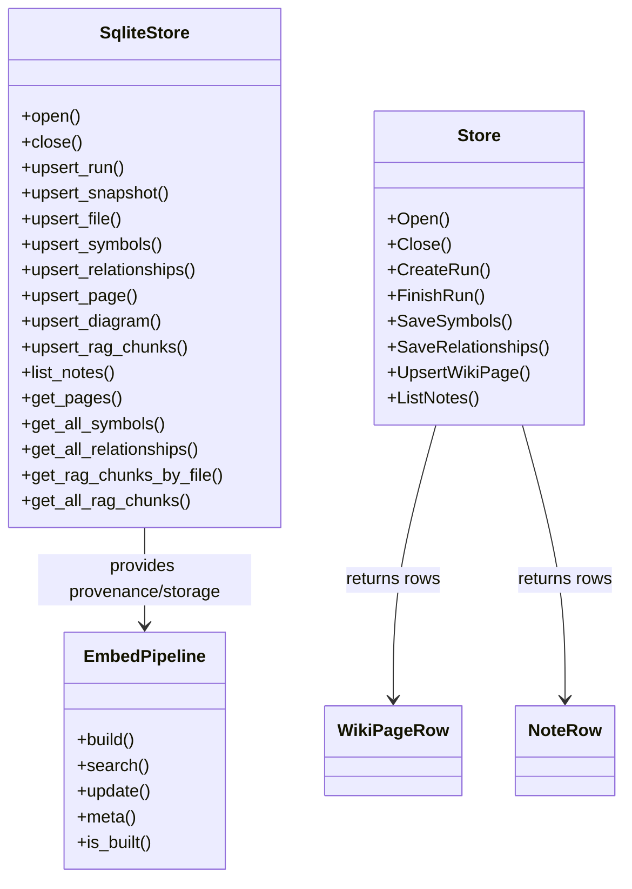
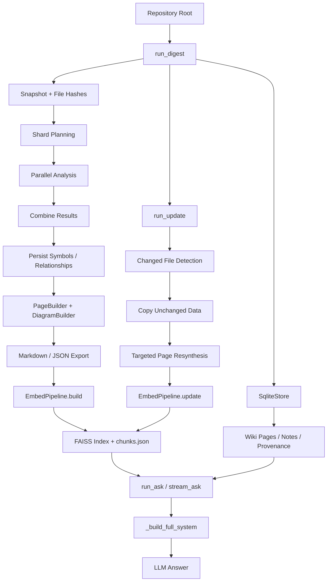

# Core Algorithms and Data Processing Logic

## Overview

`rekipedia` is a repository-to-wiki system that transforms source code into a searchable knowledge store, and then uses that store to answer questions grounded in the repository’s content. The core computational problems it solves are:

1. **Repository scanning and normalization** — discovering relevant files, extracting code symbols and relationships, and persisting scan results into a structured SQLite-backed store via [`SqliteStore`](src/rekipedia/storage/sqlite_store.py#L39).
2. **Wiki synthesis** — generating markdown/wiki pages and diagrams from scan results during the full scan pipeline [`run_digest`](src/rekipedia/orchestrator/run_digest.py#L45).
3. **Incremental update processing** — detecting changed files, carrying forward unchanged data, and selectively resynthesizing only affected pages in [`run_update`](src/rekipedia/orchestrator/run_update.py#L27).
4. **Retrieval-augmented generation (RAG)** — chunking source files, embedding them, building a FAISS index, and searching the repository corpus with diversification using Maximal Marginal Relevance in [`EmbedPipeline`](src/rekipedia/rag/embedder.py#L443) and [`_mmr`](src/rekipedia/rag/embedder.py#L45).
5. **Question answering over a local knowledge base** — assembling a contextual prompt from wiki pages, symbol provenance, notes, and retrieved chunks in [`run_ask`](src/rekipedia/orchestrator/run_ask.py#L304) and [`_build_full_system`](src/rekipedia/orchestrator/run_ask.py#L208).

The processing model is intentionally multi-stage: a full scan produces durable artifacts, incremental update reuses them, and ask-time retrieval stitches together the most relevant context. The available tests confirm the major workflows around notes, RAG indexing, and incremental updates (`tests/test_rag.py`, `tests/test_update.py`, `tests/test_notes_cli.py`, `tests/test_notes_store.py`, `tests/test_notes_server.py`).

> **Sources:** `src/rekipedia/orchestrator/run_digest.py` · L45–L433 · [`run_digest`](src/rekipedia/orchestrator/run_digest.py#L45), `src/rekipedia/orchestrator/run_update.py` · L27–L244 · [`run_update`](src/rekipedia/orchestrator/run_update.py#L27), `src/rekipedia/orchestrator/run_ask.py` · L208–L349 · [`_build_full_system`](src/rekipedia/orchestrator/run_ask.py#L208) · [`run_ask`](src/rekipedia/orchestrator/run_ask.py#L304), `src/rekipedia/rag/embedder.py` · L45–L892 · [`_mmr`](src/rekipedia/rag/embedder.py#L45) · [`EmbedPipeline`](src/rekipedia/rag/embedder.py#L443), `src/rekipedia/storage/sqlite_store.py` · L39–L827 · [`SqliteStore`](src/rekipedia/storage/sqlite_store.py#L39)

## Algorithm Descriptions

### 1) Repository File Selection and Eligibility Filtering

This logic determines which repository files are candidates for embedding and scanning.

- [`_is_implementation`](src/rekipedia/rag/embedder.py#L132) applies a filename/path heuristic to identify core implementation files versus tests and config files.
- [`_iter_repo_files`](src/rekipedia/rag/embedder.py#L144) walks the repository and yields eligible files in a deterministic order.

**Input**
- `repo_root: Path`
- repository directory tree

**Steps**
1. Walk the repository using `rglob`.
2. Keep only regular files.
3. Filter paths using `_is_implementation`.
4. Exclude non-code and non-target file types.
5. Yield the final set in sorted order for reproducibility.

**Output**
- An ordered stream of eligible file paths.

**Complexity**
- Time: roughly `O(N)` over repository files.
- Space: `O(1)` additional, not counting iteration state.

**Code Reference**
- `src/rekipedia/rag/embedder.py`
- [`_is_implementation`](src/rekipedia/rag/embedder.py#L132)
- [`_iter_repo_files`](src/rekipedia/rag/embedder.py#L144)

---

### 2) File Chunking with Line Provenance

The chunkers convert source files into text segments for embedding while preserving provenance information.

- [`_chunk_file`](src/rekipedia/rag/embedder.py#L160) does overlap-based character chunking and computes line mappings.
- [`_symbol_chunk_file`](src/rekipedia/rag/embedder.py#L218) attempts AST/symbol-aware chunking first and falls back to `_chunk_file`.
- [`_symbol_chunk_file_inner`](src/rekipedia/rag/embedder.py#L235) contains the actual symbol parser logic and raises on failure so the wrapper can fall back.

**Input**
- file `path: Path`
- `repo_root: Path`

**Steps**
1. Read file contents.
2. Build a character-to-line mapping for provenance.
3. For standard chunking, split text into overlapping windows and compute:
   - `start_line`
   - `end_line`
   - `start_char`
   - `end_char`
   - `text_hash`
4. For symbol-aware chunking, parse the file using tree-sitter if available.
5. Emit one chunk per symbol boundary, then split large symbols further if needed.
6. Fall back to character chunking when tree-sitter is unavailable, unsupported, or fails.

**Output**
- A list of chunk dictionaries compatible with storage and embedding.

**Complexity**
- Time: `O(L)` for text scan plus parser overhead; symbol chunking can be more expensive on large files.
- Space: `O(L)` for text and provenance tables.

**Code Reference**
- `src/rekipedia/rag/embedder.py`
- [`_chunk_file`](src/rekipedia/rag/embedder.py#L160)
- [`_symbol_chunk_file`](src/rekipedia/rag/embedder.py#L218)
- [`_symbol_chunk_file_inner`](src/rekipedia/rag/embedder.py#L235)

---

### 3) Embedding Batch Generation

[`_embed_batch`](src/rekipedia/rag/embedder.py#L416) is the adapter between chunk text and the LLM embedding API.

**Input**
- `texts: list[str]`
- model configuration from `llm_config`

**Steps**
1. Call `litellm.embedding()` on the batch.
2. Normalize the provider/base URL configuration when needed.
3. Convert the returned vectors into a `float32` array.
4. Return the dense matrix for indexing or query-time search.

**Output**
- A 2D embedding array `(N, D)`.

**Complexity**
- Time: dominated by external API call; local overhead `O(ND)`.
- Space: `O(ND)` for the embedding matrix.

**Code Reference**
- `src/rekipedia/rag/embedder.py`
- [`_embed_batch`](src/rekipedia/rag/embedder.py#L416)

---

### 4) Maximal Marginal Relevance (MMR) Result Diversification

[`_mmr`](src/rekipedia/rag/embedder.py#L45) is a classic diversification algorithm used when querying the embedding index.

**Input**
- `query_vec`
- `candidate_vecs`
- `top_k`
- `lambda_` balancing relevance vs. diversity

**Steps**
1. Compute query similarity for all candidates.
2. Select the first candidate most similar to the query.
3. Repeatedly score remaining candidates with:
   - relevance to query
   - penalty for similarity to already selected items
4. Pick the candidate maximizing the MMR objective.
5. Stop when `top_k` results are selected or candidates are exhausted.

**Output**
- Ordered indices of diversified top-k chunks.

**Complexity**
- Time: typically `O(k * n)` similarity scoring, with vector similarity costs.
- Space: `O(n)` for scores and selection state.

**Code Reference**
- `src/rekipedia/rag/embedder.py`
- [`_mmr`](src/rekipedia/rag/embedder.py#L45)

---

### 5) RAG Index Build Pipeline

[`EmbedPipeline.build`](src/rekipedia/rag/embedder.py#L477) is the end-to-end index construction algorithm.

**Input**
- `repo_root`
- progress callback
- `output_dir`
- `llm_config`
- optional backing [`SqliteStore`](src/rekipedia/storage/sqlite_store.py#L39)

**Steps**
1. Enumerate eligible repository files.
2. Chunk each file using symbol-aware chunking when possible.
3. Batch-embed chunk texts.
4. Create a FAISS index (`IndexFlatL2`).
5. Normalize vectors as required for similarity search.
6. Save the index and chunk metadata to disk.
7. Persist RAG chunk provenance through `SqliteStore.upsert_rag_chunks` when a store is attached.
8. Report progress and warnings for oversized or unsupported files.

**Output**
- Number of embedded chunks and on-disk index artifacts.

**Complexity**
- Time: dominated by file chunking plus embedding; index insertion is roughly linear in total chunks.
- Space: `O(CD)` for chunk embeddings and metadata, where `C` is chunk count.

**Code Reference**
- `src/rekipedia/rag/embedder.py`
- [`EmbedPipeline.build`](src/rekipedia/rag/embedder.py#L477)

---

### 6) RAG Query Pipeline

[`EmbedPipeline.search`](src/rekipedia/rag/embedder.py#L610) performs query embedding and retrieval.

**Input**
- `query: str`
- `top_k: int`
- `mmr: bool`

**Steps**
1. Verify the index exists; return `[]` when missing.
2. Embed the query.
3. Load the FAISS index and chunk metadata.
4. Run nearest-neighbor search.
5. Optionally apply `_mmr` to diversify results.
6. Reconstruct chunk payloads with file path, text, score, and implementation flag.

**Output**
- Ranked list of chunk dictionaries.

**Complexity**
- Time: `O(log n)` or index-dependent for search, plus diversification overhead.
- Space: `O(top_k)` for returned results.

**Code Reference**
- `src/rekipedia/rag/embedder.py`
- [`EmbedPipeline.search`](src/rekipedia/rag/embedder.py#L610)

---

### 7) Full Scan / Digest Pipeline

[`run_digest`](src/rekipedia/orchestrator/run_digest.py#L45) coordinates the full repository processing pipeline.

**Input**
- `repo_root`
- `output_dir`
- `llm_config`

**Steps**
1. Open the SQLite store and create a new run ID.
2. Capture a snapshot of the repository.
3. Plan shards and run analysis over files, possibly in parallel.
4. Persist symbols and relationships via [`SqliteStore.upsert_symbols`](src/rekipedia/storage/sqlite_store.py#L223) and [`SqliteStore.upsert_relationships`](src/rekipedia/storage/sqlite_store.py#L263).
5. Combine analysis outputs through [`_combine_results`](src/rekipedia/orchestrator/run_digest.py#L436).
6. Build wiki pages and diagrams.
7. Export markdown/JSON artifacts.
8. Build or refresh the embedding index using [`EmbedPipeline`](src/rekipedia/rag/embedder.py#L443).
9. Persist scan metadata and complete the run.

**Output**
- A fully materialized knowledge store: database rows, wiki pages, diagrams, scan metadata, and RAG index.

**Complexity**
- Time: repository-size dependent and parallelized; can be expensive due to analysis, synthesis, and embedding.
- Space: proportional to scan results, pages, and chunks.

**Code Reference**
- `src/rekipedia/orchestrator/run_digest.py`
- [`run_digest`](src/rekipedia/orchestrator/run_digest.py#L45)
- [`_combine_results`](src/rekipedia/orchestrator/run_digest.py#L436)

---

### 8) Incremental Update Pipeline

[`run_update`](src/rekipedia/orchestrator/run_update.py#L27) is the project’s key incremental algorithm.

**Input**
- `repo_root`
- `output_dir`
- `llm_config`

**Steps**
1. Load the latest successful run from [`SqliteStore.get_latest_run_id`](src/rekipedia/storage/sqlite_store.py#L463).
2. Snapshot the repository and identify changed files by comparing SHA-256 values.
3. If no prior scan exists, fall back to [`run_digest`](src/rekipedia/orchestrator/run_digest.py#L45).
4. If no files changed, exit early.
5. Create a new run ID.
6. Copy unchanged symbols and relationships into the new run.
7. Resynthesize only pages affected by changed source files using page-source mappings.
8. Carry forward unchanged wiki pages and page-source provenance.
9. Refresh the RAG index incrementally with [`EmbedPipeline.update`](src/rekipedia/rag/embedder.py#L733) when an index already exists.
10. Finalize exports and update run status.

**Output**
- A new run with minimized recomputation and updated artifacts.

**Complexity**
- Time: proportional to changed files rather than full repository size, plus page resynthesis for affected pages only.
- Space: similar to full scan for changed portions, but lower than a full rebuild.

**Code Reference**
- `src/rekipedia/orchestrator/run_update.py`
- [`run_update`](src/rekipedia/orchestrator/run_update.py#L27)

---

### 9) Context Assembly for Question Answering

[`_build_full_system`](src/rekipedia/orchestrator/run_ask.py#L208) is the most important retrieval-and-ranking pipeline at ask time.

**Input**
- `question: str`
- `output_dir`
- `llm_config`

**Steps**
1. Verify there is a successful scan with [`_verify_scan`](src/rekipedia/orchestrator/run_ask.py#L37).
2. Load wiki pages from disk using [`_load_wiki_pages`](src/rekipedia/orchestrator/run_ask.py#L55).
3. Load symbol line references using [`_load_symbol_lines`](src/rekipedia/orchestrator/run_ask.py#L66).
4. Optionally retrieve RAG chunks with [`_rag_chunks`](src/rekipedia/orchestrator/run_ask.py#L86).
5. Rewrite the query to codebase vocabulary using [`_rewrite_query`](src/rekipedia/orchestrator/run_ask.py#L149).
6. Rank wiki pages by relevance using [`_rank_pages_by_query`](src/rekipedia/orchestrator/run_ask.py#L137), which itself uses [`_extract_keywords`](src/rekipedia/orchestrator/run_ask.py#L104) and [`_score_page`](src/rekipedia/orchestrator/run_ask.py#L116).
7. Assemble a system prompt that includes:
   - top wiki pages
   - matching symbol references
   - RAG excerpts
   - notes from `SqliteStore.list_notes`
8. Return the final prompt/context payload for the LLM.

**Output**
- A system prompt / context bundle for the answer-generation step.

**Complexity**
- Time: proportional to the number of pages, symbols, and retrieved chunks processed.
- Space: proportional to the assembled context size.

**Code Reference**
- `src/rekipedia/orchestrator/run_ask.py`
- [`_build_full_system`](src/rekipedia/orchestrator/run_ask.py#L208)

## Data Structures

The internal processing model relies on a small number of durable structures: scan metadata, provenance records, note rows, and the RAG pipeline object. The most important named types in the provided analysis are [`SqliteStore`](src/rekipedia/storage/sqlite_store.py#L39), [`Store`](go/internal/storage/store.go#L18), [`WikiPageRow`](go/internal/storage/store.go#L300), [`NoteRow`](go/internal/storage/store.go#L348), and [`EmbedPipeline`](src/rekipedia/rag/embedder.py#L443).

| Data Structure | Kind | Purpose | Key Fields / Behaviors | Code Reference |
|---|---|---|---|---|
| `Store` | Go struct | SQLite-backed CLI storage wrapper | Minimal wrapper over DB handle | [`Store`](go/internal/storage/store.go#L18) |
| `WikiPageRow` | Go struct | Represents a wiki page row | Used by `ListWikiPages` / page storage | [`WikiPageRow`](go/internal/storage/store.go#L300) |
| `NoteRow` | Go struct | Represents tech lead notes | Stored/listed/deleted by note commands | [`NoteRow`](go/internal/storage/store.go#L348) |
| `SqliteStore` | Python class | Primary persistent store for scans, pages, notes, and RAG provenance | `upsert_run`, `upsert_symbols`, `upsert_rag_chunks`, `get_pages`, `list_notes` | [`SqliteStore`](src/rekipedia/storage/sqlite_store.py#L39) |
| `EmbedPipeline` | Python class | Build/query/update the FAISS index | `build`, `search`, `update`, `meta`, `is_built` | [`EmbedPipeline`](src/rekipedia/rag/embedder.py#L443) |
| Chunk dict | internal schema | RAG chunk provenance payload | `file_path`, `chunk_idx`, `start_line`, `end_line`, `start_char`, `end_char`, `text_hash`, `is_code`, `is_implementation` | [`upsert_rag_chunks`](src/rekipedia/storage/sqlite_store.py#L710) |
| Analysis result | internal pipeline record | Scan output aggregated across shards | Combined by [`_combine_results`](src/rekipedia/orchestrator/run_digest.py#L436) | [`_combine_results`](src/rekipedia/orchestrator/run_digest.py#L436) |

### Class Diagram

> **Sources:** `src/rekipedia/storage/sqlite_store.py` · L39–L827 · [`SqliteStore`](src/rekipedia/storage/sqlite_store.py#L39), `src/rekipedia/rag/embedder.py` · L443–L892 · [`EmbedPipeline`](src/rekipedia/rag/embedder.py#L443), `go/internal/storage/store.go` · L18–L355 · [`Store`](go/internal/storage/store.go#L18) · [`WikiPageRow`](go/internal/storage/store.go#L300) · [`NoteRow`](go/internal/storage/store.go#L348)

## Processing Pipeline

The end-to-end pipeline is best understood as a staged flow from repository snapshot to knowledge store, then to retrieval and answering.

This flow shows the system’s core design principle: **compute once, reuse aggressively**. The full scan establishes canonical state, incremental update narrows recomputation to changed inputs, and ask-time assembly uses both durable artifacts and live retrieval to answer grounded questions.

> **Sources:** `src/rekipedia/orchestrator/run_digest.py` · L45–L433 · [`run_digest`](src/rekipedia/orchestrator/run_digest.py#L45), `src/rekipedia/orchestrator/run_update.py` · L27–L244 · [`run_update`](src/rekipedia/orchestrator/run_update.py#L27), `src/rekipedia/orchestrator/run_ask.py` · L208–L349 · [`_build_full_system`](src/rekipedia/orchestrator/run_ask.py#L208) · [`run_ask`](src/rekipedia/orchestrator/run_ask.py#L304), `src/rekipedia/rag/embedder.py` · L477–L892 · [`EmbedPipeline.build`](src/rekipedia/rag/embedder.py#L477) · [`EmbedPipeline.update`](src/rekipedia/rag/embedder.py#L733), `src/rekipedia/storage/sqlite_store.py` · L137–L827 · [`upsert_run`](src/rekipedia/storage/sqlite_store.py#L137) · [`upsert_rag_chunks`](src/rekipedia/storage/sqlite_store.py#L710)