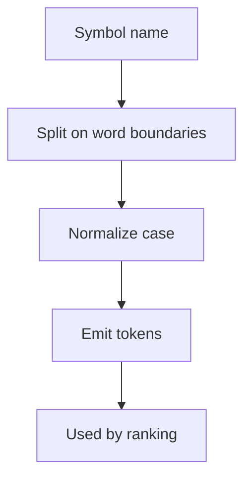
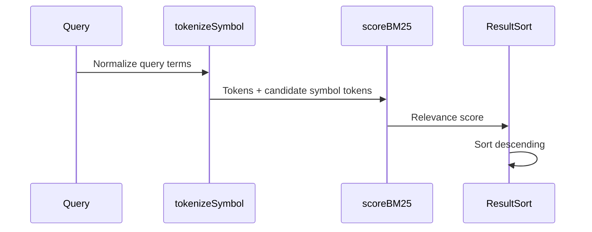
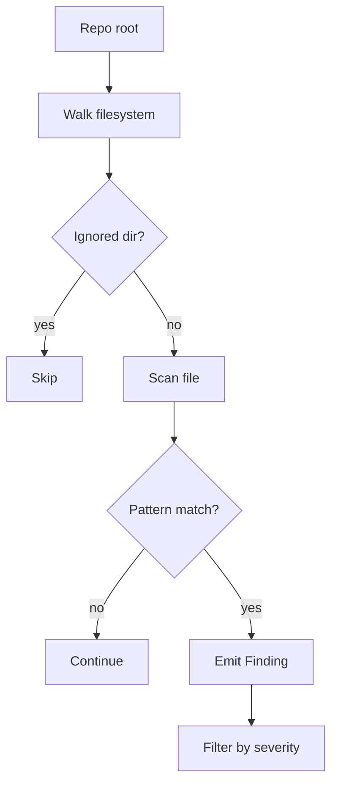

# Algorithms and Heuristics Reference

This page focuses on the repository’s notable algorithmic pieces: tokenization, ranking, static walking, and severity filtering. The emphasis is on the concrete implementations in the Go command layer and the Python analysis layer, with cross-references to the exact functions that encode the behavior.

## Tokenization

The repository uses tokenization in its search path to convert symbol names into comparable terms. The Go implementation is [`tokenizeSymbol`](go/cmd/rekipedia/cmd/search.go#L20), while the Python-side analogue is ` _tokenize_symbol` in [`src/rekipedia/analysis/cross_repo_search.py`](src/rekipedia/analysis/cross_repo_search.py). The analysis data explicitly shows `tokenizeSymbol` is the search-layer function of interest, and its call structure mirrors the Python helper: split on name boundaries, normalize case, and keep both whole-name and sub-token forms when possible.

In practice, tokenization is used before BM25 scoring in [`scoreBM25`](go/cmd/rekipedia/cmd/search.go#L54), so the quality of token boundaries directly affects ranking quality.

### Inputs, outputs, edge cases

| Aspect | Details |
|---|---|
| Inputs | Symbol names or query strings |
| Outputs | A slice/list of normalized tokens |
| Normalization | Lowercasing and token boundary splitting |
| Edge cases | Empty names, names with underscores/camel-case, and repeated separators |

### Observed heuristics

- Prefer simple, deterministic splitting over language-specific parsing.
- Preserve semantic fragments of compound names so `getUserProfile` and `get_user_profile` can share terms.
- Lowercasing reduces sensitivity to case-only differences.

> **Sources:** `go/cmd/rekipedia/cmd/search.go` · L20–L51 · [`tokenizeSymbol`](go/cmd/rekipedia/cmd/search.go#L20)

## Ranking

Ranking is implemented by [`scoreBM25`](go/cmd/rekipedia/cmd/search.go#L54). This function is the repository’s primary relevance heuristic for textual symbol search. The evidence shows it is called from the search flow in `src/rekipedia/analysis/cross_repo_search.py` via `_score_bm25`, which confirms the conceptual model: tokenized query terms are compared against tokenized symbol terms using a BM25-style relevance score.

BM25 is a pragmatic choice here because it balances term frequency and inverse document frequency while penalizing overly long documents. In this repository’s context, “documents” are symbols or symbol records rather than full source files, which makes the scoring model especially suitable for short textual fields.

### Inputs, outputs, edge cases

| Aspect | Details |
|---|---|
| Inputs | Query tokens, symbol tokens, and corpus statistics |
| Outputs | A numeric relevance score |
| Primary effect | Sorts candidate symbols by query match quality |
| Edge cases | No overlap, very short token lists, repeated terms, and ties |

### Heuristic behavior

- Strong matches on rare terms should dominate the score.
- Repetition helps, but not enough to swamp all other signals.
- Shorter symbol descriptions should not be unfairly penalized when they match well.

### Call chain

The ranking path is effectively:

`query → tokenizeSymbol → scoreBM25 → sorted results`

> **Sources:** `go/cmd/rekipedia/cmd/search.go` · L54–L71 · [`scoreBM25`](go/cmd/rekipedia/cmd/search.go#L54)

## Static Walking

Static walking is the repository’s file-system heuristic for identifying likely refactor candidates and code smells without invoking the LLM path. The core implementation is [`staticWalk`](go/cmd/rekipedia/cmd/refactor.go#L75), supported by the severity classifier [`severityIndex`](go/cmd/rekipedia/cmd/refactor.go#L65) and the post-processing gate [`applyFilter`](go/cmd/rekipedia/cmd/refactor.go#L130).

The walk is intentionally shallow in its semantics: it scans files, matches known smell patterns, and emits [`Finding`](go/cmd/rekipedia/cmd/refactor.go#L57) records. The tests in `go/cmd/rekipedia/cmd/refactor_test.go` show the intended behavior very clearly: TODO/FIXME detection, skipping `.git` and `node_modules`, and handling empty repositories.

### Inputs, outputs, edge cases

| Aspect | Details |
|---|---|
| Inputs | Repository root path and file contents |
| Outputs | Slice of `Finding` values |
| Pattern sources | Known marker strings / smell heuristics |
| Edge cases | Empty repo, ignored directories, binary/unreadable files, test-only files |

### What the walk does

- Traverses the repository tree.
- Skips ignored directories such as `.git` and `node_modules` as verified by `TestStaticWalkSkipsGitDir` and `TestStaticWalkSkipsNodeModules` in [`go/cmd/rekipedia/cmd/refactor_test.go`](go/cmd/rekipedia/cmd/refactor_test.go).
- Detects smell markers like TODO and FIXME.
- Produces findings with enough structure for severity filtering and markdown rendering.

### Algorithmic shape

The implementation is best thought of as:

1. Walk files recursively.
2. Exclude directories known to be noise.
3. Inspect file contents for smell signatures.
4. Record findings with severity and location metadata.
5. Filter findings by user-selected threshold.

> **Sources:** `go/cmd/rekipedia/cmd/refactor.go` · L57–L175 · [`Finding`](go/cmd/rekipedia/cmd/refactor.go#L57), [`severityIndex`](go/cmd/rekipedia/cmd/refactor.go#L65), [`staticWalk`](go/cmd/rekipedia/cmd/refactor.go#L75), [`applyFilter`](go/cmd/rekipedia/cmd/refactor.go#L130)

## Severity Filtering

Severity filtering is the repository’s primary way to turn a broad static scan into a targeted report. The logic lives in [`applyFilter`](go/cmd/rekipedia/cmd/refactor.go#L130) and depends on the severity ordering returned by [`severityIndex`](go/cmd/rekipedia/cmd/refactor.go#L65).

The analysis data and tests indicate that the filter supports at least the following semantics:

- `all` returns everything.
- `high` keeps only higher-severity findings.
- `critical` keeps only critical findings.

This is a classic threshold filter, but the implementation is notable because it normalizes severity into an ordered index rather than comparing arbitrary strings. That makes the filter deterministic and easy to extend.

### Inputs, outputs, edge cases

| Aspect | Details |
|---|---|
| Inputs | Findings plus a severity selector |
| Outputs | Filtered findings |
| Core dependency | `severityIndex` |
| Edge cases | Unknown severity labels, empty finding lists, already-sorted input |

### Severity indexing

[`severityIndex`](go/cmd/rekipedia/cmd/refactor.go#L65) maps a finding’s severity label to a comparable ordinal. The reason for this extra layer is simple: string comparison is not semantically safe for priorities like `critical > high > medium > low`. By converting labels into an integer-like rank, the filter can compare thresholds without hard-coding conditionals everywhere.

### Behavior pattern

- `severityIndex` provides ordering semantics.
- `applyFilter` applies a cutoff rule.
- The output remains stable regardless of source order.

### Example flow

`staticWalk → Finding(severity) → severityIndex → applyFilter → report`

> **Sources:** `go/cmd/rekipedia/cmd/refactor.go` · L65–L145 · [`severityIndex`](go/cmd/rekipedia/cmd/refactor.go#L65), [`applyFilter`](go/cmd/rekipedia/cmd/refactor.go#L130)

## How These Pieces Fit Together

Although each algorithm is independently useful, the repository uses them as a pipeline:

- tokenization prepares symbol and query text,
- BM25 ranks candidate matches,
- static walking produces candidate refactor findings,
- severity filtering trims findings to the requested scope.

This separation is important: the search path optimizes for relevance, while the refactor path optimizes for precision and triage speed. The two heuristics families do not share implementation, but they share a philosophy of deterministic, explainable scoring.

| Stage | Function | Purpose |
|---|---|---|
| Tokenization | [`tokenizeSymbol`](go/cmd/rekipedia/cmd/search.go#L20) | Normalize symbol/query text |
| Ranking | [`scoreBM25`](go/cmd/rekipedia/cmd/search.go#L54) | Compute relevance |
| Walking | [`staticWalk`](go/cmd/rekipedia/cmd/refactor.go#L75) | Discover findings |
| Severity ranking | [`severityIndex`](go/cmd/rekipedia/cmd/refactor.go#L65) | Order severities |
| Filtering | [`applyFilter`](go/cmd/rekipedia/cmd/refactor.go#L130) | Keep only requested severities |

> **Sources:** `go/cmd/rekipedia/cmd/search.go` · L20–L71 · [`tokenizeSymbol`](go/cmd/rekipedia/cmd/search.go#L20), [`scoreBM25`](go/cmd/rekipedia/cmd/search.go#L54); `go/cmd/rekipedia/cmd/refactor.go` · L57–L175 · [`Finding`](go/cmd/rekipedia/cmd/refactor.go#L57), [`severityIndex`](go/cmd/rekipedia/cmd/refactor.go#L65), [`staticWalk`](go/cmd/rekipedia/cmd/refactor.go#L75), [`applyFilter`](go/cmd/rekipedia/cmd/refactor.go#L130)