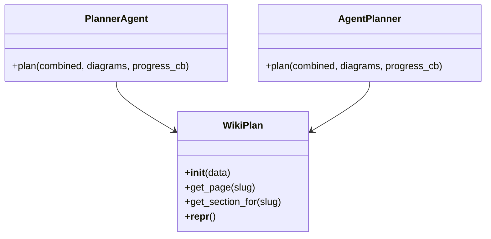
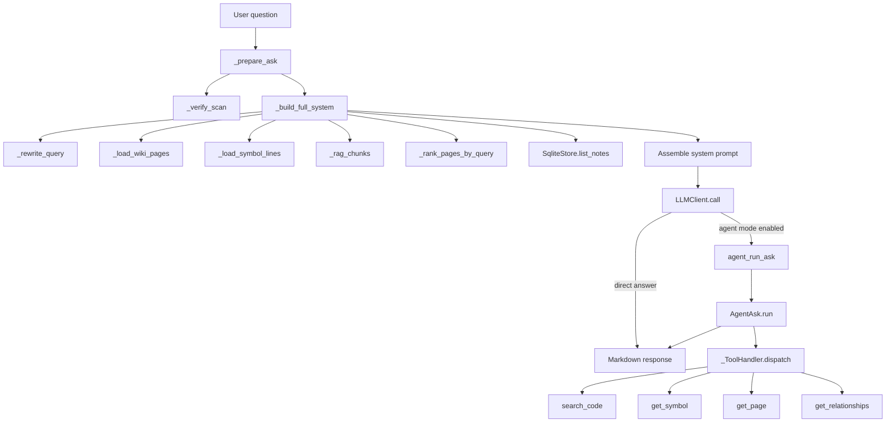

# Core Algorithms and Data Processing

## Overview

This repository implements two closely related computational workflows:

1. **Question answering over an indexed codebase / wiki knowledge store**
   - The primary goal is to answer free-text questions about a repository using a combination of:
     - structured metadata from a SQLite-backed store,
     - generated wiki pages,
     - symbol inventory data,
     - and optionally a retrieval-augmented generation (RAG) index.
   - The main entry point for this workflow is [`run_ask`](src/rekipedia/orchestrator/run_ask.py#L334) in [`rekipedia.orchestrator.run_ask`](src/rekipedia/orchestrator/run_ask.py#L1), with an agentic fallback via [`agent_run_ask`](src/rekipedia/orchestrator/agent_ask.py#L371).

2. **Wiki structure planning**
   - The synthesis layer computes a structured `WikiPlan` describing which pages and sections should exist in generated documentation.
   - There are two implementations:
     - a single-shot planner: [`PlannerAgent.plan`](src/rekipedia/synthesis/planner.py#L186),
     - and a tool-calling / agentic planner: [`AgentPlanner.plan`](src/rekipedia/synthesis/agent_planner.py#L155).
   - These planners transform a compact view of repository contents into a content model that downstream synthesis can use.

Taken together, the project solves a fairly specific computational problem: **given a code repository and its generated artifacts, construct a navigable documentation knowledge base and answer questions against it with grounded, source-aware LLM assistance**.

The analysis data shows these algorithms are heavily concentrated in a few hub functions, notably [`_build_full_system`](src/rekipedia/orchestrator/run_ask.py#L208), [`_build_planning_summary`](src/rekipedia/synthesis/planner.py#L308), [`AgentAsk.run`](src/rekipedia/orchestrator/agent_ask.py#L275), and [`AgentPlanner.plan`](src/rekipedia/synthesis/agent_planner.py#L155). The repository is therefore architecture-heavy around **prompt assembly, ranking, filtering, fallback logic, and iterative agent/tool orchestration**.

> **Sources:** `src/rekipedia/orchestrator/run_ask.py` · `src/rekipedia/orchestrator/agent_ask.py` · `src/rekipedia/synthesis/planner.py` · `src/rekipedia/synthesis/agent_planner.py`

## Algorithm Descriptions

### Query-Grounded System Prompt Assembly

The function [`_build_full_system`](src/rekipedia/orchestrator/run_ask.py#L208) is the central data-processing pipeline for question answering. It assembles the context that will be sent to the LLM.

- **Input**:
  - `question`
  - `output_dir`
  - `llm_config`
- **Steps**:
  1. Load or rewrite the user query to better match repository vocabulary using [`_rewrite_query`](src/rekipedia/orchestrator/run_ask.py#L149).
  2. Load wiki pages from disk with [`_load_wiki_pages`](src/rekipedia/orchestrator/run_ask.py#L55).
  3. Load symbol line metadata with [`_load_symbol_lines`](src/rekipedia/orchestrator/run_ask.py#L66).
  4. Optionally retrieve RAG chunks from the embedding index through [`_rag_chunks`](src/rekipedia/orchestrator/run_ask.py#L86).
  5. Rank wiki pages against the query via [`_rank_pages_by_query`](src/rekipedia/orchestrator/run_ask.py#L137).
  6. Load repository notes from the SQLite store using [`SqliteStore`](src/rekipedia/storage/sqlite_store.py) calls.
  7. Compute keyword and note scoring signals and concatenate the final prompt text.
- **Output**:
  - A large system prompt string containing ranked wiki content, symbol hints, note summaries, and optional RAG excerpts.
- **Complexity**:
  - Dominated by disk I/O and ranking over wiki pages.
  - Roughly `O(P * K)` for page scoring, where `P` is number of pages and `K` is query keywords.
  - Memory use scales with loaded wiki text and extracted snippets.
- **Code Reference**:
  - [`_build_full_system`](src/rekipedia/orchestrator/run_ask.py#L208)

This is the most important data-processing routine in the repository because it converts multiple heterogeneous stores into a single prompt-ready representation.

### Keyword Extraction for Query Normalization

[`_extract_keywords`](src/rekipedia/orchestrator/run_ask.py#L104) performs a lightweight lexical filter over the query.

- **Input**:
  - Raw user question text
- **Steps**:
  1. Lowercase the text.
  2. Extract word-like tokens with regex.
  3. Filter out short tokens and likely stopwords.
- **Output**:
  - A list of meaningful keywords used for ranking pages.
- **Complexity**:
  - Time: `O(n)` over query length
  - Space: `O(k)` for extracted tokens
- **Code Reference**:
  - [`_extract_keywords`](src/rekipedia/orchestrator/run_ask.py#L104)

This function is intentionally simple and deterministic, making query ranking explainable and cheap.

### Wiki Page Relevance Ranking

[`_rank_pages_by_query`](src/rekipedia/orchestrator/run_ask.py#L137) ranks wiki pages by relevance to the current question.

- **Input**:
  - `pages`
  - `question`
- **Steps**:
  1. Extract query keywords via [`_extract_keywords`](src/rekipedia/orchestrator/run_ask.py#L104).
  2. Score each page using [`_score_page`](src/rekipedia/orchestrator/run_ask.py#L116).
  3. Sort pages descending by score.
- **Output**:
  - A sorted list of pages ordered by relevance.
- **Complexity**:
  - Time: `O(P * S)` where `P` is page count and `S` is page text size scanned by scoring
  - Space: `O(P)` for ranking metadata
- **Code Reference**:
  - [`_rank_pages_by_query`](src/rekipedia/orchestrator/run_ask.py#L137)

This is a classic retrieval heuristic: exact lexical overlap plus weighted scoring.

### Page Scoring Heuristic

[`_score_page`](src/rekipedia/orchestrator/run_ask.py#L116) computes a heuristic relevance score for a single wiki page.

- **Input**:
  - `page_text`
  - `keywords`
- **Steps**:
  1. Lowercase page content for case-insensitive matching.
  2. Count keyword occurrences.
  3. Apply boosts based on title or section prominence signals.
  4. Use simple token/regex heuristics to reward concentrated matches.
- **Output**:
  - Numeric score used by page ranking.
- **Complexity**:
  - Time: `O(S * K)` in the worst case for scanning text against keywords
  - Space: `O(1)` beyond the text being inspected
- **Code Reference**:
  - [`_score_page`](src/rekipedia/orchestrator/run_ask.py#L116)

The analysis data shows this function is one of the main computational hotspots because it is called from page ranking and influences the prompt’s composition.

### Retrieval-Augmented Chunk Lookup

[`_rag_chunks`](src/rekipedia/orchestrator/run_ask.py#L86) integrates vector-like retrieval into the question-answering path.

- **Input**:
  - `question`
  - `output_dir`
  - `llm_config`
  - `top_k`
- **Steps**:
  1. Instantiate or access an [`EmbedPipeline`](src/rekipedia/rag/embedder.py) object.
  2. Check whether the index is built.
  3. Search for top-k relevant chunks.
  4. Return empty results if the index is unavailable.
- **Output**:
  - A list of relevant code/document chunks, or `[]` if the index is not ready.
- **Complexity**:
  - Depends on backend search implementation.
  - At the interface level, likely sublinear or indexed retrieval rather than full scan.
- **Code Reference**:
  - [`_rag_chunks`](src/rekipedia/orchestrator/run_ask.py#L86)

This is the project’s bridge from symbolic/document-oriented retrieval to semantic retrieval.

### Agentic Question Answering Loop

[`AgentAsk.run`](src/rekipedia/orchestrator/agent_ask.py#L275) implements a ReAct-style agent loop with tool calls.

- **Input**:
  - `question`
  - `history`
  - `max_iter`
- **Steps**:
  1. Build an initial system prompt with [`AgentAsk._build_initial_system`](src/rekipedia/orchestrator/agent_ask.py#L265).
  2. Append the user query and prior conversation turns.
  3. Call the LLM.
  4. If the response contains tool calls, dispatch them via [`_ToolHandler.dispatch`](src/rekipedia/orchestrator/agent_ask.py#L236).
  5. Append tool results and iterate.
  6. If the model produces a final response directly, return it.
  7. If iteration limit is reached or tool calling fails, fall back to a single-shot response path.
- **Output**:
  - Final answer string, typically Markdown.
- **Complexity**:
  - Time: `O(max_iter)` LLM turns, plus tool latency
  - Space: `O(max_iter)` message history accumulation
- **Code Reference**:
  - [`AgentAsk.run`](src/rekipedia/orchestrator/agent_ask.py#L275)

The tests in [`tests/test_agent_ask.py`](tests/test_agent_ask.py#L1) specifically exercise direct-answer, tool-call, finish-tool, max-iteration, and fallback behaviors, confirming this is a deliberate control-flow algorithm.

### Tool Dispatch and Knowledge Store Access

[`_ToolHandler`](src/rekipedia/orchestrator/agent_ask.py#L141) encapsulates the tool-facing operations the agent can invoke.

- **Input**:
  - Tool name and arguments via [`_ToolHandler.dispatch`](src/rekipedia/orchestrator/agent_ask.py#L236)
- **Steps**:
  1. Route calls to `search_code`, `get_symbol`, `get_page`, or `get_relationships`.
  2. Convert repository artifacts and database records into text answers suitable for an LLM.
  3. Return friendly error text when data is missing.
- **Output**:
  - Human-readable tool response text.
- **Complexity**:
  - Depends on tool:
    - `search_code` can be retrieval-backed
    - `get_symbol` and `get_page` are largely file lookup operations
    - `get_relationships` is database-backed
- **Code Reference**:
  - [`_ToolHandler`](src/rekipedia/orchestrator/agent_ask.py#L141)
  - [`_ToolHandler.dispatch`](src/rekipedia/orchestrator/agent_ask.py#L236)

The internal methods [`_ToolHandler.get_symbol`](src/rekipedia/orchestrator/agent_ask.py#L173), [`_ToolHandler.get_page`](src/rekipedia/orchestrator/agent_ask.py#L189), and [`_ToolHandler.get_relationships`](src/rekipedia/orchestrator/agent_ask.py#L208) are the data adapters here.

### Wiki Plan Construction

[`PlannerAgent.plan`](src/rekipedia/synthesis/planner.py#L186) computes a complete `WikiPlan` in one LLM call with fallback logic.

- **Input**:
  - `combined`
  - `diagrams`
  - `progress_cb`
- **Steps**:
  1. Build a planning summary with [`_build_planning_summary`](src/rekipedia/synthesis/planner.py#L308).
  2. Call the LLM to produce plan JSON.
  3. Parse the response into [`WikiPlan`](src/rekipedia/synthesis/planner.py#L138).
  4. If the model fails or returns invalid content, fall back to [`_default_plan`](src/rekipedia/synthesis/planner.py#L400).
  5. Use `progress_cb` to report status while waiting.
- **Output**:
  - Structured `WikiPlan`.
- **Complexity**:
  - Summary generation is heuristic `O(N)` over input metadata.
  - LLM call dominates runtime.
- **Code Reference**:
  - [`PlannerAgent.plan`](src/rekipedia/synthesis/planner.py#L186)

This is the non-agentic planning path; it trades interaction for simplicity and deterministic fallback.

### Agentic Wiki Planning

[`AgentPlanner.plan`](src/rekipedia/synthesis/agent_planner.py#L155) is the tool-calling equivalent of the planner.

- **Input**:
  - `combined`
  - `diagrams`
  - `progress_cb`
- **Steps**:
  1. Generate a compact planning summary with [`_build_planning_summary`](src/rekipedia/synthesis/planner.py#L308).
  2. Enter an iterative tool-calling loop against the LLM.
  3. Collect planner actions such as page additions and finalization.
  4. Materialize the resulting structure into [`WikiPlan`](src/rekipedia/synthesis/planner.py#L138).
  5. Fall back to [`_default_plan`](src/rekipedia/synthesis/planner.py#L400) on failure.
- **Output**:
  - `WikiPlan`
- **Complexity**:
  - LLM-turn bounded; each step is prompt/tool overhead.
  - Parsing and sanitizing are linear in the number of emitted page/section items.
- **Code Reference**:
  - [`AgentPlanner.plan`](src/rekipedia/synthesis/agent_planner.py#L155)

Compared with [`PlannerAgent.plan`](src/rekipedia/synthesis/planner.py#L186), this version supports incremental decisions and richer interaction patterns.

> **Sources:** `src/rekipedia/orchestrator/run_ask.py` · `src/rekipedia/orchestrator/agent_ask.py` · `src/rekipedia/synthesis/planner.py` · `src/rekipedia/synthesis/agent_planner.py`

## Data Structures

The internal data model is relatively small but important. The two main structural classes are `WikiPlan` and `AgentAsk`/`AgentPlanner`, with `_ToolHandler` serving as a utility adapter.

| Data Structure | Kind | Purpose | Key Fields / Methods | Code Reference |
|---|---|---|---|---|
| [`WikiPlan`](src/rekipedia/synthesis/planner.py#L138) | class | Holds the structured wiki-generation output | `__init__`, [`get_page`](src/rekipedia/synthesis/planner.py#L166), [`get_section_for`](src/rekipedia/synthesis/planner.py#L169), `__repr__` | [`src/rekipedia/synthesis/planner.py`](src/rekipedia/synthesis/planner.py#L138) |
| [`PlannerAgent`](src/rekipedia/synthesis/planner.py#L180) | class | Single-shot planner wrapper around the LLM | [`plan`](src/rekipedia/synthesis/planner.py#L186) | [`src/rekipedia/synthesis/planner.py`](src/rekipedia/synthesis/planner.py#L180) |
| [`AgentPlanner`](src/rekipedia/synthesis/agent_planner.py#L144) | class | Tool-calling planner that can iterate before finalizing | [`plan`](src/rekipedia/synthesis/agent_planner.py#L155) | [`src/rekipedia/synthesis/agent_planner.py`](src/rekipedia/synthesis/agent_planner.py#L144) |
| [`AgentAsk`](src/rekipedia/orchestrator/agent_ask.py#L253) | class | ReAct loop for answering questions with tools | [`run`](src/rekipedia/orchestrator/agent_ask.py#L275) | [`src/rekipedia/orchestrator/agent_ask.py`](src/rekipedia/orchestrator/agent_ask.py#L253) |
| [`_ToolHandler`](src/rekipedia/orchestrator/agent_ask.py#L141) | class | Tool adapter for retrieval and repository lookup | [`search_code`](src/rekipedia/orchestrator/agent_ask.py#L160), [`get_symbol`](src/rekipedia/orchestrator/agent_ask.py#L173), [`get_page`](src/rekipedia/orchestrator/agent_ask.py#L189), [`get_relationships`](src/rekipedia/orchestrator/agent_ask.py#L208) | [`src/rekipedia/orchestrator/agent_ask.py`](src/rekipedia/orchestrator/agent_ask.py#L141) |

### `WikiPlan` Structure

The `WikiPlan` class is the main internal schema for documentation generation. The analysis shows it normalizes and exposes page/section lookups rather than acting as a raw dictionary. Its helper methods suggest the plan data is organized around page slugs and page-to-section mappings.

A simplified structural view is:

### `AgentAsk` / `_ToolHandler` Interaction Model

The question-answering data flow uses a small state machine: LLM messages, optional tool invocations, tool output, and a terminal answer. `_ToolHandler.dispatch` is the polymorphic entry point that hides the storage/RAG details from the loop controller.

> **Sources:** `src/rekipedia/synthesis/planner.py` · `src/rekipedia/synthesis/agent_planner.py` · `src/rekipedia/orchestrator/agent_ask.py`

## Processing Pipeline

The main end-to-end processing pipeline for query answering is:

1. Verify that a successful scan exists.
2. Build a source-rich system prompt from wiki pages, symbols, notes, and optional RAG chunks.
3. Optionally rewrite the user query to match repository terminology.
4. Rank and select the most relevant context.
5. Call the LLM for a final answer, or enter a tool loop if agent mode is enabled.

### Pipeline Notes

- The pipeline has a **deterministic preprocessing stage** and an **LLM-controlled reasoning stage**.
- The preprocessing stage is entirely visible in the repository analysis and relies heavily on string manipulation, file loading, lexical scoring, and database reads.
- The reasoning stage uses either:
  - single-shot prompting via [`run_ask`](src/rekipedia/orchestrator/run_ask.py#L334), or
  - agentic iteration via [`agent_run_ask`](src/rekipedia/orchestrator/agent_ask.py#L371).

The planner pipeline is analogous, but inverted in purpose: instead of answering questions about an existing knowledge store, it computes the knowledge store’s documentation structure. That pipeline flows through [`_build_planning_summary`](src/rekipedia/synthesis/planner.py#L308) into either [`PlannerAgent.plan`](src/rekipedia/synthesis/planner.py#L186) or [`AgentPlanner.plan`](src/rekipedia/synthesis/agent_planner.py#L155).

### Observed Performance Characteristics

The analysis data gives enough evidence to characterize the main algorithmic costs:

| Component | Dominant Cost | Practical Implication |
|---|---|---|
| `_extract_keywords` | Linear scan of question text | Cheap preprocessing |
| `_score_page` | Full page text scans | Can be expensive if many pages are loaded |
| `_rank_pages_by_query` | Page scoring + sort | Best treated as `O(P log P)` plus scoring cost |
| `_build_full_system` | Multi-source load and assembly | I/O-bound, prompt-size sensitive |
| `AgentAsk.run` | Multiple LLM/tool iterations | Latency grows with tool loop length |
| `PlannerAgent.plan` / `AgentPlanner.plan` | LLM call + JSON parse | Mostly model-latency bound |

### Coverage and Risk Observations

The test file [`tests/test_agent_ask.py`](tests/test_agent_ask.py#L1) provides broad behavioral coverage for:
- tool dispatch,
- direct answer path,
- tool-call path,
- max-iteration fallback,
- planner fallback,
- and environment-controlled agent selection.

However, the analysis data flags a notable gap: [`_default_plan`](src/rekipedia/synthesis/planner.py#L400) and [`WikiPlan`](src/rekipedia/synthesis/planner.py#L138) are both hub nodes with no explicit direct test coverage visible in the provided test file. That does not imply bugs, but it does mean these components are important to review carefully.

> **Sources:** `src/rekipedia/orchestrator/run_ask.py` · `src/rekipedia/orchestrator/agent_ask.py` · `src/rekipedia/synthesis/planner.py` · `src/rekipedia/synthesis/agent_planner.py` · `tests/test_agent_ask.py`