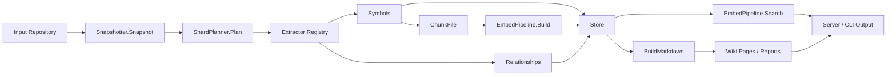

# Data Flow from Repository Input to Analysis Output

This page traces how a repository is turned into stored analysis artifacts, searchable data, and final reports. It focuses on the concrete flow through the application rather than the broader UI or command surface.

## End-to-End Data Flow

At a high level, the pipeline starts with a repository path, captures a filesystem snapshot, extracts symbols and relationships, persists the analysis to storage, and then produces downstream outputs such as search results and written reports. The main transformation steps are implemented by the orchestrator and analysis packages: [`Snapshotter.Snapshot`](go/internal/orchestrator/snapshotter.go#L89) captures the repository state, [`ShardPlanner.Plan`](go/internal/orchestrator/sharding.go#L31) divides work into units, [`ChunkFile`](go/internal/rag/chunker.go#L40) prepares text for retrieval, [`EmbedPipeline.Build`](go/internal/rag/embedder.go#L30) indexes chunks, [`EmbedPipeline.Search`](go/internal/rag/embedder.go#L87) ranks matches, and [`BuildMarkdown`](go/internal/analysis/refactor_writer.go#L177) formats analysis output. The storage layer persists intermediate and final artifacts through methods such as [`Store.SaveSymbols`](go/internal/storage/store.go#L149), [`Store.SaveRelationships`](go/internal/storage/store.go#L200), and [`Store.UpsertWikiPage`](go/internal/storage/store.go#L247).

> **Sources:** `go/internal/orchestrator/snapshotter.go` · L89–L147 · [`Snapshotter.Snapshot`](go/internal/orchestrator/snapshotter.go#L89), `go/internal/orchestrator/sharding.go` · L31–L54 · [`ShardPlanner.Plan`](go/internal/orchestrator/sharding.go#L31), `go/internal/rag/chunker.go` · L40–L92 · [`ChunkFile`](go/internal/rag/chunker.go#L40), `go/internal/rag/embedder.go` · L30–L102 · [`EmbedPipeline.Build`](go/internal/rag/embedder.go#L30), [`EmbedPipeline.Search`](go/internal/rag/embedder.go#L87), `go/internal/analysis/refactor_writer.go` · L177–L263 · [`BuildMarkdown`](go/internal/analysis/refactor_writer.go#L177), `go/internal/storage/store.go` · L149–L258 · [`Store.SaveSymbols`](go/internal/storage/store.go#L149), [`Store.SaveRelationships`](go/internal/storage/store.go#L200), [`Store.UpsertWikiPage`](go/internal/storage/store.go#L247)

## Step-by-Step Walkthrough

### 1) Scanning the input repository

The scan phase begins from repository-level options and configuration. The orchestrator’s [`Snapshotter`](go/internal/orchestrator/snapshotter.go#L57) walks the repository, filters ignored directories, detects language, and records a manifest-like view of files. Its [`Snapshot`](go/internal/orchestrator/snapshotter.go#L89) method produces per-file metadata such as path, size, hash, and language. Helper functions like [`sha256File`](go/internal/orchestrator/snapshotter.go#L149) and [`detectLanguage`](go/internal/orchestrator/snapshotter.go#L162) transform raw filesystem input into normalized metadata. If the repository is large enough to require segmentation, [`ShardPlanner.Plan`](go/internal/orchestrator/sharding.go#L31) groups files into [`Shard`](go/internal/models/contracts.go#L97) units using [`topLevelDir`](go/internal/orchestrator/sharding.go#L91) and [`fileTokenEstimate`](go/internal/orchestrator/sharding.go#L100).

### 2) Loading symbols and relationships

Once a file is assigned to a shard or scan batch, the extractor registry dispatches it to the proper language-specific extractor. The common interface [`Extractor`](go/internal/extractor/extractor.go#L11) is implemented by [`GoExtractor`](go/internal/extractor/golang.go#L16), [`PythonExtractor`](go/internal/extractor/python.go#L25), [`TypeScriptExtractor`](go/internal/extractor/typescript.go#L25), and [`ConfigExtractor`](go/internal/extractor/config.go#L40). Registry-level routing happens in [`Registry.ExtractFile`](go/internal/extractor/extractor.go#L37), while [`MergeResults`](go/internal/extractor/extractor.go#L50) combines extracted symbols and relationships.

Inside each extractor, language-specific parsing converts source text into [`Symbol`](go/internal/models/contracts.go#L53) and [`Relationship`](go/internal/models/contracts.go#L64) records. For example, [`GoExtractor.Extract`](go/internal/extractor/golang.go#L27) uses the Go AST, while [`PythonExtractor.Extract`](go/internal/extractor/python.go#L37) and [`TypeScriptExtractor.Extract`](go/internal/extractor/typescript.go#L40) use lexical/regex-based parsing. These functions are the main data transformers at this stage: they discard unrecognized constructs, normalize names, and emit structured records with file references and line numbers.

### 3) Ranking and search

The retrieval path is separate from static extraction but consumes the same stored analysis data. Repository content is first chunked with [`ChunkFile`](go/internal/rag/chunker.go#L40), which turns files into overlapping [`Chunk`](go/internal/rag/chunker.go#L11) records. The embedding pipeline, [`EmbedPipeline.Build`](go/internal/rag/embedder.go#L30), then sends chunk text to the LLM-backed embedding client and stores vectors in [`VectorStore.Add`](go/internal/rag/vector_store.go#L45). Search is driven by [`EmbedPipeline.Search`](go/internal/rag/embedder.go#L87), which queries the stored vectors and returns ranked [`SearchResult`](go/internal/rag/vector_store.go#L21) values.

For text-based ranking used in the ask/search flows, [`tokenizeSymbol`](go/cmd/rekipedia/cmd/search.go#L20) and [`scoreBM25`](go/cmd/rekipedia/cmd/search.go#L54) shape symbol names into tokens and compute BM25-like relevance. The search command’s `result` type ([`result`](go/cmd/rekipedia/cmd/search.go#L97)) holds the scored output. On the Python side, the analogous flow in `src/rekipedia/analysis/cross_repo_search.py` uses [`_tokenize_symbol`](src/rekipedia/analysis/cross_repo_search.py) and [`_score_bm25`](src/rekipedia/analysis/cross_repo_search.py) to filter and rank symbols across repositories.

### 4) Reporting and output generation

The reporting stage turns analyzed symbols into human-readable artifacts. Static refactor reporting is produced by [`buildStaticReport`](go/cmd/rekipedia/cmd/refactor.go#L148) and [`BuildMarkdown`](go/internal/analysis/refactor_writer.go#L177), which use sorted issue lists and grouped sections to produce concise markdown. Output persistence is handled by [`WriteRefactorOutputs`](go/internal/analysis/refactor_writer.go#L269), which writes both markdown and JSON summaries. At the storage layer, [`Store.UpsertWikiPage`](go/internal/storage/store.go#L247) and [`Store.UpsertManifest`](go/internal/storage/store.go#L314) persist final artifacts for later retrieval.

The server then exposes these results through handlers such as [`(s *Server).handleAPIPage`](go/internal/server/server.go#L334), [`(s *Server).handleAPIPages`](go/internal/server/server.go#L329), and [`(s *Server).handleAPIWikiSearch`](go/internal/server/server.go#L802), which read from storage and render API/HTML responses.

> **Sources:** `go/internal/orchestrator/snapshotter.go` · L57–L172 · [`Snapshotter`](go/internal/orchestrator/snapshotter.go#L57), [`Snapshot`](go/internal/orchestrator/snapshotter.go#L89), [`sha256File`](go/internal/orchestrator/snapshotter.go#L149), [`detectLanguage`](go/internal/orchestrator/snapshotter.go#L162); `go/internal/orchestrator/sharding.go` · L31–L106 · [`ShardPlanner.Plan`](go/internal/orchestrator/sharding.go#L31), [`topLevelDir`](go/internal/orchestrator/sharding.go#L91), [`fileTokenEstimate`](go/internal/orchestrator/sharding.go#L100); `go/internal/extractor/extractor.go` · L11–L68 · [`Extractor`](go/internal/extractor/extractor.go#L11), [`Registry.ExtractFile`](go/internal/extractor/extractor.go#L37), [`MergeResults`](go/internal/extractor/extractor.go#L50); `go/internal/extractor/golang.go` · L27–L165 · [`GoExtractor.Extract`](go/internal/extractor/golang.go#L27); `go/internal/extractor/python.go` · L37–L201 · [`PythonExtractor.Extract`](go/internal/extractor/python.go#L37); `go/internal/extractor/typescript.go` · L40–L149 · [`TypeScriptExtractor.Extract`](go/internal/extractor/typescript.go#L40); `go/internal/rag/chunker.go` · L11–L96 · [`Chunk`](go/internal/rag/chunker.go#L11), [`ChunkFile`](go/internal/rag/chunker.go#L40); `go/internal/rag/embedder.go` · L30–L102 · [`EmbedPipeline.Build`](go/internal/rag/embedder.go#L30), [`EmbedPipeline.Search`](go/internal/rag/embedder.go#L87); `go/internal/rag/vector_store.go` · L21–L93 · [`SearchResult`](go/internal/rag/vector_store.go#L21), [`VectorStore.Add`](go/internal/rag/vector_store.go#L45); `go/cmd/rekipedia/cmd/search.go` · L20–L102 · [`tokenizeSymbol`](go/cmd/rekipedia/cmd/search.go#L20), [`scoreBM25`](go/cmd/rekipedia/cmd/search.go#L54), [`result`](go/cmd/rekipedia/cmd/search.go#L97); `go/internal/analysis/refactor_writer.go` · L177–L326 · [`BuildMarkdown`](go/internal/analysis/refactor_writer.go#L177), [`WriteRefactorOutputs`](go/internal/analysis/refactor_writer.go#L269); `go/internal/storage/store.go` · L247–L324 · [`Store.UpsertWikiPage`](go/internal/storage/store.go#L247), [`Store.UpsertManifest`](go/internal/storage/store.go#L314); `go/internal/server/server.go` · L329–L926 · [`(s *Server).handleAPIPage`](go/internal/server/server.go#L334), [`(s *Server).handleAPIPages`](go/internal/server/server.go#L329), [`(s *Server).handleAPIWikiSearch`](go/internal/server/server.go#L802)

## Inputs, Intermediate Artifacts, and Outputs

| Stage | Inputs | Intermediate Artifacts | Outputs |
|---|---|---|---|
| Scan | Repository path, ignore rules, language filters | File manifest, file hashes, language tags, `ScanMeta` | Shard-ready file inventory |
| Symbol loading | Source files, shard assignments | `Symbol` records, `Relationship` records | Structured analysis rows |
| Chunking / retrieval prep | Extracted file content, symbol text | `Chunk` objects, embeddings, vector entries | Searchable corpus |
| Ranking/search | User query, stored vectors, stored symbols | Scored `SearchResult` or BM25 `result` items | Ranked matches |
| Reporting | Symbols, relationships, ranked findings | Markdown sections, JSON summaries, wiki page specs | Wiki pages, refactor reports, API responses |

This table reflects the actual conversion points visible in the codebase: filesystem data becomes scan metadata, scan metadata becomes shards, shards produce symbols and relationships, and those records feed both retrieval and reporting.

> **Sources:** `go/internal/orchestrator/snapshotter.go` · L89–L172 · [`Snapshotter.Snapshot`](go/internal/orchestrator/snapshotter.go#L89); `go/internal/orchestrator/sharding.go` · L31–L106 · [`ShardPlanner.Plan`](go/internal/orchestrator/sharding.go#L31); `go/internal/extractor/extractor.go` · L37–L68 · [`Registry.ExtractFile`](go/internal/extractor/extractor.go#L37), [`MergeResults`](go/internal/extractor/extractor.go#L50); `go/internal/rag/chunker.go` · L40–L96 · [`ChunkFile`](go/internal/rag/chunker.go#L40); `go/internal/rag/vector_store.go` · L45–L93 · [`VectorStore.Add`](go/internal/rag/vector_store.go#L45), [`VectorStore.Search`](go/internal/rag/vector_store.go#L71); `go/internal/analysis/refactor_writer.go` · L177–L326 · [`BuildMarkdown`](go/internal/analysis/refactor_writer.go#L177), [`WriteRefactorOutputs`](go/internal/analysis/refactor_writer.go#L269)

## Key Data Transformations and Filters

Several functions are especially important because they actively reshape or filter data rather than merely passing it along:

- [`Snapshotter.Snapshot`](go/internal/orchestrator/snapshotter.go#L89) filters repository contents based on ignore rules and supported language detection.
- [`ShardPlanner.splitGroup`](go/internal/orchestrator/sharding.go#L56) and [`fileTokenEstimate`](go/internal/orchestrator/sharding.go#L100) repartition work by size.
- [`GoExtractor.Extract`](go/internal/extractor/golang.go#L27), [`PythonExtractor.Extract`](go/internal/extractor/python.go#L37), and [`TypeScriptExtractor.Extract`](go/internal/extractor/typescript.go#L40) normalize raw source into structured symbols.
- [`scoreBM25`](go/cmd/rekipedia/cmd/search.go#L54) and [`tokenizeSymbol`](go/cmd/rekipedia/cmd/search.go#L20) convert names into ranked retrieval candidates.
- [`BuildMarkdown`](go/internal/analysis/refactor_writer.go#L177) and [`WriteRefactorOutputs`](go/internal/analysis/refactor_writer.go#L269) filter and group findings into presentable report sections.

These transformations are where the application’s semantics are encoded: everything before them is mostly acquisition; everything after them is storage, search, or presentation.

> **Sources:** `go/internal/orchestrator/snapshotter.go` · L89–L172 · [`Snapshotter.Snapshot`](go/internal/orchestrator/snapshotter.go#L89); `go/internal/orchestrator/sharding.go` · L31–L106 · [`ShardPlanner.splitGroup`](go/internal/orchestrator/sharding.go#L56), [`fileTokenEstimate`](go/internal/orchestrator/sharding.go#L100); `go/internal/extractor/golang.go` · L27–L165 · [`GoExtractor.Extract`](go/internal/extractor/golang.go#L27); `go/internal/extractor/python.go` · L37–L201 · [`PythonExtractor.Extract`](go/internal/extractor/python.go#L37); `go/internal/extractor/typescript.go` · L40–L149 · [`TypeScriptExtractor.Extract`](go/internal/extractor/typescript.go#L40); `go/cmd/rekipedia/cmd/search.go` · L20–L71 · [`tokenizeSymbol`](go/cmd/rekipedia/cmd/search.go#L20), [`scoreBM25`](go/cmd/rekipedia/cmd/search.go#L54); `go/internal/analysis/refactor_writer.go` · L177–L326 · [`BuildMarkdown`](go/internal/analysis/refactor_writer.go#L177), [`WriteRefactorOutputs`](go/internal/analysis/refactor_writer.go#L269)

## Observed Boundaries and Gaps

The analysis data is strong on the Go pipeline and its storage/retrieval/reporting layers. It is also clear that the Python side contains related ranking and impact-analysis code, such as [`_search_single_repo`](src/rekipedia/analysis/cross_repo_search.py) and [`compute_impact`](src/rekipedia/analysis/impact.py), but the exact runtime entry path for those Python modules is less explicit in the provided symbols. Likewise, the repository fixtures (`tests/fixtures/mini-py-repo/main.py`, `tests/fixtures/mini-ts-repo/src/index.ts`) are visible entry points for extraction tests, but they do not change the overall flow described above.

> **Sources:** `src/rekipedia/analysis/cross_repo_search.py` · symbol relationships for `_search_single_repo` and `search_all_repos`; `src/rekipedia/analysis/impact.py` · symbol relationships for `compute_impact`; `tests/fixtures/mini-py-repo/main.py`; `tests/fixtures/mini-ts-repo/src/index.ts`