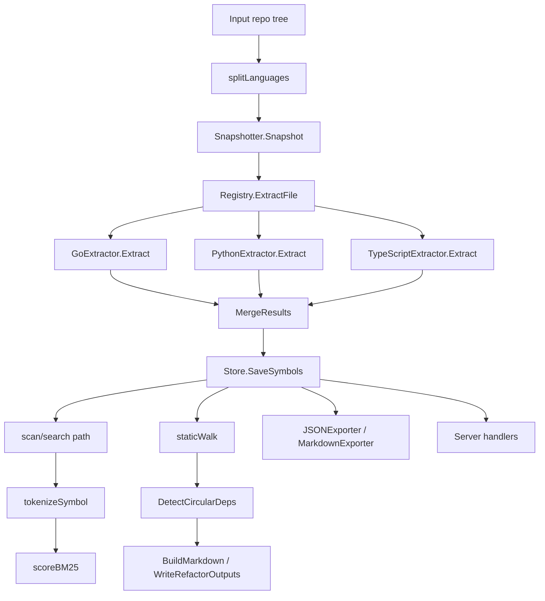

# End-to-End Data Flow

This page traces how data moves through the repository, from an input source tree to extracted symbols, scored and searched indexes, refactor findings, and final outputs. It deliberately focuses on **data movement** rather than high-level responsibilities. For architectural role descriptions, see the overview page; here we concentrate on the concrete artifacts and the functions that transform them.

## Top-Level Data Pipeline

At a high level, the repository follows a pipeline that starts with repository discovery and file inspection, then proceeds through symbol extraction, scoring/search, refactor detection, and output generation. On the Go side, the main flow is driven by the CLI entrypoints in [`main`](go/cmd/rekipedia/main.go#L6), [`splitLanguages`](go/cmd/rekipedia/cmd/scan.go#L165), [`tokenizeSymbol`](go/cmd/rekipedia/cmd/search.go#L20), [`scoreBM25`](go/cmd/rekipedia/cmd/search.go#L54), [`staticWalk`](go/cmd/rekipedia/cmd/refactor.go#L75), and [`DetectCircularDeps`](go/internal/analysis/refactor_detector.go#L103). On the Python side, the analogous flow appears in `src/rekipedia/analysis/cross_repo_search.py`, `src/rekipedia/analysis/refactor_detector.py`, and `src/rekipedia/analysis/refactor_enricher.py`, but this page keeps the emphasis on the Go repository paths requested by the task.

> **Sources:** `go/cmd/rekipedia/main.go` · L6–L8 · [`main`](go/cmd/rekipedia/main.go#L6) · `go/cmd/rekipedia/cmd/scan.go` · L165–L180 · [`splitLanguages`](go/cmd/rekipedia/cmd/scan.go#L165) · `go/cmd/rekipedia/cmd/search.go` · L20–L71 · [`tokenizeSymbol`](go/cmd/rekipedia/cmd/search.go#L20) · [`scoreBM25`](go/cmd/rekipedia/cmd/search.go#L54) · `go/cmd/rekipedia/cmd/refactor.go` · L75–L127 · [`staticWalk`](go/cmd/rekipedia/cmd/refactor.go#L75) · `go/internal/analysis/refactor_detector.go` · L103–L201 · [`DetectCircularDeps`](go/internal/analysis/refactor_detector.go#L103)

## Artifact Flow and Handoffs

The most useful way to understand the repository is by tracking the **artifacts** that cross module boundaries. The table below summarizes the major data products, who creates them, and who consumes them next.

| Data artifact | Producer(s) | Consumer(s) | Notes |
|---|---|---|---|
| Repository language selections | [`splitLanguages`](go/cmd/rekipedia/cmd/scan.go#L165), CLI option parsing in `go/cmd/rekipedia/cmd/scan.go` | [`Snapshotter.Snapshot`](go/internal/orchestrator/snapshotter.go#L89), orchestrator entrypoints | Used to restrict which files are scanned |
| File snapshot / file manifest | [`Snapshotter.Snapshot`](go/internal/orchestrator/snapshotter.go#L89), [`sha256File`](go/internal/orchestrator/snapshotter.go#L149), [`detectLanguage`](go/internal/orchestrator/snapshotter.go#L162) | [`ShardPlanner.Plan`](go/internal/orchestrator/sharding.go#L31), storage layer | Captures file path, hash, and detected language |
| Extracted symbols | [`GoExtractor.Extract`](go/internal/extractor/golang.go#L27), [`PythonExtractor.Extract`](go/internal/extractor/python.go#L37), [`TypeScriptExtractor.Extract`](go/internal/extractor/typescript.go#L40) | [`MergeResults`](go/internal/extractor/extractor.go#L50), storage layer | Core semantic data about functions, classes, interfaces, etc. |
| Relationships | Language extractors, [`MergeResults`](go/internal/extractor/extractor.go#L50) | Storage, graph/export/search layers | Drives call graphs, fan-in/fan-out, and cycle detection |
| Search tokens | [`tokenizeSymbol`](go/cmd/rekipedia/cmd/search.go#L20) | [`scoreBM25`](go/cmd/rekipedia/cmd/search.go#L54) | Normalizes symbol names for ranking |
| Ranked search results | [`scoreBM25`](go/cmd/rekipedia/cmd/search.go#L54), search command logic | CLI output, server search endpoints | Used for “find relevant symbols” workflows |
| Refactor findings | [`staticWalk`](go/cmd/rekipedia/cmd/refactor.go#L75), [`DetectCircularDeps`](go/internal/analysis/refactor_detector.go#L103) | [`BuildMarkdown`](go/internal/analysis/refactor_writer.go#L177), [`WriteRefactorOutputs`](go/internal/analysis/refactor_writer.go#L269) | Structured issues like cycles, dead code, and deep inheritance |
| Markdown refactor report | [`BuildMarkdown`](go/internal/analysis/refactor_writer.go#L177) | CLI output, filesystem | Human-readable report generated from findings |
| Export bundles | [`JSONExporter.Export`](go/internal/exporter/json_exporter.go#L49), [`MarkdownExporter.Export`](go/internal/exporter/markdown_exporter.go#L22) | Filesystem, downstream wiki/graph tooling | Materialized snapshots of symbols, relationships, and wiki pages |

> **Sources:** `go/cmd/rekipedia/cmd/scan.go` · L165–L180 · [`splitLanguages`](go/cmd/rekipedia/cmd/scan.go#L165) · `go/internal/orchestrator/snapshotter.go` · L89–L172 · [`Snapshotter.Snapshot`](go/internal/orchestrator/snapshotter.go#L89) · `go/internal/extractor/golang.go` · L27–L165 · [`GoExtractor.Extract`](go/internal/extractor/golang.go#L27) · `go/internal/extractor/python.go` · L37–L201 · [`PythonExtractor.Extract`](go/internal/extractor/python.go#L37) · `go/internal/extractor/typescript.go` · L40–L149 · [`TypeScriptExtractor.Extract`](go/internal/extractor/typescript.go#L40) · `go/cmd/rekipedia/cmd/search.go` · L20–L71 · [`tokenizeSymbol`](go/cmd/rekipedia/cmd/search.go#L20) · [`scoreBM25`](go/cmd/rekipedia/cmd/search.go#L54) · `go/cmd/rekipedia/cmd/refactor.go` · L75–L175 · [`staticWalk`](go/cmd/rekipedia/cmd/refactor.go#L75) · `go/internal/analysis/refactor_detector.go` · L103–L201 · [`DetectCircularDeps`](go/internal/analysis/refactor_detector.go#L103) · `go/internal/analysis/refactor_writer.go` · L177–L326 · [`BuildMarkdown`](go/internal/analysis/refactor_writer.go#L177) · `go/internal/exporter/json_exporter.go` · L49–L140 · [`JSONExporter.Export`](go/internal/exporter/json_exporter.go#L49) · `go/internal/exporter/markdown_exporter.go` · L22–L82 · [`MarkdownExporter.Export`](go/internal/exporter/markdown_exporter.go#L22)

## Input Repositories to File Snapshots

The first data transformation is from a raw repository tree to a normalized snapshot of files. The scan command parses the user’s language selection via [`splitLanguages`](go/cmd/rekipedia/cmd/scan.go#L165), then the orchestrator’s [`Snapshotter.Snapshot`](go/internal/orchestrator/snapshotter.go#L89) walks the tree and records file metadata. The snapshotter also computes file digests with [`sha256File`](go/internal/orchestrator/snapshotter.go#L149) and classifies files using [`detectLanguage`](go/internal/orchestrator/snapshotter.go#L162). This stage is where the repository becomes “data” rather than a directory listing: each file is distilled into structured metadata that can be reused by sharding, extraction, export, and UI layers.

The snapshot artifact is especially important because it is the bridge between the file system and the rest of the system. Even when later consumers only need symbols or relationships, they still rely on snapshot-derived paths, hashes, and language labels to preserve provenance.

> **Sources:** `go/cmd/rekipedia/cmd/scan.go` · L165–L180 · [`splitLanguages`](go/cmd/rekipedia/cmd/scan.go#L165) · `go/internal/orchestrator/snapshotter.go` · L89–L172 · [`Snapshotter.Snapshot`](go/internal/orchestrator/snapshotter.go#L89) · [`sha256File`](go/internal/orchestrator/snapshotter.go#L149) · [`detectLanguage`](go/internal/orchestrator/snapshotter.go#L162)

## Symbol Extraction and Merge

Once files are identified, the extractor registry dispatches each file to a language-specific extractor. The common entry point is [`Registry.ExtractFile`](go/internal/extractor/extractor.go#L37), which selects an implementation of the [`Extractor`](go/internal/extractor/extractor.go#L11) interface. Three concrete extractors are visible in the analysis: [`GoExtractor.Extract`](go/internal/extractor/golang.go#L27), [`PythonExtractor.Extract`](go/internal/extractor/python.go#L37), and [`TypeScriptExtractor.Extract`](go/internal/extractor/typescript.go#L40). Each extractor emits structured [`Symbol`](go/internal/models/contracts.go#L53) and [`Relationship`](go/internal/models/contracts.go#L64) records. Their outputs are then normalized by [`MergeResults`](go/internal/extractor/extractor.go#L50), which consolidates per-file extraction into one `AnalysisResult`-style dataset.

This is the repository’s main semantic lift: raw source text becomes searchable, analyzable metadata. The extracted symbol names, kinds, file locations, and relationships are the foundation for every later stage, including search, graph analysis, export, and refactor detection.

> **Sources:** `go/internal/extractor/extractor.go` · L11–L68 · [`Extractor`](go/internal/extractor/extractor.go#L11) · [`Registry.ExtractFile`](go/internal/extractor/extractor.go#L37) · [`MergeResults`](go/internal/extractor/extractor.go#L50) · `go/internal/extractor/golang.go` · L27–L165 · [`GoExtractor.Extract`](go/internal/extractor/golang.go#L27) · `go/internal/extractor/python.go` · L37–L201 · [`PythonExtractor.Extract`](go/internal/extractor/python.go#L37) · `go/internal/extractor/typescript.go` · L40–L149 · [`TypeScriptExtractor.Extract`](go/internal/extractor/typescript.go#L40) · `go/internal/models/contracts.go` · L53–L71 · [`Symbol`](go/internal/models/contracts.go#L53) · [`Relationship`](go/internal/models/contracts.go#L64)

## Search and Ranking Data Flow

Search is a narrow but important transformation pipeline: it turns stored symbols into ranked results. The search command begins by pulling symbols from storage, then tokenizes symbol names through [`tokenizeSymbol`](go/cmd/rekipedia/cmd/search.go#L20). Tokenization splits and normalizes names into searchable pieces, which are fed into [`scoreBM25`](go/cmd/rekipedia/cmd/search.go#L54). The output of BM25 scoring is a ranked list of `result` values defined in [`result`](go/cmd/rekipedia/cmd/search.go#L97).

From a data perspective, this stage converts symbol metadata into relevance scores, allowing CLI or API consumers to ask “what looks most like my query?” without needing to inspect raw tables themselves. The important thing to note is that search does not re-extract code; it consumes the already-structured symbols stored by the scan/digest pipeline.

| Step | Input | Output |
|---|---|---|
| Tokenization | Symbol name text | Token slice |
| Scoring | Query tokens + symbol tokens | BM25 score |
| Ranking | Score list | Ordered `result` list |

> **Sources:** `go/cmd/rekipedia/cmd/search.go` · L20–L102 · [`tokenizeSymbol`](go/cmd/rekipedia/cmd/search.go#L20) · [`scoreBM25`](go/cmd/rekipedia/cmd/search.go#L54) · [`result`](go/cmd/rekipedia/cmd/search.go#L97)

## Refactor Detection Pipeline

Refactor analysis has two layers of data movement: a **static scan** phase and a **detector** phase. The CLI-level [`staticWalk`](go/cmd/rekipedia/cmd/refactor.go#L75) walks the repository and identifies textual signals such as TODO/FIXME-style markers and other locally defined concerns. That output is packaged into [`Finding`](go/cmd/rekipedia/cmd/refactor.go#L57) records, filtered by [`applyFilter`](go/cmd/rekipedia/cmd/refactor.go#L130), and summarized by [`buildStaticReport`](go/cmd/rekipedia/cmd/refactor.go#L148).

The detector phase consumes the symbol/relationship graph itself. [`DetectCircularDeps`](go/internal/analysis/refactor_detector.go#L103) uses the relationship dataset to find cycles, while the sibling functions [`DetectGodNodes`](go/internal/analysis/refactor_detector.go#L30), [`DetectDeadCode`](go/internal/analysis/refactor_detector.go#L204), [`DetectHighFanIn`](go/internal/analysis/refactor_detector.go#L234), [`DetectHighFanOut`](go/internal/analysis/refactor_detector.go#L279), and [`DetectDeepInheritance`](go/internal/analysis/refactor_detector.go#L323) analyze structural patterns in the same graph. [`DetectAll`](go/internal/analysis/refactor_detector.go#L404) aggregates these into a single pass.

In other words, the refactor subsystem ingests the same core graph data that powers search and exports, but transforms it into issue-oriented output rather than navigation-oriented output.

> **Sources:** `go/cmd/rekipedia/cmd/refactor.go` · L57–L175 · [`Finding`](go/cmd/rekipedia/cmd/refactor.go#L57) · [`staticWalk`](go/cmd/rekipedia/cmd/refactor.go#L75) · [`applyFilter`](go/cmd/rekipedia/cmd/refactor.go#L130) · [`buildStaticReport`](go/cmd/rekipedia/cmd/refactor.go#L148) · `go/internal/analysis/refactor_detector.go` · L30–L413 · [`DetectCircularDeps`](go/internal/analysis/refactor_detector.go#L103) · [`DetectAll`](go/internal/analysis/refactor_detector.go#L404)

## Output Generation and Materialization

Once the system has symbols, relationships, search data, or findings, it writes them out in multiple formats. The refactor path produces Markdown and JSON via [`BuildMarkdown`](go/internal/analysis/refactor_writer.go#L177) and [`WriteRefactorOutputs`](go/internal/analysis/refactor_writer.go#L269). The export path serializes repository knowledge through [`JSONExporter.Export`](go/internal/exporter/json_exporter.go#L49) and [`MarkdownExporter.Export`](go/internal/exporter/markdown_exporter.go#L22). These exporters do not re-derive facts; they consume the structured data already assembled by the upstream pipeline.

This separation matters because it keeps the output layer deterministic. The writer and exporter modules are primarily formatting and persistence layers: they preserve the shape of the underlying artifacts while changing representation for humans or tools.

| Output | Producer | Primary consumer |
|---|---|---|
| Refactor Markdown report | [`BuildMarkdown`](go/internal/analysis/refactor_writer.go#L177) | CLI user, filesystem |
| Refactor JSON bundle | [`WriteRefactorOutputs`](go/internal/analysis/refactor_writer.go#L269) | Other tools, archives |
| Wiki JSON manifest | [`JSONExporter.Export`](go/internal/exporter/json_exporter.go#L49) | Storage, downstream tooling |
| Wiki Markdown pages | [`MarkdownExporter.Export`](go/internal/exporter/markdown_exporter.go#L22) | Filesystem, docs site |

> **Sources:** `go/internal/analysis/refactor_writer.go` · L177–L341 · [`BuildMarkdown`](go/internal/analysis/refactor_writer.go#L177) · [`WriteRefactorOutputs`](go/internal/analysis/refactor_writer.go#L269) · `go/internal/exporter/json_exporter.go` · L49–L148 · [`JSONExporter.Export`](go/internal/exporter/json_exporter.go#L49) · `go/internal/exporter/markdown_exporter.go` · L22–L82 · [`MarkdownExporter.Export`](go/internal/exporter/markdown_exporter.go#L22)

## Storage as the Shared Handoff Layer

A recurring pattern across the repository is that storage is the shared handoff point between analysis producers and UI/export consumers. The storage layer exposes symbol, relationship, page, QA, and manifest operations through methods such as [`SaveSymbols`](go/internal/storage/store.go#L149), [`ListSymbols`](go/internal/storage/store.go#L174), [`SaveRelationships`](go/internal/storage/store.go#L200), [`ListRelationships`](go/internal/storage/store.go#L223), [`UpsertWikiPage`](go/internal/storage/store.go#L247), and [`ListWikiPages`](go/internal/storage/store.go#L270). The alias layer in `go/internal/storage/aliases.go` exposes the same capabilities under convenience names like [`UpsertSymbols`](go/internal/storage/aliases.go#L49) and [`GetAllRelationships`](go/internal/storage/aliases.go#L64).

Because of this design, the rest of the system can remain focused on transformations rather than persistence details. Search reads from storage, refactor reporting reads from storage, the server reads from storage, and exporters write from storage-backed records.

> **Sources:** `go/internal/storage/store.go` · L149–L335 · [`SaveSymbols`](go/internal/storage/store.go#L149) · [`ListSymbols`](go/internal/storage/store.go#L174) · [`SaveRelationships`](go/internal/storage/store.go#L200) · [`ListRelationships`](go/internal/storage/store.go#L223) · [`UpsertWikiPage`](go/internal/storage/store.go#L247) · [`ListWikiPages`](go/internal/storage/store.go#L270) · `go/internal/storage/aliases.go` · L49–L122 · [`UpsertSymbols`](go/internal/storage/aliases.go#L49) · [`GetAllRelationships`](go/internal/storage/aliases.go#L64)

## Data Flow into the Server and UI

The HTTP server consumes the same persisted artifacts and repackages them for interactive use. Handlers such as [`handleAPIPages`](go/internal/server/server.go#L329), [`handleAPIPage`](go/internal/server/server.go#L334), [`handleAPIGraph`](go/internal/server/server.go#L649), and [`handleAPIWikiSearch`](go/internal/server/server.go#L802) read from storage and convert rows into response payloads. The server also uses helper types like [`graphData`](go/internal/server/server.go#L642) and [`searchResult`](go/internal/server/server.go#L816) to present the stored information in UI-friendly shapes.

This is a late-stage transformation, not a new analysis pass. The server simply consumes what the earlier pipeline already produced: symbols, relationships, wiki pages, and QA history.

> **Sources:** `go/internal/server/server.go` · L329–L926 · [`handleAPIPages`](go/internal/server/server.go#L329) · [`handleAPIPage`](go/internal/server/server.go#L334) · [`handleAPIGraph`](go/internal/server/server.go#L649) · [`handleAPIWikiSearch`](go/internal/server/server.go#L802) · [`graphData`](go/internal/server/server.go#L642) · [`searchResult`](go/internal/server/server.go#L816)

## Relationship Between Search and Refactor Paths

Although search and refactor detection solve different problems, they consume a common substrate: extracted symbols and relationships. Search works on symbol names and text normalization via [`tokenizeSymbol`](go/cmd/rekipedia/cmd/search.go#L20) and [`scoreBM25`](go/cmd/rekipedia/cmd/search.go#L54), while refactor detection uses graph structure and metadata through [`DetectCircularDeps`](go/internal/analysis/refactor_detector.go#L103) and its related detectors. This shared substrate is why a single scan can support both “find me the thing” and “tell me what looks risky” workflows.

A concise mental model is:

1. Repository files are scanned and classified.
2. Language extractors produce symbols and relationships.
3. Storage persists these graph artifacts.
4. Search ranks symbol text.
5. Refactor detectors analyze graph structure.
6. Writers/exporters materialize final outputs.

> **Sources:** `go/cmd/rekipedia/cmd/scan.go` · L165–L180 · [`splitLanguages`](go/cmd/rekipedia/cmd/scan.go#L165) · `go/internal/extractor/extractor.go` · L37–L68 · [`MergeResults`](go/internal/extractor/extractor.go#L50) · `go/cmd/rekipedia/cmd/search.go` · L20–L71 · [`tokenizeSymbol`](go/cmd/rekipedia/cmd/search.go#L20) · [`scoreBM25`](go/cmd/rekipedia/cmd/search.go#L54) · `go/internal/analysis/refactor_detector.go` · L103–L413 · [`DetectCircularDeps`](go/internal/analysis/refactor_detector.go#L103) · [`DetectAll`](go/internal/analysis/refactor_detector.go#L404)

## Notes on Observable Gaps

The analysis data is rich for the Go repository paths and for the general storage/export/server flow, but it does not expose every internal field shape for all structs in this page. Where that happens, the documentation stays at the level of observable function inputs and outputs rather than inventing field semantics. The data flow itself, however, is well evidenced: file systems feed snapshotting, snapshotting feeds extraction, extraction feeds storage, storage feeds search/refactor/server/export, and those consumers feed human-readable output.

> **Sources:** `go/internal/models/contracts.go` · L53–L156 · [`Symbol`](go/internal/models/contracts.go#L53) · [`Relationship`](go/internal/models/contracts.go#L64) · [`AnalysisResult`](go/internal/models/contracts.go#L82) · `go/internal/storage/store.go` · L149–L335 · `go/internal/server/server.go` · L329–L926