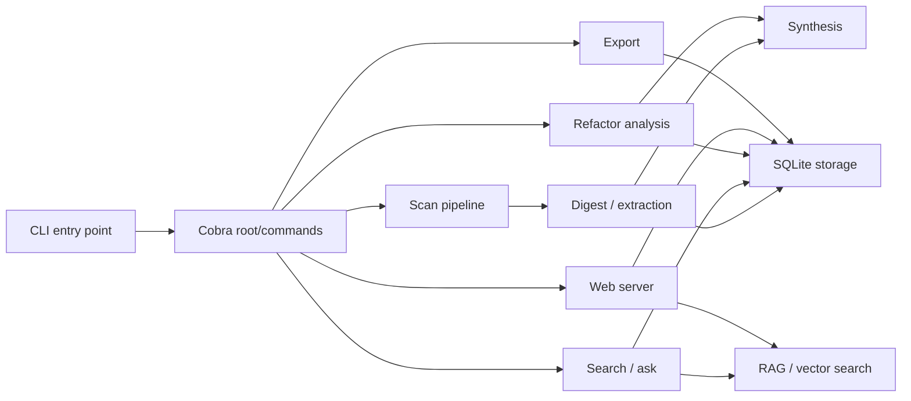
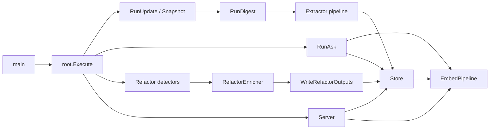

# Architecture Overview

## Components

Rekipedia is organized around a small set of top-level subsystems that turn a repository scan into searchable, exportable, and refactor-oriented knowledge. The CLI entry point [`main`](go/cmd/rekipedia/main.go#L6) delegates into the Cobra command tree defined in [`Execute`](go/cmd/rekipedia/cmd/root.go#L44) and the command registration in [`init`](go/cmd/rekipedia/cmd/root.go#L50-L77). From there, the runtime fans out into distinct flows: repository scanning, search and ask/RAG interaction, refactor analysis, and presentation/export.

The primary orchestration layer lives in [`RunUpdate`](go/internal/orchestrator/run_update.go#L30-L179), [`RunDigest`](go/internal/orchestrator/run_digest.go#L48-L309), and [`RunAsk`](go/internal/orchestrator/run_ask.go#L59-L109). These functions coordinate lower-level services rather than performing all work themselves. For example, scanning starts with [`Snapshotter`](go/internal/orchestrator/snapshotter.go#L57-L62) and [`Snapshotter.Snapshot`](go/internal/orchestrator/snapshotter.go#L89-L147), which produces file manifests and language-aware file metadata. Those manifests are then partitioned by [`ShardPlanner`](go/internal/orchestrator/sharding.go#L17-L19) via [`ShardPlanner.Plan`](go/internal/orchestrator/sharding.go#L31-L54). The digest path then feeds shard content into extraction and synthesis helpers, combining [`extractShard`](go/internal/orchestrator/run_digest.go#L313-L331), [`combineResults`](go/internal/orchestrator/run_digest.go#L346-L361), and the synthesis layer in [`PageBuilder`](go/internal/synthesis/page_builder.go#L60-L62) and [`DiagramBuilder`](go/internal/synthesis/diagram_builder.go#L16-L16).

The data model is centralized in [`LLMConfig`](go/internal/models/contracts.go#L6-L15), [`Symbol`](go/internal/models/contracts.go#L53-L61), [`Relationship`](go/internal/models/contracts.go#L64-L71), [`AnalysisResult`](go/internal/models/contracts.go#L82-L94), [`Shard`](go/internal/models/contracts.go#L97-L101), [`WikiPageSpec`](go/internal/models/contracts.go#L119-L129), and related contracts in [`go/internal/models/contracts.go`](go/internal/models/contracts.go). These structs define the shape of data flowing between CLI, storage, analysis, and export steps.

Storage is handled by [`Store`](go/internal/storage/store.go#L18-L21), opened with [`Open`](go/internal/storage/store.go#L24-L35), and accessed through the alias methods in [`go/internal/storage/aliases.go`](go/internal/storage/aliases.go). This is the persistence backbone for runs, symbols, relationships, wiki pages, QA history, and manifests.

Search and retrieval are split between full-text-ish ranking and vector retrieval. The CLI-facing search path relies on [`tokenizeSymbol`](go/cmd/rekipedia/cmd/search.go#L20-L51) and [`scoreBM25`](go/cmd/rekipedia/cmd/search.go#L54-L71), while the ask flow consults the RAG pipeline implemented by [`EmbedPipeline`](go/internal/rag/embedder.go#L15-L18), [`EmbedPipeline.Build`](go/internal/rag/embedder.go#L30-L84), [`EmbedPipeline.Search`](go/internal/rag/embedder.go#L87-L102), and [`VectorStore`](go/internal/rag/vector_store.go#L15-L18).

Refactor analysis is also a first-class subsystem. The static detectors in [`DetectAll`](go/internal/analysis/refactor_detector.go#L404-L413), the enrichment pipeline in [`RefactorEnricher`](go/internal/analysis/refactor_enricher.go#L296-L298), and the report writer in [`WriteRefactorOutputs`](go/internal/analysis/refactor_writer.go#L269-L326) form the refactor flow used by the `refactor` command.

> **Sources:** `go/cmd/rekipedia/main.go` · L6–L8 · [`main`](go/cmd/rekipedia/main.go#L6)  
> **Sources:** `go/cmd/rekipedia/cmd/root.go` · L44–L77 · [`Execute`](go/cmd/rekipedia/cmd/root.go#L44)  
> **Sources:** `go/internal/orchestrator/run_update.go` · L30–L179 · [`RunUpdate`](go/internal/orchestrator/run_update.go#L30)  
> **Sources:** `go/internal/orchestrator/run_digest.go` · L48–L309 · [`RunDigest`](go/internal/orchestrator/run_digest.go#L48)  
> **Sources:** `go/internal/orchestrator/run_ask.go` · L59–L109 · [`RunAsk`](go/internal/orchestrator/run_ask.go#L59)  
> **Sources:** `go/internal/analysis/refactor_detector.go` · L404–L413 · [`DetectAll`](go/internal/analysis/refactor_detector.go#L404)  
> **Sources:** `go/internal/analysis/refactor_enricher.go` · L296–L347 · [`RefactorEnricher`](go/internal/analysis/refactor_enricher.go#L296)  
> **Sources:** `go/internal/analysis/refactor_writer.go` · L269–L326 · [`WriteRefactorOutputs`](go/internal/analysis/refactor_writer.go#L269)

## Data Flow

At a high level, the system follows a pipeline-oriented flow that begins with repository discovery and ends with persisted artifacts plus multiple presentation surfaces.

1. **CLI invocation** starts at [`main`](go/cmd/rekipedia/main.go#L6-L8) and dispatches into command handlers such as the scan, ask, refactor, export, and serve commands defined under `go/cmd/rekipedia/cmd/`.
2. **Scan** uses [`Snapshotter.Snapshot`](go/internal/orchestrator/snapshotter.go#L89-L147) to identify files, detect languages, compute SHA-256 hashes, and produce manifests. The helper [`detectLanguage`](go/internal/orchestrator/snapshotter.go#L162-L172) is the observable language classifier in this stage.
3. **Sharding** uses [`ShardPlanner.Plan`](go/internal/orchestrator/sharding.go#L31-L54) and related helpers like [`fileTokenEstimate`](go/internal/orchestrator/sharding.go#L100-L106) to batch files into work units.
4. **Digest/extraction** processes each shard via [`extractShard`](go/internal/orchestrator/run_digest.go#L313-L331), which pulls symbols and relationships through extractors, then merges results with [`combineResults`](go/internal/orchestrator/run_digest.go#L346-L361).
5. **Storage** persists the run, symbols, relationships, manifests, wiki pages, and QA history through [`Store`](go/internal/storage/store.go#L18-L21) and its methods such as [`SaveSymbols`](go/internal/storage/store.go#L149-L171), [`SaveRelationships`](go/internal/storage/store.go#L200-L220), and [`UpsertWikiPage`](go/internal/storage/store.go#L247-L258).
6. **Search / ask** uses a hybrid approach: repository data from storage plus embeddings from [`EmbedPipeline.Build`](go/internal/rag/embedder.go#L30-L84) and retrieval from [`EmbedPipeline.Search`](go/internal/rag/embedder.go#L87-L102). The CLI search command also supports lexical ranking through [`scoreBM25`](go/cmd/rekipedia/cmd/search.go#L54-L71).
7. **Refactor analysis** consumes symbols/relationships and produces issue reports with [`DetectGodNodes`](go/internal/analysis/refactor_detector.go#L30-L100), [`DetectCircularDeps`](go/internal/analysis/refactor_detector.go#L103-L201), [`DetectDeadCode`](go/internal/analysis/refactor_detector.go#L204-L231), [`DetectHighFanIn`](go/internal/analysis/refactor_detector.go#L234-L276), [`DetectHighFanOut`](go/internal/analysis/refactor_detector.go#L279-L320), and [`DetectDeepInheritance`](go/internal/analysis/refactor_detector.go#L323-L401). Optional enrichment is done in [`DetectIssues`](go/internal/analysis/refactor_enricher.go#L99-L246) and rendered by [`BuildMarkdown`](go/internal/analysis/refactor_writer.go#L177-L263).
8. **Presentation/export** is handled by the web server in [`Server.Start`](go/internal/server/server.go#L71-L96), the markdown exporter in [`MarkdownExporter.Export`](go/internal/exporter/markdown_exporter.go#L22-L63), and the JSON exporter in [`JSONExporter.Export`](go/internal/exporter/json_exporter.go#L49-L140).

A useful way to think about the system is that scanning builds the knowledge base, RAG/search consumes it, refactor analysis interprets it, and export/serve expose it.

> **Sources:** `go/cmd/rekipedia/main.go` · L6–L8 · [`main`](go/cmd/rekipedia/main.go#L6)  
> **Sources:** `go/internal/orchestrator/snapshotter.go` · L89–L172 · [`Snapshotter.Snapshot`](go/internal/orchestrator/snapshotter.go#L89)  
> **Sources:** `go/internal/orchestrator/sharding.go` · L31–L106 · [`ShardPlanner.Plan`](go/internal/orchestrator/sharding.go#L31)  
> **Sources:** `go/internal/orchestrator/run_digest.go` · L313–L361 · [`extractShard`](go/internal/orchestrator/run_digest.go#L313)  
> **Sources:** `go/internal/storage/store.go` · L149–L335 · [`SaveSymbols`](go/internal/storage/store.go#L149)  
> **Sources:** `go/internal/rag/embedder.go` · L30–L102 · [`EmbedPipeline.Build`](go/internal/rag/embedder.go#L30)  
> **Sources:** `go/internal/analysis/refactor_detector.go` · L30–L413 · [`DetectAll`](go/internal/analysis/refactor_detector.go#L404)  
> **Sources:** `go/internal/analysis/refactor_enricher.go` · L99–L347 · [`DetectIssues`](go/internal/analysis/refactor_enricher.go#L99)  
> **Sources:** `go/internal/analysis/refactor_writer.go` · L177–L326 · [`BuildMarkdown`](go/internal/analysis/refactor_writer.go#L177)

## Design Decisions

Several design choices are visible from the code structure and the relationships between modules.

### 1. Cobra-based command boundary

The CLI is modeled as a command tree rather than a monolithic `main`. [`Execute`](go/cmd/rekipedia/cmd/root.go#L44-L48) and the command `init` blocks in the individual command files centralize subcommand registration. This makes operational flows explicit: `scan`, `ask`, `refactor`, `embed`, `export`, `serve`, `update`, `diff`, `hook`, `context`, and `impact` are separate user actions with distinct implementations.

### 2. Storage as the source of truth

Most downstream features depend on [`Store`](go/internal/storage/store.go#L18-L21) rather than recomputing data in memory. This choice is reinforced by the alias methods in [`go/internal/storage/aliases.go`](go/internal/storage/aliases.go), which show that callers intentionally use a shared persistence API for runs, snapshots, symbols, relationships, pages, and QA history. That makes the scan output durable and queryable by search, export, server, and refactor commands.

### 3. Pipeline decomposition over shared mutable state

Scan, digest, and synthesis are separated into independent steps: [`Snapshotter`](go/internal/orchestrator/snapshotter.go#L57-L62), [`ShardPlanner`](go/internal/orchestrator/sharding.go#L17-L19), [`RunDigest`](go/internal/orchestrator/run_digest.go#L48-L309), [`PageBuilder`](go/internal/synthesis/page_builder.go#L60-L62), and [`DiagramBuilder`](go/internal/synthesis/diagram_builder.go#L16-L16). This suggests a deliberate preference for stage boundaries, which is especially helpful for parallelization and testing.

### 4. Dual search strategy

The system supports both lexical search and embedding-based retrieval. [`scoreBM25`](go/cmd/rekipedia/cmd/search.go#L54-L71) indicates a BM25-like scoring path, while [`VectorStore.Search`](go/internal/rag/vector_store.go#L71-L93) and [`EmbedPipeline.Search`](go/internal/rag/embedder.go#L87-L102) implement semantic retrieval. This is a pragmatic design: lexical search is fast and transparent, while embeddings improve question answering and page recall.

### 5. Refactor analysis is deterministic first, LLM-assisted second

The static detectors in [`go/internal/analysis/refactor_detector.go`](go/internal/analysis/refactor_detector.go) are deterministic and testable. LLM enrichment is layered on top in [`RefactorEnricher.Enrich`](go/internal/analysis/refactor_enricher.go#L324-L347) and [`buildPrompt`](go/internal/analysis/refactor_enricher.go#L361-L405). This separation limits the LLM’s role to explanation and augmentation rather than core detection logic.

### 6. Presentation is built from persisted artifacts

The server and exporters read from storage rather than directly from the analysis pipeline. [`Server.handleAPIWikiSearch`](go/internal/server/server.go#L802-L926), [`MarkdownExporter.Export`](go/internal/exporter/markdown_exporter.go#L22-L63), and [`JSONExporter.Export`](go/internal/exporter/json_exporter.go#L49-L140) all consume stored pages/symbols/relationships. That keeps rendering repeatable and decouples analysis from display.

> **Sources:** `go/cmd/rekipedia/cmd/root.go` · L44–L77 · [`Execute`](go/cmd/rekipedia/cmd/root.go#L44)  
> **Sources:** `go/internal/storage/store.go` · L18–L335 · [`Store`](go/internal/storage/store.go#L18)  
> **Sources:** `go/internal/storage/aliases.go` · L1–L122 · [`(s *Store).UpsertRun`](go/internal/storage/aliases.go#L9)  
> **Sources:** `go/internal/orchestrator/snapshotter.go` · L57–L172 · [`Snapshotter`](go/internal/orchestrator/snapshotter.go#L57)  
> **Sources:** `go/internal/orchestrator/sharding.go` · L17–L106 · [`ShardPlanner`](go/internal/orchestrator/sharding.go#L17)  
> **Sources:** `go/internal/rag/embedder.go` · L15–L102 · [`EmbedPipeline`](go/internal/rag/embedder.go#L15)  
> **Sources:** `go/internal/analysis/refactor_detector.go` · L30–L413 · [`DetectAll`](go/internal/analysis/refactor_detector.go#L404)  
> **Sources:** `go/internal/analysis/refactor_enricher.go` · L296–L405 · [`RefactorEnricher`](go/internal/analysis/refactor_enricher.go#L296)  
> **Sources:** `go/internal/server/server.go` · L71–L926 · [`Server`](go/internal/server/server.go#L35)