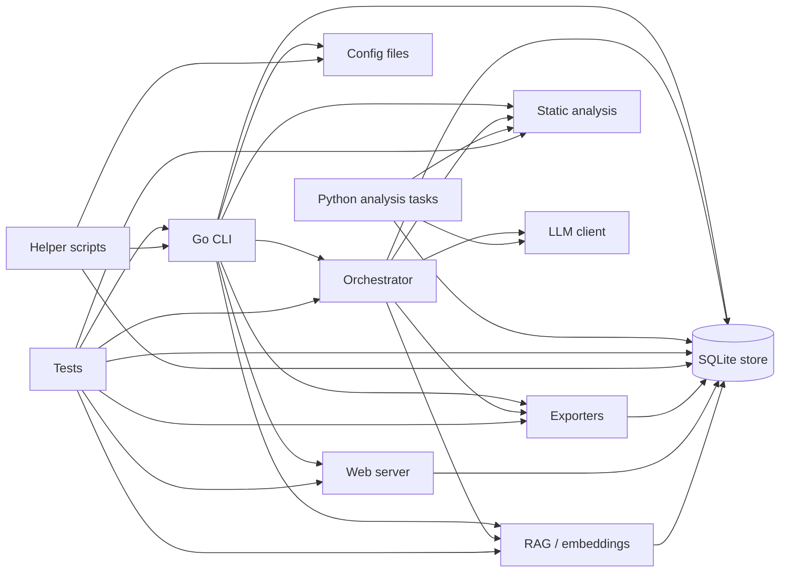
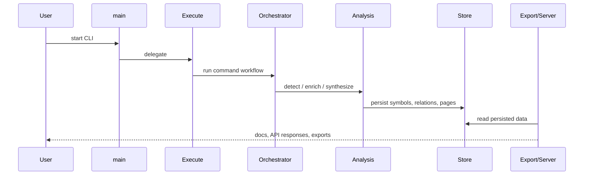

# System Overview

This repository is a cross-language system for building, storing, analyzing, and presenting code intelligence. The runtime shape is centered on a Go command-line application, with Python analysis modules providing complementary repository analytics and search behavior. The shared data backbone is the SQLite-backed [`Store`](go/internal/storage/store.go#L18), which persists runs, symbols, relationships, wiki pages, QA history, and manifests across the workflow.

The Go side provides the operational pipeline: command entrypoint, orchestration, extraction, analysis, refactor detection, RAG embedding, export, and the web server. The Python side mirrors some of those concerns for its own package namespace and includes repository analysis helpers such as [`rekipedia.analysis.cross_repo_search`](src/rekipedia/analysis/cross_repo_search.py) and [`rekipedia.analysis.graph_analysis`](src/rekipedia/analysis/graph_analysis.py). The tests are extensive and act as executable documentation for almost every subsystem.

> **Sources:** `go/cmd/rekipedia/main.go` · L6–L8 · [`main`](go/cmd/rekipedia/main.go#L6) · `go/cmd/rekipedia/cmd/root.go` · L44–L48 · [`Execute`](go/cmd/rekipedia/cmd/root.go#L44)

## Component Responsibilities

### Go CLI as the runtime front door

The application begins in [`main`](go/cmd/rekipedia/main.go#L6-L8), which delegates directly to [`Execute`](go/cmd/rekipedia/cmd/root.go#L44-L48). That root command is responsible for wiring the Cobra command tree and exposing the top-level user-facing interface. The root package also owns banner/version behavior via [`printRootBanner`](go/cmd/rekipedia/cmd/root.go#L36-L41), while subcommands such as scan, refactor, export, serve, diff, hook, update, and ask are registered in [`init`](go/cmd/rekipedia/cmd/root.go#L50-L77).

Within the CLI package, [`loadLLMConfig`](go/cmd/rekipedia/cmd/scan.go#L143-L161) is one of the most important shape-defining helpers because it determines how scan-time LLM settings are resolved from environment and config inputs. It is paired with [`splitLanguages`](go/cmd/rekipedia/cmd/scan.go#L165-L180), which influences what file types the scanner processes.

### Orchestrator as workflow coordinator

The orchestrator package is the core runtime coordinator. It handles the end-to-end pipeline that scans repositories, chunks files, embeds content, runs analysis, and persists results. Key entrypoints include [`RunAsk`](go/internal/orchestrator/run_ask.go#L59-L109), [`RunDigest`](go/internal/orchestrator/run_digest.go#L48-L309), and [`RunUpdate`](go/internal/orchestrator/run_update.go#L30-L179). The orchestrator also encapsulates repository shaping logic through [`ShardPlanner`](go/internal/orchestrator/sharding.go#L17-L19) and [`NewShardPlanner`](go/internal/orchestrator/sharding.go#L23-L28), plus filesystem-based repository snapshots through [`Snapshotter`](go/internal/orchestrator/snapshotter.go#L57-L62).

A particularly important helper is [`finishDigest`](go/internal/orchestrator/helpers.go#L18-L91), which shows the orchestrator’s role as the place where analysis, synthesis, storage, and LLM-backed refinement are brought together.

### Analysis and refactor detection

The low-level static analysis package is responsible for turning model data into higher-level refactor signals. [`DetectAll`](go/internal/analysis/refactor_detector.go#L404-L413) aggregates the major detectors: [`DetectGodNodes`](go/internal/analysis/refactor_detector.go#L30-L100), [`DetectCircularDeps`](go/internal/analysis/refactor_detector.go#L103-L201), [`DetectDeadCode`](go/internal/analysis/refactor_detector.go#L204-L231), [`DetectHighFanIn`](go/internal/analysis/refactor_detector.go#L234-L276), [`DetectHighFanOut`](go/internal/analysis/refactor_detector.go#L279-L320), and [`DetectDeepInheritance`](go/internal/analysis/refactor_detector.go#L323-L401).

Those results are then enriched by [`DetectIssues`](go/internal/analysis/refactor_enricher.go#L99-L246), [`AttachCallers`](go/internal/analysis/refactor_enricher.go#L249-L264), and [`AttachNotes`](go/internal/analysis/refactor_enricher.go#L268-L290), then formatted into reports with [`BuildMarkdown`](go/internal/analysis/refactor_writer.go#L177-L263) and [`WriteRefactorOutputs`](go/internal/analysis/refactor_writer.go#L269-L326). The CLI-facing static report helper [`buildStaticReport`](go/cmd/rekipedia/cmd/refactor.go#L148-L175) is the bridge from detector output to human-readable summaries.

### Storage, export, and presentation

The persistence layer is a SQLite store exposed by [`Store`](go/internal/storage/store.go#L18-L21), with lifecycle methods such as [`Open`](go/internal/storage/store.go#L24-L35), [`CreateRun`](go/internal/storage/store.go#L116-L122), [`SaveSymbols`](go/internal/storage/store.go#L149-L171), [`SaveRelationships`](go/internal/storage/store.go#L200-L220), [`UpsertWikiPage`](go/internal/storage/store.go#L247-L258), and [`SaveQA`](go/internal/storage/store.go#L303-L309). The export layer produces JSON and Markdown artifacts through [`JSONExporter`](go/internal/exporter/json_exporter.go#L16-L18) and [`MarkdownExporter`](go/internal/exporter/markdown_exporter.go#L11-L13).

The web server uses that same store to render pages and expose APIs. The server’s main shape is in [`Server`](go/internal/server/server.go#L35-L43), with HTTP handlers such as [`handleAPIPages`](go/internal/server/server.go#L329-L332), [`handleAPIWikiSearch`](go/internal/server/server.go#L802-L926), and [`handleAPIGraph`](go/internal/server/server.go#L649-L799). This means the presentation layer is fundamentally read-oriented over persisted analysis artifacts.

> **Sources:** `go/cmd/rekipedia/cmd/root.go` · L36–L77 · [`printRootBanner`](go/cmd/rekipedia/cmd/root.go#L36), [`Execute`](go/cmd/rekipedia/cmd/root.go#L44) · `go/internal/orchestrator/run_digest.go` · L48–L309 · [`RunDigest`](go/internal/orchestrator/run_digest.go#L48) · `go/internal/analysis/refactor_detector.go` · L30–L413 · [`DetectAll`](go/internal/analysis/refactor_detector.go#L404) · `go/internal/storage/store.go` · L18–L335 · [`Store`](go/internal/storage/store.go#L18)

## Design Boundaries

### Boundary: CLI vs. orchestration

The CLI is intentionally thin at the top level. Its job is to parse user intent, assemble config, and dispatch to orchestration methods. This boundary is visible in the fact that `main` only calls [`Execute`](go/cmd/rekipedia/cmd/root.go#L44-L48), while the actual work is carried out deeper in packages like orchestrator, storage, analysis, and synthesis.

The [`loadLLMConfig`](go/cmd/rekipedia/cmd/scan.go#L143-L161) helper is a good example of what stays at the edge: it resolves configuration, but does not itself perform repository analysis. Similarly, the CLI-specific [`buildStaticReport`](go/cmd/rekipedia/cmd/refactor.go#L148-L175) formats analysis data already produced by lower layers.

### Boundary: analysis vs. synthesis

A clear separation exists between detecting issues and turning them into navigable documentation. The detector functions like [`DetectGodNodes`](go/internal/analysis/refactor_detector.go#L30-L100) and [`DetectCircularDeps`](go/internal/analysis/refactor_detector.go#L103-L201) produce structured [`RefactorIssue`](go/internal/analysis/refactor_types.go#L24-L38) values. The synthesis layer then converts structured results into pages and diagrams using [`PlannerAgent`](go/internal/synthesis/planner.go#L77-L79), [`PageBuilder`](go/internal/synthesis/page_builder.go#L60-L62), and [`DiagramBuilder`](go/internal/synthesis/diagram_builder.go#L16-L16).

That boundary matters because it keeps heuristic analysis separate from narrative generation. The codebase can therefore re-use the same analysis results in multiple output channels: markdown pages, diagrams, search, and server endpoints.

### Boundary: storage vs. derived views

The store is the source of truth for persisted runs and content. Functions like [`LatestRunID`](go/internal/storage/store.go#L134-L144), [`ListSymbols`](go/internal/storage/store.go#L174-L195), and [`ListWikiPages`](go/internal/storage/store.go#L270-L289) expose raw persisted records. Derived views such as graph pages, exported markdown, or search results are assembled on top of those records rather than stored as the primary source.

This is also reflected in the aliases layer under [`go/internal/storage/aliases.go`](go/internal/storage/aliases.go), which provides compatibility wrappers like [`GetAllSymbols`](go/internal/storage/aliases.go#L59-L61) and [`GetAllRelationships`](go/internal/storage/aliases.go#L64-L84) rather than introducing a separate data model.

### Boundary: Go runtime vs. Python analysis helpers

The repository contains a Python package with its own analysis utilities, but those are not the runtime backbone of the Go application. Python modules such as [`rekipedia.analysis.cross_repo_search`](src/rekipedia/analysis/cross_repo_search.py) and [`rekipedia.analysis.refactor_detector`](src/rekipedia/analysis/refactor_detector.py) operate in a complementary ecosystem. The observable boundary is that the Go command line, server, and persistence stack are self-contained, while Python code provides analysis functions and fixtures for separate workflows and tests.

> **Sources:** `go/cmd/rekipedia/cmd/scan.go` · L143–L180 · [`loadLLMConfig`](go/cmd/rekipedia/cmd/scan.go#L143) · `go/cmd/rekipedia/cmd/refactor.go` · L148–L175 · [`buildStaticReport`](go/cmd/rekipedia/cmd/refactor.go#L148) · `go/internal/analysis/refactor_detector.go` · L30–L413 · [`DetectAll`](go/internal/analysis/refactor_detector.go#L404) · `go/internal/synthesis/page_builder.go` · L60–L266 · [`PageBuilder`](go/internal/synthesis/page_builder.go#L60)

## Main Data Inputs and Outputs

### Inputs

The runtime consumes several distinct kinds of inputs:

| Input type | Examples | Used by |
|---|---|---|
| Repository source files | Go, Python, TypeScript files | [`Snapshotter`](go/internal/orchestrator/snapshotter.go#L89-L147), extractors, detectors |
| CLI arguments | Subcommand options and flags | [`Execute`](go/cmd/rekipedia/cmd/root.go#L44-L48) and subcommands |
| Config files / env | LLM configuration, language filters, scan settings | [`loadLLMConfig`](go/cmd/rekipedia/cmd/scan.go#L143-L161), config loaders |
| Existing store state | Prior runs, pages, QA history, manifests | [`Store`](go/internal/storage/store.go#L18-L335), server handlers |
| LLM responses | Planning, enrichment, question answering | [`Client`](go/internal/llm/client.go#L110-L145), synthesis and enrichment layers |

Entry-point fixtures such as `tests/fixtures/mini-py-repo/main.py` and `tests/fixtures/mini-ts-repo/src/index.ts` indicate that multi-language repository content is a first-class input for the analysis and extraction pipeline.

### Outputs

The system produces both machine-readable and human-readable outputs:

| Output type | Produced by | Notes |
|---|---|---|
| SQLite records | [`Store`](go/internal/storage/store.go#L18-L335) | authoritative persisted analysis state |
| JSON exports | [`JSONExporter`](go/internal/exporter/json_exporter.go#L49-L140) | symbols, relationships, manifest |
| Markdown exports | [`MarkdownExporter`](go/internal/exporter/markdown_exporter.go#L22-L63) | wiki pages and rendered docs |
| Refactor reports | [`buildStaticReport`](go/cmd/rekipedia/cmd/refactor.go#L148-L175), [`BuildMarkdown`](go/internal/analysis/refactor_writer.go#L177-L263) | concise issue summaries |
| HTTP responses | [`Server`](go/internal/server/server.go#L35-L43) | HTML pages and JSON APIs |
| Embedding/vector data | [`EmbedPipeline`](go/internal/rag/embedder.go#L15-L18), [`VectorStore`](go/internal/rag/vector_store.go#L15-L18) | search and retrieval support |

The important architectural pattern is that nearly every output is materialized from a persisted or structured intermediate rather than generated ad hoc. That makes the system reproducible: runs can be exported, rendered, searched, and queried long after the original scan.

> **Sources:** `go/internal/storage/store.go` · L18–L335 · [`Store`](go/internal/storage/store.go#L18) · `go/internal/exporter/json_exporter.go` · L49–L140 · [`JSONExporter`](go/internal/exporter/json_exporter.go#L16) · `go/internal/exporter/markdown_exporter.go` · L22–L63 · [`MarkdownExporter`](go/internal/exporter/markdown_exporter.go#L11) · `go/internal/server/server.go` · L35–L926 · [`Server`](go/internal/server/server.go#L35)

## Key Application-Shaping Symbols

### [`main`](go/cmd/rekipedia/main.go#L6-L8) and [`Execute`](go/cmd/rekipedia/cmd/root.go#L44-L48)

These two symbols define the outermost application lifecycle. [`main`](go/cmd/rekipedia/main.go#L6-L8) is minimal and defers to [`Execute`](go/cmd/rekipedia/cmd/root.go#L44-L48), which in turn activates the Cobra command tree assembled in [`init`](go/cmd/rekipedia/cmd/root.go#L50-L77). This is the canonical CLI entry path.

### [`loadLLMConfig`](go/cmd/rekipedia/cmd/scan.go#L143-L161) and [`splitLanguages`](go/cmd/rekipedia/cmd/scan.go#L165-L180)

These functions shape scan-time behavior. Configuration determines what model/provider settings are available to the rest of the pipeline, while language splitting determines the scope of the repository traversal. In practical terms, they decide what the orchestrator will inspect and how it will talk to the LLM layer.

### [`DetectAll`](go/internal/analysis/refactor_detector.go#L404-L413)

This is the top-level static-analysis aggregation point. It combines multiple detectors into a single pass and establishes the analysis vocabulary used downstream by refactor reporting and synthesis. If you want to understand what kinds of “problems” the system can name, this is the symbol to start with.

### [`buildStaticReport`](go/cmd/rekipedia/cmd/refactor.go#L148-L175)

This function is the CLI-facing assembly point for static refactor output. It turns detected issues into a summarized report without requiring the full synthesis pipeline. That makes it a useful fast path for local inspection and a clear example of a boundary-preserving helper: it formats, but does not perform analysis itself.

### Supporting structural types

Several types define the shape of the data model and, by extension, the application:

- [`LLMConfig`](go/internal/models/contracts.go#L6-L15)
- [`Symbol`](go/internal/models/contracts.go#L53-L61)
- [`Relationship`](go/internal/models/contracts.go#L64-L71)
- [`AnalysisResult`](go/internal/models/contracts.go#L82-L94)
- [`WikiPageSpec`](go/internal/models/contracts.go#L119-L129)
- [`WikiPlan`](go/internal/models/contracts.go#L139-L144)
- [`RefactorIssue`](go/internal/analysis/refactor_types.go#L24-L38)
- [`RefactorReport`](go/internal/analysis/refactor_types.go#L60-L65)

These contracts are what let the CLI, storage layer, server, exporters, and synthesis pipeline communicate without tightly coupling to one another’s internal representation.

> **Sources:** `go/cmd/rekipedia/main.go` · L6–L8 · [`main`](go/cmd/rekipedia/main.go#L6) · `go/cmd/rekipedia/cmd/root.go` · L44–L77 · [`Execute`](go/cmd/rekipedia/cmd/root.go#L44) · `go/cmd/rekipedia/cmd/scan.go` · L143–L180 · [`loadLLMConfig`](go/cmd/rekipedia/cmd/scan.go#L143) · [`splitLanguages`](go/cmd/rekipedia/cmd/scan.go#L165) · `go/internal/analysis/refactor_detector.go` · L404–L413 · [`DetectAll`](go/internal/analysis/refactor_detector.go#L404) · `go/cmd/rekipedia/cmd/refactor.go` · L148–L175 · [`buildStaticReport`](go/cmd/rekipedia/cmd/refactor.go#L148)

## Runtime Data Flow at a Glance

The most important high-level flow is:

1. The user launches the Go CLI via [`main`](go/cmd/rekipedia/main.go#L6-L8).
2. [`Execute`](go/cmd/rekipedia/cmd/root.go#L44-L48) resolves the command and dispatches to a subcommand.
3. Orchestrator code such as [`RunDigest`](go/internal/orchestrator/run_digest.go#L48-L309) or [`RunUpdate`](go/internal/orchestrator/run_update.go#L30-L179) scans, chunks, analyzes, and persists data.
4. Analysis results are written to [`Store`](go/internal/storage/store.go#L18-L335).
5. Exporters and server handlers re-read the persisted state for markdown, JSON, or HTML views.
6. RAG components and query paths reuse the stored content for semantic retrieval.

> **Sources:** `go/cmd/rekipedia/main.go` · L6–L8 · [`main`](go/cmd/rekipedia/main.go#L6) · `go/cmd/rekipedia/cmd/root.go` · L44–L48 · [`Execute`](go/cmd/rekipedia/cmd/root.go#L44) · `go/internal/orchestrator/run_digest.go` · L48–L309 · [`RunDigest`](go/internal/orchestrator/run_digest.go#L48) · `go/internal/storage/store.go` · L18–L335 · [`Store`](go/internal/storage/store.go#L18)