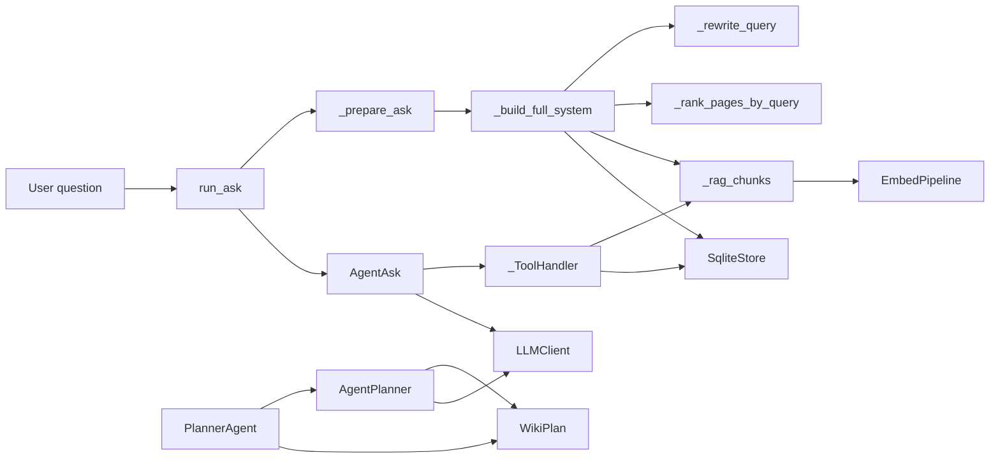
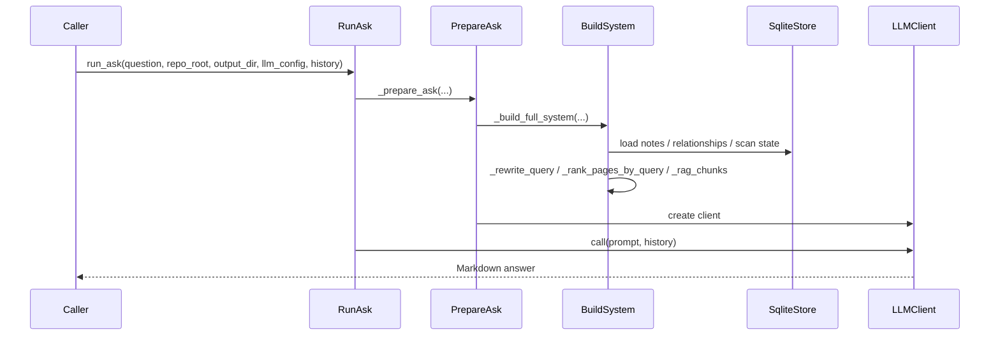

# Deep Architectural Overview

## System Architecture

`rekipedia` is a small but fairly rich question-answering and wiki-synthesis system. The observed codebase centers on two major workflows:

1. **Ask / answer**: load a prior scan, assemble contextual evidence, and answer questions grounded in the repo knowledge store.
2. **Plan / synthesize**: generate a wiki structure from repository analysis, using either a deterministic planner or an agentic, tool-driven planner.

The architecture is organized around a few high-leverage modules:
- [`rekipedia.orchestrator.run_ask`](src/rekipedia/orchestrator/run_ask.py#L1) for the standard ask path
- [`rekipedia.orchestrator.agent_ask`](src/rekipedia/orchestrator/agent_ask.py#L1) for the agentic ask fallback / variant
- [`rekipedia.synthesis.planner`](src/rekipedia/synthesis/planner.py#L1) for wiki planning and fallback heuristics
- [`rekipedia.synthesis.agent_planner`](src/rekipedia/synthesis/agent_planner.py#L1) for the tool-calling planner

The relationship density is non-trivial for this repository size: the analysis reports **546 total relationships** with **62 imports** and **484 calls**. The strongest hub functions are [`AgentPlanner.plan`](src/rekipedia/synthesis/agent_planner.py#L155), [`_build_full_system`](src/rekipedia/orchestrator/run_ask.py#L208), [`PlannerAgent.plan`](src/rekipedia/synthesis/planner.py#L186), and [`AgentAsk.run`](src/rekipedia/orchestrator/agent_ask.py#L275), indicating a design built around orchestration and prompt assembly rather than many independent subsystems.



### Sources
> **Sources:** `src/rekipedia/orchestrator/run_ask.py` · L1–L377 · [`run_ask`](src/rekipedia/orchestrator/run_ask.py#L334), [`_build_full_system`](src/rekipedia/orchestrator/run_ask.py#L208) · `src/rekipedia/orchestrator/agent_ask.py` · L1–L382 · [`AgentAsk`](src/rekipedia/orchestrator/agent_ask.py#L253), [`_ToolHandler`](src/rekipedia/orchestrator/agent_ask.py#L141) · `src/rekipedia/synthesis/planner.py` · L1–L495 · [`PlannerAgent`](src/rekipedia/synthesis/planner.py#L180), [`WikiPlan`](src/rekipedia/synthesis/planner.py#L138) · `src/rekipedia/synthesis/agent_planner.py` · L1–L295 · [`AgentPlanner`](src/rekipedia/synthesis/agent_planner.py#L144)

## Component Breakdown

### Ask Orchestration Component

The main ask pipeline lives in [`run_ask`](src/rekipedia/orchestrator/run_ask.py#L334) and its helpers. This component is responsible for validating scan state, loading the knowledge store, assembling a system prompt, and invoking the LLM. The prompt construction is concentrated in [`_build_full_system`](src/rekipedia/orchestrator/run_ask.py#L208), which gathers wiki pages, symbol-line mappings, RAG chunks, repository notes, and query rewrites into one context bundle.

The ask module also includes [`stream_ask`](src/rekipedia/orchestrator/run_ask.py#L364), which provides the same preparation path but streams tokens instead of returning a single response string.

Files implementing this component:
- [`src/rekipedia/orchestrator/run_ask.py`](src/rekipedia/orchestrator/run_ask.py#L1)
- [`src/rekipedia/orchestrator/agent_ask.py`](src/rekipedia/orchestrator/agent_ask.py#L1)

### Agentic Ask Component

The agentic ask path is implemented by [`AgentAsk`](src/rekipedia/orchestrator/agent_ask.py#L253) and its tool router [`_ToolHandler`](src/rekipedia/orchestrator/agent_ask.py#L141). The class docstring explicitly describes it as a “ReAct agentic loop for answering codebase questions” with a fallback to single-shot mode when tool calling is not available.

`_ToolHandler` exposes the operational tools used by the agent:
- [`search_code`](src/rekipedia/orchestrator/agent_ask.py#L160)
- [`get_symbol`](src/rekipedia/orchestrator/agent_ask.py#L173)
- [`get_page`](src/rekipedia/orchestrator/agent_ask.py#L189)
- [`get_relationships`](src/rekipedia/orchestrator/agent_ask.py#L208)

These tools bridge the agent to repository artifacts on disk, the SQLite store, and the RAG index.

Files implementing this component:
- [`src/rekipedia/orchestrator/agent_ask.py`](src/rekipedia/orchestrator/agent_ask.py#L1)

### Planning Component

The non-agentic wiki planner is centered on [`PlannerAgent`](src/rekipedia/synthesis/planner.py#L180). Its job is to analyze the combined repository summary and produce a [`WikiPlan`](src/rekipedia/synthesis/planner.py#L138). The planner has a documented fallback path: if the LLM call fails, it returns a sensible default plan via [`_default_plan`](src/rekipedia/synthesis/planner.py#L400).

Supporting helpers provide the underlying heuristics:
- [`_classify_file_role`](src/rekipedia/synthesis/planner.py#L289)
- [`_build_planning_summary`](src/rekipedia/synthesis/planner.py#L308)
- [`_default_plan`](src/rekipedia/synthesis/planner.py#L400)

Files implementing this component:
- [`src/rekipedia/synthesis/planner.py`](src/rekipedia/synthesis/planner.py#L1)

### Agentic Planning Component

[`AgentPlanner`](src/rekipedia/synthesis/agent_planner.py#L144) is a tool-calling alternative to the standard planner. It follows the same public interface as [`PlannerAgent`](src/rekipedia/synthesis/planner.py#L180), returning a [`WikiPlan`](src/rekipedia/synthesis/planner.py#L138) from `.plan()`.

The architecture is notable for making planning itself agentic: rather than requiring one monolithic completion to generate the entire plan, the agent can issue structured actions during the planning loop. This is supported by the repeated use of `progress_cb`, `hasattr(...)`, and fallback logic in [`AgentPlanner.plan`](src/rekipedia/synthesis/agent_planner.py#L155).

Files implementing this component:
- [`src/rekipedia/synthesis/agent_planner.py`](src/rekipedia/synthesis/agent_planner.py#L1)

### Shared Data Model Component

The shared output structure is represented by [`WikiPlan`](src/rekipedia/synthesis/planner.py#L138). Its methods include:
- [`WikiPlan.get_page`](src/rekipedia/synthesis/planner.py#L166)
- [`WikiPlan.get_section_for`](src/rekipedia/synthesis/planner.py#L169)
- [`WikiPlan.__repr__`](src/rekipedia/synthesis/planner.py#L175)

The test suite also exercises the model contract indirectly through [`AnalysisResult`](tests/test_agent_ask.py#L220) and [`LLMConfig`](tests/test_agent_ask.py#L20).

Files implementing this component:
- [`src/rekipedia/synthesis/planner.py`](src/rekipedia/synthesis/planner.py#L1)
- [`tests/test_agent_ask.py`](tests/test_agent_ask.py#L1)

> **Sources:** `src/rekipedia/orchestrator/run_ask.py` · L1–L377 · [`run_ask`](src/rekipedia/orchestrator/run_ask.py#L334), [`stream_ask`](src/rekipedia/orchestrator/run_ask.py#L364), [`_build_full_system`](src/rekipedia/orchestrator/run_ask.py#L208) · `src/rekipedia/orchestrator/agent_ask.py` · L1–L382 · [`AgentAsk`](src/rekipedia/orchestrator/agent_ask.py#L253), [`_ToolHandler`](src/rekipedia/orchestrator/agent_ask.py#L141) · `src/rekipedia/synthesis/planner.py` · L1–L495 · [`PlannerAgent`](src/rekipedia/synthesis/planner.py#L180), [`WikiPlan`](src/rekipedia/synthesis/planner.py#L138) · `src/rekipedia/synthesis/agent_planner.py` · L1–L295 · [`AgentPlanner`](src/rekipedia/synthesis/agent_planner.py#L144)

## Entry Points

The provided analysis data does not include any explicit package-level CLI entry points in the `entry_points` array, so there are no declared runtime entry points to list from that field. However, the repository evidence shows console-script metadata in the captured package information:

```text
rekipedia = "rekipedia.cli:main"
reki = "rekipedia.cli:main"
```

Because `rekipedia.cli` is not among the observed files, this documentation cannot trace the implementation of the CLI entry function itself. What is observable is that the command-line entry likely routes into the repository’s orchestration layer, which then selects either the standard ask path or the agentic variant. The test [`test_run_ask_uses_agent_when_env_set`](tests/test_agent_ask.py#L283) confirms that `run_ask` can delegate to [`agent_run_ask`](src/rekipedia/orchestrator/agent_ask.py#L371) when the environment variable `REKIPEDIA_AGENT_ASK=1` is set.

### Observable Runtime Triggers
- **Standard ask flow**: calling [`run_ask`](src/rekipedia/orchestrator/run_ask.py#L334)
- **Streaming ask flow**: calling [`stream_ask`](src/rekipedia/orchestrator/run_ask.py#L364)
- **Agentic ask flow**: calling [`agent_run_ask`](src/rekipedia/orchestrator/agent_ask.py#L371)
- **Planning flow**: calling [`PlannerAgent.plan`](src/rekipedia/synthesis/planner.py#L186) or [`AgentPlanner.plan`](src/rekipedia/synthesis/agent_planner.py#L155)

### Sources
> **Sources:** `src/rekipedia/orchestrator/run_ask.py` · L334–L377 · [`run_ask`](src/rekipedia/orchestrator/run_ask.py#L334), [`stream_ask`](src/rekipedia/orchestrator/run_ask.py#L364) · `src/rekipedia/orchestrator/agent_ask.py` · L371–L382 · [`agent_run_ask`](src/rekipedia/orchestrator/agent_ask.py#L371) · `tests/test_agent_ask.py` · L283–L303 · [`test_run_ask_uses_agent_when_env_set`](tests/test_agent_ask.py#L283)

## Data Flow

The codebase has two closely related data flows: answer-time retrieval/generation and plan-time synthesis. The answer-time path is the more deeply evidenced one.

### Ask Flow: from question to grounded answer

1. A caller invokes [`run_ask`](src/rekipedia/orchestrator/run_ask.py#L334) or [`stream_ask`](src/rekipedia/orchestrator/run_ask.py#L364).
2. [`_prepare_ask`](src/rekipedia/orchestrator/run_ask.py#L310) validates that the latest scan exists using [`_verify_scan`](src/rekipedia/orchestrator/run_ask.py#L37).
3. [`_build_full_system`](src/rekipedia/orchestrator/run_ask.py#L208) composes a large system prompt by:
   - optionally rewriting the query via [`_rewrite_query`](src/rekipedia/orchestrator/run_ask.py#L149)
   - loading wiki pages via [`_load_wiki_pages`](src/rekipedia/orchestrator/run_ask.py#L55)
   - loading symbol line mappings via [`_load_symbol_lines`](src/rekipedia/orchestrator/run_ask.py#L66)
   - retrieving code chunks from the embedding index via [`_rag_chunks`](src/rekipedia/orchestrator/run_ask.py#L86)
   - ranking pages with [`_rank_pages_by_query`](src/rekipedia/orchestrator/run_ask.py#L137)
   - collecting repository notes through [`SqliteStore`](src/rekipedia/orchestrator/run_ask.py#L208)
4. The prepared prompt and client are handed to [`LLMClient`](src/rekipedia/orchestrator/run_ask.py#L310), which performs the final answer generation.
5. If the agentic mode is enabled, [`run_ask`](src/rekipedia/orchestrator/run_ask.py#L334) delegates to [`agent_run_ask`](src/rekipedia/orchestrator/agent_ask.py#L371), which instead runs an interactive tool loop through [`AgentAsk.run`](src/rekipedia/orchestrator/agent_ask.py#L275).

### Ask sequence diagram



### Planning Flow: from scan artifacts to wiki plan

1. [`PlannerAgent.plan`](src/rekipedia/synthesis/planner.py#L186) or [`AgentPlanner.plan`](src/rekipedia/synthesis/agent_planner.py#L155) receives combined analysis data.
2. [`_build_planning_summary`](src/rekipedia/synthesis/planner.py#L308) creates a compact, structured description of files, roles, and observed relationships.
3. The LLM is asked to produce a structured wiki plan.
4. The returned JSON-like result is parsed into [`WikiPlan`](src/rekipedia/synthesis/planner.py#L138).
5. If the call fails, both planners can fall back to [`_default_plan`](src/rekipedia/synthesis/planner.py#L400), preserving progress rather than aborting.

### Sources
> **Sources:** `src/rekipedia/orchestrator/run_ask.py` · L37–L377 · [`_verify_scan`](src/rekipedia/orchestrator/run_ask.py#L37), [`_build_full_system`](src/rekipedia/orchestrator/run_ask.py#L208), [`run_ask`](src/rekipedia/orchestrator/run_ask.py#L334) · `src/rekipedia/orchestrator/agent_ask.py` · L253–L382 · [`AgentAsk.run`](src/rekipedia/orchestrator/agent_ask.py#L275), [`agent_run_ask`](src/rekipedia/orchestrator/agent_ask.py#L371) · `src/rekipedia/synthesis/planner.py` · L186–L495 · [`PlannerAgent.plan`](src/rekipedia/synthesis/planner.py#L186), [`_build_planning_summary`](src/rekipedia/synthesis/planner.py#L308), [`_default_plan`](src/rekipedia/synthesis/planner.py#L400) · `src/rekipedia/synthesis/agent_planner.py` · L155–L295 · [`AgentPlanner.plan`](src/rekipedia/synthesis/agent_planner.py#L155)

## Key Design Decisions

### 1. Deterministic orchestration with optional agentic escalation

A major architectural choice is that the repository prefers a deterministic top-level orchestration path, but can escalate into an agentic loop when needed. This is evidenced by:
- [`run_ask`](src/rekipedia/orchestrator/run_ask.py#L334) delegating to [`agent_run_ask`](src/rekipedia/orchestrator/agent_ask.py#L371) under a feature flag, as verified by [`test_run_ask_uses_agent_when_env_set`](tests/test_agent_ask.py#L283)
- [`AgentAsk`](src/rekipedia/orchestrator/agent_ask.py#L253) explicitly falling back to single-shot mode if tool calling is unavailable

This pattern reduces operational risk: the system can answer without requiring tool-call support, while still enabling richer multi-step retrieval when supported.

### 2. Prompt assembly as a synthetic retrieval layer

[`_build_full_system`](src/rekipedia/orchestrator/run_ask.py#L208) is not a thin wrapper; it is a mini retrieval and ranking pipeline. It combines:
- rewritten vocabulary via [`_rewrite_query`](src/rekipedia/orchestrator/run_ask.py#L149)
- page ranking via [`_rank_pages_by_query`](src/rekipedia/orchestrator/run_ask.py#L137)
- semantic chunk retrieval via [`_rag_chunks`](src/rekipedia/orchestrator/run_ask.py#L86)
- repository notes from [`SqliteStore`](src/rekipedia/orchestrator/run_ask.py#L208)

That design indicates the LLM is expected to work from a curated evidence package rather than raw repository contents.

### 3. Heuristic fallback paths are first-class

Both planning modules include fallback behavior:
- [`PlannerAgent.plan`](src/rekipedia/synthesis/planner.py#L186) falls back to [`_default_plan`](src/rekipedia/synthesis/planner.py#L400)
- [`AgentPlanner.plan`](src/rekipedia/synthesis/agent_planner.py#L155) also falls back to a default plan on LLM failure
- [`AgentAsk.run`](src/rekipedia/orchestrator/agent_ask.py#L275) falls back to direct completion if tool support is absent or the loop cannot continue

This is a resilient architecture: correctness is preferred, but progress is preserved.

### 4. Tool-calling and ReAct-style loops

The agentic ask path is clearly tool-oriented. [`_ToolHandler.dispatch`](src/rekipedia/orchestrator/agent_ask.py#L236) maps tool names to concrete repository actions, and [`AgentAsk.run`](src/rekipedia/orchestrator/agent_ask.py#L275) iterates over model responses, dispatching tool calls as they appear. The tests model exactly this behavior, including:
- direct answer without tool calls
- a tool call followed by a final answer
- explicit finish-tool usage
- max-iteration fallback
- exception-based fallback

That test matrix is strong evidence for a ReAct-like control loop.

### 5. Shared structured output objects

The use of [`WikiPlan`](src/rekipedia/synthesis/planner.py#L138) as a structured output container lets both the standard planner and the agentic planner share downstream expectations. This is a good separation of concerns: prompt strategy can vary, but the output contract remains stable.

### Sources
> **Sources:** `src/rekipedia/orchestrator/run_ask.py` · L149–L377 · [`_rewrite_query`](src/rekipedia/orchestrator/run_ask.py#L149), [`_build_full_system`](src/rekipedia/orchestrator/run_ask.py#L208), [`run_ask`](src/rekipedia/orchestrator/run_ask.py#L334) · `src/rekipedia/orchestrator/agent_ask.py` · L141–L364 · [`_ToolHandler`](src/rekipedia/orchestrator/agent_ask.py#L141), [`AgentAsk`](src/rekipedia/orchestrator/agent_ask.py#L253), [`AgentAsk.run`](src/rekipedia/orchestrator/agent_ask.py#L275) · `src/rekipedia/synthesis/planner.py` · L138–L495 · [`WikiPlan`](src/rekipedia/synthesis/planner.py#L138), [`PlannerAgent.plan`](src/rekipedia/synthesis/planner.py#L186), [`_default_plan`](src/rekipedia/synthesis/planner.py#L400) · `src/rekipedia/synthesis/agent_planner.py` · L144–L295 · [`AgentPlanner`](src/rekipedia/synthesis/agent_planner.py#L144) · `tests/test_agent_ask.py` · L112–L303 · [`test_agent_ask_direct_answer`](tests/test_agent_ask.py#L112), [`test_agent_ask_tool_then_finish`](tests/test_agent_ask.py#L133), [`test_agent_ask_max_iterations`](tests/test_agent_ask.py#L173), [`test_agent_ask_fallback_on_error`](tests/test_agent_ask.py#L198), [`test_run_ask_uses_agent_when_env_set`](tests/test_agent_ask.py#L283)

## Inter-Module Dependencies

No `pre_built_dependency_graph` was provided, so the dependency view is derived from the recorded cross-module relationships. The core topology is:

- [`rekipedia.orchestrator.run_ask`](src/rekipedia/orchestrator/run_ask.py#L1) imports [`rekipedia.orchestrator.agent_ask`](src/rekipedia/orchestrator/agent_ask.py#L1)
- [`rekipedia.orchestrator.agent_ask`](src/rekipedia/orchestrator/agent_ask.py#L1) imports [`rekipedia.orchestrator.run_ask`](src/rekipedia/orchestrator/run_ask.py#L1), forming a bidirectional orchestration dependency
- [`rekipedia.synthesis.planner`](src/rekipedia/synthesis/planner.py#L1) imports [`rekipedia.synthesis.agent_planner`](src/rekipedia/synthesis/agent_planner.py#L1)
- [`rekipedia.synthesis.agent_planner`](src/rekipedia/synthesis/agent_planner.py#L1) imports [`rekipedia.synthesis.planner`](src/rekipedia/synthesis/planner.py#L1), another bidirectional pair
- both orchestration and planning depend on shared infrastructure such as [`LLMClient`](src/rekipedia/orchestrator/run_ask.py#L310), [`SqliteStore`](src/rekipedia/orchestrator/run_ask.py#L208), and the shared model contract [`WikiPlan`](src/rekipedia/synthesis/planner.py#L138)

### Major cross-module dependency table

| Module | Imports From | Called By | Calls Into | Inherits From |
|--------|-------------|-----------|------------|---------------|
| `rekipedia.orchestrator.run_ask` | `rekipedia.orchestrator.agent_ask`, `rekipedia.llm.client`, `rekipedia.models.contracts`, `rekipedia.storage.sqlite_store`, `rekipedia.rag.embedder` | `rekipedia.orchestrator.agent_ask` | `LLMClient`, `SqliteStore`, `EmbedPipeline`, `_prepare_ask`, `agent_run_ask` | — |
| `rekipedia.orchestrator.agent_ask` | `rekipedia.orchestrator.run_ask`, `rekipedia.llm.client`, `rekipedia.models.contracts`, `rekipedia.storage.sqlite_store` | `rekipedia.orchestrator.run_ask`, `tests.test_agent_ask` | `_rag_chunks`, `SqliteStore`, `_verify_scan`, `LLMClient` | — |
| `rekipedia.synthesis.planner` | `rekipedia.synthesis.agent_planner`, `rekipedia.synthesis.slug_utils`, `rekipedia.orchestrator.snapshotter`, `rekipedia.llm.client`, `rekipedia.models.contracts` | `rekipedia.synthesis.agent_planner`, `tests.test_agent_ask` | `AgentPlanner`, `WikiPlan`, `_default_plan`, `_build_planning_summary` | — |
| `rekipedia.synthesis.agent_planner` | `rekipedia.synthesis.planner`, `rekipedia.llm.client`, `rekipedia.models.contracts` | `rekipedia.synthesis.planner`, `tests.test_agent_ask` | `_build_planning_summary`, `WikiPlan`, `LLMClient` | — |
| `tests.test_agent_ask` | `rekipedia.orchestrator.agent_ask`, `rekipedia.orchestrator`, `rekipedia.synthesis.agent_planner`, `rekipedia.synthesis.planner`, `rekipedia.models.contracts` | — | `AgentAsk`, `AgentPlanner`, `PlannerAgent`, `run_ask` | — |

### Coupling observations

- **Tightly coupled pairs**
  - [`rekipedia.orchestrator.run_ask`](src/rekipedia/orchestrator/run_ask.py#L1) ↔ [`rekipedia.orchestrator.agent_ask`](src/rekipedia/orchestrator/agent_ask.py#L1)
  - [`rekipedia.synthesis.planner`](src/rekipedia/synthesis/planner.py#L1) ↔ [`rekipedia.synthesis.agent_planner`](src/rekipedia/synthesis/agent_planner.py#L1)

- **Bridge / hub functions**
  - [`_build_full_system`](src/rekipedia/orchestrator/run_ask.py#L208) is explicitly flagged as a bridge node in the analysis
  - [`_build_planning_summary`](src/rekipedia/synthesis/planner.py#L308) is also a bridge node

- **Potential circular dependencies**
  - The cross-module summary shows mutual imports between orchestration modules and between planning modules. This is manageable because the import graph is intentional, but it is still a design pressure point.

### Sources
> **Sources:** `src/rekipedia/orchestrator/run_ask.py` · L1–L377 · [`rekipedia.orchestrator.run_ask`](src/rekipedia/orchestrator/run_ask.py#L1), [`_prepare_ask`](src/rekipedia/orchestrator/run_ask.py#L310), [`_build_full_system`](src/rekipedia/orchestrator/run_ask.py#L208) · `src/rekipedia/orchestrator/agent_ask.py` · L1–L382 · [`rekipedia.orchestrator.agent_ask`](src/rekipedia/orchestrator/agent_ask.py#L1), [`AgentAsk`](src/rekipedia/orchestrator/agent_ask.py#L253) · `src/rekipedia/synthesis/planner.py` · L1–L495 · [`rekipedia.synthesis.planner`](src/rekipedia/synthesis/planner.py#L1), [`PlannerAgent`](src/rekipedia/synthesis/planner.py#L180), [`_build_planning_summary`](src/rekipedia/synthesis/planner.py#L308), [`_default_plan`](src/rekipedia/synthesis/planner.py#L400) · `src/rekipedia/synthesis/agent_planner.py` · L1–L295 · [`rekipedia.synthesis.agent_planner`](src/rekipedia/synthesis/agent_planner.py#L1), [`AgentPlanner`](src/rekipedia/synthesis/agent_planner.py#L144) · `tests/test_agent_ask.py` · L1–L303 · [`tests.test_agent_ask`](tests/test_agent_ask.py#L1)