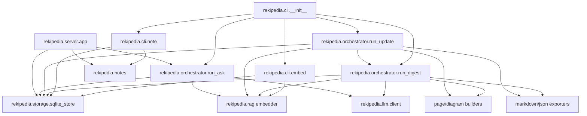
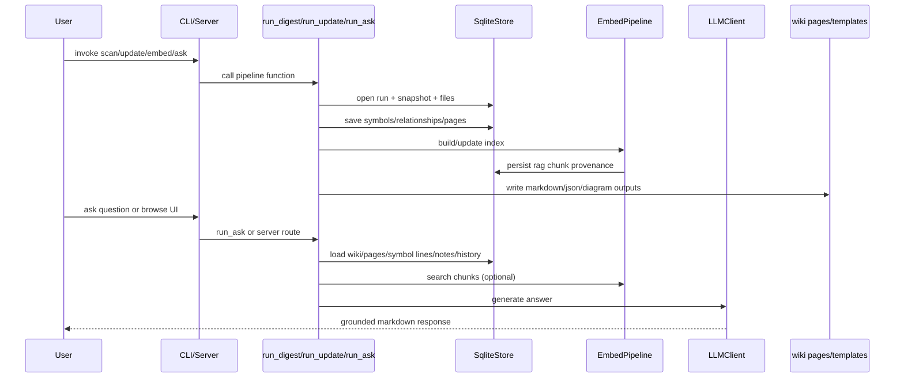

# Rekipedia Architectural Overview

## System Architecture

Rekipedia is a repository-to-wiki knowledge system that combines a CLI, a persistent SQLite-backed store, a scanning/synthesis pipeline, a retrieval-augmented embedding subsystem, and a FastAPI web server. The core orchestration lives in the Python package, with a smaller Go-based storage/CLI implementation present in `go/` for a separate command-line path. The main Python runtime is centered around [`rekipedia.cli.__init__.py`](src/rekipedia/cli/__init__.py#L1) and the orchestration modules [`rekipedia.orchestrator.run_digest`](src/rekipedia/orchestrator/run_digest.py#L1), [`rekipedia.orchestrator.run_update`](src/rekipedia/orchestrator/run_update.py#L1), and [`rekipedia.orchestrator.run_ask`](src/rekipedia/orchestrator/run_ask.py#L1).

Because no `pre_built_module_graph` was provided, the architecture diagram below is synthesized from the observed dependencies and call relationships.

The architecture is strongly pipeline-oriented: scanning produces structured artifacts in the store, synthesis converts those artifacts into wiki pages and diagrams, and retrieval/QA layers reuse the same persisted state for interactive search and answering. The relationship volume reinforces this design: the analysis reports **1,996 total relationships**, dominated by **1,757 calls** and **222 imports** (`relationship_stats`). That balance is typical of a modular application with heavy orchestration and many helper functions.

> **Sources:** `src/rekipedia/cli/__init__.py` · L1–L27 · [`main`](src/rekipedia/cli/__init__.py#L26) · `src/rekipedia/orchestrator/run_digest.py` · L45–L433 · [`run_digest`](src/rekipedia/orchestrator/run_digest.py#L45) · `src/rekipedia/orchestrator/run_update.py` · L27–L244 · [`run_update`](src/rekipedia/orchestrator/run_update.py#L27) · `src/rekipedia/orchestrator/run_ask.py` · L304–L349 · [`run_ask`](src/rekipedia/orchestrator/run_ask.py#L304)

## Component Breakdown

### CLI Surface

The top-level Python CLI group is exposed by [`main`](src/rekipedia/cli/__init__.py#L26-L27), which composes the subcommands imported in [`rekipedia.cli.__init__`](src/rekipedia/cli/__init__.py#L1-L27). Two especially important subcommands in this analysis are [`embed_cmd`](src/rekipedia/cli/embed.py#L85-L201) and the notes command family in [`rekipedia.cli.note`](src/rekipedia/cli/note.py#L1-L153).

- [`embed_cmd`](src/rekipedia/cli/embed.py#L85-L201) is the user-facing entry point for building or refreshing the RAG index. It validates optional dependencies through [`_check_rag_deps`](src/rekipedia/cli/embed.py#L22-L41), constructs [`EmbedPipeline`](src/rekipedia/rag/embedder.py#L443-L892), and updates scan metadata.
- [`note_cmd`](src/rekipedia/cli/note.py#L27-L28) groups note-management subcommands such as [`note_add`](src/rekipedia/cli/note.py#L35-L42), [`note_list`](src/rekipedia/cli/note.py#L49-L64), [`note_remove`](src/rekipedia/cli/note.py#L70-L89), [`note_edit`](src/rekipedia/cli/note.py#L96-L120), and [`note_import`](src/rekipedia/cli/note.py#L127-L153).

### Notes Import and Parsing

The notes subsystem is intentionally simple and file-driven. [`import_notes_from_file`](src/rekipedia/notes/__init__.py#L7-L19) dispatches based on file extension and delegates to [`_import_yaml`](src/rekipedia/notes/__init__.py#L22-L40) or [`_import_markdown`](src/rekipedia/notes/__init__.py#L43-L80). This gives users two import formats while preserving a normalized in-memory note dictionary shape.

### Orchestration Pipeline

The scanning/synthesis pipeline is split into two execution modes:

- [`run_digest`](src/rekipedia/orchestrator/run_digest.py#L45-L433) performs a full scan.
- [`run_update`](src/rekipedia/orchestrator/run_update.py#L27-L244) performs an incremental scan/update based on changed files.
- [`run_ask`](src/rekipedia/orchestrator/run_ask.py#L304-L349) performs retrieval-augmented question answering over the generated wiki and RAG index.

Supporting helpers inside [`run_ask`](src/rekipedia/orchestrator/run_ask.py#L1-L349) include [`_verify_scan`](src/rekipedia/orchestrator/run_ask.py#L37-L52), [`_load_wiki_pages`](src/rekipedia/orchestrator/run_ask.py#L55-L63), [`_load_symbol_lines`](src/rekipedia/orchestrator/run_ask.py#L66-L83), and [`_build_full_system`](src/rekipedia/orchestrator/run_ask.py#L208-L297), which assembles the prompt/context payload.

### Retrieval and Embedding

The RAG subsystem is implemented in [`rekipedia.rag.embedder`](src/rekipedia/rag/embedder.py#L1-L901) with the main façade being [`EmbedPipeline`](src/rekipedia/rag/embedder.py#L443-L892). Its helpers include chunking and indexing primitives like [`_chunk_file`](src/rekipedia/rag/embedder.py#L160-L215), [`_symbol_chunk_file`](src/rekipedia/rag/embedder.py#L218-L232), and the ranking/diversification routine [`_mmr`](src/rekipedia/rag/embedder.py#L45-L84).

### Persistence Layer

The authoritative Python store is [`SqliteStore`](src/rekipedia/storage/sqlite_store.py#L39-L827), which exposes methods for runs, snapshots, files, symbols, relationships, wiki pages, notes, QA history, and RAG provenance. It is initialized by [`SqliteStore.open`](src/rekipedia/storage/sqlite_store.py#L64-L67) and used as a context manager via [`__enter__`](src/rekipedia/storage/sqlite_store.py#L74-L76) / [`__exit__`](src/rekipedia/storage/sqlite_store.py#L78-L79).

### Web Server

The HTTP interface is created by [`create_app`](src/rekipedia/server/app.py#L21-L663), a FastAPI app factory that exposes wiki browsing, notes management, and QA endpoints. It bridges to the same store and orchestrators used by the CLI, keeping the server as a thin presentation layer rather than a separate domain model.

> **Sources:** `src/rekipedia/cli/embed.py` · L22–L201 · [`_check_rag_deps`](src/rekipedia/cli/embed.py#L22) · [`embed_cmd`](src/rekipedia/cli/embed.py#L85) · `src/rekipedia/cli/note.py` · L16–L153 · [`_get_store`](src/rekipedia/cli/note.py#L16) · [`note_import`](src/rekipedia/cli/note.py#L127) · `src/rekipedia/notes/__init__.py` · L7–L80 · [`import_notes_from_file`](src/rekipedia/notes/__init__.py#L7) · `src/rekipedia/orchestrator/run_ask.py` · L37–L349 · [`_build_full_system`](src/rekipedia/orchestrator/run_ask.py#L208) · `src/rekipedia/rag/embedder.py` · L45–L892 · [`EmbedPipeline`](src/rekipedia/rag/embedder.py#L443) · `src/rekipedia/storage/sqlite_store.py` · L39–L827 · [`SqliteStore`](src/rekipedia/storage/sqlite_store.py#L39) · `src/rekipedia/server/app.py` · L21–L663 · [`create_app`](src/rekipedia/server/app.py#L21)

## Entry Points

The package metadata includes two console entry points in `evidence.entry_points`:

| Entry Point | Trigger | What It Does | Source |
|---|---|---|---|
| `rekipedia` | User runs the installed console command | Invokes the Python CLI group exposed by [`main`](src/rekipedia/cli/__init__.py#L26-L27) | [`rekipedia = "rekipedia.cli:main"`](src/rekipedia/cli/__init__.py#L26) |
| `reki` | User runs the alias console command | Same behavior as `rekipedia`, routed to the same [`main`](src/rekipedia/cli/__init__.py#L26-L27) function | [`reki = "rekipedia.cli:main"`](src/rekipedia/cli/__init__.py#L26) |

The Go side also has a Cobra-based command structure in [`go/cmd/rekipedia/cmd/root.go`](go/cmd/rekipedia/cmd/root.go#L1-L78) and [`go/cmd/rekipedia/cmd/note.go`](go/cmd/rekipedia/cmd/note.go#L1-L116), but the task’s `entry_points` payload is empty, so no separate Go executable entry point is enumerated there.

The `main` function is the dispatch root for the Python CLI, and the package-level imports in [`rekipedia.cli.__init__`](src/rekipedia/cli/__init__.py#L1-L27) wire in the command tree. A notable design choice is that `main` is intentionally thin: it composes Click decorators and defers all real work to dedicated modules.

> **Sources:** `src/rekipedia/cli/__init__.py` · L1–L27 · [`main`](src/rekipedia/cli/__init__.py#L26) · `evidence.entry_points` in analysis data

## Data Flow

At a high level, data moves from repository files into a persistent run snapshot, then into derived wiki pages and embeddings, and finally back out through search, QA, and web presentation.

The incremental update path is especially important:

1. [`run_update`](src/rekipedia/orchestrator/run_update.py#L27-L244) opens [`SqliteStore`](src/rekipedia/storage/sqlite_store.py#L39-L827) and resolves the previous successful run with [`get_latest_run_id`](src/rekipedia/storage/sqlite_store.py#L463-L472).
2. It snapshots the current repository and determines which files changed.
3. For unchanged files, it reuses persisted symbols/relationships/pages where possible through store copy/carry-forward methods such as [`copy_unchanged_symbols`](src/rekipedia/storage/sqlite_store.py#L484-L508), [`copy_unchanged_relationships`](src/rekipedia/storage/sqlite_store.py#L510-L530), and page-source helpers like [`carry_forward_page_sources`](src/rekipedia/storage/sqlite_store.py#L567-L583).
4. It then re-synthesizes only impacted wiki pages using the synthesis pipeline and updates RAG provenance through [`EmbedPipeline.update`](src/rekipedia/rag/embedder.py#L733-L892) when an index already exists.

The question-answering path is similarly layered:

1. [`run_ask`](src/rekipedia/orchestrator/run_ask.py#L304-L349) first validates that a successful scan exists with [`_verify_scan`](src/rekipedia/orchestrator/run_ask.py#L37-L52).
2. It loads wiki page content, symbol line mappings, and notes via [`_load_wiki_pages`](src/rekipedia/orchestrator/run_ask.py#L55-L63), [`_load_symbol_lines`](src/rekipedia/orchestrator/run_ask.py#L66-L83), and store access.
3. It optionally fetches top-k RAG chunks with [`_rag_chunks`](src/rekipedia/orchestrator/run_ask.py#L86-L101).
4. It assembles the system prompt and context in [`_build_full_system`](src/rekipedia/orchestrator/run_ask.py#L208-L297).
5. It invokes [`LLMClient`](src/rekipedia/orchestrator/run_ask.py#L1-L349) to produce the final grounded answer.

> **Sources:** `src/rekipedia/orchestrator/run_update.py` · L27–L244 · [`run_update`](src/rekipedia/orchestrator/run_update.py#L27) · `src/rekipedia/storage/sqlite_store.py` · L463–L583 · [`get_latest_run_id`](src/rekipedia/storage/sqlite_store.py#L463) · [`copy_unchanged_symbols`](src/rekipedia/storage/sqlite_store.py#L484) · `src/rekipedia/rag/embedder.py` · L733–L892 · [`EmbedPipeline.update`](src/rekipedia/rag/embedder.py#L733) · `src/rekipedia/orchestrator/run_ask.py` · L37–L349 · [`_build_full_system`](src/rekipedia/orchestrator/run_ask.py#L208) · [`run_ask`](src/rekipedia/orchestrator/run_ask.py#L304)

## Key Design Decisions

### 1) Pipeline-Oriented Architecture

The system is intentionally split into discrete stages: scan, snapshot, analyze, synthesize, export, embed, and query. This is visible in [`run_digest`](src/rekipedia/orchestrator/run_digest.py#L45-L433) and [`run_update`](src/rekipedia/orchestrator/run_update.py#L27-L244), both of which coordinate many specialized modules rather than embedding domain logic directly. The store methods such as [`upsert_run`](src/rekipedia/storage/sqlite_store.py#L137-L160), [`upsert_snapshot`](src/rekipedia/storage/sqlite_store.py#L173-L192), [`upsert_symbols`](src/rekipedia/storage/sqlite_store.py#L223-L261), and [`upsert_page`](src/rekipedia/storage/sqlite_store.py#L305-L331) reflect this staged persistence model.

### 2) Incremental Rebuilds with Change Reuse

A notable design choice is the incremental update path in [`run_update`](src/rekipedia/orchestrator/run_update.py#L27-L244). Rather than recomputing the entire corpus, it reuses unchanged artifacts through copy/carry-forward helpers in [`SqliteStore`](src/rekipedia/storage/sqlite_store.py#L484-L604) and the RAG carry-forward helpers [`carry_forward_rag_chunks`](src/rekipedia/storage/sqlite_store.py#L766-L800). This supports faster updates and reduces churn across downstream wiki pages and indices.

### 3) Symbol-Aware Chunking with Fallbacks

The embedding subsystem uses AST-aware chunking when possible. [`_symbol_chunk_file`](src/rekipedia/rag/embedder.py#L218-L232) tries to split files along symbol boundaries, while [`_symbol_chunk_file_inner`](src/rekipedia/rag/embedder.py#L235-L409) contains the actual parser-backed implementation. The docstring explicitly states it falls back to character chunking if tree-sitter is missing, the language is unsupported, or parsing fails. This is a pragmatic hybrid design: structure-first when available, safe fallback always.

### 4) Maximal Marginal Relevance for Result Diversity

[`_mmr`](src/rekipedia/rag/embedder.py#L45-L84) implements Maximal Marginal Relevance, which diversifies retrieval results instead of returning only nearest-neighbor duplicates. That choice is consistent with the “knowledge assistant” use case, where context variety is often more valuable than raw similarity.

### 5) Typed SQLite Store with Migration-Backed Schema Evolution

[`SqliteStore`](src/rekipedia/storage/sqlite_store.py#L39-L827) applies schema migrations during open via [`_apply_migrations`](src/rekipedia/storage/sqlite_store.py#L117-L131), and the repository includes migration files such as `003_tech_lead_notes.sql`, `004_rag_chunk_provenance.sql`, and `005_page_sources.sql`. This indicates an explicit schema evolution strategy rather than ad hoc table creation.

### 6) Server and CLI Share the Same Domain Core

The FastAPI factory [`create_app`](src/rekipedia/server/app.py#L21-L663) consumes the same store and orchestration primitives as the CLI. This reduces duplication and makes the web UI a thin projection of the same canonical state used by the command line.

> **Sources:** `src/rekipedia/orchestrator/run_digest.py` · L45–L433 · [`run_digest`](src/rekipedia/orchestrator/run_digest.py#L45) · `src/rekipedia/orchestrator/run_update.py` · L27–L244 · [`run_update`](src/rekipedia/orchestrator/run_update.py#L27) · `src/rekipedia/storage/sqlite_store.py` · L117–L331 · [`_apply_migrations`](src/rekipedia/storage/sqlite_store.py#L117) · [`upsert_page`](src/rekipedia/storage/sqlite_store.py#L305) · `src/rekipedia/rag/embedder.py` · L45–L409 · [`_mmr`](src/rekipedia/rag/embedder.py#L45) · [`_symbol_chunk_file_inner`](src/rekipedia/rag/embedder.py#L235) · `src/rekipedia/server/app.py` · L21–L663 · [`create_app`](src/rekipedia/server/app.py#L21)

## Inter-Module Dependencies

No `pre_built_dependency_graph` was provided, so the following table summarizes the major observed module relationships from `cross_module_summary`.

| Module | Imports From | Called By | Calls Into | Inherits From |
|--------|-------------|-----------|------------|---------------|
| `rekipedia.cli.__init__` | `click` | package consumers | `rekipedia.cli.note`, `rekipedia.cli.embed`, other CLI submodules | — |
| `rekipedia.cli.embed` | `rekipedia.rag.embedder`, `rekipedia.storage.sqlite_store`, `rekipedia.rag.scan_meta` | `rekipedia.cli.__init__` | `EmbedPipeline`, `SqliteStore`, dependency checks | — |
| `rekipedia.cli.note` | `rekipedia.storage.sqlite_store`, `rekipedia.notes.importer` | `rekipedia.cli.__init__` | notes CRUD helpers, import parser | — |
| `rekipedia.orchestrator.run_digest` | `rekipedia.storage.sqlite_store`, `rekipedia.rag.embedder`, synthesis/export modules | `rekipedia.orchestrator.run_update`, CLI/server flows | `SqliteStore`, `LLMClient`, `PageBuilder`, `DiagramBuilder`, exporters | — |
| `rekipedia.orchestrator.run_update` | `rekipedia.orchestrator.run_digest`, `rekipedia.rag.embedder`, `rekipedia.storage.sqlite_store` | CLI/server update flow | `SqliteStore`, `PageBuilder`, `DiagramBuilder`, `EmbedPipeline` | — |
| `rekipedia.orchestrator.run_ask` | `rekipedia.storage.sqlite_store`, `rekipedia.rag.embedder`, `rekipedia.llm.client` | `rekipedia.server.app` | `EmbedPipeline`, `SqliteStore`, `LLMClient` | — |
| `rekipedia.rag.embedder` | `faiss`, `numpy`, `litellm`, tree-sitter packages | CLI/orchestrators/tests | FAISS, LiteLLM, chunking/provenance helpers | — |
| `rekipedia.storage.sqlite_store` | `sqlite3`, `turso`, `rekipedia.analysis.graph_analysis` | CLI/orchestrators/server/tests | SQL persistence, migration execution, copy/carry-forward helpers | — |
| `rekipedia.server.app` | `fastapi`, `markdown`, `rekipedia.orchestrator.run_ask`, `rekipedia.storage.sqlite_store` | HTTP runtime | store, ask flow, templates, notes endpoints | — |

Two coupling observations stand out:

- **Tightly coupled pair:** [`run_digest`](src/rekipedia/orchestrator/run_digest.py#L45-L433) and [`run_update`](src/rekipedia/orchestrator/run_update.py#L27-L244). The update pipeline reuses the full scan pipeline as a fallback and shares most downstream synthesis/export dependencies.
- **Bridge module:** [`rekipedia.rag.embedder`](src/rekipedia/rag/embedder.py#L1-L901) is a major bridge node. The analysis marks it as imported by CLI, orchestration, and tests, and it has enough outgoing edges to sit between repository scanning and user-facing retrieval.

There is no evidence of explicit inheritance hierarchies in the core Python modules; the design is composition-heavy, with orchestration functions composing helper modules and a few long-lived service objects such as [`EmbedPipeline`](src/rekipedia/rag/embedder.py#L443-L892) and [`SqliteStore`](src/rekipedia/storage/sqlite_store.py#L39-L827).

> **Sources:** `cross_module_summary` in analysis data · `src/rekipedia/orchestrator/run_digest.py` · L45–L433 · [`run_digest`](src/rekipedia/orchestrator/run_digest.py#L45) · `src/rekipedia/orchestrator/run_update.py` · L27–L244 · [`run_update`](src/rekipedia/orchestrator/run_update.py#L27) · `src/rekipedia/rag/embedder.py` · L1–L901 · [`EmbedPipeline`](src/rekipedia/rag/embedder.py#L443) · `src/rekipedia/storage/sqlite_store.py` · L39–L827 · [`SqliteStore`](src/rekipedia/storage/sqlite_store.py#L39)