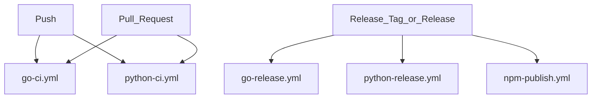
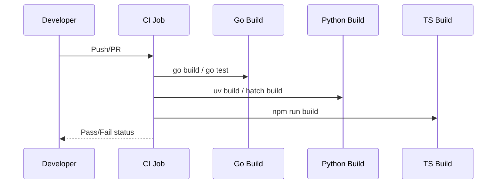

# Automation and Delivery Pipeline Overview

## Scope and What This Page Covers

This page summarizes the repository’s automation and delivery pipeline at a high level: what triggers CI, how the main build/test jobs run, what packaging artifacts are produced, and what release automation exists in the files seen. The focus is on pipeline configuration and delivery mechanics, not on application internals or helper scripts.

The repository spans multiple ecosystems, so the automation is split across GitHub Actions workflows for Go, Python, and npm/package publishing, plus repository-level tooling such as the top-level `Makefile`, `go/.goreleaser.yaml`, and `Dockerfile.sandbox`. The observed CI trigger pattern is push and pull request-based (`[push, pull_request]`), which indicates the main validation loop runs on branch activity and PRs rather than being event-driven by external schedulers or manual dispatch in the files seen.

> **Sources:** `.github/workflows/go-ci.yml` · `.github/workflows/go-release.yml` · `.github/workflows/npm-publish.yml` · `.github/workflows/python-ci.yml` · `.github/workflows/python-release.yml` · `Makefile` · `go/.goreleaser.yaml` · `Dockerfile.sandbox`

## Workflow Triggers

The clearest trigger signal available in the analysis is the shared CI trigger set of push and pull request events. That aligns with the conventional split between:
- **continuous validation** on feature branches and PRs, and
- **release automation** on tagged or release-oriented events.

While the exact per-workflow trigger blocks are not expanded in the analysis payload, the workflow filenames make their intent obvious:

- `go-ci.yml` and `python-ci.yml` are validation workflows.
- `go-release.yml`, `python-release.yml`, and `npm-publish.yml` are delivery workflows.
- `go-release.yml` is likely tied to versioned Go releases, and the presence of `go/.goreleaser.yaml` strongly suggests Go release packaging is delegated to GoReleaser.

A useful mental model is:

This diagram is intentionally high-level: it reflects the observed workflow names and the common automation structure implied by the repository layout, without inventing exact job steps not visible in the analysis.

> **Sources:** `.github/workflows/go-ci.yml` · `.github/workflows/go-release.yml` · `.github/workflows/npm-publish.yml` · `.github/workflows/python-ci.yml` · `.github/workflows/python-release.yml` · `evidence.ci_triggers`

## Build and Test Steps

The repository supports multiple build paths, one per major toolchain. The analysis explicitly lists the build commands used in the project, which gives a reliable baseline for what CI likely exercises:

| Ecosystem | Build/Test Command | Purpose |
|---|---|---|
| Python | `uv build` | Build Python package artifacts |
| Go | `CGO_ENABLED=0 go build -ldflags "-s -w" -o /tmp/reki ./cmd/rekipedia` | Compile the Go CLI binary with stripped symbols |
| Python | `hatch build` | Build Python distribution artifacts |
| Docker | `docker build .` | Build container image |
| TypeScript/Node | `npm run build  # tsc` | Compile TypeScript to JavaScript |

From the command set, the automation appears to validate both code correctness and release readiness:
- **Go** builds a CLI binary from `./cmd/rekipedia`.
- **Python** builds distributable artifacts with `uv build` and `hatch build`.
- **Node** runs a TypeScript build (`tsc`) through `npm run build`.
- **Docker** validates container image creation.

The high-level CI job shape is therefore likely:
1. Install runtime/tooling.
2. Run language-specific tests and static checks.
3. Build artifacts.
4. Fail fast on packaging regressions.

Because the task specifically asks for high-level pipeline documentation, this page intentionally does not enumerate helper scripts or internal application commands. The most relevant local-vs-CI distinction is that CI usually runs a narrower, deterministic command set aimed at validation, while local development often uses broader developer conveniences from `Makefile` or repository scripts.

> **Sources:** `uv.lock` · `pyproject.toml` · `package.json` · `Makefile` · `build_commands`

## Packaging Artifacts

The repository produces artifacts for several distribution channels.

### Go release artifacts

The strongest evidence for Go packaging is `go/.goreleaser.yaml` alongside `go-release.yml`. This typically means the release pipeline builds binaries, archives them, and attaches them to a release. The top-level Go installation script and Dockerfiles reinforce that the Go CLI is a first-class deliverable, but the public delivery artifact is the compiled binary rather than source helpers.

### Python package artifacts

The Python side uses modern packaging/build tooling:
- `uv build`
- `hatch build`

That implies source and wheel distributions are expected from CI or release workflows. The presence of `pyproject.toml` and `uv.lock` confirms a PEP 517-style packaging flow.

### npm package artifacts

The presence of `npm-publish.yml` and `package.json` indicates the repository also publishes a Node package. The analysis doesn’t expose the package contents or exact publish target, but the workflow name is enough to conclude there is a dedicated publication path.

### Container artifact

`Dockerfile.sandbox` and `go/Dockerfile` show containerized delivery support. One notable evidence point is `docker_base: FROM scratch`, which suggests at least one published container image is intentionally minimal. That usually points to release-time image assembly rather than a general development environment.

| Artifact Type | Evidence | Likely Purpose |
|---|---|---|
| Go binary release | `go/.goreleaser.yaml`, `go-release.yml` | Package CLI executables and archives |
| Python wheel/sdist | `uv build`, `hatch build`, `python-release.yml` | Publish Python distributions |
| npm package | `npm-publish.yml`, `package.json` | Publish JS/TS package |
| Container image | `Dockerfile.sandbox`, `go/Dockerfile`, `docker build .` | Publish runtime image / sandbox image |

> **Sources:** `go/.goreleaser.yaml` · `.github/workflows/go-release.yml` · `.github/workflows/python-release.yml` · `.github/workflows/npm-publish.yml` · `pyproject.toml` · `package.json` · `Dockerfile.sandbox` · `go/Dockerfile` · `evidence.docker_base`

## Release-Related Automation

Release automation is present in multiple places:

- **Go releases**: `go-release.yml` plus `go/.goreleaser.yaml`
- **Python releases**: `python-release.yml`
- **npm publishing**: `npm-publish.yml`

This strongly suggests a coordinated multi-language release process. In practical terms, that usually means:
- versioning is controlled in source or release metadata,
- artifacts are built in CI,
- and publishing happens only from release-oriented workflow runs.

A common pattern here is:
1. CI validates commits and pull requests.
2. Release workflows build signed/versioned artifacts.
3. Publishing workflows push packages to registries.
4. Release notes are tracked in `RELEASE-NOTES.md` and `go/RELEASE-NOTES.md`.

The existence of both top-level and Go-specific release notes hints that the repository may ship multiple distributions with their own cadence or changelog requirements.

> **Sources:** `.github/workflows/go-release.yml` · `.github/workflows/python-release.yml` · `.github/workflows/npm-publish.yml` · `go/.goreleaser.yaml` · `RELEASE-NOTES.md` · `go/RELEASE-NOTES.md`

## Main CI YAML Files

The following table summarizes the main CI YAML files visible in the repository and their purpose:

| CI YAML File | What It Runs | Pipeline Role |
|---|---|---|
| `.github/workflows/go-ci.yml` | Go validation/build/test flow | Continuous validation for Go code |
| `.github/workflows/python-ci.yml` | Python validation/build/test flow | Continuous validation for Python code |
| `.github/workflows/go-release.yml` | Go release packaging and publication | Release delivery for the Go CLI |
| `.github/workflows/python-release.yml` | Python package release/publish flow | Release delivery for Python package |
| `.github/workflows/npm-publish.yml` | npm publish flow | JavaScript/TypeScript package publication |

This summary is intentionally high-level because the analysis payload includes filenames and command evidence, but not the full YAML contents. Still, the workflow names are sufficiently descriptive to distinguish validation from publishing.

> **Sources:** `.github/workflows/go-ci.yml` · `.github/workflows/python-ci.yml` · `.github/workflows/go-release.yml` · `.github/workflows/python-release.yml` · `.github/workflows/npm-publish.yml`

## CI vs Local Development Commands

CI and local development overlap, but they serve different goals:

| Aspect | CI | Local Development |
|---|---|---|
| Goal | Verify correctness and release readiness | Iterate quickly while coding |
| Environment | Clean, reproducible runner | Developer machine |
| Command scope | Narrow, deterministic, automation-oriented | Broader, convenience-oriented |
| Output | Pass/fail status and artifacts | Fast feedback, debugging, ad hoc builds |

For this repository, CI is likely to run the build commands listed in the analysis (`uv build`, `hatch build`, `go build`, `docker build .`, `npm run build`) as part of a predictable pipeline. Local development may use the `Makefile` and language-specific tools more flexibly, but those developer conveniences should not be treated as public APIs.

In short: **CI proves the repository can be built and released cleanly; local commands help developers work faster.**

> **Sources:** `Makefile` · `build_commands` · `.github/workflows/go-ci.yml` · `.github/workflows/python-ci.yml`