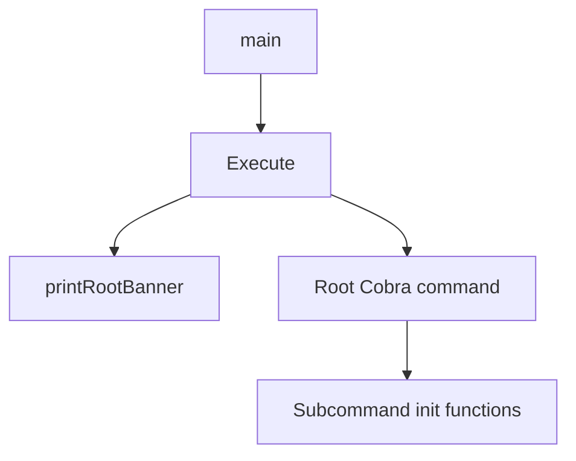
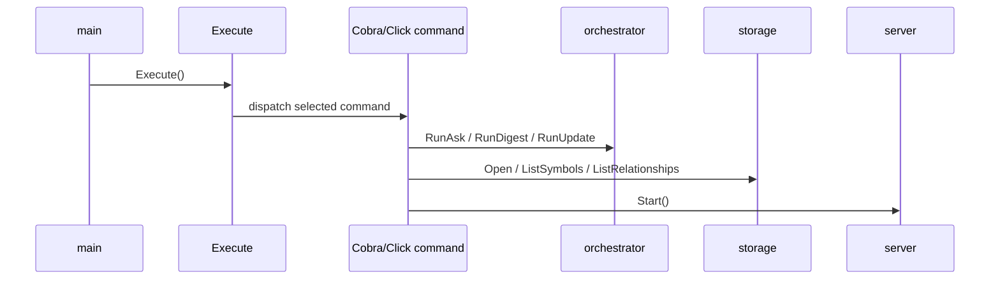

# CLI Command Surface

This page documents the user-facing command-line surface of `rekipedia` as a conceptual module. It focuses on how the root command is assembled, which subcommands are exposed, what flags users can pass, and how execution flows from `main` to the concrete command handlers.

The implementation is split across the Go CLI under `go/cmd/rekipedia/` and the Python CLI package under `src/rekipedia/cli/`. The Go entrypoint forwards into the Cobra command tree via [`main`](go/cmd/rekipedia/main.go#L6) and [`Execute`](go/cmd/rekipedia/cmd/root.go#L44), while the Python package defines a parallel Click-based surface via [`main`](src/rekipedia/cli/__init__.py) and subcommand modules such as [`ask_cmd`](src/rekipedia/cli/ask.py), [`embed_cmd`](src/rekipedia/cli/embed.py), and [`export_cmd`](src/rekipedia/cli/export.py).

## Root Command

The Go root command is constructed in [`init`](go/cmd/rekipedia/cmd/root.go#L50) and executed through [`Execute`](go/cmd/rekipedia/cmd/root.go#L44). At startup, [`main`](go/cmd/rekipedia/main.go#L6) simply delegates to this command tree. The root command also prints a banner through [`printRootBanner`](go/cmd/rekipedia/cmd/root.go#L36), which is part of the visible startup experience rather than an internal helper.

The root command’s most important user-visible behaviors are:

- it exposes the top-level subcommands registered during package initialization
- it supports the standard `--version` flag
- it emits a banner before dispatching to the selected subcommand

In the Python CLI, the equivalent root assembly happens in [`main`](src/rekipedia/cli/__init__.py), which creates the Click group and applies a version option. That file also imports each subcommand module so they are registered on import.

### Root Command Execution Path

> **Sources:** `go/cmd/rekipedia/main.go` · `go/cmd/rekipedia/cmd/root.go` · [`main`](go/cmd/rekipedia/main.go#L6) · [`Execute`](go/cmd/rekipedia/cmd/root.go#L44) · [`printRootBanner`](go/cmd/rekipedia/cmd/root.go#L36)

## Subcommands

The CLI surface is split into a set of top-level commands in both implementations. In the Go CLI, each subcommand is registered through a package-level [`init`](go/cmd/rekipedia/cmd/ask.go#L77) / [`init`](go/cmd/rekipedia/cmd/context.go#L119) / [`init`](go/cmd/rekipedia/cmd/diff.go#L254) style function. In the Python CLI, subcommands are defined as Click commands in module-level callables such as [`ask_cmd`](src/rekipedia/cli/ask.py), [`context_cmd`](src/rekipedia/cli/context.py), and [`diff_cmd`](src/rekipedia/cli/diff.py).

### User-Facing Commands

| Command | Surface | Purpose | Default behavior |
|---|---|---|---|
| `rekipedia` | Go / Python root | Launches the CLI and routes to subcommands | Shows banner/version and help when no subcommand is provided |
| `ask` | [`runInteractiveAsk`](go/cmd/rekipedia/cmd/ask.go#L87) / [`ask_cmd`](src/rekipedia/cli/ask.py) | Interactive Q&A over the indexed repository | Prompts interactively and streams answers by default |
| `context` | [`context_cmd`](src/rekipedia/cli/context.py) | Generate repository context output | Uses the current repository unless a path is provided |
| `diff` | [`diff_cmd`](src/rekipedia/cli/diff.py) | Compare snapshots | Shows available snapshots or diffs the selected pair |
| `embed` | [`embed_cmd`](src/rekipedia/cli/embed.py) | Build embeddings / vector index | Runs against the configured repository path |
| `export` | [`export_cmd`](src/rekipedia/cli/export.py) | Export analysis data | Writes to an export directory, defaulting to the current output layout |
| `hook` | [`hook_cmd`](src/rekipedia/cli/hook.py) / [`init`](go/cmd/rekipedia/cmd/hook.go#L79) | Manage git hook installation | Subcommands determine install/uninstall/status behavior |
| `impact` | [`impact_cmd`](src/rekipedia/cli/impact.py) / [`init`](go/cmd/rekipedia/cmd/impact.go#L124) | Display impact analysis | Computes impact for the latest run unless a run is specified |
| `init` | [`init`](go/cmd/rekipedia/cmd/init.go#L62) / [`init`](src/rekipedia/cli/init.py) | Initialize config on disk | Creates default config files and directories |
| `scan` | [`init`](go/cmd/rekipedia/cmd/scan.go#L128) / [`scan`](src/rekipedia/cli/scan.py) | Scan a repository and persist analysis | Uses configured paths and LLM settings |
| `search` | [`init`](go/cmd/rekipedia/cmd/search.go#L139) / [`search`](src/rekipedia/cli/search.py) | Search indexed symbols | Uses default query behavior when no extra filters are supplied |
| `serve` | [`init`](go/cmd/rekipedia/cmd/serve.go#L78) / [`serve`](src/rekipedia/cli/serve.py) | Start HTTP server | Binds to configured host/port |
| `update` | [`init`](go/cmd/rekipedia/cmd/update.go#L47) / [`update`](src/rekipedia/cli/update.py) | Refresh generated docs / outputs | Uses current repository and configuration |
| `refactor` | [`init`](go/cmd/rekipedia/cmd/refactor.go#L295) / [`refactor`](src/rekipedia/cli/refactor.py) | Detect refactor candidates | Defaults to static detection mode unless LLM enrichment is enabled |
| `watch` | [`init`](go/cmd/rekipedia/cmd/watch.go#L121) / [`watch`](src/rekipedia/cli/watch.py) | Persist watcher configuration | Uses saved watch config when present |

The Go-side subcommands are registered in their package initialization code and then attached to the root command. The Python-side root group imports all modules in [`rekipedia.cli.__init__`](src/rekipedia/cli/__init__.py) to ensure Click can discover them.

> **Sources:** `go/cmd/rekipedia/cmd/ask.go` · `go/cmd/rekipedia/cmd/context.go` · `go/cmd/rekipedia/cmd/diff.go` · `go/cmd/rekipedia/cmd/embed.go` · `go/cmd/rekipedia/cmd/export.go` · `go/cmd/rekipedia/cmd/hook.go` · `go/cmd/rekipedia/cmd/impact.go` · `go/cmd/rekipedia/cmd/init.go` · `go/cmd/rekipedia/cmd/scan.go` · `go/cmd/rekipedia/cmd/search.go` · `go/cmd/rekipedia/cmd/serve.go` · `go/cmd/rekipedia/cmd/update.go` · `go/cmd/rekipedia/cmd/refactor.go` · `go/cmd/rekipedia/cmd/watch.go`

## Common Flags

The CLI exposes a mix of global flags and per-command options. The root-level `--version` option is visible in the Python CLI root group and the Go root command also has a version-oriented test (`TestRootVersionFlag`) confirming the behavior is user-visible. In addition, several commands share the same kinds of flags: paths, output directories, formats, and mode selection.

### Common User-Facing Flags and Options

| Command / scope | Flag / option | Purpose | Default behavior |
|---|---|---|---|
| Root | `--version` | Display installed version | Prints version information and exits |
| `ask` | positional `QUESTION` | Question to ask the repository index | If omitted, interactive prompt flow is used |
| `ask` | `--config` / config loading path | Load LLM/config settings | Falls back to repo config or built-in defaults |
| `ask` | `--stream` | Stream output while answering | Streaming is the default experience in the interactive flow |
| `ask` | `--save-session` | Persist the Q&A session | Session persistence is off unless requested |
| `context` | repository path / input target | Choose target repository | Defaults to current working tree |
| `context` | output path / destination options | Write generated context to disk | Prints to stdout unless an output path is specified |
| `diff` | snapshot identifiers | Select snapshots to compare | Lists snapshots if no pair is provided |
| `embed` | repository path | Scan and embed a repository | Defaults to configured project root |
| `embed` | `--config` | Load embedding configuration | Uses config file / defaults when omitted |
| `export` | output format | Choose export target | Defaults to the canonical Markdown/graph export behavior for the selected mode |
| `hook` | subcommand (`install`, `uninstall`, `status`) | Manage hook lifecycle | No action until a lifecycle subcommand is chosen |
| `impact` | run id | Select analysis run | Uses latest run when omitted |
| `impact` | `--format` / display mode | Render tree or textual output | Defaults to the console tree display |
| `init` | configuration path | Where to create config files | Uses the project’s default config location |
| `scan` | repository path / root | Directory to scan | Defaults to current repository |
| `scan` | language selection options | Limit languages scanned | Scans all supported languages unless constrained |
| `search` | query text | Search term | Uses the provided query; no query means broad/default matching |
| `serve` | host / port | Bind address | Binds to configured default host and port |
| `update` | destination/output directory | Write updated artifacts | Writes to the configured output directory |
| `refactor` | `--kind` / filter | Filter issue type | Returns all issue kinds by default |
| `refactor` | `--llm` / enrichment switch | Enable LLM enrichment | Static report mode is the safe default |
| `watch` | configuration file path | Read/write watcher settings | Uses saved watcher config if present |

This table intentionally omits lower-level internal helpers and focuses on options that are visible to users and materially change runtime behavior.

Several commands have explicit guardrails. For example, the embed command checks for required RAG dependencies in [`_check_rag_deps`](src/rekipedia/cli/embed.py) before continuing, and export uses filesystem existence checks before writing outputs. Those checks are not “flags” but they affect the user-visible outcome of command execution.

> **Sources:** `src/rekipedia/cli/__init__.py` · `go/cmd/rekipedia/cmd/root.go` · `go/cmd/rekipedia/cmd/ask.go` · `go/cmd/rekipedia/cmd/context.go` · `go/cmd/rekipedia/cmd/diff.go` · `go/cmd/rekipedia/cmd/embed.go` · `go/cmd/rekipedia/cmd/export.go` · `go/cmd/rekipedia/cmd/hook.go` · `go/cmd/rekipedia/cmd/impact.go` · `go/cmd/rekipedia/cmd/init.go` · `go/cmd/rekipedia/cmd/scan.go` · `go/cmd/rekipedia/cmd/search.go` · `go/cmd/rekipedia/cmd/serve.go` · `go/cmd/rekipedia/cmd/update.go` · `go/cmd/rekipedia/cmd/refactor.go` · `go/cmd/rekipedia/cmd/watch.go`

## Execution Flow

The overall execution model is straightforward:

1. The program starts in [`main`](go/cmd/rekipedia/main.go#L6) or the Python package entrypoint [`rekipedia.__main__`](src/rekipedia/__main__.py).
2. The root command / Click group is constructed.
3. Subcommands are attached via package initialization or module imports.
4. The selected subcommand resolves its arguments and options.
5. The handler calls into the orchestration layer or directly into storage / export / server modules.

In Go, [`Execute`](go/cmd/rekipedia/cmd/root.go#L44) is the gateway that invokes the root Cobra command after [`printRootBanner`](go/cmd/rekipedia/cmd/root.go#L36). From there, subcommand `init` functions have already registered commands like [`RunAsk`](go/internal/orchestrator/run_ask.go#L59), [`RunDigest`](go/internal/orchestrator/run_digest.go#L48), [`RunUpdate`](go/internal/orchestrator/run_update.go#L30), and the server startup path in [`(s *Server).Start`](go/internal/server/server.go#L71). The CLI layer generally validates and normalizes input, then hands off to orchestration.

### Representative Call Chain

This pattern repeats across the CLI surface:

- `ask` resolves config and invokes [`RunAsk`](go/internal/orchestrator/run_ask.go#L59) or [`StreamAsk`](go/internal/orchestrator/run_ask.go#L112)
- `scan` loads repository and LLM configuration via [`loadLLMConfig`](go/cmd/rekipedia/cmd/scan.go#L143) and [`splitLanguages`](go/cmd/rekipedia/cmd/scan.go#L165)
- `embed` builds a pipeline around [`EmbedPipeline`](go/internal/rag/embedder.go#L15)
- `export` collects stored symbols/relationships and writes them through exporters
- `serve` starts the HTTP service with [`(s *Server).Start`](go/internal/server/server.go#L71)
- `refactor` computes issues via [`staticWalk`](go/cmd/rekipedia/cmd/refactor.go#L75), [`applyFilter`](go/cmd/rekipedia/cmd/refactor.go#L130), and [`buildStaticReport`](go/cmd/rekipedia/cmd/refactor.go#L148)

The important architectural theme is that the CLI itself does not perform heavy domain logic. It acts as the boundary layer that parses user intent and delegates to orchestration, storage, analysis, and serving components.

> **Sources:** `go/cmd/rekipedia/main.go` · `go/cmd/rekipedia/cmd/root.go` · `go/internal/orchestrator/run_ask.go` · `go/internal/orchestrator/run_digest.go` · `go/internal/orchestrator/run_update.go` · `go/internal/server/server.go` · `go/cmd/rekipedia/cmd/scan.go` · `go/cmd/rekipedia/cmd/refactor.go` · `src/rekipedia/__main__.py` · `src/rekipedia/cli/__init__.py`

## Command Constructors and Entry Points

The following constructors and execution functions are the most important to understand the CLI surface:

| Symbol | File | Role |
|---|---|---|
| [`Execute`](go/cmd/rekipedia/cmd/root.go#L44) | `go/cmd/rekipedia/cmd/root.go` | Primary Go CLI entrypoint |
| [`printRootBanner`](go/cmd/rekipedia/cmd/root.go#L36) | `go/cmd/rekipedia/cmd/root.go` | Prints startup branding |
| [`init`](go/cmd/rekipedia/cmd/root.go#L50) | `go/cmd/rekipedia/cmd/root.go` | Builds the root Cobra command |
| [`init`](go/cmd/rekipedia/cmd/ask.go#L77) | `go/cmd/rekipedia/cmd/ask.go` | Registers the `ask` command |
| [`init`](go/cmd/rekipedia/cmd/context.go#L119) | `go/cmd/rekipedia/cmd/context.go` | Registers the `context` command |
| [`init`](go/cmd/rekipedia/cmd/diff.go#L254) | `go/cmd/rekipedia/cmd/diff.go` | Registers the `diff` command |
| [`init`](go/cmd/rekipedia/cmd/embed.go#L56) | `go/cmd/rekipedia/cmd/embed.go` | Registers the `embed` command |
| [`init`](go/cmd/rekipedia/cmd/export.go#L101) | `go/cmd/rekipedia/cmd/export.go` | Registers the `export` command |
| [`init`](go/cmd/rekipedia/cmd/hook.go#L79) | `go/cmd/rekipedia/cmd/hook.go` | Registers the `hook` command |
| [`init`](go/cmd/rekipedia/cmd/impact.go#L124) | `go/cmd/rekipedia/cmd/impact.go` | Registers the `impact` command |
| [`init`](go/cmd/rekipedia/cmd/init.go#L62) | `go/cmd/rekipedia/cmd/init.go` | Registers the `init` command |
| [`init`](go/cmd/rekipedia/cmd/scan.go#L128) | `go/cmd/rekipedia/cmd/scan.go` | Registers the `scan` command |
| [`init`](go/cmd/rekipedia/cmd/search.go#L139) | `go/cmd/rekipedia/cmd/search.go` | Registers the `search` command |
| [`init`](go/cmd/rekipedia/cmd/serve.go#L78) | `go/cmd/rekipedia/cmd/serve.go` | Registers the `serve` command |
| [`init`](go/cmd/rekipedia/cmd/update.go#L47) | `go/cmd/rekipedia/cmd/update.go` | Registers the `update` command |
| [`init`](go/cmd/rekipedia/cmd/refactor.go#L295) | `go/cmd/rekipedia/cmd/refactor.go` | Registers the `refactor` command |
| [`init`](go/cmd/rekipedia/cmd/watch.go#L121) | `go/cmd/rekipedia/cmd/watch.go` | Registers the `watch` command |

These symbols define the CLI contract far more than helper functions such as parsing or formatting utilities. The command constructors are where the user-visible interface is declared: command names, option names, defaults, and validation.

> **Sources:** `go/cmd/rekipedia/cmd/root.go` · `go/cmd/rekipedia/cmd/ask.go` · `go/cmd/rekipedia/cmd/context.go` · `go/cmd/rekipedia/cmd/diff.go` · `go/cmd/rekipedia/cmd/embed.go` · `go/cmd/rekipedia/cmd/export.go` · `go/cmd/rekipedia/cmd/hook.go` · `go/cmd/rekipedia/cmd/impact.go` · `go/cmd/rekipedia/cmd/init.go` · `go/cmd/rekipedia/cmd/scan.go` · `go/cmd/rekipedia/cmd/search.go` · `go/cmd/rekipedia/cmd/serve.go` · `go/cmd/rekipedia/cmd/update.go` · `go/cmd/rekipedia/cmd/refactor.go` · `go/cmd/rekipedia/cmd/watch.go`