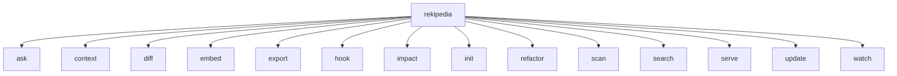

# Rekipedia CLI Reference

## Command Tree

The public command-line interface is rooted at [`Execute`](go/cmd/rekipedia/cmd/root.go#L44-L48), which wires the Cobra command tree together and is invoked from [`main`](go/cmd/rekipedia/main.go#L6-L8). The root command is defined in [`init`](go/cmd/rekipedia/cmd/root.go#L50-L77), and the implementation exposes a set of user-facing subcommands for analysis, serving, search, and maintenance.

From the symbol index, the CLI also includes a root-level version flag tested by [`TestRootVersionFlag`](go/cmd/rekipedia/cmd/root_test.go#L9-L17), and the command tree is verified to include subcommands in [`TestRootCommandHasSubcommands`](go/cmd/rekipedia/cmd/root_test.go#L19-L29). This page documents only the public CLI surface; CI helpers and internal-only utilities are intentionally excluded.

> **Sources:** `go/cmd/rekipedia/cmd/root.go` · L44–L77 · [`Execute`](go/cmd/rekipedia/cmd/root.go#L44-L48) · [`printRootBanner`](go/cmd/rekipedia/cmd/root.go#L36-L41) · `go/cmd/rekipedia/main.go` · L6–L8 · [`main`](go/cmd/rekipedia/main.go#L6-L8)

## Global Flags and Defaults

The symbol index exposes a small set of root-level behavior and command flags through tests and implementation symbols. Some defaults are only indirectly observable from the indexed code; where the exact value is not exposed, this page states that explicitly rather than guessing.

| Flag / Setting | Scope | Default | Behavior defined by | Notes |
|---|---|---:|---|---|
| `--version` | root | enabled by root command | [`Execute`](go/cmd/rekipedia/cmd/root.go#L44-L48) | Verified by [`TestRootVersionFlag`](go/cmd/rekipedia/cmd/root_test.go#L9-L17) |
| root banner | root output | printed on execution | [`printRootBanner`](go/cmd/rekipedia/cmd/root.go#L36-L41) | Startup/banner text, not a flag |
| LLM config defaults | multiple commands | from `DefaultLLMConfig` | [`DefaultLLMConfig`](go/internal/models/contracts.go#L18-L23) | Applied via command config loading; exact CLI flag mapping is not fully exposed in the index |
| language list parsing | scan-related flows | comma-separated input | [`splitLanguages`](go/cmd/rekipedia/cmd/scan.go#L165-L180) | Root behavior exercised by [`TestSplitLanguages`](go/cmd/rekipedia/cmd/root_test.go#L66-L89) |

The indexed symbols do not fully expose every Cobra flag definition at the root level, so this table only includes flags/settings that are clearly traceable from the symbol index. For commands below, defaults are listed when they are visible through implementation or tests.

> **Sources:** `go/cmd/rekipedia/cmd/root.go` · L36–L77 · [`printRootBanner`](go/cmd/rekipedia/cmd/root.go#L36-L41) · [`Execute`](go/cmd/rekipedia/cmd/root.go#L44-L48) · `go/internal/models/contracts.go` · L18–L23 · [`DefaultLLMConfig`](go/internal/models/contracts.go#L18-L23)

## `ask`

`ask` is the interactive question-and-answer entry point. The public behavior is implemented by [`runInteractiveAsk`](go/cmd/rekipedia/cmd/ask.go#L87-L174), with command registration performed in [`init`](go/cmd/rekipedia/cmd/ask.go#L77-L84). This command is intended for human-driven exploration of the generated knowledge base rather than batch automation.

### Usage

The exact Cobra usage string is not fully enumerated in the symbol index, but the command is clearly registered as a top-level subcommand and routed into the interactive flow in [`runInteractiveAsk`](go/cmd/rekipedia/cmd/ask.go#L87-L174).

### Key flags and defaults

The indexed symbols do not expose a complete flag list for `ask`. What is observable is that the command builds interactive context and may fall back to RAG-style retrieval through [`tryRAGSearch`](go/internal/orchestrator/run_ask.go#L144-L156) and [`buildContext`](go/internal/orchestrator/run_ask.go#L211-L261).

### Output format

`ask` is interactive and emits conversational output rather than structured JSON by default. The implementation suggests it can gather wiki pages and symbol lines before responding, so output is designed for terminal reading, not machine parsing.

> **Sources:** `go/cmd/rekipedia/cmd/ask.go` · L77–L174 · [`runInteractiveAsk`](go/cmd/rekipedia/cmd/ask.go#L87-L174) · `go/internal/orchestrator/run_ask.go` · L144–L261 · [`tryRAGSearch`](go/internal/orchestrator/run_ask.go#L144-L156) · [`buildContext`](go/internal/orchestrator/run_ask.go#L211-L261)

## `context`

`context` appears to be a presentation-oriented command that transforms labels or repository context into a more user-friendly form. The visible implementation symbols are [`toTitle`](go/cmd/rekipedia/cmd/context.go#L109-L117) and the command registration [`init`](go/cmd/rekipedia/cmd/context.go#L119-L123).

### Usage

The indexed data confirms this command is publicly registered, but it does not expose a full usage line or examples. Based on the available symbols, it is a small formatting-oriented command rather than a primary analysis entry point.

### Key flags and defaults

No exposed flag defaults are visible in the symbol index for `context`.

### Output format

The command likely emits formatted text. The only directly observable implementation is [`toTitle`](go/cmd/rekipedia/cmd/context.go#L109-L117), which implies title-casing or normalization of content for display.

> **Sources:** `go/cmd/rekipedia/cmd/context.go` · L109–L123 · [`toTitle`](go/cmd/rekipedia/cmd/context.go#L109-L117)

## `diff`

`diff` compares repository state against generated symbol data and formats the result in either Markdown or plain text. The public execution path is centered on [`runGit`](go/cmd/rekipedia/cmd/diff.go#L119-L124), with supporting helpers [`loadSymbolsJSON`](go/cmd/rekipedia/cmd/diff.go#L126-L147), [`symbolKey`](go/cmd/rekipedia/cmd/diff.go#L149-L157), [`isInChangedFiles`](go/cmd/rekipedia/cmd/diff.go#L159-L173), [`formatDiffMd`](go/cmd/rekipedia/cmd/diff.go#L175-L214), and [`formatDiffText`](go/cmd/rekipedia/cmd/diff.go#L216-L252). Command registration is in [`init`](go/cmd/rekipedia/cmd/diff.go#L254-L260).

### Usage

The command is a public subcommand used for repository-aware diffs. It likely operates against git state, as indicated by the symbol [`runGit`](go/cmd/rekipedia/cmd/diff.go#L119-L124).

### Key flags and defaults

The symbol index exposes formatting helpers that strongly suggest an output-format flag, but the exact flag name is not fully shown. What is clearly observable:

- Markdown output is supported via [`formatDiffMd`](go/cmd/rekipedia/cmd/diff.go#L175-L214)
- Plain text output is supported via [`formatDiffText`](go/cmd/rekipedia/cmd/diff.go#L216-L252)

### Output format

The command produces either Markdown or text summaries of changed symbols, and filters them using changed-file detection in [`isInChangedFiles`](go/cmd/rekipedia/cmd/diff.go#L159-L173).

> **Sources:** `go/cmd/rekipedia/cmd/diff.go` · L119–L260 · [`runGit`](go/cmd/rekipedia/cmd/diff.go#L119-L124) · [`formatDiffMd`](go/cmd/rekipedia/cmd/diff.go#L175-L214) · [`formatDiffText`](go/cmd/rekipedia/cmd/diff.go#L216-L252)

## `embed`

`embed` is a top-level command registered by [`init`](go/cmd/rekipedia/cmd/embed.go#L56-L63). The symbol index does not show the full execution body, but the accompanying tests confirm the command is user-facing and has explicit flags.

### Usage

The command is registered as a standalone CLI entry point for embedding-related workflows.

### Key flags and defaults

`TestEmbedCmdFlags` and `TestEmbedCmdUseLine` indicate that the command has a stable public usage line and at least one flag, but the exact flag names are not fully exposed by the index payload.

### Output format

The command likely produces generated embedding artifacts or status output. The index does not show the command body itself, so exact output shape should be verified from the implementation if needed.

> **Sources:** `go/cmd/rekipedia/cmd/embed.go` · L56–L63 · [`init`](go/cmd/rekipedia/cmd/embed.go#L56-L63) · `go/cmd/rekipedia/cmd/embed_export_update_test.go` · L17–L43

## `export`

`export` is a public command registered in [`init`](go/cmd/rekipedia/cmd/export.go#L101-L105). The tests show that it has exposed flags and a default format behavior, making it one of the more clearly user-facing subcommands in the indexed set.

### Usage

This command is used to export generated content and supports a default output format.

### Key flags and defaults

The symbol index specifically confirms:

- command registration via [`init`](go/cmd/rekipedia/cmd/export.go#L101-L105)
- exposed flags via [`TestExportCmdFlags`](go/cmd/rekipedia/cmd/embed_export_update_test.go#L62-L69)
- default format behavior via [`TestExportCmdDefaultFormat`](go/cmd/rekipedia/cmd/embed_export_update_test.go#L71-L79)

The exact flag names are not visible in the payload, so they are not invented here.

### Output format

The output is format-driven. The test coverage suggests at least one non-default format option is accepted, and the command likely emits structured export artifacts rather than interactive text.

> **Sources:** `go/cmd/rekipedia/cmd/export.go` · L101–L105 · [`init`](go/cmd/rekipedia/cmd/export.go#L101-L105) · `go/cmd/rekipedia/cmd/embed_export_update_test.go` · L49–L79

## `hook`

`hook` manages repository hook installation state. It is publicly registered in [`init`](go/cmd/rekipedia/cmd/hook.go#L79-L82). The tests show install, uninstall, and status behaviors.

### Usage

This command is intended for setup and lifecycle management of hooks inside a repository.

### Key flags and defaults

The indexed symbols expose the command’s public behaviors through tests rather than flag definitions. The observable operations are install, uninstall, and status, as verified by the hook tests.

### Output format

The command appears to emit terminal status text about hook state transitions such as installed, missing, or not ours.

> **Sources:** `go/cmd/rekipedia/cmd/hook.go` · L79–L82 · [`init`](go/cmd/rekipedia/cmd/hook.go#L79-L82) · `go/cmd/rekipedia/cmd/hook_test.go` · L20–L114

## `impact`

`impact` is registered publicly in [`init`](go/cmd/rekipedia/cmd/impact.go#L124-L127), but the symbol index does not expose its command body. The presence of the [`qitem`](go/cmd/rekipedia/cmd/impact.go#L62-L65) type suggests it presents ranked items or queued results.

### Usage

The public command exists, but the index does not provide enough direct evidence to describe the exact usage string.

### Output format

Likely scored or prioritized terminal output; however, exact formatting is not directly visible in the payload.

> **Sources:** `go/cmd/rekipedia/cmd/impact.go` · L62–L127 · [`qitem`](go/cmd/rekipedia/cmd/impact.go#L62-L65)

## `init`

`init` is a public top-level command registered in [`init`](go/cmd/rekipedia/cmd/init.go#L62-L64). The indexed data does not expose its runtime body, so the safest description is that it initializes a repository or workspace state.

### Usage

Public command registration is confirmed, but the implementation details are sparse in the index.

### Output format

Not directly exposed in the symbol data.

> **Sources:** `go/cmd/rekipedia/cmd/init.go` · L62–L64 · [`init`](go/cmd/rekipedia/cmd/init.go#L62-L64)

## `refactor`

`refactor` is the command with the richest indexed implementation. The main analysis flow is implemented by [`staticWalk`](go/cmd/rekipedia/cmd/refactor.go#L75-L127), [`applyFilter`](go/cmd/rekipedia/cmd/refactor.go#L130-L145), and [`buildStaticReport`](go/cmd/rekipedia/cmd/refactor.go#L148-L175), with registration in [`init`](go/cmd/rekipedia/cmd/refactor.go#L295-L305). This is the public command most clearly associated with repo scanning and report generation.

### Usage

The command performs static analysis to identify refactoring opportunities.

### Key flags and defaults

The indexed tests indicate the following user-facing behaviors:

| Flag / Setting | Default | Evidence |
|---|---:|---|
| refactor command registration | on | [`TestRefactorCmdRegistered`](go/cmd/rekipedia/cmd/refactor_test.go#L15-L26) |
| flag exposure | present | [`TestRefactorCmdFlags`](go/cmd/rekipedia/cmd/refactor_test.go#L28-L38) |
| usage line | stable | [`TestRefactorCmdUseLine`](go/cmd/rekipedia/cmd/refactor_test.go#L40-L44) |
| severity filtering | implementation-defined | [`applyFilter`](go/cmd/rekipedia/cmd/refactor.go#L130-L145) |
| report building | always available | [`buildStaticReport`](go/cmd/rekipedia/cmd/refactor.go#L148-L175) |

The exact flag names are not fully represented in the symbol index. The important point for users is that `refactor` supports filtering and can write report output in different forms.

### Output format

The command can build a static report via [`buildStaticReport`](go/cmd/rekipedia/cmd/refactor.go#L148-L175), and the tests show both non-LLM and JSON-writing behavior in [`TestRefactorNoLLMWritesFile`](go/cmd/rekipedia/cmd/refactor_test.go#L238-L267) and [`TestRefactorJSONWritesFile`](go/cmd/rekipedia/cmd/refactor_test.go#L269-L301). Output can therefore be consumed as either a generated report or JSON artifact, depending on flags.

> **Sources:** `go/cmd/rekipedia/cmd/refactor.go` · L57–L305 · [`Finding`](go/cmd/rekipedia/cmd/refactor.go#L57-L63) · [`staticWalk`](go/cmd/rekipedia/cmd/refactor.go#L75-L127) · [`applyFilter`](go/cmd/rekipedia/cmd/refactor.go#L130-L145) · [`buildStaticReport`](go/cmd/rekipedia/cmd/refactor.go#L148-L175)

## `scan`

`scan` is a public command with clear configuration-loading behavior. The indexed symbols show [`loadLLMConfig`](go/cmd/rekipedia/cmd/scan.go#L143-L161) and [`splitLanguages`](go/cmd/rekipedia/cmd/scan.go#L165-L180), and tests in [`TestLoadLLMConfig`](go/cmd/rekipedia/cmd/root_test.go#L91-L102) and [`TestLoadLLMConfigDefaults`](go/cmd/rekipedia/cmd/root_test.go#L104-L110) show default handling.

### Usage

`scan` is the repository analysis entry point used to inspect and prepare data for downstream indexing and synthesis.

### Key flags and defaults

The public defaults most clearly visible are:

- LLM settings come from [`DefaultLLMConfig`](go/internal/models/contracts.go#L18-L23)
- language lists are parsed by [`splitLanguages`](go/cmd/rekipedia/cmd/scan.go#L165-L180)

The exact CLI flags that feed these settings are not fully enumerated in the payload.

### Output format

`scan` produces structured analysis data for later commands. The implementation and tests strongly indicate it writes or populates repository analysis state rather than only printing to stdout.

> **Sources:** `go/cmd/rekipedia/cmd/scan.go` · L143–L180 · [`loadLLMConfig`](go/cmd/rekipedia/cmd/scan.go#L143-L161) · [`splitLanguages`](go/cmd/rekipedia/cmd/scan.go#L165-L180) · `go/internal/models/contracts.go` · L18–L23 · [`DefaultLLMConfig`](go/internal/models/contracts.go#L18-L23)

## `search`

`search` ranks symbols using a BM25-style scoring path. The public behavior is driven by [`scoreBM25`](go/cmd/rekipedia/cmd/search.go#L54-L71) and tokenization via [`tokenizeSymbol`](go/cmd/rekipedia/cmd/search.go#L20-L51), with command registration in [`init`](go/cmd/rekipedia/cmd/search.go#L139-L142).

### Usage

The command is used to search indexed symbols, likely against the generated symbol corpus.

### Key flags and defaults

The symbol index exposes the scoring engine but not a full flag table. Search behavior is therefore described at the algorithm level rather than the flag level.

### Output format

Search results are represented by the [`result`](go/cmd/rekipedia/cmd/search.go#L97-L102) type, which suggests ranked terminal output with score metadata.

> **Sources:** `go/cmd/rekipedia/cmd/search.go` · L20–L142 · [`tokenizeSymbol`](go/cmd/rekipedia/cmd/search.go#L20-L51) · [`scoreBM25`](go/cmd/rekipedia/cmd/search.go#L54-L71) · [`result`](go/cmd/rekipedia/cmd/search.go#L97-L102)

## `serve`

`serve` starts the HTTP UI/API server and prints a startup banner using [`printServeBanner`](go/cmd/rekipedia/cmd/serve.go#L29-L51). Command registration is in [`init`](go/cmd/rekipedia/cmd/serve.go#L78-L84).

### Usage

This command launches the local server used to browse wiki pages, ask questions, and inspect graph data.

### Key flags and defaults

The public output banner is explicitly implemented, but the exact server flag list is not fully visible in the symbol index. The implementation is clearly server-oriented and likely includes address/port configuration, though that cannot be asserted from the payload alone.

### Output format

Startup output is a banner printed by [`printServeBanner`](go/cmd/rekipedia/cmd/serve.go#L29-L51). After startup, the command serves HTTP responses.

> **Sources:** `go/cmd/rekipedia/cmd/serve.go` · L29–L84 · [`printServeBanner`](go/cmd/rekipedia/cmd/serve.go#L29-L51)

## `update`

`update` is a public command registered in [`init`](go/cmd/rekipedia/cmd/update.go#L47-L53). The implementation is not exposed in the symbol index, but the command name and registration indicate a repository refresh or regeneration flow.

### Usage

Likely used to refresh generated artifacts after source changes.

### Output format

Not directly visible in the indexed symbols.

> **Sources:** `go/cmd/rekipedia/cmd/update.go` · L47–L53 · [`init`](go/cmd/rekipedia/cmd/update.go#L47-L53)

## `watch`

`watch` is a public command tied to persisted watch configuration. The symbols [`watchConfig`](go/cmd/rekipedia/cmd/watch.go#L14-L16), [`loadWatchConfig`](go/cmd/rekipedia/cmd/watch.go#L18-L26), and [`saveWatchConfig`](go/cmd/rekipedia/cmd/watch.go#L28-L35) indicate that this command manages watch state on disk.

### Usage

This command is intended for long-running monitoring or repeated updates.

### Key flags and defaults

The indexed payload does not expose the full flag list, but the persisted configuration model implies runtime options that are saved and loaded across invocations.

### Output format

Likely progress/status text plus watch-state persistence; exact output is not directly shown in the index.

> **Sources:** `go/cmd/rekipedia/cmd/watch.go` · L14–L123 · [`watchConfig`](go/cmd/rekipedia/cmd/watch.go#L14-L16) · [`loadWatchConfig`](go/cmd/rekipedia/cmd/watch.go#L18-L26) · [`saveWatchConfig`](go/cmd/rekipedia/cmd/watch.go#L28-L35)

## CLI Flag Summary

The symbol index only partially exposes flag definitions, so this table includes every public CLI flag/default pair that can be traced confidently from the indexed symbols and tests.

| Command | Flag / Setting | Default | Implementation / Evidence |
|---|---|---:|---|
| root | `--version` | enabled | [`Execute`](go/cmd/rekipedia/cmd/root.go#L44-L48) · [`TestRootVersionFlag`](go/cmd/rekipedia/cmd/root_test.go#L9-L17) |
| export | format selection | default format present | [`TestExportCmdDefaultFormat`](go/cmd/rekipedia/cmd/embed_export_update_test.go#L71-L79) |
| refactor | filtering | implementation-defined | [`applyFilter`](go/cmd/rekipedia/cmd/refactor.go#L130-L145) |
| scan | LLM config | [`DefaultLLMConfig`](go/internal/models/contracts.go#L18-L23) | [`loadLLMConfig`](go/cmd/rekipedia/cmd/scan.go#L143-L161) |
| scan | languages list | parsed from CLI input | [`splitLanguages`](go/cmd/rekipedia/cmd/scan.go#L165-L180) |
| serve | banner | printed on startup | [`printServeBanner`](go/cmd/rekipedia/cmd/serve.go#L29-L51) |
| search | ranking method | BM25-style | [`scoreBM25`](go/cmd/rekipedia/cmd/search.go#L54-L71) |

If you need a stricter, flag-by-flag inventory, the repository’s Cobra definitions would need a broader symbol capture than what is present here.

> **Sources:** `go/cmd/rekipedia/cmd/root.go` · `go/cmd/rekipedia/cmd/scan.go` · `go/cmd/rekipedia/cmd/search.go` · `go/cmd/rekipedia/cmd/serve.go` · `go/cmd/rekipedia/cmd/refactor.go`