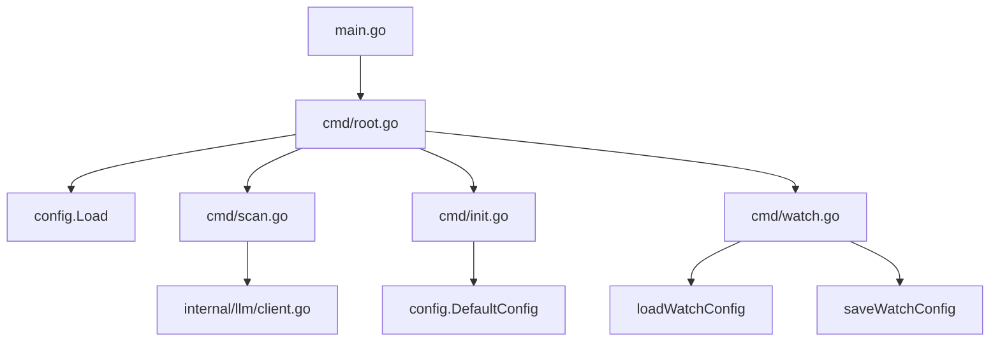

# Repository Configuration Files: Build, Test, and CLI Behavior

This repository uses configuration files in both the Python and Go implementations, and they play a direct role in how the project is formatted, linted, built, tested, containerized, and initialized. The configuration surface is broad, but the observable pattern is consistent: config files define developer tooling conventions, while runtime/config-loader code consumes project-local settings and environment overrides to control CLI behavior.

The most visible configuration-related entry points are the Go loader in [`go/internal/config/loader.go`](go/internal/config/loader.go#L16), the config extractor in [`go/internal/extractor/config.go`](go/internal/extractor/config.go#L40), and the CLI initialization and scanning commands in [`go/cmd/rekipedia/cmd/init.go`](go/cmd/rekipedia/cmd/init.go) and [`go/cmd/rekipedia/cmd/scan.go`](go/cmd/rekipedia/cmd/scan.go#L143). On the Python side, the repository exposes a package entry point through [`src/rekipedia/__main__.py`](src/rekipedia/__main__.py) and a console script declared in `pyproject.toml` via `rekipedia = "rekipedia.cli:main"` and `reki = "rekipedia.cli:main"`.

## Configuration File Inventory

The table below summarizes the major config file types visible in the repository, what they do, and which subsystem they influence.

| Config file type | Purpose | Subsystem affected |
|---|---|---|
| `pyproject.toml` | Python project metadata, packaging, and tool configuration | Python build, test, lint, CLI packaging |
| `package.json` | Node/TypeScript package metadata and scripts | JS/TS build and CLI wrapper behavior |
| `go/go.mod` | Go module definition and dependency graph | Go build/test resolution |
| `Makefile` / `go/Makefile` | Convenience build targets and task orchestration | Build and test automation |
| `.github/workflows/*.yml` | CI pipeline definitions | Automated build, test, release |
| `.env.sample` | Sample environment variable template | CLI/runtime configuration |
| `.eslintrc.json`, `.prettierrc.json` | JavaScript linting and formatting rules | JS code quality |
| `.ruff_cache/…`, `.editorconfig` | Python formatting/cache conventions | Python developer workflow |
| `.golangci.yml`, `checkstyle.xml`, `pmd-ruleset.xml` | Go/static-analysis and code-style rules | Go linting and code quality |
| `.pre-commit-config.yaml` | Local git hook automation | Pre-commit validation |
| `Dockerfile.sandbox` / `go/Dockerfile` | Container build definitions | Sandbox/runtime packaging |
| `.gitignore` | File exclusion rules | Git, packaging, build outputs |

### What is most relevant to builds and tests?

- **`pyproject.toml`** and **`uv.lock`** anchor Python dependency and build reproducibility.
- **`go/go.mod`** and **`go/go.sum`** define the Go module and exact dependency versions.
- **`Makefile`** and **`go/Makefile`** are used to aggregate build/test steps for developer convenience.
- **`.github/workflows/go-ci.yml`**, **`python-ci.yml`**, and **`npm-publish.yml`** indicate that CI validates multiple language targets.
- **`.pre-commit-config.yaml`**, **`.golangci.yml`**, and **`.eslintrc.json`** shape the lint/test feedback loop before changes land.

> **Sources:** `pyproject.toml`; `package.json`; `go/go.mod`; `Makefile`; `go/Makefile`; `.github/workflows/go-ci.yml`; `.github/workflows/python-ci.yml`; `.github/workflows/npm-publish.yml`; `.pre-commit-config.yaml`; `.golangci.yml`; `.eslintrc.json`

## How Configuration Influences the CLI

The repository contains two command surfaces: the Go CLI in `go/cmd/rekipedia/cmd/` and the Python CLI package in `src/rekipedia/cli/`. Their behavior is strongly shaped by configuration files rather than hard-coded defaults.

### Python CLI packaging and entry points

The `pyproject.toml` evidence shows console entry points named `rekipedia` and `reki`, both routed to `rekipedia.cli:main`. That means packaging metadata directly determines how the Python CLI is launched after installation. In practice, this file controls:

- whether the package can be built as a distributable artifact,
- how the executable is exposed to users,
- and which dependency set is installed during testing and release.

### Go CLI behavior and environment-aware loading

On the Go side, the CLI root is wired through [`main`](go/cmd/rekipedia/main.go#L6) and the command tree defined in [`Execute`](go/cmd/rekipedia/cmd/root.go#L44). Configuration loading is centralized in [`Load`](go/internal/config/loader.go#L55), which returns a [`Config`](go/internal/config/loader.go#L34) containing at least LLM and refactor settings. That loader is the bridge between static config files, environment overrides, and runtime CLI behavior.

The tests in [`go/cmd/rekipedia/cmd/root_test.go`](go/cmd/rekipedia/cmd/root_test.go#L91) show that `loadLLMConfig` and its defaults are part of the CLI contract. Similarly, [`loadWatchConfig`](go/cmd/rekipedia/cmd/watch.go#L18) and [`saveWatchConfig`](go/cmd/rekipedia/cmd/watch.go#L28) indicate that the watch command persists its own local settings.

A useful way to think about the Go CLI is:

This is not an algorithmic diagram; it simply shows that command behavior is configuration-driven at the boundaries.

> **Sources:** `pyproject.toml`; `go/cmd/rekipedia/main.go` · L6–L8 · [`main`](go/cmd/rekipedia/main.go#L6); `go/cmd/rekipedia/cmd/root.go` · L44–L48 · [`Execute`](go/cmd/rekipedia/cmd/root.go#L44); `go/internal/config/loader.go` · L34–L89 · [`Config`](go/internal/config/loader.go#L34), [`Load`](go/internal/config/loader.go#L55), [`applyEnvOverrides`](go/internal/config/loader.go#L74); `go/cmd/rekipedia/cmd/watch.go` · L18–L35 · [`loadWatchConfig`](go/cmd/rekipedia/cmd/watch.go#L18), [`saveWatchConfig`](go/cmd/rekipedia/cmd/watch.go#L28); `go/cmd/rekipedia/cmd/root_test.go` · L91–L110 · [`TestLoadLLMConfig`](go/cmd/rekipedia/cmd/root_test.go#L91)

## Build and Test Configuration

Repository-level build/test behavior is determined by a mix of package manifests, task runners, and CI definitions.

### Python build/test inputs

The following files are the main Python-side configuration sources:

- [`pyproject.toml`](pyproject.toml): canonical project metadata and tool settings.
- [`uv.lock`](uv.lock): pinned dependency resolution for reproducible installs.
- [`CONTRIBUTING.md`](CONTRIBUTING.md): contributor expectations that often constrain test and lint workflows.
- `.github/workflows/python-ci.yml`: CI execution of the Python pipeline.

These files collectively determine whether the Python package is built with the intended versions and whether local/test environments match CI.

### Go build/test inputs

The Go pipeline is governed by:

- [`go/go.mod`](go/go.mod) and [`go/go.sum`](go/go.sum) for dependency pinning,
- [`go/Makefile`](go/Makefile) for build helpers,
- [`go/.goreleaser.yaml`](go/.goreleaser.yaml) for release packaging,
- `.github/workflows/go-ci.yml` and `.github/workflows/go-release.yml` for validation and release automation.

The repository evidence also shows a Go build command using `CGO_ENABLED=0 go build -ldflags "-s -w" -o /tmp/reki ./cmd/rekipedia`, which indicates that build reproducibility and static linking are part of the intended release process.

### Linting and code style controls

Static analysis and formatting are split across language ecosystems:

- JavaScript: [`package.json`](package.json), `.eslintrc.json`, `.prettierrc.json`
- Python: `.editorconfig`, `.pre-commit-config.yaml`, `.ruff_cache/…`
- Go: `.golangci.yml`, `checkstyle.xml`
- Cross-language workflow helpers: `scripts/lint-and-report.sh`

These do not change runtime behavior directly, but they affect whether changes are accepted by CI and by local hook enforcement.

> **Sources:** `pyproject.toml`; `uv.lock`; `go/go.mod`; `go/go.sum`; `go/Makefile`; `go/.goreleaser.yaml`; `.github/workflows/python-ci.yml`; `.github/workflows/go-ci.yml`; `.github/workflows/go-release.yml`; `.eslintrc.json`; `.prettierrc.json`; `.golangci.yml`; `.pre-commit-config.yaml`; `scripts/lint-and-report.sh`

## Configuration Loading and Initialization

The most concrete runtime configuration behavior is in [`go/internal/config/loader.go`](go/internal/config/loader.go#L16). It defines:

- [`RefactorConfig`](go/internal/config/loader.go#L16), which governs refactor-related thresholds or modes,
- [`Config`](go/internal/config/loader.go#L34), which aggregates runtime configuration,
- [`DefaultConfig`](go/internal/config/loader.go#L43), which creates the baseline values,
- [`Load`](go/internal/config/loader.go#L55), which reads configuration from disk and environment,
- [`applyEnvOverrides`](go/internal/config/loader.go#L74), which applies environment-variable precedence,
- [`InitDir`](go/internal/config/loader.go#L92), which prepares a repository for first use.

The presence of [`ensureGitIgnore`](go/internal/config/loader.go#L113) suggests initialization also writes or updates ignore rules to keep generated artifacts out of version control. That is an important operational detail: initialization is not just “create config”; it also aligns repo hygiene with expected tool output.

The companion type [`AgentFile`](go/internal/config/agent.go#L63) and function [`WriteAgentFiles`](go/internal/config/agent.go#L76) show that the repository may also generate agent-specific instruction files as part of setup.

### Observable effect on CLI behavior

- `init` likely establishes baseline config and ignore files.
- `scan` reads config and applies LLM-related settings.
- `watch` persists its own state between runs.
- `serve` and `ask` depend on whatever config has already been loaded and stored.

This makes config a first-class runtime dependency, not a passive metadata layer.

> **Sources:** `go/internal/config/loader.go` · L16–L129 · [`RefactorConfig`](go/internal/config/loader.go#L16), [`Config`](go/internal/config/loader.go#L34), [`DefaultConfig`](go/internal/config/loader.go#L43), [`Load`](go/internal/config/loader.go#L55), [`applyEnvOverrides`](go/internal/config/loader.go#L74), [`InitDir`](go/internal/config/loader.go#L92), [`ensureGitIgnore`](go/internal/config/loader.go#L113); `go/internal/config/agent.go` · L63–L95 · [`AgentFile`](go/internal/config/agent.go#L63), [`WriteAgentFiles`](go/internal/config/agent.go#L76)

## Major Config File Types and Their Effects

| File type | Example files | Purpose | Subsystem affected |
|---|---|---|---|
| Project/package manifest | `pyproject.toml`, `package.json`, `go/go.mod` | Declares package identity, dependencies, and tooling | Build, packaging, test resolution |
| Lock file | `uv.lock`, `go/go.sum` | Pins versions for reproducibility | Dependency installation, CI stability |
| Style/lint config | `.eslintrc.json`, `.prettierrc.json`, `.golangci.yml`, `checkstyle.xml`, `pmd-ruleset.xml` | Enforces formatting and static analysis | Developer workflow, pre-merge checks |
| Hook config | `.pre-commit-config.yaml` | Runs checks before commits | Local validation and hygiene |
| CI workflow | `.github/workflows/*.yml` | Automates build/test/release | Continuous integration and release |
| Runtime env sample | `.env.sample` | Documents required/optional env vars | CLI/runtime configuration |
| Container build file | `Dockerfile.sandbox`, `go/Dockerfile` | Creates runtime or sandbox images | Deployment, reproducible execution |
| Repo initialization artifacts | `AGENTS.md`, `CLAUDE.md`, `.github/*instructions.md` | Tooling/instruction files for agents and contributors | CLI init, AI-assisted workflow setup |

Notably, some files are “configuration” in a human/workflow sense rather than a parser-driven application sense. For example, `AGENTS.md` and `CLAUDE.md` are instruction artifacts that influence how automated agents or contributors behave, and [`WriteAgentFiles`](go/internal/config/agent.go#L76) suggests the toolchain may generate them as part of setup.

> **Sources:** `pyproject.toml`; `package.json`; `go/go.mod`; `uv.lock`; `go/go.sum`; `.eslintrc.json`; `.prettierrc.json`; `.golangci.yml`; `checkstyle.xml`; `pmd-ruleset.xml`; `.pre-commit-config.yaml`; `.github/workflows/go-ci.yml`; `.github/workflows/python-ci.yml`; `.github/workflows/go-release.yml`; `.env.sample`; `Dockerfile.sandbox`; `go/Dockerfile`; `AGENTS.md`; `CLAUDE.md`; `go/internal/config/agent.go` · L76–L95 · [`WriteAgentFiles`](go/internal/config/agent.go#L76)

## Environment Variables and Flags

The repository evidence is clear that environment overrides exist in the Go config loader via [`applyEnvOverrides`](go/internal/config/loader.go#L74). However, the analysis payload does **not** enumerate the exact variable names, so it would be speculative to list them individually here.

What is observable:

- environment values can override file-based config,
- defaults are available through [`DefaultConfig`](go/internal/config/loader.go#L43) and [`DefaultLLMConfig`](go/internal/models/contracts.go#L18),
- tests explicitly cover environment override behavior in [`TestEnvOverride`](go/internal/config/loader_test.go#L53) and [`TestEnvOverrideFallbackOpenAI`](go/internal/config/loader_test.go#L71),
- CLI commands such as `scan` and `watch` read configuration during execution.

The repository also shows command-line flags in tests for subcommands like `embed`, `export`, `update`, and `refactor`, but because the task is focused on configuration files rather than command reference details, the exact flags are intentionally omitted here.

> **Sources:** `go/internal/config/loader.go` · L43–L89 · [`DefaultConfig`](go/internal/config/loader.go#L43), [`applyEnvOverrides`](go/internal/config/loader.go#L74); `go/internal/models/contracts.go` · L18–L23 · [`DefaultLLMConfig`](go/internal/models/contracts.go#L18); `go/internal/config/loader_test.go` · L53–L79 · [`TestEnvOverride`](go/internal/config/loader_test.go#L53), [`TestEnvOverrideFallbackOpenAI`](go/internal/config/loader_test.go#L71)