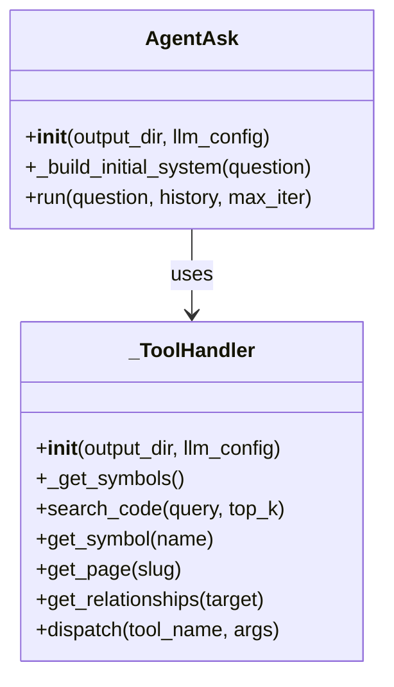
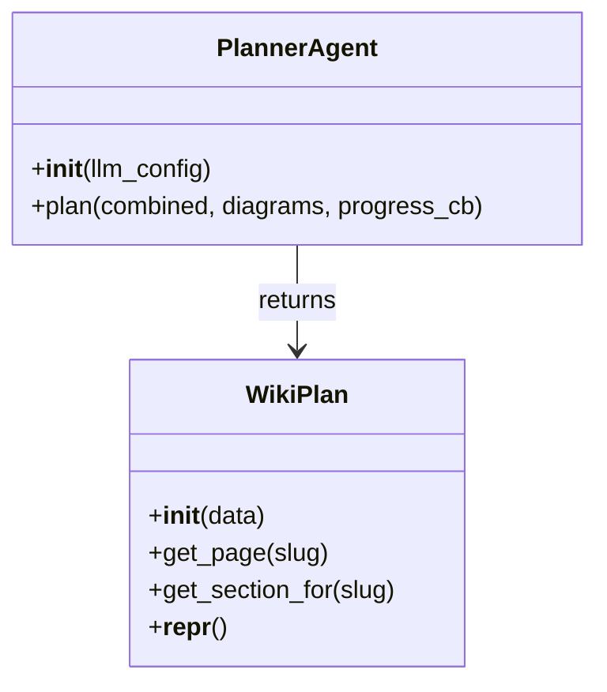
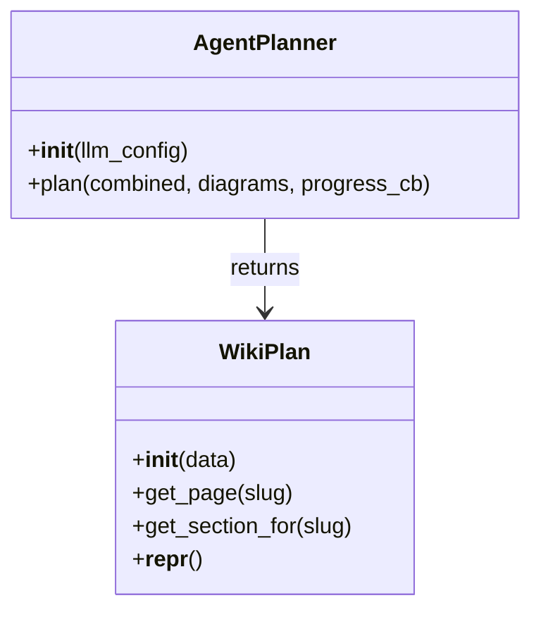

# Module Reference: Significant Packages and Modules

This page documents the significant Python modules in the repository based on the available static analysis. The focus is on the orchestration and planning layers used by the “ask” and wiki synthesis flows, plus the package root and tests that validate the agentic behavior.

## Overview

The repository centers on two major workflows:

1. **Answering questions over a scanned codebase** via the orchestrator modules [`rekipedia.orchestrator.run_ask`](src/rekipedia/orchestrator/run_ask.py#L1) and [`rekipedia.orchestrator.agent_ask`](src/rekipedia/orchestrator/agent_ask.py#L1).
2. **Planning wiki structure and content generation** via [`rekipedia.synthesis.planner`](src/rekipedia/synthesis/planner.py#L1) and [`rekipedia.synthesis.agent_planner`](src/rekipedia/synthesis/agent_planner.py#L1).

The test module [`tests.test_agent_ask`](tests/test_agent_ask.py#L1) exercises both the direct and agentic ask/planner paths, including fallback behavior and environment-variable-based delegation.

### Relationship summary

The analysis reports **546 total internal relationships**, split into **62 imports** and **484 calls**. The strongest hubs are `get` (74 inbound calls), [`AgentPlanner.plan`](src/rekipedia/synthesis/agent_planner.py#L155), [`PlannerAgent.plan`](src/rekipedia/synthesis/planner.py#L186), and [`_build_full_system`](src/rekipedia/orchestrator/run_ask.py#L208). These are good indicators of where the system concentrates its logic.

## Package Root: `rekipedia`

The package root module [`rekipedia.__init__`](src/rekipedia/__init__.py#L1) exists as the package entry point and namespace anchor.

### Purpose

The analysis only shows [`rekipedia.__init__`](src/rekipedia/__init__.py#L1) as a module symbol with no exported functions or classes. Its observable role is to define the package namespace for the `rekipedia` distribution identified in the metadata (`py_name: rekipedia`, `py_version: 0.13.0`).

### Public API

No public API symbols are visible in the analysis data for this module.

### Interactions

The package root is not shown importing anything in the extracted relationships, so there is no evidence here of runtime logic beyond package initialization.

> **Sources:** `src/rekipedia/__init__.py` · L1–L1 · [`rekipedia.__init__`](src/rekipedia/__init__.py#L1)

## Orchestration Module: `rekipedia.orchestrator.run_ask`

[`rekipedia.orchestrator.run_ask`](src/rekipedia/orchestrator/run_ask.py#L1) is the non-agentic question-answering orchestrator. It builds the full system prompt, collects contextual evidence from the scan output, and prepares the LLM client used to answer a user question grounded in the codebase.

### Purpose

This module assembles the main “ask” context from multiple sources:

- wiki pages from the scan output
- symbol metadata
- RAG chunks from the embedding pipeline
- notes from the SQLite knowledge store
- optional query rewriting to better match project vocabulary

It is the core “single-shot” path used by [`run_ask`](src/rekipedia/orchestrator/run_ask.py#L334) and [`stream_ask`](src/rekipedia/orchestrator/run_ask.py#L364).

### Public API

- [`run_ask(question, repo_root, output_dir, llm_config, history)`](src/rekipedia/orchestrator/run_ask.py#L334)
- [`stream_ask(question, repo_root, output_dir, llm_config, history)`](src/rekipedia/orchestrator/run_ask.py#L364)

### Key Classes

This module does not define classes in the extracted symbol list.

### Key Functions

| Function | Signature | Description |
|---|---|---|
| [`_verify_scan`](src/rekipedia/orchestrator/run_ask.py#L37) | `_verify_scan(output_dir, repo_root)` | Validates that a successful scan exists and returns the latest run id. |
| [`_load_wiki_pages`](src/rekipedia/orchestrator/run_ask.py#L55) | `_load_wiki_pages(output_dir)` | Loads wiki markdown pages from the generated wiki directory. |
| [`_load_symbol_lines`](src/rekipedia/orchestrator/run_ask.py#L66) | `_load_symbol_lines(output_dir)` | Loads symbol line metadata from JSON. |
| [`_rag_chunks`](src/rekipedia/orchestrator/run_ask.py#L86) | `_rag_chunks(question, output_dir, llm_config, top_k)` | Returns top-k embedding search chunks if the index is available. |
| [`_extract_keywords`](src/rekipedia/orchestrator/run_ask.py#L104) | `_extract_keywords(text)` | Extracts query keywords using a simple stopword filter. |
| [`_score_page`](src/rekipedia/orchestrator/run_ask.py#L116) | `_score_page(page_text, keywords)` | Computes a relevance score for a wiki page. |
| [`_rank_pages_by_query`](src/rekipedia/orchestrator/run_ask.py#L137) | `_rank_pages_by_query(pages, question)` | Sorts wiki pages by query relevance. |
| [`_rewrite_query`](src/rekipedia/orchestrator/run_ask.py#L149) | `_rewrite_query(question, output_dir, llm_config)` | Optionally rewrites the query to align with codebase vocabulary. |
| [`_build_full_system`](src/rekipedia/orchestrator/run_ask.py#L208) | `_build_full_system(question, output_dir, llm_config)` | Builds the full system prompt and all context blocks. |
| [`_prepare_ask`](src/rekipedia/orchestrator/run_ask.py#L310) | `_prepare_ask(question, repo_root, output_dir, llm_config, history)` | Validates the scan, builds the prompt, and initializes the LLM client. |

### Interactions

#### Imported modules

According to the cross-module summary, this module imports:

- [`rekipedia.llm.client`](src/rekipedia/orchestrator/run_ask.py#L1)
- [`rekipedia.models.contracts`](src/rekipedia/orchestrator/run_ask.py#L1)
- [`rekipedia.storage.sqlite_store`](src/rekipedia/orchestrator/run_ask.py#L1)
- [`rekipedia.rag.embedder`](src/rekipedia/orchestrator/run_ask.py#L1)
- [`rekipedia.orchestrator.agent_ask`](src/rekipedia/orchestrator/run_ask.py#L1)

It also uses standard library modules such as `json`, `re`, `pathlib`, `typing`, and `os`.

#### Called by

- [`rekipedia.orchestrator.agent_ask`](src/rekipedia/orchestrator/agent_ask.py#L1) imports this module
- [`tests.test_agent_ask`](tests/test_agent_ask.py#L1) imports this module and asserts delegation behavior

### Mermaid class diagram

There are no classes in this module, so no class hierarchy diagram is applicable.

> **Sources:** `src/rekipedia/orchestrator/run_ask.py` · L1–L377 · [`_verify_scan`](src/rekipedia/orchestrator/run_ask.py#L37), [`run_ask`](src/rekipedia/orchestrator/run_ask.py#L334), [`stream_ask`](src/rekipedia/orchestrator/run_ask.py#L364)

## Orchestration Module: `rekipedia.orchestrator.agent_ask`

[`rekipedia.orchestrator.agent_ask`](src/rekipedia/orchestrator/agent_ask.py#L1) provides the agentic ask path. It wraps a ReAct-style tool loop around the same knowledge store used by the plain `run_ask` path.

### Purpose

This module enables iterative question answering with tools. The `AgentAsk` class can call tools such as:

- code search
- symbol lookup
- wiki page retrieval
- relationship inspection

The docstring on [`AgentAsk`](src/rekipedia/orchestrator/agent_ask.py#L253) explicitly states that it is a “ReAct agentic loop for answering codebase questions” and that it falls back to single-shot mode if the model does not support tool calling.

### Public API

- [`AgentAsk`](src/rekipedia/orchestrator/agent_ask.py#L253)
- [`agent_run_ask(question, repo_root, output_dir, llm_config, history)`](src/rekipedia/orchestrator/agent_ask.py#L371)

### Key Classes

#### [`_ToolHandler`](src/rekipedia/orchestrator/agent_ask.py#L141)

A private utility class that encapsulates tool implementations.

- **Constructor:** [`_ToolHandler.__init__(self, output_dir, llm_config)`](src/rekipedia/orchestrator/agent_ask.py#L142)
- **Main methods:**
  - [`_get_symbols(self)`](src/rekipedia/orchestrator/agent_ask.py#L148) — loads `symbols.json`
  - [`search_code(self, query, top_k)`](src/rekipedia/orchestrator/agent_ask.py#L160) — returns code chunks from the RAG index
  - [`get_symbol(self, name)`](src/rekipedia/orchestrator/agent_ask.py#L173) — returns matching symbol metadata
  - [`get_page(self, slug)`](src/rekipedia/orchestrator/agent_ask.py#L189) — returns wiki page content for a slug
  - [`get_relationships(self, target)`](src/rekipedia/orchestrator/agent_ask.py#L208) — returns relationship information for a target
  - [`dispatch(self, tool_name, args)`](src/rekipedia/orchestrator/agent_ask.py#L236) — routes tool invocations by name

#### [`AgentAsk`](src/rekipedia/orchestrator/agent_ask.py#L253)

The main agentic orchestrator.

- **Constructor:** [`AgentAsk.__init__(self, output_dir, llm_config)`](src/rekipedia/orchestrator/agent_ask.py#L259)
- **Main methods:**
  - [`_build_initial_system(self, question)`](src/rekipedia/orchestrator/agent_ask.py#L265) — creates the initial system prompt
  - [`run(self, question, history, max_iter)`](src/rekipedia/orchestrator/agent_ask.py#L275) — executes the ReAct loop and returns the final answer string

### Key Functions

| Function | Signature | Description |
|---|---|---|
| [`_ToolHandler._get_symbols`](src/rekipedia/orchestrator/agent_ask.py#L148) | `_get_symbols(self)` | Loads symbol metadata from `symbols.json`. |
| [`_ToolHandler.search_code`](src/rekipedia/orchestrator/agent_ask.py#L160) | `search_code(self, query, top_k)` | Searches code chunks via the embedding pipeline. |
| [`_ToolHandler.get_symbol`](src/rekipedia/orchestrator/agent_ask.py#L173) | `get_symbol(self, name)` | Finds symbols by exact or fuzzy name matching. |
| [`_ToolHandler.get_page`](src/rekipedia/orchestrator/agent_ask.py#L189) | `get_page(self, slug)` | Reads a wiki page from disk by slug. |
| [`_ToolHandler.get_relationships`](src/rekipedia/orchestrator/agent_ask.py#L208) | `get_relationships(self, target)` | Collects relationships for a symbol or module. |
| [`_ToolHandler.dispatch`](src/rekipedia/orchestrator/agent_ask.py#L236) | `dispatch(self, tool_name, args)` | Dispatches a tool call to the appropriate handler. |
| [`AgentAsk._build_initial_system`](src/rekipedia/orchestrator/agent_ask.py#L265) | `_build_initial_system(self, question)` | Prepares the first system prompt with local context. |
| [`AgentAsk.run`](src/rekipedia/orchestrator/agent_ask.py#L275) | `run(self, question, history, max_iter)` | Runs the iterative tool-calling loop. |
| [`agent_run_ask`](src/rekipedia/orchestrator/agent_ask.py#L371) | `agent_run_ask(question, repo_root, output_dir, llm_config, history)` | Validates scan state and delegates to `AgentAsk`. |

### Interactions

#### Imports

This module imports:

- [`rekipedia.llm.client`](src/rekipedia/orchestrator/agent_ask.py#L1)
- [`rekipedia.models.contracts`](src/rekipedia/orchestrator/agent_ask.py#L1)
- [`rekipedia.orchestrator.run_ask`](src/rekipedia/orchestrator/agent_ask.py#L1)
- [`rekipedia.storage.sqlite_store`](src/rekipedia/orchestrator/agent_ask.py#L1)

It also imports `litellm`, `json`, `logging`, `os`, and `pathlib`.

#### Imported by

- [`rekipedia.orchestrator.run_ask`](src/rekipedia/orchestrator/run_ask.py#L1) imports this module for delegation
- [`tests.test_agent_ask`](tests/test_agent_ask.py#L1) imports it to validate the tool loop and fallback behavior

### Mermaid class diagram

> **Sources:** `src/rekipedia/orchestrator/agent_ask.py` · L1–L382 · [`_ToolHandler`](src/rekipedia/orchestrator/agent_ask.py#L141), [`AgentAsk`](src/rekipedia/orchestrator/agent_ask.py#L253), [`agent_run_ask`](src/rekipedia/orchestrator/agent_ask.py#L371)

## Synthesis Module: `rekipedia.synthesis.planner`

[`rekipedia.synthesis.planner`](src/rekipedia/synthesis/planner.py#L1) implements the primary wiki planning flow. It turns scan outputs into a structured [`WikiPlan`](src/rekipedia/synthesis/planner.py#L138), and it contains both an LLM-driven planner and a heuristic fallback planner.

### Purpose

This module is responsible for deciding how the wiki should be structured. It analyzes the combined scan data and diagrams, then returns a plan describing pages, sections, and supporting metadata. The design is split into:

- [`PlannerAgent`](src/rekipedia/synthesis/planner.py#L180): one-shot LLM-based planner
- [`_default_plan`](src/rekipedia/synthesis/planner.py#L400): deterministic fallback when LLM planning fails
- [`WikiPlan`](src/rekipedia/synthesis/planner.py#L138): the structured output container

It also imports [`rekipedia.synthesis.agent_planner`](src/rekipedia/synthesis/agent_planner.py#L1), which suggests this module can delegate to or interoperate with the agentic planner implementation.

### Public API

- [`WikiPlan`](src/rekipedia/synthesis/planner.py#L138)
- [`PlannerAgent`](src/rekipedia/synthesis/planner.py#L180)

### Key Classes

#### [`WikiPlan`](src/rekipedia/synthesis/planner.py#L138)

A structured wrapper around plan data.

- **Constructor:** [`WikiPlan.__init__(self, data)`](src/rekipedia/synthesis/planner.py#L141)
- **Main methods:**
  - [`get_page(self, slug)`](src/rekipedia/synthesis/planner.py#L166) — returns a page entry for a slug
  - [`get_section_for(self, slug)`](src/rekipedia/synthesis/planner.py#L169) — returns the section mapping for a slug
  - [`__repr__(self)`](src/rekipedia/synthesis/planner.py#L175) — compact summary representation

#### [`PlannerAgent`](src/rekipedia/synthesis/planner.py#L180)

The blocking LLM planner.

- **Constructor:** [`PlannerAgent.__init__(self, llm_config)`](src/rekipedia/synthesis/planner.py#L183)
- **Main methods:**
  - [`plan(self, combined, diagrams, progress_cb)`](src/rekipedia/synthesis/planner.py#L186) — analyzes the combined scan output and returns a `WikiPlan`

### Key Functions

| Function | Signature | Description |
|---|---|---|
| [`_classify_file_role`](src/rekipedia/synthesis/planner.py#L289) | `_classify_file_role(path)` | Classifies a path as impl/test/ci/config/doc. |
| [`_build_planning_summary`](src/rekipedia/synthesis/planner.py#L308) | `_build_planning_summary(combined, diagrams)` | Produces a compact planning summary for LLM consumption. |
| [`_default_plan`](src/rekipedia/synthesis/planner.py#L400) | `_default_plan(combined)` | Creates a heuristic fallback wiki plan. |

### Interactions

#### Imports

This module imports:

- [`rekipedia.llm.client`](src/rekipedia/synthesis/planner.py#L1)
- [`rekipedia.models.contracts`](src/rekipedia/synthesis/planner.py#L1)
- [`rekipedia.synthesis.slug_utils`](src/rekipedia/synthesis/planner.py#L1)
- [`rekipedia.orchestrator.snapshotter`](src/rekipedia/synthesis/planner.py#L1)
- [`rekipedia.synthesis.agent_planner`](src/rekipedia/synthesis/planner.py#L1)

It also imports `json`, `logging`, `os`, `re`, `pathlib`, and `threading`.

#### Imported by

- [`rekipedia.synthesis.agent_planner`](src/rekipedia/synthesis/agent_planner.py#L1) imports this module
- [`tests.test_agent_ask`](tests/test_agent_ask.py#L1) imports it to validate the fallback planner and plan object behavior

### Mermaid class diagram

> **Sources:** `src/rekipedia/synthesis/planner.py` · L1–L495 · [`WikiPlan`](src/rekipedia/synthesis/planner.py#L138), [`PlannerAgent`](src/rekipedia/synthesis/planner.py#L180), [`_default_plan`](src/rekipedia/synthesis/planner.py#L400)

## Synthesis Module: `rekipedia.synthesis.agent_planner`

[`rekipedia.synthesis.agent_planner`](src/rekipedia/synthesis/agent_planner.py#L1) provides an agentic alternative to the one-shot planner. It uses tool-style iterative calls to build a wiki plan, rather than relying on a single structured LLM response.

### Purpose

The docstring on [`AgentPlanner`](src/rekipedia/synthesis/agent_planner.py#L144) states that it is a “Tool-calling agentic planner for wiki structure design” and that it shares the same interface as `PlannerAgent`: constructor takes `llm_config`, and `.plan()` returns `WikiPlan`.

This module is the agentic counterpart to [`rekipedia.synthesis.planner`](src/rekipedia/synthesis/planner.py#L1).

### Public API

- [`AgentPlanner`](src/rekipedia/synthesis/agent_planner.py#L144)

### Key Classes

#### [`AgentPlanner`](src/rekipedia/synthesis/agent_planner.py#L144)

Agentic planning implementation.

- **Constructor:** [`AgentPlanner.__init__(self, llm_config)`](src/rekipedia/synthesis/agent_planner.py#L151)
- **Main methods:**
  - [`plan(self, combined, diagrams, progress_cb)`](src/rekipedia/synthesis/agent_planner.py#L155) — iteratively builds and returns a `WikiPlan`

### Key Functions

The extracted symbol set shows only the class methods above. No standalone helper functions are visible in the analysis data for this file.

### Interactions

#### Imports

This module imports:

- [`rekipedia.llm.client`](src/rekipedia/synthesis/agent_planner.py#L1)
- [`rekipedia.models.contracts`](src/rekipedia/synthesis/agent_planner.py#L1)
- [`rekipedia.synthesis.planner`](src/rekipedia/synthesis/agent_planner.py#L1)

It also imports `litellm`, `json`, `logging`, `os`, `collections.abc`, and `pathlib`.

#### Imported by

- [`rekipedia.synthesis.planner`](src/rekipedia/synthesis/planner.py#L1) imports this module
- [`tests.test_agent_ask`](tests/test_agent_ask.py#L1) imports this module for agent planner tests

### Mermaid class diagram

> **Sources:** `src/rekipedia/synthesis/agent_planner.py` · L1–L295 · [`AgentPlanner`](src/rekipedia/synthesis/agent_planner.py#L144)

## Test Module: `tests.test_agent_ask`

[`tests.test_agent_ask`](tests/test_agent_ask.py#L1) validates the ask and planning modules under mocked LLM behavior. It covers both normal and failure scenarios, including environment-variable-based delegation to the agentic ask path.

### Purpose

The tests are heavily focused on behavior that is easy to regress:

- tool handler edge cases when data stores are missing
- direct-answer and tool-call flows for [`AgentAsk.run`](src/rekipedia/orchestrator/agent_ask.py#L275)
- fallback behavior when `litellm` raises exceptions
- agent planner success and fallback cases
- delegation from `run_ask` when `REKIPEDIA_AGENT_ASK=1`

### Public API

This is a test module; its public API consists of test functions.

### Key Functions

| Function | Signature | Description |
|---|---|---|
| [`_make_config`](tests/test_agent_ask.py#L20) | `_make_config(tmp_path)` | Builds a temporary [`LLMConfig`](tests/test_agent_ask.py#L20) for tests. |
| [`_mock_direct_response`](tests/test_agent_ask.py#L24) | `_mock_direct_response(content)` | Creates a mock LLM response with no tool calls. |
| [`_mock_tool_call_response`](tests/test_agent_ask.py#L35) | `_mock_tool_call_response(fn_name, fn_args, call_id)` | Creates a mock LLM response containing a single tool call. |
| [`test_tool_handler_search_code_no_index`](tests/test_agent_ask.py#L60) | `test_tool_handler_search_code_no_index(tmp_path)` | Verifies the search tool handles a missing index. |
| [`test_tool_handler_get_symbol_not_found`](tests/test_agent_ask.py#L67) | `test_tool_handler_get_symbol_not_found(tmp_path)` | Verifies helpful output when a symbol cannot be found. |
| [`test_tool_handler_get_page_not_found`](tests/test_agent_ask.py#L74) | `test_tool_handler_get_page_not_found(tmp_path)` | Verifies helpful output when the wiki directory is empty. |
| [`test_tool_handler_get_symbol_found`](tests/test_agent_ask.py#L81) | `test_tool_handler_get_symbol_found(tmp_path)` | Verifies symbol lookup from `symbols.json`. |
| [`test_tool_handler_get_page_found`](tests/test_agent_ask.py#L97) | `test_tool_handler_get_page_found(tmp_path)` | Verifies page retrieval from disk. |
| [`test_agent_ask_direct_answer`](tests/test_agent_ask.py#L112) | `test_agent_ask_direct_answer(tmp_path)` | Verifies a direct LLM answer with no tool calls. |
| [`test_agent_ask_tool_then_finish`](tests/test_agent_ask.py#L133) | `test_agent_ask_tool_then_finish(tmp_path)` | Verifies a tool call followed by a final direct answer. |
| [`test_agent_ask_finish_tool`](tests/test_agent_ask.py#L155) | `test_agent_ask_finish_tool(tmp_path)` | Verifies completion via the finish tool. |
| [`test_agent_ask_max_iterations`](tests/test_agent_ask.py#L173) | `test_agent_ask_max_iterations(tmp_path)` | Verifies behavior after the maximum number of iterations. |
| [`test_agent_ask_fallback_on_error`](tests/test_agent_ask.py#L198) | `test_agent_ask_fallback_on_error(tmp_path)` | Verifies fallback to single-shot mode if `litellm` fails. |
| [`test_agent_planner_add_pages_and_finalize`](tests/test_agent_ask.py#L220) | `test_agent_planner_add_pages_and_finalize(tmp_path)` | Verifies multi-step plan assembly into a `WikiPlan`. |
| [`test_agent_planner_fallback_on_error`](tests/test_agent_ask.py#L263) | `test_agent_planner_fallback_on_error(tmp_path)` | Verifies fallback to the default plan on errors. |
| [`test_run_ask_uses_agent_when_env_set`](tests/test_agent_ask.py#L283) | `test_run_ask_uses_agent_when_env_set(tmp_path, monkeypatch)` | Verifies `run_ask` delegates to the agentic version when enabled. |

### Interactions

This test module imports:

- [`rekipedia.orchestrator.agent_ask`](src/rekipedia/orchestrator/agent_ask.py#L1)
- [`rekipedia.synthesis.agent_planner`](src/rekipedia/synthesis/agent_planner.py#L1)
- [`rekipedia.synthesis.planner`](src/rekipedia/synthesis/planner.py#L1)
- [`rekipedia.models.contracts`](src/rekipedia/models/contracts) — referenced in the analysis but not expanded in the file list
- [`rekipedia.orchestrator`](src/rekipedia/orchestrator) — used for import reloading in one test

### Mermaid class diagram

There are no classes defined in the test module.

> **Sources:** `tests/test_agent_ask.py` · L1–L303 · [`test_agent_ask_direct_answer`](tests/test_agent_ask.py#L112), [`test_agent_planner_add_pages_and_finalize`](tests/test_agent_ask.py#L220), [`test_run_ask_uses_agent_when_env_set`](tests/test_agent_ask.py#L283)

## Cross-Module Dependency Table

The following table summarizes the most relevant module relationships observed in the analysis.

| Module | Imports From | Called By | Calls Into | Inherits From |
|--------|-------------|-----------|------------|---------------|
| `rekipedia.orchestrator.run_ask` | `rekipedia.llm.client`, `rekipedia.models.contracts`, `rekipedia.storage.sqlite_store`, `rekipedia.rag.embedder`, `rekipedia.orchestrator.agent_ask` | `rekipedia.orchestrator.agent_ask`, `tests.test_agent_ask` | LLM client, SQLite store, embedder, query-ranking helpers | — |
| `rekipedia.orchestrator.agent_ask` | `rekipedia.llm.client`, `rekipedia.models.contracts`, `rekipedia.orchestrator.run_ask`, `rekipedia.storage.sqlite_store` | `rekipedia.orchestrator.run_ask`, `tests.test_agent_ask` | Tool handlers, LLM client, scan validation, `run_ask` fallback path | — |
| `rekipedia.synthesis.planner` | `rekipedia.llm.client`, `rekipedia.models.contracts`, `rekipedia.synthesis.slug_utils`, `rekipedia.orchestrator.snapshotter`, `rekipedia.synthesis.agent_planner` | `rekipedia.synthesis.agent_planner`, `tests.test_agent_ask` | `WikiPlan`, fallback planner, agentic planner, snapshot plumbing | — |
| `rekipedia.synthesis.agent_planner` | `rekipedia.llm.client`, `rekipedia.models.contracts`, `rekipedia.synthesis.planner` | `rekipedia.synthesis.planner`, `tests.test_agent_ask` | `WikiPlan`, summary builder, LLM client | — |
| `tests.test_agent_ask` | `rekipedia.orchestrator.agent_ask`, `rekipedia.synthesis.agent_planner`, `rekipedia.synthesis.planner`, `rekipedia.models.contracts` | — | mocks, patched `litellm`, module reloads | — |

## Observations and Gaps

The analysis data is strong on symbol names, signatures, relationships, and test coverage, but it does not include source text for all dependent modules such as `rekipedia.llm.client`, `rekipedia.models.contracts`, `rekipedia.storage.sqlite_store`, or `rekipedia.rag.embedder`. As a result, this page documents only the behavior observable from the analyzed modules and their relationships.

The most notable uncovered implementation detail is the exact shape of the `LLMClient`, `LLMConfig`, `SqliteStore`, and `EmbedPipeline` abstractions; they are referenced heavily, but their own modules were not part of the provided file set.

> **Sources:** `src/rekipedia/orchestrator/run_ask.py` · L1–L377 · `src/rekipedia/orchestrator/agent_ask.py` · L1–L382 · `src/rekipedia/synthesis/planner.py` · L1–L495 · `src/rekipedia/synthesis/agent_planner.py` · L1–L295 · `tests/test_agent_ask.py` · L1–L303