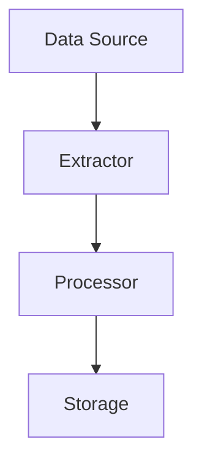
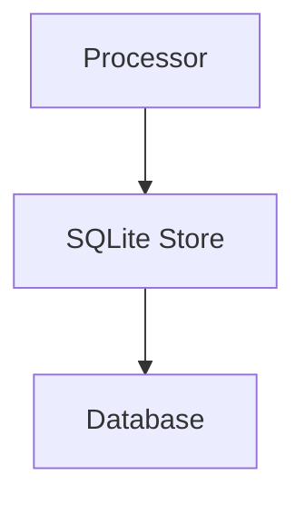
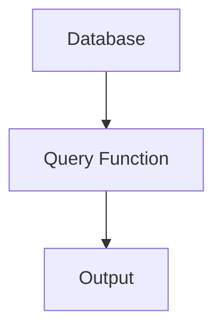

# Data Flow within the System

This document describes the data flow within the system, focusing on the following sections:
- Data Sources
- Data Processing Pipeline
- Data Storage
- Data Retrieval

## Data Sources

Data sources are the initial points where data is collected or generated within the system. These sources can include files, databases, APIs, and other external inputs.

### Entry Points
The system has several entry points where data is initially collected:
- [`src/rekipedia/sandbox/tasks/analyze_shard.py`](src/rekipedia/sandbox/tasks/analyze_shard.py)
- [`tests/fixtures/mini-py-repo/main.py`](tests/fixtures/mini-py-repo/main.py)
- [`tests/fixtures/mini-ts-repo/src/index.ts`](tests/fixtures/mini-ts-repo/src/index.ts)

### Functions for Data Collection
Several functions are responsible for collecting data from various sources:
- [`read_checksums_from_dist`](.github/scripts/update-homebrew-tap.py#L36): Reads sha256 checksums from `dist/checksums.txt`.
- [`gh_get_sha`](.github/scripts/update-homebrew-tap.py#L58): Retrieves SHA values from GitHub.
- [`gh_put`](.github/scripts/update-homebrew-tap.py#L71): Uploads content to GitHub.

### Data Collection Example
```python
def read_checksums_from_dist():
    # Read sha256 from goreleaser's dist/checksums.txt (no download needed)
    pass
```

> **Sources:** `.github/scripts/update-homebrew-tap.py` · L36–L55 · [`read_checksums_from_dist`](.github/scripts/update-homebrew-tap.py#L36)

## Data Processing Pipeline

The data processing pipeline involves transforming raw data into structured formats that can be stored and queried efficiently.

### Pipeline Components
The pipeline consists of several components that handle different stages of data processing:
- **Extractors**: Extract symbols and relationships from source files.
  - [`BaseExtractor`](src/rekipedia/extractors/base.py#L10)
  - [`ConfigExtractor`](src/rekipedia/extractors/config_extractor.py#L23)
  - [`GoExtractor`](src/rekipedia/extractors/go_extractor.py#L31)
  - [`JavaExtractor`](src/rekipedia/extractors/java_extractor.py#L32)
  - [`PythonExtractor`](src/rekipedia/extractors/python_extractor.py#L18)
  - [`RustExtractor`](src/rekipedia/extractors/rust_extractor.py#L48)
  - [`TypeScriptExtractor`](src/rekipedia/extractors/typescript_extractor.py#L35)

### Processing Functions
Functions that process data include:
- [`_tokenize_symbol`](src/rekipedia/analysis/cross_repo_search.py#L8): Splits camelCase and snake_case into tokens.
- [`_score_bm25`](src/rekipedia/analysis/cross_repo_search.py#L18): Scores symbols using BM25-inspired scoring.
- [`_search_single_repo`](src/rekipedia/analysis/cross_repo_search.py#L35): Searches symbols in one repo's database.

### Data Processing Example
```python
def _tokenize_symbol(name):
    # Split camelCase and snake_case into tokens
    pass
```

> **Sources:** `src/rekipedia/analysis/cross_repo_search.py` · L8–L15 · [`_tokenize_symbol`](src/rekipedia/analysis/cross_repo_search.py#L8)

### Data Processing Pipeline Diagram


## Data Storage

Data storage involves saving processed data into databases or other storage systems for persistent access.

### Storage Components
The system uses various storage components:
- **SQLite Store**: Manages database connections and operations.
  - [`SqliteStore`](src/rekipedia/storage/sqlite_store.py#L39)

### Storage Functions
Functions that handle data storage include:
- [`upsert_run`](src/rekipedia/storage/sqlite_store.py#L137): Inserts or updates a scan run.
- [`upsert_symbols`](src/rekipedia/storage/sqlite_store.py#L223): Inserts or updates symbols.
- [`upsert_relationships`](src/rekipedia/storage/sqlite_store.py#L263): Inserts or updates relationships.

### Data Storage Example
```python
def upsert_run(self, run_id, repo_path, status):
    # Insert or update a scan run
    pass
```

> **Sources:** `src/rekipedia/storage/sqlite_store.py` · L137–L160 · [`upsert_run`](src/rekipedia/storage/sqlite_store.py#L137)

### Data Storage Diagram


## Data Retrieval

Data retrieval involves querying stored data to generate insights, reports, or other outputs.

### Retrieval Components
Components involved in data retrieval include:
- **Query Functions**: Functions that query the database for specific data.
  - [`search_all_repos`](src/rekipedia/analysis/cross_repo_search.py#L63): Searches all registered repositories.
  - [`get_all_symbols`](src/rekipedia/storage/sqlite_store.py#L363): Retrieves all symbols for a given run.
  - [`get_all_relationships`](src/rekipedia/storage/sqlite_store.py#L370): Retrieves all relationships for a given run.

### Retrieval Functions
Functions that handle data retrieval include:
- [`search_all_repos`](src/rekipedia/analysis/cross_repo_search.py#L63): Searches all registered repositories.
- [`get_all_symbols`](src/rekipedia/storage/sqlite_store.py#L363): Retrieves all symbols for a given run.
- [`get_all_relationships`](src/rekipedia/storage/sqlite_store.py#L370): Retrieves all relationships for a given run.

### Data Retrieval Example
```python
def search_all_repos(query, repo_dirs, kind):
    # Search all registered repos in parallel
    pass
```

> **Sources:** `src/rekipedia/analysis/cross_repo_search.py` · L63–L85 · [`search_all_repos`](src/rekipedia/analysis/cross_repo_search.py#L63)

### Data Retrieval Diagram


## Cross-Module Dependency Table

| Module | Imports From | Called By | Calls Into | Inherits From |
|--------|-------------|-----------|------------|---------------|
| `rekipedia.analysis.cross_repo_search` | `__future__`, `concurrent.futures`, `rekipedia.storage.sqlite_store`, `rekipedia.watcher.watcher` | - | - | - |
| `rekipedia.analysis.graph_analysis` | `__future__`, `rekipedia.models.contracts` | - | - | - |
| `rekipedia.analysis.graph_export` | `__future__`, `xml.etree` | - | - | - |
| `rekipedia.analysis.impact` | `__future__` | - | - | - |
| `rekipedia.analysis.refactor_detector` | `__future__` | - | - | - |
| `rekipedia.analysis.refactor_enricher` | `__future__`, `concurrent.futures`, `rekipedia.llm.client`, `rekipedia.models.contracts` | - | - | - |
| `rekipedia.analysis.refactor_writer` | `__future__`, `importlib.metadata`, `rekipedia.models.contracts` | - | - | -