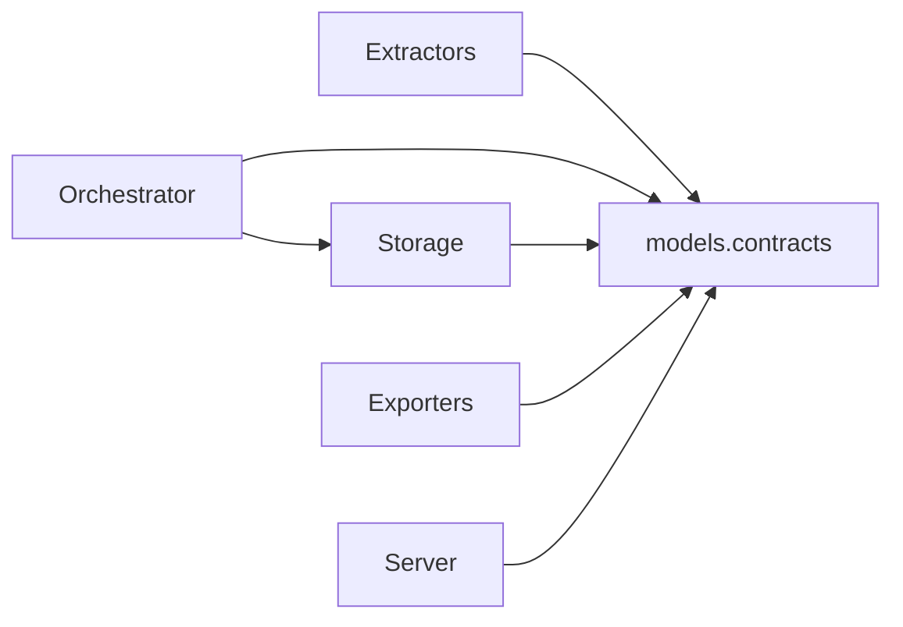

# Core Data Structures and Types

## Overview

This page documents the repository’s shared **data shapes**: the structs, interfaces, and configuration/manifest objects that move across modules. The focus is intentionally on **what data looks like**, **where it is produced**, and **which modules consume it**, rather than on execution flow or CLI usage.

The most important shared contract is defined in [`go/internal/models/contracts.go`](go/internal/models/contracts.go), which provides the canonical Go types used by the orchestrator, analysis, storage, exporter, server, and synthesis layers. In the Python portion of the codebase, the equivalent contracts live in [`src/rekipedia/models/contracts.py`](src/rekipedia/models/contracts.py), with analysis modules such as [`rekipedia.analysis.refactor_detector`](src/rekipedia/analysis/refactor_detector.py) and [`rekipedia.analysis.refactor_enricher`](src/rekipedia/analysis/refactor_enricher.py) consuming them.

### High-level type families

The codebase clusters its structured data into a few broad groups:

- **Repository inventory types**: [`Symbol`](go/internal/models/contracts.go#L53), [`Relationship`](go/internal/models/contracts.go#L64), [`AnalysisResult`](go/internal/models/contracts.go#L82), [`Shard`](go/internal/models/contracts.go#L97)
- **Knowledge and refactor types**: [`RefactorIssue`](go/internal/analysis/refactor_types.go#L24), [`RefactorSummary`](go/internal/analysis/refactor_types.go#L41), [`RefactorReport`](go/internal/analysis/refactor_types.go#L60)
- **LLM and runtime configuration**: [`LLMConfig`](go/internal/models/contracts.go#L6), [`Config`](go/internal/config/loader.go#L34), [`RefactorConfig`](go/internal/config/loader.go#L16)
- **Persistence/export metadata**: [`ScanMeta`](go/internal/rag/scan_meta.go#L12), [`FileManifest`](go/internal/models/contracts.go#L111), [`WikiPageSpec`](go/internal/models/contracts.go#L119), [`WikiPlan`](go/internal/models/contracts.go#L139)

## Canonical shared table

The table below summarizes the most important types and where they are used.

| Type | Fields | Used By | Source File |
|------|--------|---------|-------------|
| [`LLMConfig`](go/internal/models/contracts.go#L6) | Provider/model settings for LLM access; used as the runtime config object for the model client | [`go/internal/llm/client.go`](go/internal/llm/client.go), orchestrator run paths, CLI config loaders | [`go/internal/models/contracts.go`](go/internal/models/contracts.go) |
| [`Symbol`](go/internal/models/contracts.go#L53) | Symbol identity and metadata for repository items | storage, exporters, graph analysis, orchestrator, server | [`go/internal/models/contracts.go`](go/internal/models/contracts.go) |
| [`Relationship`](go/internal/models/contracts.go#L64) | Directed relationship between symbols/files (import/call/etc.) | storage, graph analysis, exporters, server, orchestrator | [`go/internal/models/contracts.go`](go/internal/models/contracts.go) |
| [`RationaleNote`](go/internal/models/contracts.go#L74) | Free-form note attached to an analysis finding or plan item | synthesis, storage/export layers, server rendering | [`go/internal/models/contracts.go`](go/internal/models/contracts.go) |
| [`AnalysisResult`](go/internal/models/contracts.go#L82) | Bundle of symbols, relationships, findings, and metadata for one run/shard | orchestrator, storage, exporter, server | [`go/internal/models/contracts.go`](go/internal/models/contracts.go) |
| [`Shard`](go/internal/models/contracts.go#L97) | Partition of repository files for parallel analysis | orchestrator snapshot/sharding flow | [`go/internal/models/contracts.go`](go/internal/models/contracts.go) |
| [`QAHistory`](go/internal/models/contracts.go#L104) | Stored question/answer entry for conversational history | storage, server API, ask orchestration | [`go/internal/models/contracts.go`](go/internal/models/contracts.go) |
| [`FileManifest`](go/internal/models/contracts.go#L111) | File-level manifest record for snapshots and exports | orchestrator, storage, exporter | [`go/internal/models/contracts.go`](go/internal/models/contracts.go) |
| [`WikiPageSpec`](go/internal/models/contracts.go#L119) | Page definition for generated wiki content | synthesis, exporter, server, storage | [`go/internal/models/contracts.go`](go/internal/models/contracts.go) |
| [`WikiSection`](go/internal/models/contracts.go#L132) | Section descriptor inside a wiki page | synthesis, exporter, server | [`go/internal/models/contracts.go`](go/internal/models/contracts.go) |
| [`WikiPlan`](go/internal/models/contracts.go#L139) | Top-level plan describing which wiki pages to build | synthesis planner, page builder, orchestrator | [`go/internal/models/contracts.go`](go/internal/models/contracts.go) |
| [`ScanMeta`](go/internal/models/contracts.go#L147) / [`go/internal/rag/scan_meta.go`](go/internal/rag/scan_meta.go#L12) | Scan timestamp and repository-wide summary metadata | rag, embed pipeline, CLI embed path | [`go/internal/rag/scan_meta.go`](go/internal/rag/scan_meta.go) |
| [`RefactorIssue`](go/internal/analysis/refactor_types.go#L24) | One detected refactor finding with severity and evidence | refactor detector/writer, CLI refactor command | [`go/internal/analysis/refactor_types.go`](go/internal/analysis/refactor_types.go) |
| [`RefactorSummary`](go/internal/analysis/refactor_types.go#L41) | Aggregate counts for a refactor report | refactor writer/export, CLI output | [`go/internal/analysis/refactor_types.go`](go/internal/analysis/refactor_types.go) |
| [`RefactorReport`](go/internal/analysis/refactor_types.go#L60) | Full report containing issues + summary + metadata | writer, CLI, tests | [`go/internal/analysis/refactor_types.go`](go/internal/analysis/refactor_types.go) |
| [`TokenStats`](go/internal/llm/client.go#L27) | Token accounting counters and summary helpers | LLM client, logging, tests | [`go/internal/llm/client.go`](go/internal/llm/client.go) |
| [`SearchResult`](go/internal/rag/vector_store.go#L21) | Search hit with score and payload | RAG search, server/wiki search | [`go/internal/rag/vector_store.go`](go/internal/rag/vector_store.go) |
| [`pageEntry`](go/internal/exporter/json_exporter.go#L25) / [`sectionEntry`](go/internal/exporter/json_exporter.go#L32) / [`manifest`](go/internal/exporter/json_exporter.go#L38) | JSON export document structure | JSON exporter | [`go/internal/exporter/json_exporter.go`](go/internal/exporter/json_exporter.go) |
| [`pageInfo`](go/internal/server/server.go#L395), [`sectionGroup`](go/internal/server/server.go#L401), [`statsInfo`](go/internal/server/server.go#L407), [`graphNode`](go/internal/server/server.go#L627), [`graphEdge`](go/internal/server/server.go#L636), [`graphData`](go/internal/server/server.go#L642), [`searchResult`](go/internal/server/server.go#L816) | Response/view model shapes for server templates and APIs | HTTP server handlers | [`go/internal/server/server.go`](go/internal/server/server.go) |

> **Note:** some of the table rows point to structs whose full field lists are not fully visible in the analysis payload. Those entries are still documented below based on observable usage and type definitions, without inventing unseen fields.

## Repository contract types

### `Symbol`, `Relationship`, and `AnalysisResult`

The core repository graph is represented by [`Symbol`](go/internal/models/contracts.go#L53) and [`Relationship`](go/internal/models/contracts.go#L64). These are the most widely reused data structures in the codebase:

- [`Symbol`](go/internal/models/contracts.go#L53) represents a named code element and is consumed by:
  - [`go/internal/extractor/extractor.go`](go/internal/extractor/extractor.go)
  - [`go/internal/storage/store.go`](go/internal/storage/store.go)
  - [`go/internal/graph/graph_analysis.go`](go/internal/graph/graph_analysis.go)
  - [`go/internal/synthesis/diagram_builder.go`](go/internal/synthesis/diagram_builder.go)
  - [`go/internal/server/server.go`](go/internal/server/server.go)

- [`Relationship`](go/internal/models/contracts.go#L64) carries directed linkage data between two symbols/items and is used by the same analysis, storage, and rendering layers.

- [`AnalysisResult`](go/internal/models/contracts.go#L82) acts as the canonical “analysis bundle”. It is the data product passed from extraction/orchestration into persistence and export. Tests in [`go/internal/models/contracts_test.go`](go/internal/models/contracts_test.go) explicitly verify its zero-value behavior, which is a strong sign that this struct is expected to be safe to instantiate and extend incrementally.

The codebase also includes [`Shard`](go/internal/models/contracts.go#L97), which partitions analysis work, and [`FileManifest`](go/internal/models/contracts.go#L111), which tracks file-level snapshot information.

> **Sources:** `go/internal/models/contracts.go` · L6–L156 · [`LLMConfig`](go/internal/models/contracts.go#L6) [`Symbol`](go/internal/models/contracts.go#L53) [`Relationship`](go/internal/models/contracts.go#L64) [`AnalysisResult`](go/internal/models/contracts.go#L82) [`Shard`](go/internal/models/contracts.go#L97) [`FileManifest`](go/internal/models/contracts.go#L111) [`WikiPageSpec`](go/internal/models/contracts.go#L119) [`WikiPlan`](go/internal/models/contracts.go#L139)

### `RationaleNote`

[`RationaleNote`](go/internal/models/contracts.go#L74) is a lightweight note-bearing type used to attach human-readable explanation to generated artifacts. In practice, it supports the “why” behind findings, page generation, or plan decisions. The fact that it lives in the shared `models` contract package indicates it is intended to cross process boundaries and survive storage/export round-trips.

> **Sources:** `go/internal/models/contracts.go` · L74–L79 · [`RationaleNote`](go/internal/models/contracts.go#L74)

## Refactor finding types

### `RefactorIssue`, `RefactorSummary`, and `RefactorReport`

The refactor subsystem defines its own compact report schema in [`go/internal/analysis/refactor_types.go`](go/internal/analysis/refactor_types.go):

- [`RefactorIssue`](go/internal/analysis/refactor_types.go#L24) represents a single finding.
- [`RefactorSummary`](go/internal/analysis/refactor_types.go#L41) aggregates counts across findings.
- [`RefactorReport`](go/internal/analysis/refactor_types.go#L60) packages the issues and summary together into a single deliverable.

These types are deliberately separate from the broader repository-analysis contracts. That separation is useful because refactor detection has its own severity model and enrichment fields, while still depending on [`Symbol`](go/internal/models/contracts.go#L53) and [`Relationship`](go/internal/models/contracts.go#L64) as evidence sources.

The analysis pipeline uses these types in:

- [`DetectIssues`](go/internal/analysis/refactor_enricher.go#L99)
- [`DetectWriterIssues`](go/internal/analysis/refactor_writer.go#L40)
- [`BuildMarkdown`](go/internal/analysis/refactor_writer.go#L177)
- [`WriteRefactorOutputs`](go/internal/analysis/refactor_writer.go#L269)

> **Sources:** `go/internal/analysis/refactor_types.go` · L24–L65 · [`RefactorIssue`](go/internal/analysis/refactor_types.go#L24) [`RefactorSummary`](go/internal/analysis/refactor_types.go#L41) [`RefactorReport`](go/internal/analysis/refactor_types.go#L60)

## Configuration objects

### `LLMConfig`

[`LLMConfig`](go/internal/models/contracts.go#L6) is the shared configuration object for model access. It is used by the Go LLM client in [`go/internal/llm/client.go`](go/internal/llm/client.go) and by orchestrator and CLI layers that need to construct a client consistently.

The tests in [`go/internal/models/contracts_test.go`](go/internal/models/contracts_test.go) include [`TestDefaultLLMConfig`](go/internal/models/contracts_test.go#L5), confirming that the repository expects a stable default configuration shape.

### `Config` and `RefactorConfig`

The config loader defines two related structures:

- [`RefactorConfig`](go/internal/config/loader.go#L16) for refactor thresholds and behavior
- [`Config`](go/internal/config/loader.go#L34) for the application’s top-level configuration

The loader functions [`DefaultRefactorConfig`](go/internal/config/loader.go#L24), [`DefaultConfig`](go/internal/config/loader.go#L43), [`Load`](go/internal/config/loader.go#L55), and [`applyEnvOverrides`](go/internal/config/loader.go#L74) demonstrate that these structures are intended to be deserialized from file and then overridden from environment variables. The configuration module also includes [`InitDir`](go/internal/config/loader.go#L92) and [`ensureGitIgnore`](go/internal/config/loader.go#L113), which strongly suggests the config is a persisted on-disk manifest rather than a purely in-memory object.

### `AgentFile` and `AgentFileResult`

The config package also defines [`AgentFile`](go/internal/config/agent.go#L63) and [`AgentFileResult`](go/internal/config/agent.go#L98). These types support agent-oriented file generation through [`WriteAgentFiles`](go/internal/config/agent.go#L76). Because the analysis payload only includes line ranges and not the field names, the documentation here is limited to what is observable: these structs represent per-file output specifications and the resulting write status/paths.

> **Sources:** `go/internal/config/loader.go` · L16–L129 · [`RefactorConfig`](go/internal/config/loader.go#L16) [`Config`](go/internal/config/loader.go#L34) · `go/internal/config/agent.go` · L63–L102 · [`AgentFile`](go/internal/config/agent.go#L63) [`AgentFileResult`](go/internal/config/agent.go#L98)

## RAG and persistence metadata

### `ScanMeta`

[`ScanMeta`](go/internal/rag/scan_meta.go#L12) is a small but important metadata record for scan results. It is written and read via:

- [`WriteScanMeta`](go/internal/rag/scan_meta.go#L24)
- [`ReadScanMeta`](go/internal/rag/scan_meta.go#L39)
- [`PatchScanMeta`](go/internal/rag/scan_meta.go#L52)

This object is also referenced from [`go/internal/models/contracts.go`](go/internal/models/contracts.go#L147), indicating that scan metadata is treated as a shared contract between the RAG subsystem and the rest of the system.

### `VectorStore` and `SearchResult`

[`VectorStore`](go/internal/rag/vector_store.go#L15) is the persistence wrapper for embedded chunks, and [`SearchResult`](go/internal/rag/vector_store.go#L21) is the result shape returned from search. The store exposes CRUD-like methods:

- [`Add`](go/internal/rag/vector_store.go#L45)
- [`Len`](go/internal/rag/vector_store.go#L63)
- [`Search`](go/internal/rag/vector_store.go#L71)
- [`Save`](go/internal/rag/vector_store.go#L96)
- [`Load`](go/internal/rag/vector_store.go#L108)

The accompanying tests in [`go/internal/rag/rag_test.go`](go/internal/rag/rag_test.go) cover round-tripping, empty search behavior, and persistence boundaries, which suggests the `SearchResult` shape is expected to be serializable and stable.

> **Sources:** `go/internal/rag/scan_meta.go` · L12–L81 · [`ScanMeta`](go/internal/rag/scan_meta.go#L12) · `go/internal/rag/vector_store.go` · L15–L118 · [`VectorStore`](go/internal/rag/vector_store.go#L15) [`SearchResult`](go/internal/rag/vector_store.go#L21)

## Wiki planning and synthesis types

### `WikiPageSpec`, `WikiSection`, and `WikiPlan`

The wiki-generation pipeline uses a dedicated set of planning structs in [`go/internal/models/contracts.go`](go/internal/models/contracts.go):

- [`WikiPageSpec`](go/internal/models/contracts.go#L119) describes a single page to generate.
- [`WikiSection`](go/internal/models/contracts.go#L132) describes a section within a page.
- [`WikiPlan`](go/internal/models/contracts.go#L139) aggregates the plan.

These are consumed by the page builder in [`go/internal/synthesis/page_builder.go`](go/internal/synthesis/page_builder.go), specifically [`PageBuilder`](go/internal/synthesis/page_builder.go#L60), [`BuildAll`](go/internal/synthesis/page_builder.go#L71), and [`BuildPage`](go/internal/synthesis/page_builder.go#L113). The page builder’s helper functions such as [`buildPayload`](go/internal/synthesis/page_builder.go#L174) and [`slicePayload`](go/internal/synthesis/page_builder.go#L243) indicate that the page specification is transformed into serialized prompt payloads before LLM calls are made.

### `DiagramBuilder` output shapes

The diagram subsystem in [`go/internal/synthesis/diagram_builder.go`](go/internal/synthesis/diagram_builder.go) builds structural outputs from model data. While the file exposes a `DiagramBuilder` type, the key takeaway for data-shape documentation is that it translates [`Symbol`](go/internal/models/contracts.go#L53) and [`Relationship`](go/internal/models/contracts.go#L64) collections into diagram-friendly intermediate data.

> **Sources:** `go/internal/models/contracts.go` · L119–L144 · [`WikiPageSpec`](go/internal/models/contracts.go#L119) [`WikiSection`](go/internal/models/contracts.go#L132) [`WikiPlan`](go/internal/models/contracts.go#L139) · `go/internal/synthesis/page_builder.go` · L60–L266 · [`PageBuilder`](go/internal/synthesis/page_builder.go#L60)

## Exporter and server response shapes

### JSON export document structure

The JSON exporter defines its own internal serializable document model in [`go/internal/exporter/json_exporter.go`](go/internal/exporter/json_exporter.go):

- [`pageEntry`](go/internal/exporter/json_exporter.go#L25)
- [`sectionEntry`](go/internal/exporter/json_exporter.go#L32)
- [`manifest`](go/internal/exporter/json_exporter.go#L38)

These are the schema objects emitted by [`(e *JSONExporter).Export`](go/internal/exporter/json_exporter.go#L49). They are not the domain model itself; instead, they are the export-specific serialized form of the wiki content and graph metadata.

### Server view models

The HTTP server uses a set of small response/view types in [`go/internal/server/server.go`](go/internal/server/server.go):

- [`pageInfo`](go/internal/server/server.go#L395)
- [`sectionGroup`](go/internal/server/server.go#L401)
- [`statsInfo`](go/internal/server/server.go#L407)
- [`graphNode`](go/internal/server/server.go#L627)
- [`graphEdge`](go/internal/server/server.go#L636)
- [`graphData`](go/internal/server/server.go#L642)
- [`searchResult`](go/internal/server/server.go#L816)

These are template/API payload types, not persistence contracts. The distinction matters: domain types like [`Symbol`](go/internal/models/contracts.go#L53) and [`Relationship`](go/internal/models/contracts.go#L64) are persisted and analyzed, while these server structs are shaped specifically to simplify rendering and JSON responses.

> **Sources:** `go/internal/exporter/json_exporter.go` · L25–L140 · [`pageEntry`](go/internal/exporter/json_exporter.go#L25) [`sectionEntry`](go/internal/exporter/json_exporter.go#L32) [`manifest`](go/internal/exporter/json_exporter.go#L38) · `go/internal/server/server.go` · L395–L822 · [`pageInfo`](go/internal/server/server.go#L395) [`graphData`](go/internal/server/server.go#L642) [`searchResult`](go/internal/server/server.go#L816)

## Cross-module dependency table

The table below summarizes the main module-to-module relationships for these data structures.

| Module | Imports From | Called By | Calls Into | Inherits From |
|--------|-------------|-----------|------------|---------------|
| `go/internal/models` | — | almost every core package | none | — |
| `go/internal/config` | `go/internal/models` | CLI commands, analysis code | filesystem and YAML helpers | — |
| `go/internal/rag` | `go/internal/models`, `go/internal/llm` | CLI embed path, orchestrator | vector store, scan metadata helpers | — |
| `go/internal/analysis` | `go/internal/models`, `go/internal/llm` | CLI refactor path, orchestrator | report/writer helpers | — |
| `go/internal/storage` | `go/internal/models` | orchestrator, CLI, server | SQLite layer | — |
| `go/internal/synthesis` | `go/internal/models`, `go/internal/llm`, `go/internal/storage` | orchestrator | prompt/page/diagram builders | — |
| `go/internal/exporter` | `go/internal/models` | CLI export path | JSON/Markdown serialization | — |
| `go/internal/server` | `go/internal/models`, `go/internal/storage`, `go/internal/orchestrator`, `go/internal/graph` | HTTP entrypoint | template rendering, API responses | — |

This makes [`go/internal/models`](go/internal/models/contracts.go) the most important schema package in the Go codebase: it is the dependency backbone for nearly every subsystem.

> **Sources:** `go/internal/models/contracts.go` · L6–L156 · `go/internal/config/loader.go` · L16–L129 · `go/internal/rag/vector_store.go` · L15–L118 · `go/internal/analysis/refactor_types.go` · L24–L65 · `go/internal/storage/store.go` · L18–L335 · `go/internal/server/server.go` · L35–L931