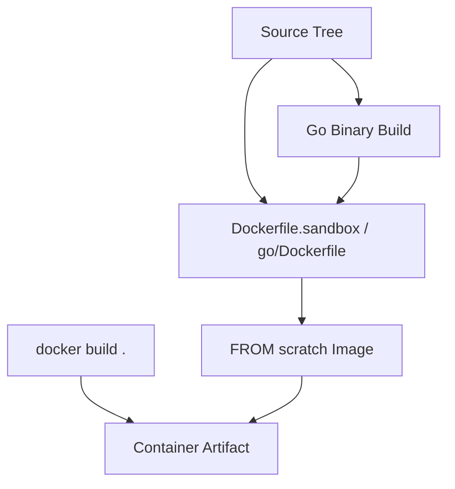
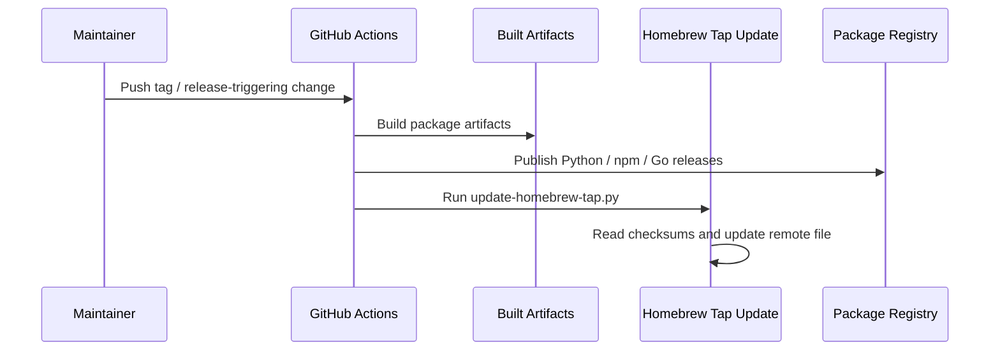

# Packaging, Build, and Release Workflows

This repository ships in multiple downstream formats, with a clear split between the Python CLI package, the Go-based implementation, and CI-driven release automation. The evidence in the repo shows build and publish paths for PyPI, npm, Homebrew, and containerized execution, plus local packaging commands for both ecosystems. This page stays anchored to the repository scripts and workflows that are present, without assuming any external release infrastructure.

## Release Artifacts

The repo contains two independently packaged user-facing distributions:

1. A Python package published from `pyproject.toml`
2. A JavaScript wrapper published from `package.json` / `bin/rekipedia.js`

The Python package exposes console entry points named `rekipedia` and `reki`, as recorded in the repository evidence:

```text
rekipedia = "rekipedia.cli:main"
reki = "rekipedia.cli:main"
```

That means the Python artifact is intended to be installed as a CLI application rather than a library-only dependency. The package metadata also records the canonical package name and version used in the test fixture evidence (`py_name: mini-py-repo`, `py_version: 0.0.1`), but those are fixture values and not release identifiers for the main project.

For the JavaScript side, the top-level `bin/rekipedia.js` script is the executable shim. It contains a `tryRun` function, indicating it is responsible for invoking the underlying CLI/runtime from the npm package.

The Go implementation has its own packaging and release surface under `go/`, including `go/cmd/rekipedia/main.go` and release metadata in `go/.goreleaser.yaml`. The presence of this file indicates the Go code is intended to be built and released as a standalone binary distribution. The Go build command evidence also shows an optimized binary build:

```bash
CGO_ENABLED=0 go build -ldflags "-s -w" -o /tmp/reki ./cmd/rekipedia
```

### Build output and publish-path summary

| Build Output | Source of Truth | Build Command / Config | Publishing or Update Path |
|---|---|---|---|
| Python wheel / sdist | `pyproject.toml`, `uv.lock` | `uv build`, `hatch build` | Published by `.github/workflows/python-release.yml` |
| npm package | `package.json`, `bin/rekipedia.js` | `npm run build  # tsc` | Published by `.github/workflows/npm-publish.yml` |
| Go binary release artifacts | `go/.goreleaser.yaml`, `go/cmd/rekipedia/main.go` | `CGO_ENABLED=0 go build ...` | Released by `.github/workflows/go-release.yml` |
| Homebrew tap formula/update | `.github/scripts/update-homebrew-tap.py` | Scripted update from dist checksums | Homebrew update workflow in CI/release path |
| Container image | `Dockerfile.sandbox`, `go/Dockerfile` | `docker build .` | Built as container artifact; no repo evidence of registry target |

> **Sources:** `pyproject.toml`; `package.json`; `bin/rekipedia.js` · `go/.goreleaser.yaml`; `go/cmd/rekipedia/main.go` · `go/install.sh`; `.github/workflows/python-release.yml`; `.github/workflows/npm-publish.yml`; `.github/workflows/go-release.yml`

## Container Builds

Container support is evidenced in two places: a top-level `Dockerfile.sandbox` and `go/Dockerfile`. The build command inventory includes a generic `docker build .`, and repository evidence for containerization explicitly states:

```text
docker_base: FROM scratch
```

That is an important packaging detail: the container image is intentionally minimal and starts from `scratch`, which implies the final image is expected to contain only the built binary and any required runtime assets. The repo does not provide evidence for runtime orchestration, multi-stage targets, or registry publishing destinations, so those should not be inferred.

The Go tree also includes `go/Dockerfile`, which strongly suggests the Go binary is intended to be packaged into a container image from the Go build outputs. However, the exact image tagging and push process is not visible in the analyzed data.

A practical reading of the repository evidence is:

- the project can be built into a container image locally via `docker build .`
- the image is likely designed to be small and self-contained because of the `FROM scratch` base
- container packaging is supported, but container registry publishing is not evidenced here



> **Sources:** `Dockerfile.sandbox`; `go/Dockerfile` · `docker_base: FROM scratch` · `build_commands: docker build .`

## Publish/Update Workflows

The repository has explicit CI workflow files for release publishing:

- `.github/workflows/python-release.yml`
- `.github/workflows/npm-publish.yml`
- `.github/workflows/go-release.yml`

It also includes CI workflows for validation rather than release:

- `.github/workflows/python-ci.yml`
- `.github/workflows/go-ci.yml`

The workflow trigger evidence states:

```text
ci_triggers: [push, pull_request]
```

This tells us that the repository’s main automated validation runs are attached to standard branch activity, while the release workflows are separate named files. The exact branching/tagging rules for those release workflows are not shown in the evidence, so the safe conclusion is only that the workflows exist and are dedicated to release publishing.

There is also a repository script that updates the Homebrew tap:

- `.github/scripts/update-homebrew-tap.py`

That script exposes three named functions: [`read_checksums_from_dist`](.github/scripts/update-homebrew-tap.py#L36), [`gh_get_sha`](.github/scripts/update-homebrew-tap.py#L58), and [`gh_put`](.github/scripts/update-homebrew-tap.py#L71). The function names are strongly indicative of a release-maintenance workflow that reads checksums from build artifacts and updates a remote tap file through GitHub API operations. Importantly, the evidence does not show a hardcoded tap repository or formula path, so we cannot say more than that it is used to update Homebrew-related metadata.

### Observed release/update flow



This is intentionally high-level because the repo does not expose the workflow internals in the provided evidence.

> **Sources:** `.github/workflows/python-release.yml`; `.github/workflows/npm-publish.yml`; `.github/workflows/go-release.yml`; `.github/scripts/update-homebrew-tap.py` · [`read_checksums_from_dist`](.github/scripts/update-homebrew-tap.py#L36) · [`gh_get_sha`](.github/scripts/update-homebrew-tap.py#L58) · [`gh_put`](.github/scripts/update-homebrew-tap.py#L71)

## Build Systems and Local Packaging Commands

The repository supports local packaging across several ecosystems. The build command inventory shows:

- `uv build`
- `hatch build`
- `npm run build  # tsc`
- `CGO_ENABLED=0 go build -ldflags "-s -w" -o /tmp/reki ./cmd/rekipedia`
- `docker build .`

That set is a strong signal that the project is polyglot and publishes different downstream artifacts from different build systems:

| Ecosystem | Primary Build Tooling | Observable Output |
|---|---|---|
| Python | `uv`, `hatch` | Wheel / sdist-style package build |
| Go | `go build`, GoReleaser | CLI binary release artifacts |
| Node/npm | `npm`, TypeScript compiler | npm package / executable wrapper |
| Containers | Docker | Minimal image artifact |

The Go directory mirrors this with its own `go/Makefile`, `go/install.sh`, and `go/README.md`, suggesting the Go implementation can be built and installed independently from the monorepo root. The top-level repository also includes a `Makefile`, which likely orchestrates local developer tasks, but the contents are not exposed in the analysis payload.

### Notes on evidence gaps

The repository clearly supports packaging and release, but it does **not** provide enough evidence to describe:

- exact tag names used for release automation
- registry endpoints for PyPI, npm, or container images
- Homebrew formula repository identifiers
- whether GoReleaser publishes archives, checksums, or signatures beyond what is implied by `go/.goreleaser.yaml`

Those details are intentionally omitted here to stay faithful to the source material.

> **Sources:** `Makefile`; `pyproject.toml`; `uv.lock`; `package.json`; `go/Makefile`; `go/install.sh`; `go/.goreleaser.yaml` · `build_commands: uv build`; `build_commands: hatch build`; `build_commands: npm run build  # tsc`; `build_commands: CGO_ENABLED=0 go build -ldflags "-s -w" -o /tmp/reki ./cmd/rekipedia`

## Downstream Distribution Topology

At a systems level, the project’s release story is layered:

- **Python CLI** is the primary package interface, exporting `rekipedia` and `reki`
- **npm wrapper** provides a Node-facing executable entry point via `bin/rekipedia.js`
- **Go binary** exists as a separate compiled deliverable in `go/`
- **Docker image** packages the binary into a minimal runtime
- **Homebrew tap** is updated via a dedicated script after artifact generation

This topology aligns with the repository’s multi-language support and its release artifacts. The same product can therefore be consumed by downstream users through package managers, direct binaries, or container images, depending on environment and preference.

> **Sources:** `pyproject.toml`; `package.json`; `bin/rekipedia.js`; `go/.goreleaser.yaml`; `.github/scripts/update-homebrew-tap.py`