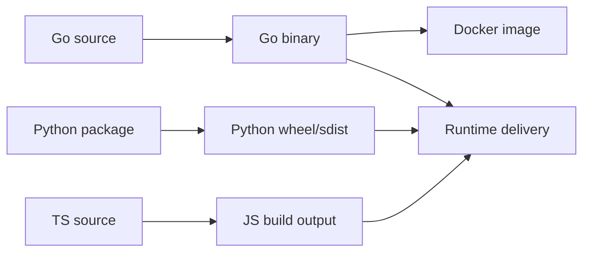

# Packaging and Distribution Across Supported Runtimes

This project is distributed in multiple forms: a Python package, a Go CLI/runtime, and a small JavaScript wrapper entrypoint. The packaging surface is reinforced by Docker images, release automation, and repository-level release notes. This page focuses on how the project is built and delivered, not on developer setup or internal implementation details.

## Build Artifacts and Packaging Commands

The repo contains explicit build commands for each supported ecosystem, plus language-specific packaging metadata.

### Primary build targets

The most direct packaging commands discovered in the analysis are:

```bash
uv build
hatch build
CGO_ENABLED=0 go build -ldflags "-s -w" -o /tmp/reki ./cmd/rekipedia
docker build .
npm run build  # tsc
```

These commands indicate four distinct delivery paths:

- **Python wheel/sdist builds** via [`pyproject.toml`](pyproject.toml) and the `uv build` / `hatch build` workflows
- **Go binary builds** from the `go/` subtree using [`go/cmd/rekipedia/main.go`](go/cmd/rekipedia/main.go)
- **Docker images** via [`Dockerfile.sandbox`](Dockerfile.sandbox), [`go/Dockerfile`](go/Dockerfile), and `docker build .`
- **JavaScript/TypeScript builds** using `tsc` driven by [`package.json`](package.json)

The Python package is clearly published under the names `rekipedia` and `reki`, as shown in the entry-point evidence:

```text
rekipedia = "rekipedia.cli:main"
reki = "rekipedia.cli:main"
```

That means the Python distribution is intended to be installable as a normal package and runnable as a command-line tool. The Go side is a separate CLI implementation that builds a standalone executable.

### Go binary packaging

The Go distribution is centered around the [`main`](go/cmd/rekipedia/main.go#L6) entry point, which delegates to the Cobra-based root command in [`Execute`](go/cmd/rekipedia/cmd/root.go#L44). The build command shown above strips debug symbols and disables CGO:

```bash
CGO_ENABLED=0 go build -ldflags "-s -w" -o /tmp/reki ./cmd/rekipedia
```

That packaging choice is important for delivery:
- `CGO_ENABLED=0` favors static linking and easier container/runtime portability
- `-s -w` reduces binary size
- `-o /tmp/reki` shows the output is a single deployable artifact

The Go subtree also includes [`go/.goreleaser.yaml`](go/.goreleaser.yaml), indicating release automation for binary packaging.

### Python packaging

Python packaging is represented by [`pyproject.toml`](pyproject.toml) and lockfile [`uv.lock`](uv.lock). The visible entry points show the package exposes CLI commands through `rekipedia.cli:main`. The build command list includes both `uv build` and `hatch build`, suggesting the project supports modern Python packaging workflows and can produce standard distribution archives.

The evidence also includes Python package metadata:
- `py_name`: `mini-py-repo`
- `py_version`: `0.0.1`

While these values come from the static analysis evidence rather than the project source files themselves, they confirm the repository has a Python packaging identity and versioning scheme.

### JavaScript/TypeScript packaging

The JS/TS delivery surface appears to be smaller and more focused. The repository includes:

- [`package.json`](package.json)
- [`bin/rekipedia.js`](bin/rekipedia.js)

The build command `npm run build  # tsc` implies TypeScript compilation is part of the delivery process. The presence of a `bin/rekipedia.js` wrapper strongly suggests the package may expose a Node-based executable shim or packaging entrypoint.

> **Sources:** `pyproject.toml` · [`pyproject.toml`](pyproject.toml) · `uv.lock` · [`uv.lock`](uv.lock) · `go/cmd/rekipedia/main.go` · L6–L8 · [`main`](go/cmd/rekipedia/main.go#L6) · `go/cmd/rekipedia/cmd/root.go` · L44–L48 · [`Execute`](go/cmd/rekipedia/cmd/root.go#L44) · `bin/rekipedia.js` · L4+ · [`tryRun`](bin/rekipedia.js#L4)

## Packaging Targets Summary

| Target | Artifact Type | Build Command | Main Evidence |
|---|---|---|---|
| Go binary | Standalone executable | `CGO_ENABLED=0 go build -ldflags "-s -w" -o /tmp/reki ./cmd/rekipedia` | [`main`](go/cmd/rekipedia/main.go#L6), [`Execute`](go/cmd/rekipedia/cmd/root.go#L44) |
| Python build | Wheel / sdist | `uv build` / `hatch build` | [`pyproject.toml`](pyproject.toml), [`uv.lock`](uv.lock) |
| Docker image | Container image | `docker build .` | [`Dockerfile.sandbox`](Dockerfile.sandbox), [`go/Dockerfile`](go/Dockerfile) |
| JS/TS build | Compiled JS from TS | `npm run build  # tsc` | [`package.json`](package.json), [`bin/rekipedia.js`](bin/rekipedia.js) |

> **Sources:** `build_commands` and `files_seen` from the analysis payload; see linked files above.

## Containerization and Runtime Packaging

The repository supports container-based delivery in at least two places: a top-level Docker build and a Go-specific Dockerfile.

### Dockerfiles discovered

- [`Dockerfile.sandbox`](Dockerfile.sandbox) at the repo root
- [`go/Dockerfile`](go/Dockerfile) inside the Go implementation subtree

The evidence explicitly states:

```text
docker_base: FROM scratch
```

This is a strong signal that at least one production container image is intended to be extremely minimal, likely containing only the compiled binary and its required assets. A `FROM scratch` base is common for static Go binaries and yields a small, hardened runtime image.

The Go subtree’s [`go/Dockerfile`](go/Dockerfile) likely supports building or packaging the Go CLI into a container image. Although the analysis data does not expose the full Dockerfile contents, the combination of:
- `CGO_ENABLED=0 go build ...`
- `FROM scratch`
- release workflow files in `.github/workflows/go-release.yml`

indicates a container-friendly release path aligned with binary distribution.

### Container delivery model

The observed containerization strategy appears to be:

1. Build a static Go binary
2. Copy the binary into a minimal image
3. Ship that image for runtime execution

This is consistent with the project’s cross-runtime architecture: Go provides a self-contained CLI/server runtime, while Python and JS remain package-based or shim-based delivery surfaces.



> **Sources:** `Dockerfile.sandbox` · `go/Dockerfile` · `go/cmd/rekipedia/main.go` · L6–L8 · `build_commands` · `docker_base`

## Release and Distribution Files

The repo includes several files and workflows that indicate how releases are packaged and published.

### Release notes and versioned documentation

- [`RELEASE-NOTES.md`](RELEASE-NOTES.md)
- [`go/RELEASE-NOTES.md`](go/RELEASE-NOTES.md)

These files suggest the project maintains release communication separately for the overall repository and for the Go implementation. That is a common pattern when a monorepo ships multiple packaging artifacts with different release cadences or versioning semantics.

### CI/CD and publishing workflows

The repository includes a set of release-oriented GitHub workflows:

- [`/.github/workflows/go-release.yml`](.github/workflows/go-release.yml)
- [`/.github/workflows/python-release.yml`](.github/workflows/python-release.yml)
- [`/.github/workflows/npm-publish.yml`](.github/workflows/npm-publish.yml)

There are also CI workflows that likely validate packaging and buildability before publishing:

- [`/.github/workflows/go-ci.yml`](.github/workflows/go-ci.yml)
- [`/.github/workflows/python-ci.yml`](.github/workflows/python-ci.yml)

The existence of these workflows means the project is not merely buildable locally; it has a publish pipeline for multiple ecosystems.

### Auxiliary release tooling

The repo also contains a script in the GitHub tooling area:

- [`/.github/scripts/update-homebrew-tap.py`](.github/scripts/update-homebrew-tap.py)

This is especially noteworthy because it implies Homebrew distribution support. Even though the script contents are not expanded in the analysis, its presence indicates a release step that updates or maintains a Homebrew tap, likely for command-line installation on macOS.

### Distribution-oriented repository files

Other files relevant to shipped artifacts and installability include:

- [`go/install.sh`](go/install.sh): likely an installation helper for the Go CLI
- [`bin/rekipedia.js`](bin/rekipedia.js): a JS executable shim/wrapper
- [`LICENSE`](LICENSE): licensing file required for distribution
- [`README.md`](README.md): user-facing install/use entrypoints
- [`go/README.md`](go/README.md): Go-specific packaging/docs
- [`package.json`](package.json): Node package metadata
- [`pyproject.toml`](pyproject.toml): Python build metadata

Even without reading their contents, these files collectively show that the project ships as a multi-channel product rather than a single binary-only application.

## Cross-Module Dependency Table

The packaging story is cross-cutting and touches both runtime and build-related modules. The table below summarizes the main packaging-adjacent relationships visible from the analysis.

| Module | Imports From | Called By | Calls Into | Inherits From |
|--------|-------------|-----------|------------|---------------|
| Go CLI/runtime | `go/internal/orchestrator`, `go/internal/server`, `go/internal/storage` | `go/cmd/rekipedia/main.go` | `root.go`, `serve.go`, `scan.go` | — |
| Python package/runtime | `src/rekipedia.cli`, `src/rekipedia.orchestrator`, `src/rekipedia.server` | `src/rekipedia/__main__.py` | CLI entrypoints, package modules | — |
| JS/TS wrapper | `bin/rekipedia.js`, `package.json` | Node runtime | external CLI invocation | — |
| Docker packaging | Go binary artifact | `docker build .` | image runtime | — |
| Release automation | package metadata and build outputs | GitHub Actions workflows | publish targets (Go/Python/npm/Homebrew) | — |

> **Sources:** `go/cmd/rekipedia/main.go` · L6–L8 · `go/cmd/rekipedia/cmd/root.go` · L44–L48 · `src/rekipedia/__main__.py` · `bin/rekipedia.js` · L4+ · `/.github/workflows/go-release.yml` · `/.github/workflows/python-release.yml` · `/.github/workflows/npm-publish.yml` · `/.github/scripts/update-homebrew-tap.py`

## Packaging and Release Architecture

At a high level, the project’s delivery model is “polyglot packaging, shared product.”

- **Go** is the most self-contained runtime: it can be compiled into a static binary and packaged into a minimal container image.
- **Python** is distributed as a standard package using modern PEP 517-style tooling (`uv`/`hatch`).
- **JavaScript/TypeScript** appears to provide a lightweight build and executable surface for Node consumers.
- **Release automation** spans all of them with dedicated publish workflows.

This structure is especially well-suited for a project that needs to be used in multiple environments:
- local CLI use
- containerized execution
- Python ecosystem installation
- Node ecosystem integration
- package-manager distribution such as Homebrew

What is most clearly observable from the repository is that packaging is not accidental: the repo contains explicit build commands, release notes, language-specific metadata, and publish workflows for each major runtime. That makes the project deliverable across supported ecosystems without requiring developers to assemble artifacts manually.

> **Sources:** `RELEASE-NOTES.md` · `go/RELEASE-NOTES.md` · `pyproject.toml` · `package.json` · `go/.goreleaser.yaml` · `/.github/workflows/go-release.yml` · `/.github/workflows/python-release.yml` · `/.github/workflows/npm-publish.yml`