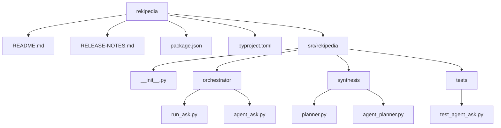

# Project Overview

## What is this project?

[`rekipedia`](src/rekipedia/__init__.py#L1) is a repository-aware documentation and Q&A system that builds a knowledge store from a codebase and then answers questions grounded in that stored context. The top-level orchestration lives in [`rekipedia.orchestrator.run_ask`](src/rekipedia/orchestrator/run_ask.py#L1) and [`rekipedia.orchestrator.agent_ask`](src/rekipedia/orchestrator/agent_ask.py#L1), while wiki-planning logic is implemented in [`rekipedia.synthesis.planner`](src/rekipedia/synthesis/planner.py#L1) and its agentic variant [`rekipedia.synthesis.agent_planner`](src/rekipedia/synthesis/agent_planner.py#L1).

At a high level, the project solves a practical problem: it turns a scanned repository into a searchable documentation store, then uses that store to answer free-text questions with file/page/symbol grounding. The ask path is designed to work in two modes: a standard grounded Q&A flow via [`run_ask(question, repo_root, output_dir, llm_config, history)`](src/rekipedia/orchestrator/run_ask.py#L334) and an agentic ReAct-style flow via [`agent_run_ask(question, repo_root, output_dir, llm_config, history)`](src/rekipedia/orchestrator/agent_ask.py#L371). The latter is encapsulated in [`AgentAsk`](src/rekipedia/orchestrator/agent_ask.py#L253), which explicitly documents itself as a “ReAct agentic loop for answering codebase questions.”

The synthesis side mirrors this design. [`PlannerAgent`](src/rekipedia/synthesis/planner.py#L180) constructs a wiki structure in one LLM call, while [`AgentPlanner`](src/rekipedia/synthesis/agent_planner.py#L144) provides a tool-calling, iterative planner for the same `WikiPlan` output type. This makes the project useful not only as a Q&A assistant, but as a wiki-generation pipeline for complex repositories.

> **Sources:** `src/rekipedia/__init__.py` · L1 · [`rekipedia.__init__`](src/rekipedia/__init__.py#L1)  
> `src/rekipedia/orchestrator/run_ask.py` · L1–L377 · [`rekipedia.orchestrator.run_ask`](src/rekipedia/orchestrator/run_ask.py#L1), [`run_ask`](src/rekipedia/orchestrator/run_ask.py#L334)  
> `src/rekipedia/orchestrator/agent_ask.py` · L1–L382 · [`rekipedia.orchestrator.agent_ask`](src/rekipedia/orchestrator/agent_ask.py#L1), [`AgentAsk`](src/rekipedia/orchestrator/agent_ask.py#L253), [`agent_run_ask`](src/rekipedia/orchestrator/agent_ask.py#L371)  
> `src/rekipedia/synthesis/planner.py` · L1–L495 · [`rekipedia.synthesis.planner`](src/rekipedia/synthesis/planner.py#L1), [`PlannerAgent`](src/rekipedia/synthesis/planner.py#L180), [`WikiPlan`](src/rekipedia/synthesis/planner.py#L138)  
> `src/rekipedia/synthesis/agent_planner.py` · L1–L295 · [`rekipedia.synthesis.agent_planner`](src/rekipedia/synthesis/agent_planner.py#L1), [`AgentPlanner`](src/rekipedia/synthesis/agent_planner.py#L144)

## Who is it for?

`rekipedia` is aimed at developers, technical writers, and maintainers who need to understand or document a codebase quickly. The presence of both direct and agentic ask/planning paths suggests it is especially useful for teams that want automated repository Q&A and structured wiki generation over the same knowledge base.

Typical use cases inferred from the implementation include:

- Repository question answering: ask about symbols, pages, relationships, and code chunks through [`_ToolHandler`](src/rekipedia/orchestrator/agent_ask.py#L141) and [`run_ask`](src/rekipedia/orchestrator/run_ask.py#L334).
- Documentation synthesis: generate a structured wiki plan from repository analysis via [`PlannerAgent.plan`](src/rekipedia/synthesis/planner.py#L186) or [`AgentPlanner.plan`](src/rekipedia/synthesis/agent_planner.py#L155).
- Interactive investigation: use the agentic loop in [`AgentAsk.run`](src/rekipedia/orchestrator/agent_ask.py#L275) to let the model choose tools such as `search_code`, `get_symbol`, `get_page`, and `get_relationships`.
- Automation and regression testing: the test module [`tests/test_agent_ask.py`](tests/test_agent_ask.py#L1) exercises tool handling, fallbacks, planner behavior, and the environment-variable switch for agent mode.

The package metadata in `package.json` and the Python project metadata in `pyproject.toml` indicate this is a distributable package named `rekipedia` at version `0.13.0`, with CLI entry points configured for end users.

> **Sources:** `tests/test_agent_ask.py` · L1–L303 · [`tests.test_agent_ask`](tests/test_agent_ask.py#L1)  
> `src/rekipedia/orchestrator/agent_ask.py` · L141–L382 · [`_ToolHandler`](src/rekipedia/orchestrator/agent_ask.py#L141), [`AgentAsk.run`](src/rekipedia/orchestrator/agent_ask.py#L275)  
> `src/rekipedia/synthesis/planner.py` · L138–L495 · [`PlannerAgent.plan`](src/rekipedia/synthesis/planner.py#L186)  
> `src/rekipedia/synthesis/agent_planner.py` · L144–L295 · [`AgentPlanner.plan`](src/rekipedia/synthesis/agent_planner.py#L155)

## Key Features

- Grounded Q&A over repository artifacts through [`run_ask`](src/rekipedia/orchestrator/run_ask.py#L334), which validates scan availability, builds a context-rich system prompt, and invokes the LLM client.
- Agentic tool use in [`AgentAsk`](src/rekipedia/orchestrator/agent_ask.py#L253), allowing the model to iterate over tools and optionally fall back to single-shot behavior if tool calling is unavailable.
- Repository search and symbol lookup through [`_ToolHandler.search_code`](src/rekipedia/orchestrator/agent_ask.py#L160), [`_ToolHandler.get_symbol`](src/rekipedia/orchestrator/agent_ask.py#L173), and [`_ToolHandler.get_page`](src/rekipedia/orchestrator/agent_ask.py#L189).
- Relationship inspection via [`_ToolHandler.get_relationships`](src/rekipedia/orchestrator/agent_ask.py#L208), which consults [`SqliteStore`](src/rekipedia/orchestrator/run_ask.py#L1) data to answer dependency questions.
- Wiki planning through two implementations: [`PlannerAgent`](src/rekipedia/synthesis/planner.py#L180) for single-shot planning and [`AgentPlanner`](src/rekipedia/synthesis/agent_planner.py#L144) for tool-calling planning.
- A structured plan abstraction in [`WikiPlan`](src/rekipedia/synthesis/planner.py#L138), including helpers such as [`get_page`](src/rekipedia/synthesis/planner.py#L166) and [`get_section_for`](src/rekipedia/synthesis/planner.py#L169).
- Heuristic fallbacks for resilience, including [`_default_plan`](src/rekipedia/synthesis/planner.py#L400) and the fallback logic in [`AgentAsk.run`](src/rekipedia/orchestrator/agent_ask.py#L275).
- Tested integration behavior, including direct-answer mode, tool-call mode, max-iteration behavior, planner fallback, and `REKIPEDIA_AGENT_ASK` delegation in [`tests/test_agent_ask.py`](tests/test_agent_ask.py#L112).

> **Sources:** `src/rekipedia/orchestrator/run_ask.py` · L334–L377 · [`run_ask`](src/rekipedia/orchestrator/run_ask.py#L334), [`stream_ask`](src/rekipedia/orchestrator/run_ask.py#L364)  
> `src/rekipedia/orchestrator/agent_ask.py` · L141–L382 · [`_ToolHandler.search_code`](src/rekipedia/orchestrator/agent_ask.py#L160), [`_ToolHandler.get_symbol`](src/rekipedia/orchestrator/agent_ask.py#L173), [`_ToolHandler.get_page`](src/rekipedia/orchestrator/agent_ask.py#L189), [`_ToolHandler.get_relationships`](src/rekipedia/orchestrator/agent_ask.py#L208), [`AgentAsk.run`](src/rekipedia/orchestrator/agent_ask.py#L275)  
> `src/rekipedia/synthesis/planner.py` · L138–L495 · [`WikiPlan`](src/rekipedia/synthesis/planner.py#L138), [`PlannerAgent`](src/rekipedia/synthesis/planner.py#L180), [`_default_plan`](src/rekipedia/synthesis/planner.py#L400)  
> `src/rekipedia/synthesis/agent_planner.py` · L144–L295 · [`AgentPlanner`](src/rekipedia/synthesis/agent_planner.py#L144)

## Quick Start

The repository exposes packaged entry points `rekipedia = "rekipedia.cli:main"` and `reki = "rekipedia.cli:main"` in the project metadata, so the quickest path is to install the project and invoke either command. The analysis data also shows the primary build command is `uv build`, and the test suite is run with `pytest`.

A practical start sequence is:

```bash
uv sync
uv build
pytest
```

If you want to run the CLI, use whichever entry point your environment installs:

```bash
rekipedia --help
# or
reki --help
```

If the project is used in agentic question-answer mode, the important runtime path is the ask API rather than a separate executable function list. The implementation makes the environment variable `REKIPEDIA_AGENT_ASK=1` a switch that causes [`run_ask`](src/rekipedia/orchestrator/run_ask.py#L334) to delegate to [`agent_run_ask`](src/rekipedia/orchestrator/agent_ask.py#L371); this behavior is explicitly covered by [`test_run_ask_uses_agent_when_env_set`](tests/test_agent_ask.py#L283).

> **Sources:** `package.json` · entry points in `evidence.entry_points`  
> `pyproject.toml` · project metadata and packaging configuration  
> `src/rekipedia/orchestrator/run_ask.py` · L334–L377 · [`run_ask`](src/rekipedia/orchestrator/run_ask.py#L334), [`stream_ask`](src/rekipedia/orchestrator/run_ask.py#L364)  
> `src/rekipedia/orchestrator/agent_ask.py` · L371–L382 · [`agent_run_ask`](src/rekipedia/orchestrator/agent_ask.py#L371)  
> `tests/test_agent_ask.py` · L283–L303 · [`test_run_ask_uses_agent_when_env_set`](tests/test_agent_ask.py#L283)

## Project Structure



The repository is organized around two primary capability clusters: orchestration and synthesis. The orchestration layer contains the ask workflows (`run_ask.py` and `agent_ask.py`), while the synthesis layer contains wiki planning (`planner.py` and `agent_planner.py`). Test coverage in the provided analysis snapshot centers on [`tests/test_agent_ask.py`](tests/test_agent_ask.py#L1), suggesting the agentic ask and planner paths are important integration points.

> **Sources:** `README.md`  
> `RELEASE-NOTES.md`  
> `package.json`  
> `pyproject.toml`  
> `src/rekipedia/__init__.py` · L1 · [`rekipedia.__init__`](src/rekipedia/__init__.py#L1)  
> `src/rekipedia/orchestrator/run_ask.py` · L1–L377 · [`rekipedia.orchestrator.run_ask`](src/rekipedia/orchestrator/run_ask.py#L1)  
> `src/rekipedia/orchestrator/agent_ask.py` · L1–L382 · [`rekipedia.orchestrator.agent_ask`](src/rekipedia/orchestrator/agent_ask.py#L1)  
> `src/rekipedia/synthesis/planner.py` · L1–L495 · [`rekipedia.synthesis.planner`](src/rekipedia/synthesis/planner.py#L1)  
> `src/rekipedia/synthesis/agent_planner.py` · L1–L295 · [`rekipedia.synthesis.agent_planner`](src/rekipedia/synthesis/agent_planner.py#L1)  
> `tests/test_agent_ask.py` · L1–L303 · [`tests.test_agent_ask`](tests/test_agent_ask.py#L1)

## How it Works (High Level)

The standard answer flow starts in [`run_ask`](src/rekipedia/orchestrator/run_ask.py#L334), which first calls [`_prepare_ask`](src/rekipedia/orchestrator/run_ask.py#L310) to validate that a successful scan exists via [`_verify_scan`](src/rekipedia/orchestrator/run_ask.py#L37), then builds a context-rich prompt with [`_build_full_system`](src/rekipedia/orchestrator/run_ask.py#L208). That prompt is assembled from wiki pages, symbol metadata, relationship data from [`SqliteStore`](src/rekipedia/orchestrator/run_ask.py#L1), and optional RAG chunks from [`_rag_chunks`](src/rekipedia/orchestrator/run_ask.py#L86). If the environment enables agent mode, `run_ask` delegates to [`agent_run_ask`](src/rekipedia/orchestrator/agent_ask.py#L371), which constructs an [`AgentAsk`](src/rekipedia/orchestrator/agent_ask.py#L253) instance and runs a ReAct loop over tools managed by [`_ToolHandler`](src/rekipedia/orchestrator/agent_ask.py#L141).

On the synthesis side, [`PlannerAgent.plan`](src/rekipedia/synthesis/planner.py#L186) and [`AgentPlanner.plan`](src/rekipedia/synthesis/agent_planner.py#L155) both transform repository analysis into a [`WikiPlan`](src/rekipedia/synthesis/planner.py#L138). The planner code includes a heuristic fallback in [`_default_plan`](src/rekipedia/synthesis/planner.py#L400), ensuring the system can still produce a usable structure when the LLM call fails.

> **Sources:** `src/rekipedia/orchestrator/run_ask.py` · L37–L377 · [`_verify_scan`](src/rekipedia/orchestrator/run_ask.py#L37), [`_build_full_system`](src/rekipedia/orchestrator/run_ask.py#L208), [`_prepare_ask`](src/rekipedia/orchestrator/run_ask.py#L310), [`run_ask`](src/rekipedia/orchestrator/run_ask.py#L334)  
> `src/rekipedia/orchestrator/agent_ask.py` · L141–L382 · [`_ToolHandler`](src/rekipedia/orchestrator/agent_ask.py#L141), [`AgentAsk`](src/rekipedia/orchestrator/agent_ask.py#L253), [`agent_run_ask`](src/rekipedia/orchestrator/agent_ask.py#L371)  
> `src/rekipedia/synthesis/planner.py` · L138–L495 · [`WikiPlan`](src/rekipedia/synthesis/planner.py#L138), [`PlannerAgent.plan`](src/rekipedia/synthesis/planner.py#L186), [`_default_plan`](src/rekipedia/synthesis/planner.py#L400)  
> `src/rekipedia/synthesis/agent_planner.py` · L144–L295 · [`AgentPlanner.plan`](src/rekipedia/synthesis/agent_planner.py#L155)