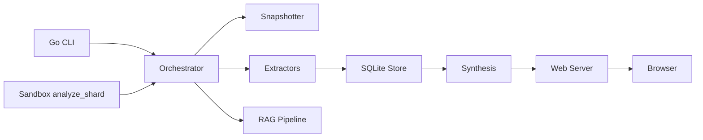

# Overview

## What It Is

This repository contains **Rekipedia**, a developer-focused codebase intelligence tool that scans repositories, extracts symbols and relationships, analyzes architecture and refactoring risks, and publishes the results as searchable wiki pages and other outputs. The project supports both the current Python implementation under `src/rekipedia/` and a Go rewrite under `go/`, with the same overall product shape: analyze a repository, store structured results, synthesize documentation, and expose it through CLI and web interfaces.

In practical terms, Rekipedia is for engineers who need to understand a large or unfamiliar codebase quickly: tech leads, platform engineers, maintainers, and reviewers looking for dependency maps, knowledge gaps, and refactor candidates. The primary user workflows are: scanning a repository, generating analysis artifacts, querying via an ask/search experience, and serving the results in a local web app.

The main CLI entry point for the Go implementation is [`main`](go/cmd/rekipedia/main.go#L6), which delegates execution to the Cobra root command in [`Execute`](go/cmd/rekipedia/cmd/root.go#L44). The sandbox analysis entry point is [`src/rekipedia/sandbox/tasks/analyze_shard.py`](src/rekipedia/sandbox/tasks/analyze_shard.py), which is used for shard-based analysis work.

## Key Features

Rekipedia’s feature set is broad, but the landing-page view is simple:

- **Repository scanning and snapshotting**: collects file manifests and language-aware metadata through the orchestrator and snapshotter path such as [`Snapshotter`](go/internal/orchestrator/snapshotter.go#L57) and [`RunUpdate`](go/internal/orchestrator/run_update.go#L30).
- **Symbol and relationship extraction**: language-specific extractors for Go, Python, TypeScript, and configuration files are implemented in modules like [`GoExtractor`](go/internal/extractor/golang.go#L16), [`PythonExtractor`](go/internal/extractor/python.go#L25), and [`TypeScriptExtractor`](go/internal/extractor/typescript.go#L25).
- **Wiki synthesis**: page and diagram generation are handled by [`PageBuilder`](go/internal/synthesis/page_builder.go#L60) and [`DiagramBuilder`](go/internal/synthesis/diagram_builder.go#L16).
- **Interactive querying**: the ask workflow is exposed through [`RunAsk`](go/internal/orchestrator/run_ask.go#L59) and the CLI command under `go/cmd/rekipedia/cmd/ask.go`.
- **Local web server**: the server in [`Server`](go/internal/server/server.go#L35) renders wiki pages, graphs, and API endpoints.
- **Storage-backed history**: SQLite persistence in [`Store`](go/internal/storage/store.go#L18) keeps runs, symbols, relationships, wiki pages, QA history, and manifests.

At a higher level, the repo is structured to support both **offline analysis** and **interactive consumption** of the results.

> **Sources:** `go/cmd/rekipedia/main.go` · L6–L8 · [`main`](go/cmd/rekipedia/main.go#L6); `go/cmd/rekipedia/cmd/root.go` · L44–L48 · [`Execute`](go/cmd/rekipedia/cmd/root.go#L44); `src/rekipedia/sandbox/tasks/analyze_shard.py` · entry point; `go/internal/orchestrator/snapshotter.go` · L57–L86 · [`Snapshotter`](go/internal/orchestrator/snapshotter.go#L57); `go/internal/orchestrator/run_update.go` · L30–L179 · [`RunUpdate`](go/internal/orchestrator/run_update.go#L30); `go/internal/extractor/golang.go` · L16–L134 · [`GoExtractor`](go/internal/extractor/golang.go#L16); `go/internal/extractor/python.go` · L25–L135 · [`PythonExtractor`](go/internal/extractor/python.go#L25); `go/internal/extractor/typescript.go` · L25–L141 · [`TypeScriptExtractor`](go/internal/extractor/typescript.go#L25); `go/internal/synthesis/page_builder.go` · L60–L133 · [`PageBuilder`](go/internal/synthesis/page_builder.go#L60); `go/internal/synthesis/diagram_builder.go` · L16–L36 · [`DiagramBuilder`](go/internal/synthesis/diagram_builder.go#L16); `go/internal/orchestrator/run_ask.go` · L59–L156 · [`RunAsk`](go/internal/orchestrator/run_ask.go#L59); `go/internal/server/server.go` · L35–L96 · [`Server`](go/internal/server/server.go#L35); `go/internal/storage/store.go` · L18–L45 · [`Store`](go/internal/storage/store.go#L18)

## Quick Start

The repository supports multiple build paths, but for most contributors the fastest way to validate the Go CLI is:

```bash
# Build the Go CLI
CGO_ENABLED=0 go build -ldflags "-s -w" -o /tmp/reki ./cmd/rekipedia

# Optionally build packaged artifacts
uv build
hatch build
npm run build  # tsc
```

For a local run, use the compiled binary after building:

```bash
/tmp/reki --help
```

If you are working in the Python packaging or release path, the repository also includes `uv build` and `hatch build` in the available build commands, and the JavaScript shim lives in `bin/rekipedia.js`.

A typical developer workflow is:

1. Build the CLI.
2. Scan or update a repository.
3. Start the web server to inspect generated pages.
4. Use ask/search to interrogate the indexed codebase.

The Go command tree is rooted at [`Execute`](go/cmd/rekipedia/cmd/root.go#L44), while the main analysis entry for shard-based sandbox execution is [`analyze_shard.py`](src/rekipedia/sandbox/tasks/analyze_shard.py).

> **Sources:** `go/cmd/rekipedia/cmd/root.go` · L44–L48 · [`Execute`](go/cmd/rekipedia/cmd/root.go#L44); `go/cmd/rekipedia/main.go` · L6–L8 · [`main`](go/cmd/rekipedia/main.go#L6); `src/rekipedia/sandbox/tasks/analyze_shard.py` · entry point; `bin/rekipedia.js` · `tryRun`; build commands from analysis data

## Repository Map

The top-level layout shows two primary implementation areas plus supporting docs, pipelines, and fixtures.

```text
.
├── go/                     # Go CLI, analysis engine, web server, storage, and synthesis pipeline
├── src/rekipedia/          # Python package with CLI, analysis, orchestrator, server, and sandbox code
├── tests/                  # Cross-language test suite and fixture repositories
├── docs/                   # Product and planning documentation
├── pipelines/              # Harness and CI pipeline definitions
├── scripts/                # Utility scripts for linting/reporting
├── schemas/                # JSON schema definitions for analysis outputs
├── skills/                 # Harness/shared operating guidance
├── .github/                # Workflow automation and contribution instructions
├── bin/rekipedia.js        # JavaScript wrapper / launcher shim
├── Makefile                # Root build and task entrypoint
├── package.json            # Node package metadata and build script
├── pyproject.toml          # Python project configuration
└── uv.lock                 # Python dependency lockfile
```

A few practical waypoints:

- `go/cmd/rekipedia/` contains the CLI entrypoint and subcommands.
- `go/internal/` contains most of the Go implementation for extraction, orchestration, storage, RAG, server, and synthesis.
- `src/rekipedia/cli/` mirrors the command surface in Python.
- `src/rekipedia/sandbox/` contains the shard analysis runtime used by the sandbox entry point.
- `tests/fixtures/` holds small repositories that exercise the language extraction and workflow paths.

This map intentionally stays high-level; it is meant to help new contributors orient themselves without duplicating the deeper repository-structure documentation.

> **Sources:** `go/cmd/rekipedia/main.go` · L6–L8 · [`main`](go/cmd/rekipedia/main.go#L6); `src/rekipedia/sandbox/tasks/analyze_shard.py` · entry point; `bin/rekipedia.js` · `tryRun`; top-level files and directories from `files_seen`

## Architecture at a Glance

At a conceptual level, Rekipedia follows a pipeline:

1. **CLI or sandbox entry point** starts a run.
2. **Orchestrator** coordinates snapshotting, sharding, extraction, and downstream generation.
3. **Analysis and RAG layers** build searchable metadata and embeddings.
4. **Storage** persists runs, symbols, relationships, pages, and history.
5. **Synthesis and server** turn structured data into wiki pages, diagrams, and interactive views.



The Go implementation makes these boundaries especially visible: command handling lives in `go/cmd/rekipedia/cmd/`, orchestration in `go/internal/orchestrator/`, extraction in `go/internal/extractor/`, persistence in `go/internal/storage/`, and display logic in `go/internal/server/`. The Python package mirrors the same product shape under `src/rekipedia/`, which is helpful for the sandbox and language-agnostic workflows.

For new developers, the most important mental model is that Rekipedia is **not just a CLI** and **not just a website**. It is an end-to-end analysis system that converts source repositories into structured knowledge products.

> **Sources:** `go/internal/orchestrator/run_update.go` · L30–L179 · [`RunUpdate`](go/internal/orchestrator/run_update.go#L30); `go/internal/orchestrator/snapshotter.go` · L57–L147 · [`Snapshotter`](go/internal/orchestrator/snapshotter.go#L57); `go/internal/extractor/extractor.go` · L11–L68 · [`Extractor`](go/internal/extractor/extractor.go#L11), [`Registry`](go/internal/extractor/extractor.go#L19); `go/internal/storage/store.go` · L18–L335 · [`Store`](go/internal/storage/store.go#L18); `go/internal/synthesis/page_builder.go` · L60–L133 · [`PageBuilder`](go/internal/synthesis/page_builder.go#L60); `go/internal/server/server.go` · L35–L96 · [`Server`](go/internal/server/server.go#L35); `src/rekipedia/sandbox/tasks/analyze_shard.py` · entry point