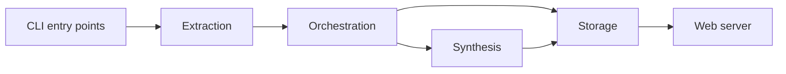

# Overview

## What it is

Rekipedia is a developer tool for turning source repositories into navigable, searchable documentation and analysis outputs. The project includes a Python package under `src/rekipedia`, a Go implementation under `go/`, and supporting scripts, workflows, and fixtures for testing across languages and packaging targets. At a high level, it can scan code, extract symbols and relationships, generate wiki pages and diagrams, persist results in storage, and expose the content through a server and command-line entry points such as [`main`](go/cmd/rekipedia/main.go#L6) and the Python package entry point in `src/rekipedia/__main__.py`.  

The repository clearly supports multiple workflows: build/package, analysis, export, and serving content. The presence of `README.md`, `CONTRIBUTING.md`, `docs/`, `tests/`, and the Go and Python source trees indicates it is intended both as an end-user tool and as a maintained engineering project.

> **Sources:** `README.md`; `go/cmd/rekipedia/main.go` · L6–L8 · [`main`](go/cmd/rekipedia/main.go#L6); `src/rekipedia/__main__.py`

## Key Features

### Multi-language extraction and analysis

The codebase contains extractors for several languages and config files. In the Go implementation, the extractor registry is defined around [`Extractor`](go/internal/extractor/extractor.go#L11) and [`NewRegistry`](go/internal/extractor/extractor.go#L24), with concrete extractors for Go, Python, and TypeScript such as [`(e *GoExtractor).Extract`](go/internal/extractor/golang.go#L27), [`(e *PythonExtractor).Extract`](go/internal/extractor/python.go#L37), and [`(e *TypeScriptExtractor).Extract`](go/internal/extractor/typescript.go#L40). The Python side mirrors this with modules like `src/rekipedia/extractors/go_extractor.py`, `python_extractor.py`, and `typescript_extractor.py`.

### Wiki generation and synthesis

The system can turn analysis into wiki pages and diagrams through synthesis components like [`PageBuilder`](go/internal/synthesis/page_builder.go#L60), [`DiagramBuilder`](go/internal/synthesis/diagram_builder.go#L16), and [`PlannerAgent`](go/internal/synthesis/planner.go#L77). This is reinforced by the server templates in `go/internal/server/templates/` and `src/rekipedia/server/templates/`, which indicate a rendered documentation experience rather than just raw JSON output.

### Search, RAG, and LLM-assisted workflows

The project includes retrieval and generation support via [`EmbedPipeline`](go/internal/rag/embedder.go#L15), [`VectorStore`](go/internal/rag/vector_store.go#L15), and the LLM client [`Client`](go/internal/llm/client.go#L110). Higher-level orchestration lives in [`RunAsk`](go/internal/orchestrator/run_ask.go#L59), [`RunDigest`](go/internal/orchestrator/run_digest.go#L48), and [`RunUpdate`](go/internal/orchestrator/run_update.go#L30), showing that the tool can answer questions, synthesize digests, and update repository knowledge.

### Storage and web serving

Persistent state is handled by [`Store`](go/internal/storage/store.go#L18), with API and HTML delivery through [`Server`](go/internal/server/server.go#L35) and handlers like [`(s *Server).handleWikiPage`](go/internal/server/server.go#L147) and [`(s *Server).handleAPIGraph`](go/internal/server/server.go#L649). This suggests a complete loop from codebase analysis to indexed, browsable output.

> **Sources:** `go/internal/extractor/extractor.go` · L11–L68 · [`Extractor`](go/internal/extractor/extractor.go#L11) · [`NewRegistry`](go/internal/extractor/extractor.go#L24); `go/internal/synthesis/page_builder.go` · L60–L239 · [`PageBuilder`](go/internal/synthesis/page_builder.go#L60); `go/internal/rag/embedder.go` · L15–L84 · [`EmbedPipeline`](go/internal/rag/embedder.go#L15); `go/internal/storage/store.go` · L18–L335 · [`Store`](go/internal/storage/store.go#L18)

## Quick Start

The repository shows multiple supported build paths, but the primary ones visible in the analysis are Go and Python packaging workflows. For a first-time developer, the fastest way to validate the Go toolchain is:

```bash
CGO_ENABLED=0 go build -ldflags "-s -w" -o /tmp/reki ./cmd/rekipedia
```

If you are working from the Python package, the repository also supports:

```bash
uv build
```

For a first run, the clearest entry point in the codebase is the Go CLI executable built from [`main`](go/cmd/rekipedia/main.go#L6). After building the binary, run it directly:

```bash
/tmp/reki
```

If you are using the Python entry point instead, the package is wired through `src/rekipedia/__main__.py`, so the equivalent first run is:

```bash
python -m rekipedia
```

These commands are intentionally minimal here; detailed flags and subcommands are documented on the deeper CLI and architecture pages.

| Purpose | Command |
|---|---|
| Build Go binary | `CGO_ENABLED=0 go build -ldflags "-s -w" -o /tmp/reki ./cmd/rekipedia` |
| Build Python package | `uv build` |
| First run Go CLI | `/tmp/reki` |
| First run Python entry point | `python -m rekipedia` |

> **Sources:** `go/cmd/rekipedia/main.go` · L6–L8 · [`main`](go/cmd/rekipedia/main.go#L6); `uv.lock`; `pyproject.toml`; `go/go.mod`

## Repository Map

Top-level layout, grouped for a quick orientation:

```text
.
├── .github/
├── docs/
├── go/
├── pipelines/
├── scripts/
├── skills/
├── src/
├── tests/
├── package.json
├── pyproject.toml
├── uv.lock
├── Makefile
└── README.md
```

### What each area is for

- `.github/` — CI/workflow definitions and contributor guidance.
- `docs/` — planning and design documents.
- `go/` — the Go implementation, including CLI, internal packages, and release/build assets.
- `src/rekipedia/` — the Python package implementation.
- `tests/` — automated tests and fixtures for both Python and TypeScript-style sample repositories.
- `pipelines/` — harness and delivery pipeline definitions.
- `scripts/` — utility scripts such as lint/report helpers.
- `skills/` — operational and workflow guidance used by the repo.
- `package.json`, `pyproject.toml`, `uv.lock`, `Makefile` — top-level build and packaging entry points.

> **Sources:** `files_seen` list; `go/README.md`; `README.md`; `pyproject.toml`; `package.json`; `Makefile`

## Architecture at a Glance

Rekipedia is organized as a pipeline: repository content is extracted, normalized into models, analyzed and enriched, then persisted and rendered through exports or a web server. The main architectural layers are visible in the Go implementation around extraction (`go/internal/extractor`), orchestration (`go/internal/orchestrator`), synthesis (`go/internal/synthesis`), persistence (`go/internal/storage`), retrieval (`go/internal/rag`), and serving (`go/internal/server`). If you want the deeper breakdown, see the dedicated architecture pages for module relationships, core modules, and algorithms; this landing page only establishes the path from source tree to generated wiki.

A useful mental model is:



For a first-time developer, the main next step is to read the architecture pages that explain these modules in detail rather than trying to infer everything from the repository root.

> **Sources:** `go/internal/extractor/extractor.go` · L11–L68 · [`Extractor`](go/internal/extractor/extractor.go#L11); `go/internal/orchestrator/run_digest.go` · L48–L396 · [`RunDigest`](go/internal/orchestrator/run_digest.go#L48); `go/internal/synthesis/page_builder.go` · L60–L266 · [`PageBuilder`](go/internal/synthesis/page_builder.go#L60); `go/internal/storage/store.go` · L18–L335 · [`Store`](go/internal/storage/store.go#L18); `go/internal/server/server.go` · L35–L955 · [`Server`](go/internal/server/server.go#L35)