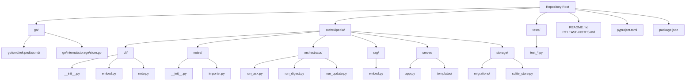

# Project Overview

## What is this project?

`rekipedia` is an agentic “repo-to-wiki” knowledge store: it scans a source repository, extracts symbols and relationships, synthesizes wiki pages, and stores everything in a local database for later querying. The project is centered around the Python entry point [`main`](src/rekipedia/cli/__init__.py#L26) exposed as the console scripts `rekipedia` and `reki`, which are both mapped to [`rekipedia.cli:main`](src/rekipedia/cli/__init__.py#L26). From there, the CLI fans out into operational commands such as [`embed_cmd`](src/rekipedia/cli/embed.py#L85-L201) for building a retrieval index and note-management commands in [`note_cmd`](src/rekipedia/cli/note.py#L27-L28).

At the heart of the system are a few high-level modules:

- [`rekipedia.orchestrator.run_digest`](src/rekipedia/orchestrator/run_digest.py#L45-L433) — performs a full repository scan and synthesis pass.
- [`rekipedia.orchestrator.run_update`](src/rekipedia/orchestrator/run_update.py#L27-L244) — performs an incremental update when files change.
- [`rekipedia.orchestrator.run_ask`](src/rekipedia/orchestrator/run_ask.py#L304-L330) — answers questions against the generated knowledge store.
- [`rekipedia.rag.embedder`](src/rekipedia/rag/embedder.py#L1-L1) — builds and queries the RAG index via [`EmbedPipeline`](src/rekipedia/rag/embedder.py#L443-L892).
- [`rekipedia.storage.sqlite_store`](src/rekipedia/storage/sqlite_store.py#L39-L827) — persists scans, wiki pages, notes, QA history, and chunk provenance via [`SqliteStore`](src/rekipedia/storage/sqlite_store.py#L39-L827).

In practice, the project solves a recurring problem for codebases: “How do I automatically turn a repository into navigable documentation and an LLM-friendly knowledge base, then keep it updated as the code changes?” The answer here is a local, structured pipeline backed by SQLite and optional FAISS-based semantic retrieval.

> **Sources:** `src/rekipedia/cli/__init__.py` · L26–L27 · [`main`](src/rekipedia/cli/__init__.py#L26) · `src/rekipedia/cli/embed.py` · L85–L201 · [`embed_cmd`](src/rekipedia/cli/embed.py#L85-L201) · `src/rekipedia/cli/note.py` · L27–L28 · [`note_cmd`](src/rekipedia/cli/note.py#L27-L28) · `src/rekipedia/orchestrator/run_digest.py` · L45–L433 · [`run_digest`](src/rekipedia/orchestrator/run_digest.py#L45-L433) · `src/rekipedia/orchestrator/run_update.py` · L27–L244 · [`run_update`](src/rekipedia/orchestrator/run_update.py#L27-L244) · `src/rekipedia/orchestrator/run_ask.py` · L304–L330 · [`run_ask`](src/rekipedia/orchestrator/run_ask.py#L304-L330) · `src/rekipedia/rag/embedder.py` · L443–L892 · [`EmbedPipeline`](src/rekipedia/rag/embedder.py#L443-L892) · `src/rekipedia/storage/sqlite_store.py` · L39–L827 · [`SqliteStore`](src/rekipedia/storage/sqlite_store.py#L39-L827)

## Who is it for?

`rekipedia` is aimed at developers and teams who need durable, queryable understanding of a repository rather than a one-off summary. The generated wiki pages, stored Q&A history, and RAG chunks suggest several practical user groups:

### Primary audience
- **Maintainers and tech leads** who want continuously updated documentation and a local record of architectural intent.
- **Developers onboarding to a large codebase** who need a searchable knowledge base with source-backed context.
- **AI-assisted engineering workflows** where an LLM needs repository-grounded answers rather than generic responses.

### Typical use cases
- Run a full scan to generate documentation pages, diagrams, and metadata from a repo.
- Use the semantic index to search source files and retrieve implementation-relevant chunks.
- Ask natural-language questions against the generated knowledge store using [`run_ask`](src/rekipedia/orchestrator/run_ask.py#L304-L330).
- Manage curated “tech lead notes” via [`note_add`](src/rekipedia/cli/note.py#L35-L42), [`note_list`](src/rekipedia/cli/note.py#L49-L64), [`note_edit`](src/rekipedia/cli/note.py#L96-L120), and [`note_import`](src/rekipedia/cli/note.py#L127-L153).

A notable signal from the codebase is that notes are first-class context: the tests in [`tests/test_notes_rag.py`](tests/test_notes_rag.py#L11-L47) verify that notes are injected into the assembled system prompt when present.

> **Sources:** `src/rekipedia/orchestrator/run_ask.py` · L304–L330 · [`run_ask`](src/rekipedia/orchestrator/run_ask.py#L304-L330) · `src/rekipedia/cli/note.py` · L35–L153 · [`note_add`](src/rekipedia/cli/note.py#L35-L42) · [`note_list`](src/rekipedia/cli/note.py#L49-L64) · [`note_edit`](src/rekipedia/cli/note.py#L96-L120) · [`note_import`](src/rekipedia/cli/note.py#L127-L153) · `tests/test_notes_rag.py` · L11–L47 · `src/rekipedia/storage/sqlite_store.py` · L631–L704 · [`SqliteStore.upsert_note`](src/rekipedia/storage/sqlite_store.py#L631-L656) · [`SqliteStore.list_notes`](src/rekipedia/storage/sqlite_store.py#L658-L681)

## Key Features

- **Full repository digestion** via [`run_digest`](src/rekipedia/orchestrator/run_digest.py#L45-L433), which orchestrates scanning, synthesis, exporting, and persistence.
- **Incremental updates** via [`run_update`](src/rekipedia/orchestrator/run_update.py#L27-L244), which reuses unchanged symbols, relationships, wiki pages, and RAG provenance where possible.
- **Question answering over repo knowledge** via [`run_ask`](src/rekipedia/orchestrator/run_ask.py#L304-L330) and [`stream_ask`](src/rekipedia/orchestrator/run_ask.py#L333-L349).
- **Semantic retrieval** through [`EmbedPipeline.build`](src/rekipedia/rag/embedder.py#L477-L604), [`EmbedPipeline.search`](src/rekipedia/rag/embedder.py#L610-L711), and [`EmbedPipeline.update`](src/rekipedia/rag/embedder.py#L733-L892).
- **Symbol-aware chunking** using [`_symbol_chunk_file`](src/rekipedia/rag/embedder.py#L218-L232) and [`_symbol_chunk_file_inner`](src/rekipedia/rag/embedder.py#L235-L409), with fallback chunking through [`_chunk_file`](src/rekipedia/rag/embedder.py#L160-L215).
- **SQLite-backed persistence** for runs, files, symbols, relationships, wiki pages, diagrams, QA history, notes, and RAG chunk provenance via [`SqliteStore`](src/rekipedia/storage/sqlite_store.py#L39-L827).
- **Tech lead notes** with CRUD and import support, implemented in [`rekipedia.cli.note`](src/rekipedia/cli/note.py#L1-L1) and parsed by [`import_notes_from_file`](src/rekipedia/notes/__init__.py#L7-L19).
- **Web UI** served by [`create_app`](src/rekipedia/server/app.py#L21-L663), which renders wiki pages and note-backed views using Jinja templates.

> **Sources:** `src/rekipedia/orchestrator/run_digest.py` · L45–L433 · [`run_digest`](src/rekipedia/orchestrator/run_digest.py#L45-L433) · `src/rekipedia/orchestrator/run_update.py` · L27–L244 · [`run_update`](src/rekipedia/orchestrator/run_update.py#L27-L244) · `src/rekipedia/orchestrator/run_ask.py` · L304–L349 · [`run_ask`](src/rekipedia/orchestrator/run_ask.py#L304-L330) · [`stream_ask`](src/rekipedia/orchestrator/run_ask.py#L333-L349) · `src/rekipedia/rag/embedder.py` · L160–L232 · L235–L409 · L443–L892 · [`_chunk_file`](src/rekipedia/rag/embedder.py#L160-L215) · [`_symbol_chunk_file`](src/rekipedia/rag/embedder.py#L218-L232) · [`EmbedPipeline`](src/rekipedia/rag/embedder.py#L443-L892) · `src/rekipedia/storage/sqlite_store.py` · L39–L827 · [`SqliteStore`](src/rekipedia/storage/sqlite_store.py#L39-L827) · `src/rekipedia/cli/note.py` · L1–L153 · `src/rekipedia/notes/__init__.py` · L7–L80 · [`import_notes_from_file`](src/rekipedia/notes/__init__.py#L7-L19) · `src/rekipedia/server/app.py` · L21–L663 · [`create_app`](src/rekipedia/server/app.py#L21-L663)

## Quick Start

The repository metadata provides a very small build/test surface:

| Purpose | Command |
|---|---|
| Build package | `uv build` |
| Run test suite | `pytest` |

### Fastest path to get going
1. Install dependencies from the project’s packaging workflow.
2. Build the package with [`uv build`](#).
3. Run the test suite with [`pytest`](#).
4. Start using the CLI entry point `rekipedia` or `reki`, both mapped to [`rekipedia.cli:main`](src/rekipedia/cli/__init__.py#L26-L27).

### Example CLI entry points
The analysis data shows these entry points explicitly in package metadata:

```text
rekipedia = "rekipedia.cli:main"
reki = "rekipedia.cli:main"
```

From there, the two most visible operational commands are:

```bash
rekipedia note add "Capture a design decision" --tag architecture
rekipedia embed /path/to/repo --output-dir .rekipedia
```

The second command is implemented by [`embed_cmd`](src/rekipedia/cli/embed.py#L85-L201) and is the fastest route to building the RAG index and scan metadata.

### What the quick start does not show
The repository snapshot does not include a dedicated bootstrap script or a richer setup guide in the analysis data, so the safest documented path is the package build + test commands above, followed by the CLI entry points defined in metadata.

> **Sources:** `uv build` · `pytest` · `src/rekipedia/cli/__init__.py` · L26–L27 · [`main`](src/rekipedia/cli/__init__.py#L26-L27) · `src/rekipedia/cli/embed.py` · L85–L201 · [`embed_cmd`](src/rekipedia/cli/embed.py#L85-L201)

## Project Structure

The repository has a mixed Python + Go layout, but the Python package is the main application surface in the available analysis. The following diagram shows the top-level directory/module organization evidenced in the scanned files.



### Reading the structure
- [`src/rekipedia/cli/__init__.py`](src/rekipedia/cli/__init__.py#L1-L27) is the Python command group root.
- [`src/rekipedia/orchestrator/`](src/rekipedia/orchestrator/run_ask.py#L1-L349) contains the main execution pipelines.
- [`src/rekipedia/rag/embedder.py`](src/rekipedia/rag/embedder.py#L1-L901) contains the semantic indexing engine.
- [`src/rekipedia/storage/sqlite_store.py`](src/rekipedia/storage/sqlite_store.py#L39-L827) is the primary persistence layer.
- [`src/rekipedia/server/app.py`](src/rekipedia/server/app.py#L21-L663) is the HTTP interface factory.

> **Sources:** `src/rekipedia/cli/__init__.py` · L1–L27 · [`main`](src/rekipedia/cli/__init__.py#L26-L27) · `src/rekipedia/orchestrator/run_ask.py` · L1–L349 · `src/rekipedia/orchestrator/run_digest.py` · L1–L450 · `src/rekipedia/orchestrator/run_update.py` · L1–L244 · `src/rekipedia/rag/embedder.py` · L1–L901 · `src/rekipedia/storage/sqlite_store.py` · L39–L827 · `src/rekipedia/server/app.py` · L21–L663

## How it Works (High Level)

A typical end-to-end run starts at the CLI [`main`](src/rekipedia/cli/__init__.py#L26-L27), which routes user intent to commands like [`embed_cmd`](src/rekipedia/cli/embed.py#L85-L201) or note-management commands in [`rekipedia.cli.note`](src/rekipedia/cli/note.py#L1-L153). For a full scan, [`run_digest`](src/rekipedia/orchestrator/run_digest.py#L45-L433) coordinates repository analysis, symbol/relationship collection, wiki page synthesis, and persistence into [`SqliteStore`](src/rekipedia/storage/sqlite_store.py#L39-L827). When the repository changes, [`run_update`](src/rekipedia/orchestrator/run_update.py#L27-L244) detects changed files and reuses unchanged outputs to minimize work. For retrieval, [`EmbedPipeline.build`](src/rekipedia/rag/embedder.py#L477-L604) chunks source files and writes a FAISS-backed index, while [`run_ask`](src/rekipedia/orchestrator/run_ask.py#L304-L330) assembles wiki pages, symbol lines, note context, and optional RAG chunks into a grounded prompt for the LLM.

The result is a closed loop: scan → synthesize → persist → embed → query → update. That loop is reinforced by provenance methods like [`SqliteStore.upsert_rag_chunks`](src/rekipedia/storage/sqlite_store.py#L710-L737) and [`SqliteStore.upsert_page_sources`](src/rekipedia/storage/sqlite_store.py#L535-L542), which keep generated artifacts traceable back to the source files that produced them.

> **Sources:** `src/rekipedia/cli/__init__.py` · L26–L27 · [`main`](src/rekipedia/cli/__init__.py#L26-L27) · `src/rekipedia/cli/embed.py` · L85–L201 · [`embed_cmd`](src/rekipedia/cli/embed.py#L85-L201) · `src/rekipedia/cli/note.py` · L1–L153 · `src/rekipedia/orchestrator/run_digest.py` · L45–L433 · [`run_digest`](src/rekipedia/orchestrator/run_digest.py#L45-L433) · `src/rekipedia/orchestrator/run_update.py` · L27–L244 · [`run_update`](src/rekipedia/orchestrator/run_update.py#L27-L244) · `src/rekipedia/rag/embedder.py` · L477–L604 · [`EmbedPipeline.build`](src/rekipedia/rag/embedder.py#L477-L604) · `src/rekipedia/orchestrator/run_ask.py` · L304–L330 · [`run_ask`](src/rekipedia/orchestrator/run_ask.py#L304-L330) · `src/rekipedia/storage/sqlite_store.py` · L535–L737 · [`SqliteStore.upsert_page_sources`](src/rekipedia/storage/sqlite_store.py#L535-L542) · [`SqliteStore.upsert_rag_chunks`](src/rekipedia/storage/sqlite_store.py#L710-L737)