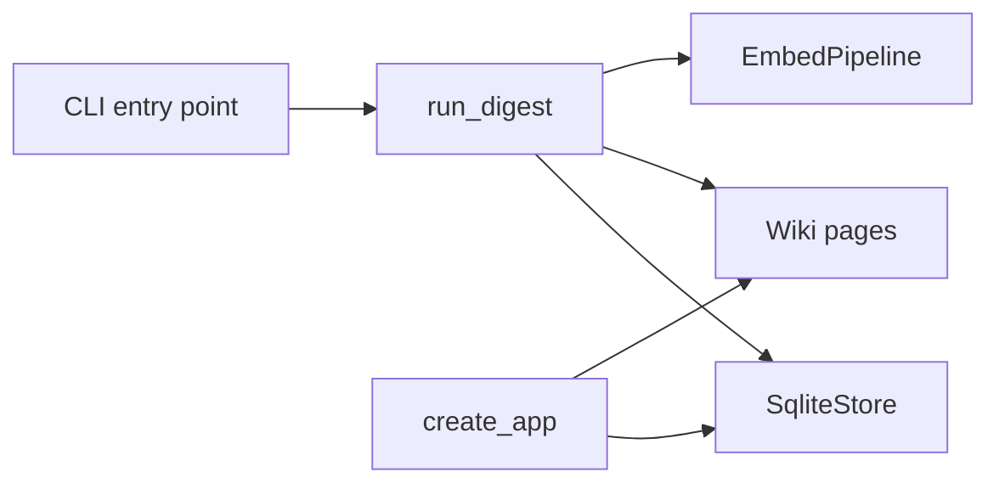

# Installation and Setup Guide

This guide explains how to install and run **rekipedia** from source or via package managers, based on the repository’s analyzed build and runtime entry points. The project exposes a Python CLI via [`rekipedia.cli:main`](src/rekipedia/cli/__init__.py#L26) and also contains a Go implementation under `go/`, but the documented install path here is the Python package, since the available packaging metadata and commands are Python-oriented. The package version observed in the repository metadata is `0.10.9` for both Python and npm naming information.

## Requirements

### System Requirements

`rekipedia` is a local developer tool that stores data in SQLite and builds a RAG index over repository content. At minimum, you need:

- A modern Python runtime
- SQLite support via the bundled database layer
- Enough disk space for the local `.rekipedia/` cache and generated wiki output
- Network access if your LLM provider is remote

The storage layer is implemented by [`SqliteStore`](src/rekipedia/storage/sqlite_store.py#L39), which opens a database file and applies schema migrations on startup. That means a writable working directory is required, because the store is created in a project-local output directory, typically `.rekipedia/`.

### Language Versions

The repository includes both Python and Go code, but the install/setup surface for the CLI is Python-first:

| Component | Evidence |
|---|---|
| Python package name | `rekipedia` |
| Python package version | `0.10.9` |
| CLI entry point | [`rekipedia = "rekipedia.cli:main"`](src/rekipedia/cli/__init__.py#L26) |
| Alternate CLI entry point | [`reki = "rekipedia.cli:main"`](src/rekipedia/cli/__init__.py#L26) |
| Build command | `uv build` |

### Runtime Dependencies

The code paths show these major runtime dependencies:

- `click` for CLI wiring in [`rekipedia.cli.__init__`](src/rekipedia/cli/__init__.py#L1)
- `faiss` and `numpy` for embedding and ANN search in [`rekipedia.rag.embedder`](src/rekipedia/rag/embedder.py#L1)
- `litellm` for embeddings and LLM calls in [`_embed_batch`](src/rekipedia/rag/embedder.py#L416)
- `tree_sitter` language bindings for symbol-aware chunking in [`_symbol_chunk_file_inner`](src/rekipedia/rag/embedder.py#L235)
- `fastapi` and templating libraries for the web server in [`create_app`](src/rekipedia/server/app.py#L21)
- `yaml` for note import in [`import_notes_from_file`](src/rekipedia/notes/__init__.py#L7)

The embedding CLI also explicitly checks for missing `faiss-cpu`/`numpy` and exits with a friendly error via [`_check_rag_deps`](src/rekipedia/cli/embed.py#L22).

> **Sources:** `pyproject.toml` · `package.json` · [`main`](src/rekipedia/cli/__init__.py#L26) · [`SqliteStore`](src/rekipedia/storage/sqlite_store.py#L39) · [`_check_rag_deps`](src/rekipedia/cli/embed.py#L22-L41) · [`_embed_batch`](src/rekipedia/rag/embedder.py#L416-L436) · [`_symbol_chunk_file_inner`](src/rekipedia/rag/embedder.py#L235-L409) · [`create_app`](src/rekipedia/server/app.py#L21-L663)

## Installation Methods

### From Source

The analysis data includes one explicit build command: [`uv build`](#). In practice, the source install flow is:

1. Clone the repository.
2. Create and activate a Python environment.
3. Install project dependencies.
4. Build the package if you want a distributable artifact.
5. Invoke the CLI entry point.

A typical source workflow looks like this:

```bash
git clone <repository-url>
cd <repository-dir>

uv venv
source .venv/bin/activate

uv sync
uv build
```

If you are not using `uv` to manage the environment, you can still install in editable mode using standard Python tooling, provided your environment already has the dependencies required by the package:

```bash
pip install -e .
```

The build command is confirmed by the repository analysis (`build_commands: ["uv build"]`), so `uv build` is the canonical packaging step.

### Via Package Manager

Both `pyproject.toml` and `package.json` are present, which means the project is discoverable through Python packaging and also has npm metadata.

#### Python Package Manager

The Python package name is `rekipedia` and the version is `0.10.9`. Install it with:

```bash
pip install rekipedia==0.10.9
```

or with `uv`:

```bash
uv pip install rekipedia==0.10.9
```

If you are developing locally, editable install is usually preferred:

```bash
pip install -e .
```

#### npm

The repository metadata includes `package.json` with npm package name `rekipedia` and version `0.10.9`. However, the analysis does not provide an npm build or runtime workflow comparable to the Python CLI. Treat the npm metadata as packaging metadata rather than the primary installation path.

### Docker

No `Dockerfile` was present in the analyzed file list, so there is no evidence-based Docker build/run flow to document. If you want containerized usage, you would need to author a Dockerfile yourself or check the repository outside the analyzed snapshot.

> **Sources:** `pyproject.toml` · `package.json` · `build_commands` · [`main`](src/rekipedia/cli/__init__.py#L26-L27)

## First Run

The first-run experience centers around the CLI entry point and the project-local `.rekipedia/` directory.

### 1. Verify the CLI is available

The package exposes two entry points:

- `rekipedia`
- `reki`

Both resolve to [`rekipedia.cli:main`](src/rekipedia/cli/__init__.py#L26).

Run:

```bash
rekipedia --help
# or
reki --help
```

The CLI module is organized with Click in [`rekipedia.cli.__init__`](src/rekipedia/cli/__init__.py#L1), so `--help` should show the command tree.

### 2. Create or select a repository to scan

The main workflows operate against a repository root. The scanning pipeline is implemented by [`run_digest`](src/rekipedia/orchestrator/run_digest.py#L45) and the update pipeline by [`run_update`](src/rekipedia/orchestrator/run_update.py#L27). Both expect a repository root and an output directory, typically `.rekipedia/`.

### 3. Run the initial scan / digest

Although the CLI command wrapper for scan is not fully shown in the analyzed set, the underlying full scan pipeline is [`run_digest`](src/rekipedia/orchestrator/run_digest.py#L45). It:

- creates a run record
- snapshots files
- extracts symbols and relationships
- synthesizes wiki pages
- writes Markdown/JSON outputs
- optionally builds embeddings via [`EmbedPipeline.build`](src/rekipedia/rag/embedder.py#L477)

A first run should therefore populate:

- `.rekipedia/store.db`
- `.rekipedia/wiki/`
- embedding artifacts if the RAG step is enabled

### 4. Open the server

The web app factory is [`create_app`](src/rekipedia/server/app.py#L21). In a healthy setup, the server reads the latest successful run and renders wiki pages and note management UI from the generated local store.

### Execution Flow



> **Sources:** [`main`](src/rekipedia/cli/__init__.py#L26-L27) · [`run_digest`](src/rekipedia/orchestrator/run_digest.py#L45-L433) · [`run_update`](src/rekipedia/orchestrator/run_update.py#L27-L244) · [`create_app`](src/rekipedia/server/app.py#L21-L663) · [`EmbedPipeline.build`](src/rekipedia/rag/embedder.py#L477-L604)

## Environment Variables

The repository analysis shows several environment-sensitive code paths, even where the exact variable names are not fully enumerated in the metadata.

### LLM and Embedding Configuration

The embedding CLI accepts provider/model settings in [`embed_cmd`](src/rekipedia/cli/embed.py#L85). It uses an [`LLMConfig`](src/rekipedia/cli/embed.py#L85) instance and passes `base_url`/API-related settings down to [`_embed_batch`](src/rekipedia/rag/embedder.py#L416), which routes through `litellm.embedding()`.

The orchestrator also uses [`LLMConfig`](src/rekipedia/orchestrator/run_digest.py#L45) and [`run_ask`](src/rekipedia/orchestrator/run_ask.py#L304) / [`stream_ask`](src/rekipedia/orchestrator/run_ask.py#L333) for answer generation, so common LLM configuration is likely shared across scan and ask workflows.

### RAG Behaviour Flags

The embedding search path documents one explicit environment-driven toggle:

- `REKIPEDIA_RAG_MMR=0` disables Maximal Marginal Relevance in [`EmbedPipeline.search`](src/rekipedia/rag/embedder.py#L610-L711)

This is useful when you want deterministic top-K nearest neighbours without diversification.

### Shell Environment Dependencies

The note-editing flow uses the `$EDITOR` environment variable when content is not passed directly, in [`note_edit`](src/rekipedia/cli/note.py#L96-L120). If `$EDITOR` is unset, editing may fail or fall back poorly depending on the shell/platform.

### What is Observable vs. What is Not

The analysis data confirms environment-driven behavior, but it does **not** provide a complete inventory of all possible variables. In particular, there is no exhaustive config reference file in the analyzed snapshot. The safest documented assumptions are:

| Area | Observable behavior |
|---|---|
| LLM provider/model | Configurable through `LLMConfig`-driven CLI/runtime paths |
| RAG MMR | `REKIPEDIA_RAG_MMR=0` disables diversification |
| Note editing | `$EDITOR` may be used by the CLI |

> **Sources:** [`embed_cmd`](src/rekipedia/cli/embed.py#L85-L201) · [`_embed_batch`](src/rekipedia/rag/embedder.py#L416-L436) · [`EmbedPipeline.search`](src/rekipedia/rag/embedder.py#L610-L711) · [`note_edit`](src/rekipedia/cli/note.py#L96-L120)

## Troubleshooting

### Missing `faiss-cpu` or `numpy`

If you run the embedding command and see a dependency error, it is likely from [`_check_rag_deps`](src/rekipedia/cli/embed.py#L22-L41). The command intentionally checks for these packages and exits with a friendly message.

**Fix:**

```bash
pip install numpy faiss-cpu
# or, if using uv:
uv pip install numpy faiss-cpu
```

### Tree-sitter not installed or unsupported language

Symbol-aware chunking in [`_symbol_chunk_file`](src/rekipedia/rag/embedder.py#L218-L232) falls back gracefully when tree-sitter is unavailable or a language is unsupported. This is not fatal, but it can reduce chunk quality.

**Symptoms:**
- fewer symbol-aligned chunks
- less precise provenance in RAG results

**Fix:**
Install the relevant tree-sitter bindings used by the project and rerun embedding.

### Database or migration issues

The store automatically applies migrations in [`SqliteStore._apply_migrations`](src/rekipedia/storage/sqlite_store.py#L117-L131). If the database is corrupt or schema state is stale, remove the local `.rekipedia/` directory and re-run the initial scan.

**Fix:**

```bash
rm -rf .rekipedia
rekipedia ...
```

### “No successful scan exists” errors

The ask flow validates that a successful scan already exists via [`_verify_scan`](src/rekipedia/orchestrator/run_ask.py#L37-L52). If it fails, you likely tried to ask questions before running a scan.

**Fix:**
Run the full scan/digest pipeline first, then retry the question workflow.

### Notes editing opens the wrong editor or fails

[`note_edit`](src/rekipedia/cli/note.py#L96-L120) may open an editor through `$EDITOR`. If the editor does not launch, set it explicitly:

```bash
export EDITOR=vim
# or
export EDITOR=nano
```

### Server shows no pages or empty content

The server depends on generated wiki output and the latest successful run, both read through [`create_app`](src/rekipedia/server/app.py#L21-L663). If the UI is empty, check that:

1. the scan completed successfully,
2. `.rekipedia/wiki/` exists,
3. `.rekipedia/store.db` contains the latest run.

### Embedding index absent after update

The update path only performs incremental embedding when an index already exists; otherwise [`EmbedPipeline.update`](src/rekipedia/rag/embedder.py#L733-L892) falls back to a full build. If the index is missing, the first update may take longer than expected because it rebuilds from scratch.

> **Sources:** [`_check_rag_deps`](src/rekipedia/cli/embed.py#L22-L41) · [`_symbol_chunk_file`](src/rekipedia/rag/embedder.py#L218-L232) · [`SqliteStore._apply_migrations`](src/rekipedia/storage/sqlite_store.py#L117-L131) · [`_verify_scan`](src/rekipedia/orchestrator/run_ask.py#L37-L52) · [`note_edit`](src/rekipedia/cli/note.py#L96-L120) · [`create_app`](src/rekipedia/server/app.py#L21-L663) · [`EmbedPipeline.update`](src/rekipedia/rag/embedder.py#L733-L892)