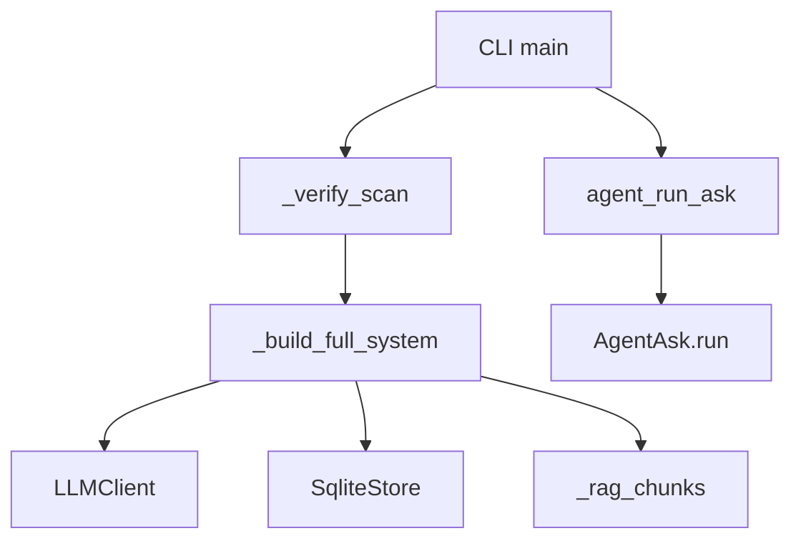

# Installation and Setup Guide

This guide explains how to install, configure, and run `rekipedia` for the first time based on the repository evidence. The package is published as version `0.13.0` for both Python and npm naming metadata, and it exposes CLI entry points `rekipedia` and `reki` via `rekipedia.cli:main` in the package metadata. The relevant runtime orchestration for “ask” workflows lives in [`rekipedia.orchestrator.run_ask`](src/rekipedia/orchestrator/run_ask.py#L1) and [`rekipedia.orchestrator.agent_ask`](src/rekipedia/orchestrator/agent_ask.py#L1). The planning/synthesis path is implemented in [`rekipedia.synthesis.planner`](src/rekipedia/synthesis/planner.py#L1) and [`rekipedia.synthesis.agent_planner`](src/rekipedia/synthesis/agent_planner.py#L1).

## Requirements

### System requirements

The repository analysis does not include a `Dockerfile` or OS-specific build scripts, so the observable requirement is a standard development environment capable of running Python tooling and `pytest`. The build command found in the repository is:

```bash
uv build
```

This indicates the project is intended to be built with [uv](https://docs.astral.sh/uv/) and, by implication, requires a working Python packaging toolchain.

### Language and package versions

The metadata evidence identifies:

| Component | Version / Name |
|---|---|
| Python package name | `rekipedia` |
| Python package version | `0.13.0` |
| npm package name | `rekipedia` |
| npm package version | `0.13.0` |

The code imports modern typing and `from __future__ import annotations` in multiple modules, so a contemporary Python version is recommended. The repository evidence does not state an exact minimum Python version, so that should be treated as unspecified in the current analysis.

### Dependencies

The analysis shows these notable runtime dependencies imported by the implementation:

| Dependency | Used in |
|---|---|
| `litellm` | [`rekipedia.orchestrator.agent_ask`](src/rekipedia/orchestrator/agent_ask.py#L1), [`rekipedia.synthesis.agent_planner`](src/rekipedia/synthesis/agent_planner.py#L1) |
| `rekipedia.llm.client` | ask/planning orchestration modules |
| `rekipedia.models.contracts` | ask/planning modules |
| `rekipedia.storage.sqlite_store` | ask flows |
| `rekipedia.rag.embedder` | [`rekipedia.orchestrator.run_ask`](src/rekipedia/orchestrator/run_ask.py#L1) |
| `rekipedia.synthesis.planner` | [`rekipedia.synthesis.agent_planner`](src/rekipedia/synthesis/agent_planner.py#L1) |
| `pytest` | tests in [`tests/test_agent_ask.py`](tests/test_agent_ask.py#L1) |

The test suite also uses `unittest.mock`, and standard library modules such as `json`, `os`, `pathlib`, and `re`.

> **Sources:** `pyproject.toml` · `package.json` · `src/rekipedia/orchestrator/run_ask.py` · `src/rekipedia/orchestrator/agent_ask.py` · `src/rekipedia/synthesis/planner.py` · `src/rekipedia/synthesis/agent_planner.py`

## Installation Methods

### From Source

The repository exposes a source build command via `uv build` in the analysis payload. A practical source-install workflow is:

1. Clone the repository.
2. Create and activate a Python virtual environment.
3. Install project dependencies using the project’s package manager workflow.
4. Build the package.
5. Optionally install the built artifact locally.

Example sequence:

```bash
git clone <repository-url>
cd rekipedia

python -m venv .venv
# Linux/macOS
source .venv/bin/activate
# Windows PowerShell
# .venv\Scripts\Activate.ps1

uv build
```

If you want to install the project in editable mode after creating a virtual environment, the repository metadata suggests a standard Python package layout under `src/rekipedia/`, so editable installation is likely appropriate:

```bash
pip install -e .
```

That said, only `uv build` is explicitly evidenced as a build command, so the editable install step is a common packaging practice rather than something directly stated in the repository data.

### Via Package Manager

The repository contains both `pyproject.toml` and `package.json`, so package-manager-based installation is supported from both ecosystems.

#### Python

Given the packaging layout and the `uv build` command, the most natural Python install path is:

```bash
uv sync
```

or, if you prefer pip-based installation:

```bash
pip install .
```

For development:

```bash
pip install -e .
```

#### npm

Because `package.json` exists and the npm metadata names the package `rekipedia` at version `0.13.0`, the package is also represented in the npm ecosystem. The analysis does not expose the package scripts or publish format, so the only safe commands to recommend are standard npm install flows:

```bash
npm install
```

If the package is published to npm, a consumer install would typically be:

```bash
npm install rekipedia
```

However, whether that external package is currently published is not proven by the repository data, so treat that as conditional.

### Docker

No `Dockerfile` appears in the files seen, so there is no evidence-based Docker install path to document. If you want to containerize the project, you would need to author a `Dockerfile` yourself; there is currently no repository-provided build or run recipe to cite.

> **Sources:** `pyproject.toml` · `package.json` · `README.md` · `uv build`

## First Run

The repository analysis shows that the public CLI entry point is `rekipedia = "rekipedia.cli:main"` and `reki = "rekipedia.cli:main"`, so the intended first-run path is via the CLI. Although `rekipedia.cli` is not included in the provided file list, the orchestration code makes clear that “ask” operations expect two things to exist:

1. a repository scan result under `.rekipedia/`
2. a backing SQLite store and wiki content beneath that output directory

The ask flow begins with [`run_ask(question, repo_root, output_dir, llm_config, history)`](src/rekipedia/orchestrator/run_ask.py#L334) or, when agentic mode is enabled, [`agent_run_ask(question, repo_root, output_dir, llm_config, history)`](src/rekipedia/orchestrator/agent_ask.py#L371). The workflow validates that a successful scan exists through [`_verify_scan`](src/rekipedia/orchestrator/run_ask.py#L37) and then builds a prompt using stored wiki pages, symbol metadata, and optionally RAG chunks.

A practical first-run sequence therefore looks like this:

```bash
# 1. Install dependencies
uv sync

# 2. Run the CLI help to confirm the entry point
rekipedia --help
# or
reki --help

# 3. Execute the project’s scan/build workflow first
# (exact scan command is not visible in the analysis)

# 4. Ask a question against the generated store
# (depends on CLI subcommands not included in the provided files)
```

### What happens internally

On a successful run, [`_build_full_system`](src/rekipedia/orchestrator/run_ask.py#L208) assembles context from:
- the latest stored wiki pages
- symbol line metadata
- retrieval-augmented chunks from [`_rag_chunks`](src/rekipedia/orchestrator/run_ask.py#L86)
- ranked page snippets via [`_rank_pages_by_query`](src/rekipedia/orchestrator/run_ask.py#L137)
- notes from the SQLite store

If the environment variable `REKIPEDIA_AGENT_ASK=1` is set, [`run_ask`](src/rekipedia/orchestrator/run_ask.py#L334) delegates to [`agent_run_ask`](src/rekipedia/orchestrator/agent_ask.py#L371), which uses the agentic loop implemented by [`AgentAsk`](src/rekipedia/orchestrator/agent_ask.py#L253).



> **Sources:** `src/rekipedia/orchestrator/run_ask.py` · L334–L377 · [`run_ask`](src/rekipedia/orchestrator/run_ask.py#L334) · [`_prepare_ask`](src/rekipedia/orchestrator/run_ask.py#L310) · `src/rekipedia/orchestrator/agent_ask.py` · L253–L382 · [`agent_run_ask`](src/rekipedia/orchestrator/agent_ask.py#L371)

## Environment Variables

The strongest evidence for runtime configuration is the agent-mode toggle:

| Environment variable | Effect | Evidence |
|---|---|---|
| `REKIPEDIA_AGENT_ASK` | When set to `1`, `run_ask` delegates to `agent_run_ask` | [`test_run_ask_uses_agent_when_env_set`](tests/test_agent_ask.py#L283) |

This is directly exercised by the test suite, which reloads the module after setting the variable and verifies that the agent path is used.

The synthesis and ask modules also read from the filesystem under `.rekipedia/`, but that is a data-directory convention rather than an environment variable. The orchestration code expects:
- `store.db`
- `wiki/`
- optionally `symbols.json`

The analysis payload does not expose additional environment variables from config files, so no other env-based settings can be stated confidently. In particular, LLM provider configuration appears to be carried via `LLMConfig` and `LLMClient` rather than hard-coded environment names in the provided evidence.

> **Sources:** `tests/test_agent_ask.py` · L283–L303 · [`test_run_ask_uses_agent_when_env_set`](tests/test_agent_ask.py#L283) · `src/rekipedia/orchestrator/run_ask.py` · L334–L377 · `src/rekipedia/orchestrator/agent_ask.py` · L253–L382

## Troubleshooting

### “No successful scan exists” or missing store errors

The most common startup problem inferred from the code is attempting to ask questions before the repository has been scanned. [`_verify_scan`](src/rekipedia/orchestrator/run_ask.py#L37) checks for the `.rekipedia/` directory and queries the SQLite store for the latest successful run. If no run is found, it raises `RuntimeError`.

**Fix:**
1. Run the project’s scan/indexing workflow first.
2. Ensure `.rekipedia/store.db` exists.
3. Confirm the latest scan completed successfully.

### Empty wiki pages or missing symbol data

The ask workflow reads page files from `.rekipedia/wiki/` and symbol metadata from `.rekipedia/symbols.json` via [`_load_wiki_pages`](src/rekipedia/orchestrator/run_ask.py#L55) and [`_load_symbol_lines`](src/rekipedia/orchestrator/run_ask.py#L66). If those files are missing, the system still proceeds with degraded context, but the answer quality will be reduced.

**Fix:**
- Re-run the scan/generation stage.
- Check that the output directory contains populated wiki pages and symbol metadata.
- Verify the output directory path passed to the CLI or API.

### RAG index not available

The tool handler’s [`search_code`](src/rekipedia/orchestrator/agent_ask.py#L160) method delegates to [`_rag_chunks`](src/rekipedia/orchestrator/run_ask.py#L86). The tests show the no-index case returns a helpful “No code chunks found” style message.

**Fix:**
- Build the embedding/indexing pipeline before asking questions.
- Make sure the embedding store is initialized and searchable.

### Agent mode unexpectedly not enabled

If you expected the agentic loop but got the standard single-shot answer path, check `REKIPEDIA_AGENT_ASK`. The test suite shows that setting it to `1` activates the agent runner.

**Fix:**
```bash
export REKIPEDIA_AGENT_ASK=1
```

Then rerun the CLI or application entry point.

### Planning falls back to defaults

The planning side has a graceful fallback: [`PlannerAgent.plan`](src/rekipedia/synthesis/planner.py#L186) and [`AgentPlanner.plan`](src/rekipedia/synthesis/agent_planner.py#L155) both fall back to [`_default_plan`](src/rekipedia/synthesis/planner.py#L400) if the LLM call fails. This is intentional, but it can make the generated wiki structure less tailored.

**Fix:**
- Confirm your LLM client configuration is valid.
- Verify network access to the model provider.
- Inspect logs for warnings from `AgentPlanner.plan` or `PlannerAgent.plan`.

> **Sources:** `src/rekipedia/orchestrator/run_ask.py` · L37–L52 · [`_verify_scan`](src/rekipedia/orchestrator/run_ask.py#L37) · [`_load_wiki_pages`](src/rekipedia/orchestrator/run_ask.py#L55) · [`_load_symbol_lines`](src/rekipedia/orchestrator/run_ask.py#L66) · `src/rekipedia/orchestrator/agent_ask.py` · L160–L234 · [`_ToolHandler.search_code`](src/rekipedia/orchestrator/agent_ask.py#L160) · `src/rekipedia/synthesis/planner.py` · L186–L495 · [`PlannerAgent.plan`](src/rekipedia/synthesis/planner.py#L186) · [`_default_plan`](src/rekipedia/synthesis/planner.py#L400)