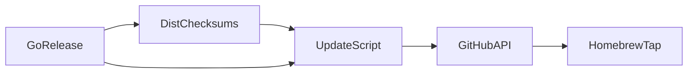

# Third-Party and Cross-Tool Integrations

This repository is intentionally integration-heavy: it combines GitHub automation, release tooling, language-ecosystem hooks, containerization, and developer workflow enforcement. The concrete integrations are visible both in top-level files such as `.github/workflows/go-release.yml`, `Dockerfile.sandbox`, `package.json`, and `.pre-commit-config.yaml`, and in the implementation code that bridges those tools into the app’s release and runtime paths.

The most important pattern is that external tools are not treated as passive dependencies. They are actively wired into code paths. For example, the GitHub release pipeline updates a Homebrew tap via [.github/scripts/update-homebrew-tap.py](.github/scripts/update-homebrew-tap.py#L1), the Node launcher in [bin/rekipedia.js](bin/rekipedia.js#L4) shells out via `child_process`, and the Python CLI hooks into the repository’s ecosystem-specific artifacts through extractors and config parsing in [src/rekipedia/extractors/config_extractor.py](src/rekipedia/extractors/config_extractor.py) and [src/rekipedia/cli/ask.py](src/rekipedia/cli/ask.py).

## Integration Overview

The table below lists the integrations that are actually evidenced in the repository, the files that participate, and the data-flow direction.

| Integration | Touched files | Direction of data flow |
|---|---|---|
| GitHub release automation | `.github/workflows/go-release.yml`, `.github/workflows/python-release.yml`, `.github/scripts/update-homebrew-tap.py`, `go/.goreleaser.yaml`, `go/install.sh` | Build artifacts and checksum data flow from release jobs into GitHub content updates, then into the Homebrew tap |
| GitHub CI / workflow automation | `.github/workflows/go-ci.yml`, `.github/workflows/python-ci.yml`, `.github/workflows/npm-publish.yml`, `scripts/lint-and-report.sh`, `.github/lint-report.instructions.md` | Source tree and test outputs flow into CI jobs; CI feedback flows back into GitHub status/artifacts |
| Homebrew tap updates | `.github/scripts/update-homebrew-tap.py`, `go/.goreleaser.yaml`, `go/RELEASE-NOTES.md`, `go/install.sh` | `dist/checksums.txt` and release metadata flow into GitHub file updates for the tap formula |
| Container/tooling integration | `Dockerfile.sandbox`, `go/Dockerfile`, `Makefile`, `go/Makefile`, `scripts/lint-and-report.sh` | Local build commands and runtime entrypoints flow into container images and build targets |
| JavaScript launcher / shim | `bin/rekipedia.js`, `package.json` | Node CLI invocation flows into a spawned process (the repository’s executable) |
| Python ecosystem hooks | `src/rekipedia/extractors/python_extractor.py`, `src/rekipedia/extractors/config_extractor.py`, `pyproject.toml`, `uv.lock` | Python source and project metadata flow into extractor logic and runtime configuration |
| Go ecosystem hooks | `go/go.mod`, `go/go.sum`, `go/cmd/rekipedia/main.go`, `go/install.sh`, `go/.goreleaser.yaml` | Go module metadata and compiled binary flow into release/install packaging |
| Editor / developer workflow hooks | `.pre-commit-config.yaml`, `.eslintrc.json`, `.prettierrc.json`, `.golangci.yml`, `checkstyle.xml`, `pmd-ruleset.xml` | Source changes flow into lint/format/quality tooling before merge |

> **Sources:** `.github/scripts/update-homebrew-tap.py` · `go/.goreleaser.yaml` · `Dockerfile.sandbox` · `package.json` · `pyproject.toml` · `go/go.mod`

## GitHub Automation

GitHub automation is centered around the `.github/` directory. The repository includes workflow definitions for Go, Python, and npm release/CI pipelines: [.github/workflows/go-ci.yml](.github/workflows/go-ci.yml), [.github/workflows/go-release.yml](.github/workflows/go-release.yml), [.github/workflows/python-ci.yml](.github/workflows/python-ci.yml), [.github/workflows/python-release.yml](.github/workflows/python-release.yml), and [.github/workflows/npm-publish.yml](.github/workflows/npm-publish.yml). These are complemented by GitHub-specific instructions files such as [.github/copilot-instructions.md](.github/copilot-instructions.md), [.github/husky-enforcement.instructions.md](.github/husky-enforcement.instructions.md), and [.github/lint-report.instructions.md](.github/lint-report.instructions.md).

The clearest automation hook is the Homebrew update script [`.github/scripts/update-homebrew-tap.py`](.github/scripts/update-homebrew-tap.py#L1), which uses the GitHub API directly. Its functions [`read_checksums_from_dist`](.github/scripts/update-homebrew-tap.py#L36-L55), [`gh_get_sha`](.github/scripts/update-homebrew-tap.py#L58-L68), and [`gh_put`](.github/scripts/update-homebrew-tap.py#L71-L87) show the end-to-end flow: read checksums from `dist/checksums.txt`, fetch the current file SHA from GitHub, and write back a new file revision. The script imports `urllib.request`, `base64`, `json`, `os`, and `sys`, which is a strong signal that it is not a passive helper but a GitHub-content updater.

A second GitHub-facing integration is the workflow-driven release path around `go/.goreleaser.yaml`, which is the input for release artifact generation. The repository’s release notes file [go/RELEASE-NOTES.md](go/RELEASE-NOTES.md) also indicates that release outputs are curated for publishing and downstream consumption.

> **Sources:** `.github/scripts/update-homebrew-tap.py` · `go/.goreleaser.yaml` · `.github/workflows/go-release.yml` · `.github/workflows/python-release.yml` · `go/RELEASE-NOTES.md`

## Homebrew Tap Updates

Homebrew tap maintenance is handled explicitly rather than manually. The script [`.github/scripts/update-homebrew-tap.py`](.github/scripts/update-homebrew-tap.py#L1) is the key integration point. Its docstring on [`read_checksums_from_dist`](.github/scripts/update-homebrew-tap.py#L36-L55) says it reads SHA-256 values from GoReleaser’s `dist/checksums.txt` “no download needed,” so the data path is:

1. GoReleaser produces release artifacts and checksums.
2. [`read_checksums_from_dist`](.github/scripts/update-homebrew-tap.py#L36-L55) extracts checksums.
3. [`gh_get_sha`](.github/scripts/update-homebrew-tap.py#L58-L68) fetches the current file state from GitHub.
4. [`gh_put`](.github/scripts/update-homebrew-tap.py#L71-L87) writes the updated formula content back through the GitHub contents API.

That means the Homebrew tap update is checksum-driven, not artifact-download-driven. This is an important operational detail: the formula update is based on already-published release metadata rather than a separate file-transfer workflow.

The presence of `go/install.sh` and `go/.goreleaser.yaml` reinforces that the Homebrew path is part of a broader Go release story, not an isolated script.

> **Sources:** `.github/scripts/update-homebrew-tap.py` · `go/.goreleaser.yaml` · `go/install.sh`

## Container and Tooling Integration

The repository supports both sandboxed and Go-specific containerization. There is a top-level [Dockerfile.sandbox](Dockerfile.sandbox) and a Go-specific [go/Dockerfile](go/Dockerfile). These imply two distinct container use cases: one for sandboxed execution and one for the Go rewrite/runtime. The file layout suggests the sandbox container is tied to higher-level repository tasks, while the Go Dockerfile packages the standalone Go implementation.

Build tooling is also explicit: [Makefile](Makefile) at the root and [go/Makefile](go/Makefile) coordinate local developer workflows. The lint/report pipeline in [`scripts/lint-and-report.sh`](scripts/lint-and-report.sh) is a cross-tool bridge because it aggregates output from multiple linters and emits a report format consumed elsewhere in the repo.

The presence of `.golangci.yml`, `checkstyle.xml`, and `pmd-ruleset.xml` shows that containerized and local tooling are backed by formal lint configs rather than ad hoc commands.

> **Sources:** `Dockerfile.sandbox` · `go/Dockerfile` · `Makefile` · `go/Makefile` · `scripts/lint-and-report.sh`

## JavaScript / Node Ecosystem Hooks

The repository includes a Node launcher at [bin/rekipedia.js](bin/rekipedia.js#L4), whose [`tryRun`](bin/rekipedia.js#L4) function imports `child_process`. That tells us the Node layer is acting as a process shim, not a full application runtime. In practice, this kind of script typically mediates between `npm`-style entrypoints and the actual executable, and the presence of `package.json` confirms it is part of the repository’s published JS surface.

Importantly, the launcher is not isolated from the rest of the system: it sits alongside Go and Python sources, so it functions as a cross-tool entrypoint rather than a standalone Node product.

> **Sources:** `bin/rekipedia.js` · `package.json`

## Python and Go Ecosystem Hooks

The Python side is highly integrated with repository conventions. The extractor modules under `src/rekipedia/extractors/` are language-aware, including [src/rekipedia/extractors/python_extractor.py](src/rekipedia/extractors/python_extractor.py), [src/rekipedia/extractors/typescript_extractor.py](src/rekipedia/extractors/typescript_extractor.py), and [src/rekipedia/extractors/config_extractor.py](src/rekipedia/extractors/config_extractor.py). The config extractor is especially relevant to ecosystem integration because it is designed to parse project metadata such as `package.json`, `pyproject.toml`, Dockerfiles, Makefiles, `go.mod`, and CI YAML patterns.

That means ecosystem hooks are not merely “supported languages” but first-class inputs to analysis. The extracted data from these project files is what feeds higher-level flows like scanning, embedding, and export. The repository also includes `pyproject.toml` and `uv.lock`, which show the Python runtime and dependency management story is tracked in-source.

On the Go side, `go/go.mod` and `go/go.sum` establish module management, while [go/cmd/rekipedia/main.go](go/cmd/rekipedia/main.go#L6-L8) serves as the Go CLI entrypoint. The Go release path is also supported by `go/install.sh` and `go/.goreleaser.yaml`, tying compilation, packaging, and install-time behavior together.

> **Sources:** `src/rekipedia/extractors/config_extractor.py` · `src/rekipedia/extractors/python_extractor.py` · `pyproject.toml` · `uv.lock` · `go/go.mod` · `go/go.sum` · `go/cmd/rekipedia/main.go` · `go/install.sh` · `go/.goreleaser.yaml`

## Cross-Tool Dependency Table

The repository’s integrations are not independent; they feed one another. The table below summarizes the concrete relationships observable from the code and workflow files.

| Module / integration | Imports from | Called by | Calls into | Inherits from |
|---|---|---|---|---|
| `.github/scripts/update-homebrew-tap.py` | `os`, `sys`, `json`, `base64`, `urllib.request` | GitHub release workflows | GitHub contents API | — |
| `go/.goreleaser.yaml` | Go release artifacts | `.github/workflows/go-release.yml` | `dist/checksums.txt`, install script consumers | — |
| `bin/rekipedia.js` | `child_process` | Node package entrypoint | external command execution | — |
| `src/rekipedia/extractors/config_extractor.py` | Python stdlib parsing helpers | scan / extract flows | project metadata files (`package.json`, `pyproject.toml`, `Dockerfile`, `Makefile`, `go.mod`, CI YAML) | — |
| `Dockerfile.sandbox` | sandbox runtime base image | container build tooling | repository tasks / sandbox execution | — |
| `go/Dockerfile` | Go build/runtime base image | container build tooling | Go CLI packaging/runtime | — |
| `go/install.sh` | shell / release artifacts | release users, tap updates | installed Go binary | — |
| `scripts/lint-and-report.sh` | shell, repo linters | CI and local dev | lint output aggregation | — |

> **Sources:** `.github/scripts/update-homebrew-tap.py` · `go/.goreleaser.yaml` · `bin/rekipedia.js` · `src/rekipedia/extractors/config_extractor.py` · `Dockerfile.sandbox` · `go/Dockerfile` · `go/install.sh` · `scripts/lint-and-report.sh`

## Language Ecosystem Hooks

The repository explicitly hooks into several language ecosystems through both dependency manifests and parser logic:

| Ecosystem | Evidence in repo | How it is used |
|---|---|---|
| Python | `pyproject.toml`, `uv.lock`, `src/rekipedia/extractors/python_extractor.py` | Dependency/runtime management and Python AST-like extraction |
| Go | `go/go.mod`, `go/go.sum`, `go/cmd/rekipedia/main.go`, `go/.goreleaser.yaml` | Module management, CLI runtime, and release packaging |
| Node/JavaScript | `package.json`, `bin/rekipedia.js` | CLI shim / process launcher and package metadata |
| Container | `Dockerfile.sandbox`, `go/Dockerfile` | Reproducible execution and packaging |
| CI / GitHub | `.github/workflows/*.yml`, `.github/scripts/update-homebrew-tap.py` | Automation, release, and publishing |

The most important point is that these hooks are not generic “support” claims; they are reflected in code paths and file parsing logic. For instance, the config extractor’s focus on `package.json`, `pyproject.toml`, Dockerfiles, Makefiles, and `go.mod` shows the repository treats ecosystem manifests as structured inputs to analysis rather than opaque configuration files.

> **Sources:** `pyproject.toml` · `uv.lock` · `package.json` · `go/go.mod` · `src/rekipedia/extractors/config_extractor.py` · `src/rekipedia/extractors/python_extractor.py` · `bin/rekipedia.js`