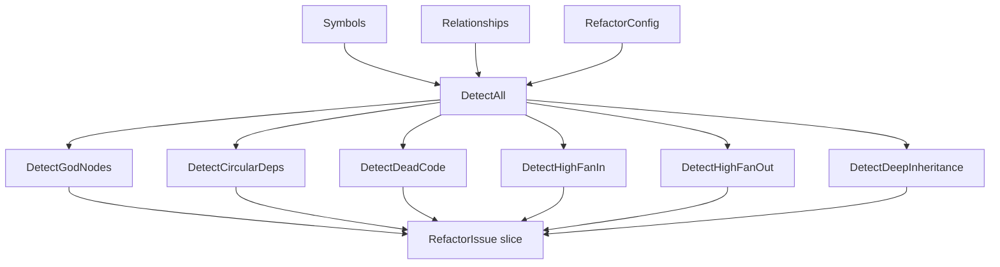

# Go Refactor Detection Engine

## Overview

The Go analysis engine for refactor detection lives in [`go/internal/analysis/refactor_detector.go`](go/internal/analysis/refactor_detector.go) and is responsible for identifying structural smells in a repository’s symbol/relationship graph. Its public API is intentionally small: a set of focused detector functions plus [`DetectAll`](go/internal/analysis/refactor_detector.go#L404-L413) as the orchestration entry point. The module consumes repository analysis data expressed as `models.Symbol` and `models.Relationship` values from [`go/internal/models/contracts.go`](go/internal/models/contracts.go), and it emits `models.RefactorIssue` objects that can later be aggregated into a report.

The detectors are designed around static graph metrics and simple heuristics rather than expensive semantic analysis. That makes the module fast, deterministic, and suitable for scanning entire repositories repeatedly. The exported detectors are:

- [`DetectGodNodes`](go/internal/analysis/refactor_detector.go#L30-L100)
- [`DetectCircularDeps`](go/internal/analysis/refactor_detector.go#L103-L201)
- [`DetectDeadCode`](go/internal/analysis/refactor_detector.go#L204-L231)
- [`DetectHighFanIn`](go/internal/analysis/refactor_detector.go#L234-L276)
- [`DetectHighFanOut`](go/internal/analysis/refactor_detector.go#L279-L320)
- [`DetectDeepInheritance`](go/internal/analysis/refactor_detector.go#L323-L401)
- [`DetectAll`](go/internal/analysis/refactor_detector.go#L404-L413)

These detectors all operate on the same underlying symbol/relationship model, which gives the module a consistent shape: build indexes, calculate a metric, apply a threshold or traversal rule, and emit normalized findings.

> **Sources:** `go/internal/analysis/refactor_detector.go` · L19–L413 · [`DetectGodNodes`](go/internal/analysis/refactor_detector.go#L30-L100) [`DetectCircularDeps`](go/internal/analysis/refactor_detector.go#L103-L201) [`DetectDeadCode`](go/internal/analysis/refactor_detector.go#L204-L231) [`DetectHighFanIn`](go/internal/analysis/refactor_detector.go#L234-L276) [`DetectHighFanOut`](go/internal/analysis/refactor_detector.go#L279-L320) [`DetectDeepInheritance`](go/internal/analysis/refactor_detector.go#L323-L401) [`DetectAll`](go/internal/analysis/refactor_detector.go#L404-L413)

## Detector Responsibilities

The detector module’s job is not to enrich or format findings, but to discover them. Each detector answers a specific structural question:

- Is a symbol too central or over-connected?
- Does the dependency graph contain cycles?
- Are there symbols that appear unreachable?
- Which symbols attract excessive incoming edges?
- Which symbols depend on too many others?
- Are inheritance chains deeper than the configured limit?

The module uses several small helper routines to normalize input fields from loosely-typed analysis objects. Even though the symbol index provides typed model contracts, the detector code still contains helpers like [`isExported`](go/internal/analysis/refactor_detector.go#L19-L27) and internal accessors used throughout the detectors to read symbol names, files, kinds, and graph endpoints. That indicates the implementation is built to work against generic analysis payloads while still producing typed refactor issues.

The output contract is consistent across all detectors: a slice of `models.RefactorIssue`. Each issue can carry metadata such as kind, severity, location, description, and optional evidence fields defined in [`RefactorIssue`](go/internal/models/contracts.go#L24-L38). This makes the detector stage easy to compose with later aggregation and presentation layers.

A useful way to think about the module is:

1. Index symbols by name and/or file.
2. Traverse or count relationships.
3. Filter by thresholds or reachability.
4. Emit normalized issues.

This pattern is visible in every detector function in the file.

> **Sources:** `go/internal/analysis/refactor_detector.go` · L19–L413 · [`isExported`](go/internal/analysis/refactor_detector.go#L19-L27) · `go/internal/models/contracts.go` · L24–L38 · [`RefactorIssue`](go/internal/models/contracts.go#L24-L38)

## Detection Strategies

### God node detection

[`DetectGodNodes`](go/internal/analysis/refactor_detector.go#L30-L100) identifies “hub” symbols that connect to many others. The implementation builds a per-symbol edge summary, then checks whether a node’s degree exceeds the configured threshold. This detector is focused on *structural centrality*, not just raw call counts.

Typical inputs:

- symbol list for name/file resolution
- relationship list for degree counting
- threshold values from refactor configuration

It is a good fit for classes or modules that have become too broad.

### Circular dependency detection

[`DetectCircularDeps`](go/internal/analysis/refactor_detector.go#L103-L201) searches the relationship graph for cycles. The implementation maintains sets and traversal state, then walks dependencies using DFS-style recursion. The detector deduplicates cycles, excludes self-loops, and emits one issue per unique cycle path.

This detector is more about *topology* than about individual symbols. The primary input is the relationship graph, with symbols used to render readable issue locations and names.

### Dead code detection

[`DetectDeadCode`](go/internal/analysis/refactor_detector.go#L204-L231) finds symbols that appear to have no callers. It relies on relationship data to determine inbound edges and uses symbol metadata to avoid false positives. The helper [`isExported`](go/internal/analysis/refactor_detector.go#L19-L27) is important here, since exported symbols are treated differently from private ones.

This detector is intentionally conservative: a symbol is not automatically dead just because it has no local callers. Public API surface and special naming patterns can be excluded.

### Fan-in and fan-out detection

[`DetectHighFanIn`](go/internal/analysis/refactor_detector.go#L234-L276) and [`DetectHighFanOut`](go/internal/analysis/refactor_detector.go#L279-L320) are mirror-image metrics:

- fan-in = how many other symbols call or depend on this one
- fan-out = how many other symbols this symbol depends on

Both detectors build counters from the relationship set, then compare against thresholds. These are classic maintainability signals: high fan-in often indicates a shared utility or a risky bottleneck, while high fan-out often indicates poor separation of responsibilities.

### Deep inheritance detection

[`DetectDeepInheritance`](go/internal/analysis/refactor_detector.go#L323-L401) follows inheritance chains and measures depth. Unlike the other detectors, it needs to distinguish inheritance-style relationships from other dependency edges, so it relies on relationship kind and recursive depth computation.

This detector is useful in object-oriented language surfaces where nested inheritance can become hard to reason about. It emits issues for symbols whose depth exceeds a threshold and also records chain information for diagnostics.

> **Sources:** `go/internal/analysis/refactor_detector.go` · L30–L401 · [`DetectGodNodes`](go/internal/analysis/refactor_detector.go#L30-L100) [`DetectCircularDeps`](go/internal/analysis/refactor_detector.go#L103-L201) [`DetectDeadCode`](go/internal/analysis/refactor_detector.go#L204-L231) [`DetectHighFanIn`](go/internal/analysis/refactor_detector.go#L234-L276) [`DetectHighFanOut`](go/internal/analysis/refactor_detector.go#L279-L320) [`DetectDeepInheritance`](go/internal/analysis/refactor_detector.go#L323-L401)

## Detector Function Reference

The table below maps each detector function to the smell it finds and the primary inputs it consumes.

| Detector function | Smell found | Primary inputs consumed |
|---|---|---|
| [`DetectGodNodes`](go/internal/analysis/refactor_detector.go#L30-L100) | God nodes / overly central symbols | Symbols, relationships, thresholds / config |
| [`DetectCircularDeps`](go/internal/analysis/refactor_detector.go#L103-L201) | Circular dependencies | Relationships, symbols for naming |
| [`DetectDeadCode`](go/internal/analysis/refactor_detector.go#L204-L231) | Dead / unused code | Symbols, inbound relationships, export status |
| [`DetectHighFanIn`](go/internal/analysis/refactor_detector.go#L234-L276) | High fan-in | Relationships, symbols, thresholds / config |
| [`DetectHighFanOut`](go/internal/analysis/refactor_detector.go#L279-L320) | High fan-out | Relationships, symbols, thresholds / config |
| [`DetectDeepInheritance`](go/internal/analysis/refactor_detector.go#L323-L401) | Deep inheritance chains | Relationships, symbols, relationship kind, depth threshold |
| [`DetectAll`](go/internal/analysis/refactor_detector.go#L404-L413) | Aggregated multi-smell detection | Full symbol list, full relationship list, config |

A notable pattern here is that most detectors depend on the same two primitives: symbols and relationships. The detector module therefore acts as a metric layer over the repository graph, not as a language parser or filesystem walker.

> **Sources:** `go/internal/analysis/refactor_detector.go` · L30–L413 · [`DetectGodNodes`](go/internal/analysis/refactor_detector.go#L30-L100) [`DetectCircularDeps`](go/internal/analysis/refactor_detector.go#L103-L201) [`DetectDeadCode`](go/internal/analysis/refactor_detector.go#L204-L231) [`DetectHighFanIn`](go/internal/analysis/refactor_detector.go#L234-L276) [`DetectHighFanOut`](go/internal/analysis/refactor_detector.go#L279-L320) [`DetectDeepInheritance`](go/internal/analysis/refactor_detector.go#L323-L401) [`DetectAll`](go/internal/analysis/refactor_detector.go#L404-L413)

## Aggregation and `DetectAll`

[`DetectAll`](go/internal/analysis/refactor_detector.go#L404-L413) is the top-level entry point for the detector stage. Its role is to execute the individual heuristics and concatenate their outputs into a single finding set. The implementation is intentionally lightweight: it does not attempt to rank or rewrite findings; it simply runs the specialized detectors and appends their results.

That design is useful for two reasons:

1. **Separation of concerns** — each detector remains independently testable and easy to reason about.
2. **Composable reporting** — later stages can sort, group, enrich, or serialize findings without affecting detection semantics.

In practice, aggregation typically follows this sequence:

- run structural detectors
- collect all `RefactorIssue` values
- hand the result to enrichment or writing stages

The analysis engine therefore behaves like a pipeline where detection is the first pure step and aggregation is a thin wrapper around it.

Although the function naming is concise, the detector module clearly models a multi-stage metric pipeline rather than a single monolithic analysis.

> **Sources:** `go/internal/analysis/refactor_detector.go` · L404–L413 · [`DetectAll`](go/internal/analysis/refactor_detector.go#L404-L413) · `go/internal/models/contracts.go` · L24–L38 · [`RefactorIssue`](go/internal/models/contracts.go#L24-L38)

## Input Modeling and Metric Boundaries

The detector module is driven by the repository’s symbol graph, which is represented through `models.Symbol` and `models.Relationship` in [`go/internal/models/contracts.go`](go/internal/models/contracts.go). Those contracts provide the structural vocabulary that the detector relies on:

- `Symbol` gives a named entity and file context
- `Relationship` gives directed edges between symbols
- `RefactorIssue` is the normalized output

This boundary matters because it keeps the detector independent from extraction, storage, and presentation. The module does not care whether the inputs were derived from Go ASTs, Python parsing, or TypeScript extraction; it only cares about the graph shape.

A subtle but important consequence is that the detectors are metric-first. They do not attempt semantic interpretation beyond lightweight predicates such as export detection or relationship kind filtering. That makes them reliable for large repositories and consistent across repeated scans, but it also means they intentionally trade deep semantic understanding for speed and simplicity.

> **Sources:** `go/internal/models/contracts.go` · L24–L94 · [`Symbol`](go/internal/models/contracts.go#L53-L61) [`Relationship`](go/internal/models/contracts.go#L64-L71) [`RefactorIssue`](go/internal/models/contracts.go#L24-L38) · `go/internal/analysis/refactor_detector.go` · L19–L413