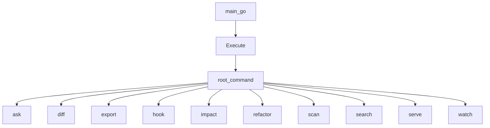

# Go CLI Application

## Package layout and command structure

The Go command-line application lives under `go/cmd/rekipedia`, with a conventional Cobra-based layout: a small `main.go` entrypoint delegates immediately into the `cmd` package, and the real CLI surface is split across per-command files such as `ask.go`, `diff.go`, `export.go`, `hook.go`, `impact.go`, `init.go`, `refactor.go`, `scan.go`, `search.go`, `serve.go`, `update.go`, and `watch.go`. The root package is initialized in [`main`](go/cmd/rekipedia/main.go#L6) and hands control to [`Execute`](go/cmd/rekipedia/cmd/root.go#L44), which is the canonical top-level entry for command parsing and dispatch.

This layout keeps the CLI cohesive while still separating responsibilities by subcommand. Each file defines one command or a small family of related commands, and each command imports only the internal subsystem it needs: for example, `ask` talks to the orchestrator, `export` talks to storage and exporters, and `serve` talks to the HTTP server. The result is a thin CLI layer that adapts user-facing flags and arguments into structured internal operations.

The root command also defines the visible startup behavior. [`printRootBanner`](go/cmd/rekipedia/cmd/root.go#L36) is responsible for the banner shown before dispatch, and [`Execute`](go/cmd/rekipedia/cmd/root.go#L44) acts as the single entry point used by `main.go`. The command registration itself happens in package initialization, which is a typical Cobra pattern: each `init()` adds its command to the root command tree so the CLI is ready once `Execute` is called.

### Observable package split

| Path | Responsibility |
|---|---|
| `go/cmd/rekipedia/main.go` | Process entrypoint; calls `cmd.Execute()` |
| `go/cmd/rekipedia/cmd/root.go` | Root command, banner, global flags, dispatch |
| `go/cmd/rekipedia/cmd/*.go` | Individual subcommands and their flags/handlers |
| `go/cmd/rekipedia/cmd/watch.go` | Watch-mode configuration and persistence helpers |

> **Sources:** `go/cmd/rekipedia/main.go` · L6–L8 · [`main`](go/cmd/rekipedia/main.go#L6)  
> **Sources:** `go/cmd/rekipedia/cmd/root.go` · L36–L77 · [`printRootBanner`](go/cmd/rekipedia/cmd/root.go#L36), [`Execute`](go/cmd/rekipedia/cmd/root.go#L44)

## Root command responsibilities

The root command is the CLI’s control plane. It owns global concerns such as version output, banner display, and the registration of subcommands. The [`Execute`](go/cmd/rekipedia/cmd/root.go#L44) function is the only symbol that `main.go` needs to know about; everything else is internal wiring.

[`printRootBanner`](go/cmd/rekipedia/cmd/root.go#L36) is particularly important because it establishes the “welcome” behavior before any actual subcommand work begins. From the analysis data, the root command also imports `cobra`, `pterm`, `fmt`, `os`, and `path/filepath`, which is consistent with a command that prints text, resolves paths, and manages process-level concerns. The root command’s `init()` function (defined in the same file) is where the command tree is assembled.

A useful way to think about the root command is as a router: it does not implement the domain actions itself, but it decides which subcommand should handle the requested operation and ensures consistent startup behavior around them.

> **Sources:** `go/cmd/rekipedia/cmd/root.go` · L36–L77 · [`printRootBanner`](go/cmd/rekipedia/cmd/root.go#L36), [`Execute`](go/cmd/rekipedia/cmd/root.go#L44)

## Subcommands and their purpose

The CLI exposes a fairly broad toolset, but the commands are grouped around a few recurring workflows: asking questions, inspecting diffs, exporting artifacts, managing Git hooks, analyzing impact, running refactors, scanning repositories, searching the knowledge base, serving the UI/API, and watching for changes.

| Subcommand | Purpose |
|---|---|
| `ask` | Interactive question/answer flow over repository context |
| `diff` | Generate and format repository diffs between snapshots |
| `export` | Export stored analysis data and wiki artifacts |
| `hook` | Install, uninstall, and inspect Git hook integration |
| `impact` | Compute impact summaries from stored symbols/relationships |
| `refactor` | Run refactor-oriented static analysis and reports |
| `scan` | Scan a repository and build its analysis state |
| `search` | Search stored symbols and content |
| `serve` | Run the HTTP server for the wiki/application |
| `watch` | Load or persist watch-mode configuration and trigger watching workflows |
| `init` | Initialize local project/configuration state |
| `update` | Refresh or update the repository’s stored analysis |
| `embed` | Build embeddings / RAG data for the scanned repository |

The task asks for the root command dispatch to the major operational subcommands; those are the ones shown in the diagram below. Note that the CLI also contains other commands such as `embed`, `init`, and `update`, but the core user-facing flow is centered on the listed commands.

> **Sources:** `go/cmd/rekipedia/cmd/ask.go` · L87–L174 · [`runInteractiveAsk`](go/cmd/rekipedia/cmd/ask.go#L87)  
> **Sources:** `go/cmd/rekipedia/cmd/diff.go` · L175–L214 · [`formatDiffMd`](go/cmd/rekipedia/cmd/diff.go#L175)  
> **Sources:** `go/cmd/rekipedia/cmd/watch.go` · L18–L35 · [`loadWatchConfig`](go/cmd/rekipedia/cmd/watch.go#L18)

## Command dispatch flow

The following diagram captures the root command’s dispatch role and the main subcommands requested in the task.

At runtime, the process starts in `main.go`, which immediately delegates to [`Execute`](go/cmd/rekipedia/cmd/root.go#L44). After the root command is constructed, Cobra’s command parsing selects the appropriate subcommand based on the user’s arguments. In practice, this means the root command owns the shell-level UX, while the subcommands own behavior.

> **Sources:** `go/cmd/rekipedia/main.go` · L6–L8 · [`main`](go/cmd/rekipedia/main.go#L6)  
> **Sources:** `go/cmd/rekipedia/cmd/root.go` · L44–L77 · [`Execute`](go/cmd/rekipedia/cmd/root.go#L44)

## Notable subcommand implementations

### `ask`

The `ask` command is the most interactive CLI path. [`runInteractiveAsk`](go/cmd/rekipedia/cmd/ask.go#L87) is the central implementation symbol called out in the task. Its placement in `ask.go` and its imports tell us that it orchestrates interactive terminal behavior using `bufio`, `os/signal`, `syscall`, and rich terminal output via `pterm`. The command bridges user input and the orchestrator layer, making it the main conversational interface for the CLI.

### `diff`

The `diff` command’s main formatting behavior is concentrated in [`formatDiffMd`](go/cmd/rekipedia/cmd/diff.go#L175). The surrounding helpers in the same file—`runGit`, `loadSymbolsJSON`, `symbolKey`, `isInChangedFiles`, and `formatDiffText`—show that this command compares repository snapshots, loads symbol metadata from JSON, filters what changed, and renders the result as markdown or text. The function name itself is a strong indicator that markdown output is a first-class format for this command.

### `watch`

[`loadWatchConfig`](go/cmd/rekipedia/cmd/watch.go#L18) is the most important observable helper for `watch`. The file also defines [`watchConfig`](go/cmd/rekipedia/cmd/watch.go#L14), [`saveWatchConfig`](go/cmd/rekipedia/cmd/watch.go#L28), and an `init()` at the bottom of the file, suggesting that watch mode persists configuration to disk and reloads it when needed. This is a stateful command rather than a purely transient one.

### `export`, `hook`, `impact`, `refactor`, `scan`, `search`, `serve`

These commands are all registered as individual Cobra commands and each has a narrow focus:

- `export` reads stored data and writes it to external formats.
- `hook` manages repository hook installation and status.
- `impact` calculates impact trees and dependency reachability from stored symbols.
- `refactor` identifies refactor candidates and writes reports.
- `scan` prepares repository state and orchestrates analysis inputs.
- `search` provides symbol/content search over the stored index.
- `serve` starts the web server and prints a startup banner.

The task only asked to name these commands and show their place in dispatch, so the most important thing to observe is that they are all siblings under the same root command rather than separate tools.

> **Sources:** `go/cmd/rekipedia/cmd/diff.go` · L119–L252 · [`runGit`](go/cmd/rekipedia/cmd/diff.go#L119), [`loadSymbolsJSON`](go/cmd/rekipedia/cmd/diff.go#L126), [`formatDiffMd`](go/cmd/rekipedia/cmd/diff.go#L175)  
> **Sources:** `go/cmd/rekipedia/cmd/watch.go` · L14–L35 · [`watchConfig`](go/cmd/rekipedia/cmd/watch.go#L14), [`loadWatchConfig`](go/cmd/rekipedia/cmd/watch.go#L18), [`saveWatchConfig`](go/cmd/rekipedia/cmd/watch.go#L28)  
> **Sources:** `go/cmd/rekipedia/cmd/serve.go` · L29–L51 · [`printServeBanner`](go/cmd/rekipedia/cmd/serve.go#L29)

## CLI design characteristics

The Go CLI follows a clear “thin shell, rich subsystems” pattern. The command package handles:

- argument parsing and flags,
- user interaction and terminal output,
- command registration and dispatch,
- lightweight file/path resolution,
- and formatting of results for human consumption.

The substantive logic is delegated into internal packages such as orchestrator, storage, server, exporter, and analysis. Even when a command performs local work, it usually does so by composing lower-level services rather than directly manipulating data structures itself.

This makes the application easy to extend: adding a new command typically means adding a new file under `go/cmd/rekipedia/cmd`, registering a Cobra command in `init()`, and calling into the relevant internal package from the handler. The existing subcommands demonstrate a consistent style that keeps the CLI layer readable and maintainable.

> **Sources:** `go/cmd/rekipedia/cmd/root.go` · L44–L77 · [`Execute`](go/cmd/rekipedia/cmd/root.go#L44)  
> **Sources:** `go/cmd/rekipedia/cmd/ask.go` · L87–L174 · [`runInteractiveAsk`](go/cmd/rekipedia/cmd/ask.go#L87)  
> **Sources:** `go/cmd/rekipedia/cmd/watch.go` · L18–L35 · [`loadWatchConfig`](go/cmd/rekipedia/cmd/watch.go#L18)