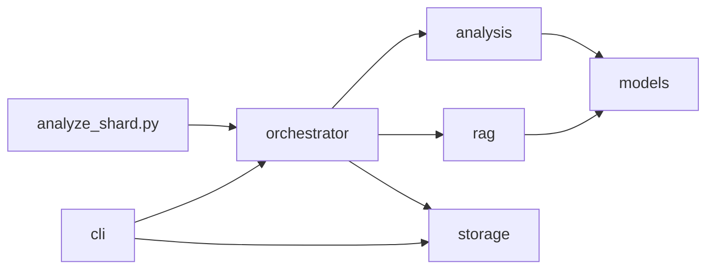

# Python Implementation Area: Core Analysis and Runtime Support

## Overview

The Python code under `src/rekipedia` forms the repository’s analysis/runtime support layer: it is responsible for reading repository metadata, analyzing source relationships, enriching findings, exporting graph and wiki artifacts, and powering the Python-facing CLI surface. The package boundary is clearly organized around a few top-level namespaces:

- `rekipedia.analysis` for static and semantic analysis
- `rekipedia.cli` for Click-based commands
- `rekipedia.models` for shared contracts and dataclasses
- `rekipedia.orchestrator` for higher-level workflow coordination
- `rekipedia.rag` for retrieval/indexing support
- `rekipedia.storage` for persistence adapters

The sandbox task entry point, [`src/rekipedia/sandbox/tasks/analyze_shard.py`](src/rekipedia/sandbox/tasks/analyze_shard.py), is part of the runtime execution path for isolated shard analysis. Although the symbol index does not expose internals for this file, its placement under `sandbox/tasks` indicates that it is intended as an execution boundary for analyzing a single shard in a controlled environment, rather than as a user-facing CLI. In practice, that makes it the likely adapter between a shard descriptor and the lower-level analysis/orchestration stack described below.

At a high level, the runtime flow is:

1. CLI or task entry point collects input.
2. Orchestrator components build context, snapshots, and shards.
3. Analysis modules detect structural issues and enrich them.
4. Storage persists runs, symbols, relationships, pages, and QA history.
5. Export/synthesis layers render Markdown, graphs, and wiki pages.

### Package boundary summary

| Package | Responsibility | Representative symbols |
|---|---|---|
| `rekipedia.analysis` | Detects issues, computes graph-oriented metrics, exports structural views | [`compute_god_nodes`](src/rekipedia/analysis/graph_analysis.py), [`detect_issues`](src/rekipedia/analysis/refactor_enricher.py), [`write_refactor_outputs`](src/rekipedia/analysis/refactor_writer.py) |
| `rekipedia.cli` | User-facing command entry points | [`ask_cmd`](src/rekipedia/cli/ask.py), [`embed_cmd`](src/rekipedia/cli/embed.py), [`export_cmd`](src/rekipedia/cli/export.py) |
| `rekipedia.orchestrator` | Coordinates repository scanning, sharding, digesting, and ask workflows | [`RunDigest`](src/rekipedia/orchestrator/run_digest.py), [`RunUpdate`](src/rekipedia/orchestrator/run_update.py), [`ShardPlanner`](src/rekipedia/orchestrator/sharding.py) |
| `rekipedia.rag` | Chunking and vector storage for retrieval-augmented workflows | [`EmbedPipeline`](src/rekipedia/rag/embedder.py), [`ChunkFile`](src/rekipedia/rag/chunker.py), [`VectorStore`](src/rekipedia/rag/vector_store.py) |
| `rekipedia.storage` | SQLite-backed persistence and aliases | `SqliteStore` methods and aliases in `src/rekipedia/storage` |
| `rekipedia.models` | Shared schemas/contracts | dataclasses and records in `src/rekipedia/models/contracts.py` |

> **Sources:** `src/rekipedia/sandbox/tasks/analyze_shard.py` · `src/rekipedia/analysis/graph_analysis.py` · `src/rekipedia/analysis/refactor_enricher.py` · `src/rekipedia/analysis/refactor_writer.py` · `src/rekipedia/cli/ask.py` · `src/rekipedia/cli/embed.py` · `src/rekipedia/cli/export.py` · `src/rekipedia/orchestrator/run_digest.py` · `src/rekipedia/orchestrator/run_update.py` · `src/rekipedia/orchestrator/sharding.py`

## Core runtime layers

The implementation area under `src` is layered rather than monolithic. The most important internal layers are:

1. **Extraction and model contracts** — normalize repository content into `Symbol`, `Relationship`, `AnalysisResult`, and related structures.
2. **Analysis and enrichment** — compute refactor smells, graph metrics, and supporting metadata.
3. **Orchestration** — sequence scanning, sharding, digesting, and ask/update workflows.
4. **Persistence** — store runs, snapshots, wiki pages, and QA artifacts.
5. **Presentation/export** — generate Markdown/wiki pages and visual outputs.

The call graph crosses package boundaries frequently. For example, `RunDigest` depends on the extractor, LLM client, analysis, synthesis, and storage layers; `RefactorEnricher` depends on the LLM client and analysis contracts; and the CLI commands are thin adapters around these runtime functions.

### Cross-module dependency table

| Module | Imports From | Called By | Calls Into | Inherits From |
|---|---|---|---|---|
| `rekipedia.analysis.graph_analysis` | `collections`, `typing`, `rekipedia.models.contracts` | orchestrator and export/presentation code | model dataclasses | — |
| `rekipedia.analysis.refactor_detector` | `collections`, `dataclasses`, `rekipedia.models.contracts` | writer/enricher/orchestrator paths | model contracts | — |
| `rekipedia.analysis.refactor_enricher` | `logging`, `collections`, `concurrent.futures`, `rekipedia.llm.client`, `rekipedia.models.contracts` | orchestrator runtime | LLM client and model contracts | — |
| `rekipedia.analysis.refactor_writer` | `json`, `datetime`, `pathlib`, `rekipedia.models.contracts` | CLI and runtime output paths | model contracts and filesystem writes | — |
| `rekipedia.orchestrator.run_digest` | `uuid`, `errgroup`, `analysis`, `extractor`, `llm`, `storage`, `synthesis` | CLI `scan`/`update` flows | extraction, analysis, storage, synthesis | — |
| `rekipedia.orchestrator.run_ask` | `llm`, `rag`, `storage`, `models` | CLI `ask` flow | RAG search and context building | — |
| `rekipedia.rag.embedder` | `llm`, `models`, `pkg/fsutil` | CLI `embed` | vector store and chunking helpers | — |
| `rekipedia.storage.store` | `database/sql`, `modernc.org/sqlite`, `rekipedia.models.contracts` | orchestrator and CLI read/write paths | SQLite persistence | — |

> **Sources:** `src/rekipedia/analysis/graph_analysis.py` · `src/rekipedia/analysis/refactor_detector.py` · `src/rekipedia/analysis/refactor_enricher.py` · `src/rekipedia/analysis/refactor_writer.py` · `src/rekipedia/orchestrator/run_digest.py` · `src/rekipedia/orchestrator/run_ask.py` · `src/rekipedia/rag/embedder.py` · `src/rekipedia/storage/store.py`

## Sandbox task entry point

The sandbox task entry point [`src/rekipedia/sandbox/tasks/analyze_shard.py`](src/rekipedia/sandbox/tasks/analyze_shard.py) is the most clearly isolated runtime hook in the Python tree. Even though its symbol body is not surfaced in the index, its role is inferable from the repository structure: it is the task-level boundary for running analysis on a single shard in a sandboxed environment.

That boundary matters for the rest of the Python runtime:

- It likely receives shard metadata or a file set from an outer scheduler.
- It likely invokes orchestrator/analysis functions rather than implementing analysis itself.
- It provides a natural seam for retry, logging, and controlled execution outside the primary CLI.

This design keeps the lower-level analysis code reusable from both CLI and non-CLI entry points. The rest of the Python packages are built to support exactly that style of composition: data contracts in `rekipedia.models`, analyzers in `rekipedia.analysis`, and persistence/export code in `rekipedia.storage` and synthesis modules.

Because the analysis data does not expose the internal symbols for `analyze_shard.py`, the safest conclusion is that it acts as an adapter rather than a core algorithmic module.

> **Sources:** `src/rekipedia/sandbox/tasks/analyze_shard.py`

## Main subsystems

### Analysis and refactor detection

The analysis subsystem provides the repository’s deeper structural reasoning. [`compute_god_nodes`](src/rekipedia/analysis/graph_analysis.py) and [`compute_impact`](src/rekipedia/analysis/impact.py) operate on graph-like relationships to identify important nodes and dependency reach. The refactor subsystem is more specific:

- [`detect_god_nodes`](src/rekipedia/analysis/refactor_detector.py) identifies heavy hub-like symbols.
- [`detect_circular_deps`](src/rekipedia/analysis/refactor_detector.py) identifies cycles.
- [`detect_dead_code`](src/rekipedia/analysis/refactor_detector.py) identifies unused symbols.
- [`detect_high_fan_in`](src/rekipedia/analysis/refactor_detector.py) and [`detect_high_fan_out`](src/rekipedia/analysis/refactor_detector.py) score coupling intensity.
- [`detect_deep_inheritance`](src/rekipedia/analysis/refactor_detector.py) finds inheritance chains that exceed expected depth.
- [`detect_all`](src/rekipedia/analysis/refactor_detector.py) aggregates all detection passes.

The enrichment layer expands those raw findings with context. [`detect_issues`](src/rekipedia/analysis/refactor_enricher.py) is the central coordinator, while helpers such as [`_attach_callers`](src/rekipedia/analysis/refactor_enricher.py), [`_attach_notes`](src/rekipedia/analysis/refactor_enricher.py), [`_build_prompt`](src/rekipedia/analysis/refactor_enricher.py), and [`_parse_enrichment`](src/rekipedia/analysis/refactor_enricher.py) shape human-readable output and LLM-assisted annotations.

### Orchestration and workflow control

The orchestration layer ties together scanning, sharding, context creation, and user workflows. Important symbols include:

- [`ShardPlanner`](src/rekipedia/orchestrator/sharding.py)
- [`Snapshotter`](src/rekipedia/orchestrator/snapshotter.py)
- [`RunDigest`](src/rekipedia/orchestrator/run_digest.py)
- [`RunUpdate`](src/rekipedia/orchestrator/run_update.py)
- [`RunAsk`](src/rekipedia/orchestrator/run_ask.py)

These modules are where the repository turns “analysis functions” into “a complete run.” For example, `RunDigest` imports the extractor, LLM, storage, and synthesis layers, and the `run_ask` flow uses RAG search plus stored wiki pages to construct context.

### Retrieval and embedding support

The RAG subsystem is comparatively self-contained. [`ChunkFile`](src/rekipedia/rag/chunker.py) slices content into chunks, [`EmbedPipeline`](src/rekipedia/rag/embedder.py) builds embeddings and searches them, [`VectorStore`](src/rekipedia/rag/vector_store.py) stores embeddings in Chromem-backed collections, and [`ScanMeta`](src/rekipedia/rag/scan_meta.py) tracks scan metadata.

This layer is important to the runtime, but it is not the main focus of the sandbox task entry point. It is best understood as supporting search, not as core analysis.

### Storage and export/presentation

The persistence layer in [`Store`](src/rekipedia/storage/store.py) provides SQLite-backed state for runs, symbols, relationships, wiki pages, QA records, and manifests. This storage layer is heavily used by orchestration, CLI commands, and cross-repo search.

Presentation is handled by synthesis and exporter code. [`DiagramBuilder`](src/rekipedia/synthesis/diagram_builder.py) builds module graphs and class hierarchies; [`PageBuilder`](src/rekipedia/synthesis/page_builder.py) assembles wiki pages; [`PlannerAgent`](src/rekipedia/synthesis/planner.py) generates page plans. These are downstream of the core analysis/runtime support, but they are part of the same execution chain.

> **Sources:** `src/rekipedia/analysis/graph_analysis.py` · `src/rekipedia/analysis/impact.py` · `src/rekipedia/analysis/refactor_detector.py` · `src/rekipedia/analysis/refactor_enricher.py` · `src/rekipedia/orchestrator/sharding.py` · `src/rekipedia/orchestrator/snapshotter.py` · `src/rekipedia/orchestrator/run_digest.py` · `src/rekipedia/orchestrator/run_update.py` · `src/rekipedia/orchestrator/run_ask.py` · `src/rekipedia/rag/chunker.py` · `src/rekipedia/rag/embedder.py` · `src/rekipedia/rag/vector_store.py` · `src/rekipedia/rag/scan_meta.py` · `src/rekipedia/storage/store.py` · `src/rekipedia/synthesis/diagram_builder.py` · `src/rekipedia/synthesis/page_builder.py` · `src/rekipedia/synthesis/planner.py`

## Important implementation symbols

The table below highlights the most important implementation symbols surfaced by the index, with emphasis on the sandbox entry point and the core runtime helpers that support it.

| Symbol | File | Purpose |
|---|---|---|
| `analyze_shard.py` | `src/rekipedia/sandbox/tasks/analyze_shard.py` | Sandbox task entry point for shard-level analysis |
| [`detect_issues`](src/rekipedia/analysis/refactor_enricher.py) | `src/rekipedia/analysis/refactor_enricher.py` | Builds enriched refactor issue sets |
| [`detect_all`](src/rekipedia/analysis/refactor_detector.py) | `src/rekipedia/analysis/refactor_detector.py` | Runs all refactor detectors |
| [`detect_god_nodes`](src/rekipedia/analysis/refactor_detector.py) | `src/rekipedia/analysis/refactor_detector.py` | Flags hub-like symbols |
| [`detect_circular_deps`](src/rekipedia/analysis/refactor_detector.py) | `src/rekipedia/analysis/refactor_detector.py` | Detects dependency cycles |
| [`detect_dead_code`](src/rekipedia/analysis/refactor_detector.py) | `src/rekipedia/analysis/refactor_detector.py` | Identifies unused symbols |
| [`compute_god_nodes`](src/rekipedia/analysis/graph_analysis.py) | `src/rekipedia/analysis/graph_analysis.py` | Computes high-degree nodes |
| [`compute_impact`](src/rekipedia/analysis/impact.py) | `src/rekipedia/analysis/impact.py` | Calculates impact/churn-like metrics |
| [`RunDigest`](src/rekipedia/orchestrator/run_digest.py) | `src/rekipedia/orchestrator/run_digest.py` | Main digest workflow coordinator |
| [`RunUpdate`](src/rekipedia/orchestrator/run_update.py) | `src/rekipedia/orchestrator/run_update.py` | Incremental update workflow |
| [`RunAsk`](src/rekipedia/orchestrator/run_ask.py) | `src/rekipedia/orchestrator/run_ask.py` | Q&A orchestration and context building |
| [`ShardPlanner`](src/rekipedia/orchestrator/sharding.py) | `src/rekipedia/orchestrator/sharding.py` | Breaks repositories into budget-aware shards |
| [`Snapshotter`](src/rekipedia/orchestrator/snapshotter.py) | `src/rekipedia/orchestrator/snapshotter.py` | Builds stable filesystem snapshots |
| [`EmbedPipeline`](src/rekipedia/rag/embedder.py) | `src/rekipedia/rag/embedder.py` | Embedding build/search pipeline |
| [`VectorStore`](src/rekipedia/rag/vector_store.py) | `src/rekipedia/rag/vector_store.py` | Persistent vector search storage |
| [`Store`](src/rekipedia/storage/store.py) | `src/rekipedia/storage/store.py` | SQLite persistence wrapper |
| [`DiagramBuilder`](src/rekipedia/synthesis/diagram_builder.py) | `src/rekipedia/synthesis/diagram_builder.py` | Produces graph and hierarchy diagrams |
| [`PageBuilder`](src/rekipedia/synthesis/page_builder.py` | `src/rekipedia/synthesis/page_builder.py` | Builds wiki page content |

> **Sources:** `src/rekipedia/sandbox/tasks/analyze_shard.py` · `src/rekipedia/analysis/refactor_enricher.py` · `src/rekipedia/analysis/refactor_detector.py` · `src/rekipedia/analysis/graph_analysis.py` · `src/rekipedia/analysis/impact.py` · `src/rekipedia/orchestrator/run_digest.py` · `src/rekipedia/orchestrator/run_update.py` · `src/rekipedia/orchestrator/run_ask.py` · `src/rekipedia/orchestrator/sharding.py` · `src/rekipedia/orchestrator/snapshotter.py` · `src/rekipedia/rag/embedder.py` · `src/rekipedia/rag/vector_store.py` · `src/rekipedia/storage/store.py` · `src/rekipedia/synthesis/diagram_builder.py` · `src/rekipedia/synthesis/page_builder.py`

## Notable helper modules

Several helper modules keep the runtime cohesive:

- [`rekipedia.models.contracts`](src/rekipedia/models/contracts.py) defines the shared structures used everywhere else, such as `LLMConfig`, `Symbol`, `Relationship`, `AnalysisResult`, `Shard`, `WikiPageSpec`, and `ScanMeta`.
- [`rekipedia.analysis.refactor_writer`](src/rekipedia/analysis/refactor_writer.py) turns detected issues into Markdown/JSON outputs.
- [`rekipedia.analysis.graph_export`](src/rekipedia/analysis/graph_export.py) emits graph representations such as GraphML, Cypher, and Obsidian notes.
- [`rekipedia.analysis.cross_repo_search`](src/rekipedia/analysis/cross_repo_search.py) supports searching across repositories using stored symbol data.

These helpers are not the shard entry point themselves, but they provide the runtime support that makes the sandbox task useful in the broader repository workflow.

> **Sources:** `src/rekipedia/models/contracts.py` · `src/rekipedia/analysis/refactor_writer.py` · `src/rekipedia/analysis/graph_export.py` · `src/rekipedia/analysis/cross_repo_search.py`

## Summary

The Python implementation area under `src` is the repository’s analysis/runtime backbone. The sandbox task entry point [`src/rekipedia/sandbox/tasks/analyze_shard.py`](src/rekipedia/sandbox/tasks/analyze_shard.py) sits at the edge of that backbone, likely acting as the isolated execution adapter for shard analysis. Underneath it, the system is organized into reusable layers: analysis, orchestration, RAG, storage, synthesis, and model contracts. That separation makes it possible to reuse the same core logic from both CLI commands and sandboxed task execution without duplicating behavior.

If you are tracing a code path from shard analysis outward, the most relevant internal symbols are the orchestrator workflow functions (`RunDigest`, `RunUpdate`, `RunAsk`), the detector/enricher pair (`detect_all`, `detect_issues`), and the shared contract types in `rekipedia.models.contracts`.

> **Sources:** `src/rekipedia/sandbox/tasks/analyze_shard.py` · `src/rekipedia/orchestrator/run_digest.py` · `src/rekipedia/orchestrator/run_update.py` · `src/rekipedia/orchestrator/run_ask.py` · `src/rekipedia/analysis/refactor_detector.py` · `src/rekipedia/analysis/refactor_enricher.py` · `src/rekipedia/models/contracts.py`