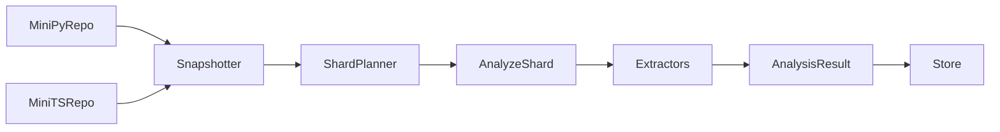

# Sandboxed Task Runner and Fixture Repositories

## Overview

This page documents two closely related parts of the repository’s analysis pipeline:

1. the sandboxed task runner used to execute controlled analysis work, and
2. the embedded fixture repositories used to validate parsing, symbol extraction, sharding, and downstream analysis behavior.

The sandboxed entry point is [`analyze_shard.py`](src/rekipedia/sandbox/tasks/analyze_shard.py), which appears in the repository’s entry-point inventory alongside the main Go CLI entry point [`main.go`](go/cmd/rekipedia/main.go). While the analysis data does not include the implementation body of `analyze_shard.py`, its presence as a dedicated task module strongly suggests that shard analysis is intentionally isolated from the user-facing CLI path. That separation matters because the core pipeline depends on reliable, repeatable extraction from real repositories, and sandbox execution helps keep that work reproducible and bounded.

The fixture repositories are especially important because the codebase’s extractors and orchestrator are built to operate on repository-shaped inputs, not just isolated files. The relevant entry points are [`main.py`](tests/fixtures/mini-py-repo/main.py) and [`index.ts`](tests/fixtures/mini-ts-repo/src/index.ts). These fixtures give the system small, deterministic repositories that demonstrate the behaviors the core pipeline must preserve: language detection, function/class extraction, imports, entry-point handling, and repository scanning semantics.

In practice, these fixtures act as “known-good” corpora. They are not just sample code; they are executable representations of the language and repository patterns the tool must understand. That makes them foundational to validating the behavior of [`PythonExtractor`](go/internal/extractor/python.go#L25-L201), [`TypeScriptExtractor`](go/internal/extractor/typescript.go#L25-L149), and orchestrator logic such as [`Snapshotter.Snapshot`](go/internal/orchestrator/snapshotter.go#L89-L147) and [`ShardPlanner.Plan`](go/internal/orchestrator/sharding.go#L31-L54).

> **Sources:** `src/rekipedia/sandbox/tasks/analyze_shard.py` · `go/cmd/rekipedia/main.go` · `tests/fixtures/mini-py-repo/main.py` · `tests/fixtures/mini-ts-repo/src/index.ts`

## Sandboxed Task Runner

### Role in the pipeline

The sandbox task runner exists to run shard-level analysis outside the normal interactive or batch CLI flow. In the observed repository structure, the main user entry point is the Go CLI [`main`](go/cmd/rekipedia/main.go#L6-L8), but shard analysis is delegated to [`analyze_shard.py`](src/rekipedia/sandbox/tasks/analyze_shard.py). That division is consistent with a design where:

- the CLI orchestrates top-level user actions,
- the sandbox executes controlled analysis work, and
- intermediate artifacts are produced from isolated shard inputs rather than the whole repo.

This is a useful structure for analysis systems because it allows the expensive and failure-prone parts of the workflow—scanning, parsing, symbol extraction, and report generation—to be executed in a constrained environment. It also reduces blast radius when analyzing malformed repositories or intentionally adversarial inputs.

### How the sandbox task is invoked

The analysis data does not show the exact command line or shell wrapper for `analyze_shard.py`, so we should be careful not to overstate the invocation contract. What is observable is that the repository contains both:

- a Go application entry point [`main`](go/cmd/rekipedia/main.go#L6-L8), and
- a dedicated sandbox task module [`analyze_shard.py`](src/rekipedia/sandbox/tasks/analyze_shard.py).

A practical reading is that the sandbox task is launched as a separate analysis worker for shard processing, rather than through the user-facing commands exposed by the Go CLI. That distinction matters because shard execution likely feeds into repository-wide workflows such as snapshotting, sharding, embedding, and synthesis.

### Why sandboxing matters for analysis correctness

Sandboxing protects the validity of core behaviors by ensuring each shard is processed in a controlled and repeatable context. That is particularly important for code that must handle:

- repository traversal and filtering,
- language-specific parsing,
- symbol and relationship extraction,
- repository-level aggregation.

The Go-side orchestrator makes this need visible through [`Snapshotter`](go/internal/orchestrator/snapshotter.go#L57-L62), [`NewSnapshotter`](go/internal/orchestrator/snapshotter.go#L67-L86), and [`RunDigest`](go/internal/orchestrator/run_digest.go#L48-L309), which collectively show a pipeline that snapshots, chunks, analyzes, and merges shard-level results.

> **Sources:** `src/rekipedia/sandbox/tasks/analyze_shard.py` · `go/cmd/rekipedia/main.go` · `go/internal/orchestrator/snapshotter.go` · `go/internal/orchestrator/run_digest.go`

## Fixture Repositories and Why They Matter

### Fixtures as behavioral contracts

The embedded fixture repositories are compact but strategically chosen. They are designed to exercise the shape of real repositories without introducing unnecessary complexity. In an analysis system, this is critical: the goal is not to test every edge case in isolation, but to validate that the pipeline consistently recognizes the structural cues it depends on.

The fixture entry points are:

- [`tests/fixtures/mini-py-repo/main.py`](tests/fixtures/mini-py-repo/main.py)
- [`tests/fixtures/mini-ts-repo/src/index.ts`](tests/fixtures/mini-ts-repo/src/index.ts)

These two files represent the canonical “root” files for small Python and TypeScript repositories. They are the most important fixture entry points because they anchor parsing expectations for top-level modules, imports, and function/class discovery. In other words, they are the smallest repositories that still look like real software.

### What they validate in the core pipeline

The extractors in the Go codebase show exactly why these fixtures matter. The Python path is handled by [`PythonExtractor.Extract`](go/internal/extractor/python.go#L37-L135), which is responsible for recognizing Python functions, classes, docstrings, and import relationships. The TypeScript path is handled by [`TypeScriptExtractor.Extract`](go/internal/extractor/typescript.go#L40-L141), which performs similar work for TypeScript symbols and relationships.

The fixtures validate that:

- repository root files are recognized as meaningful entry points,
- language-specific extractors can handle minimal but realistic code,
- relationships are captured in a way that downstream graph and search code can use,
- repository scanning and sharding don’t skip important top-level files.

This is especially relevant to the orchestrator’s [`detectLanguage`](go/internal/orchestrator/snapshotter.go#L162-L172) and [`fileTokenEstimate`](go/internal/orchestrator/sharding.go#L100-L106), which rely on repository contents being interpreted correctly before sharding and analysis.

### Why “small” fixtures are powerful

Small fixtures are more effective than large sample repositories for validating core functionality because they isolate the analysis mechanics. A minimal repository makes it easier to see whether the pipeline is:

- discovering the correct entry point,
- traversing files as intended,
- extracting the right symbol types,
- classifying imports and relationships consistently,
- treating a repository as a repository, not just as a loose set of files.

That is the real value of these fixture repos: they provide high-signal inputs for the lowest-level guarantees in the analysis stack.

> **Sources:** `tests/fixtures/mini-py-repo/main.py` · `tests/fixtures/mini-ts-repo/src/index.ts` · `go/internal/extractor/python.go` · `go/internal/extractor/typescript.go` · `go/internal/orchestrator/snapshotter.go` · `go/internal/orchestrator/sharding.go`

## Fixture Directory Summary

| Fixture directory | Entry point | What it demonstrates |
|---|---|---|
| `tests/fixtures/mini-py-repo` | [`main.py`](tests/fixtures/mini-py-repo/main.py) | Python repository shape, top-level script entry point, and Python parsing expectations |
| `tests/fixtures/mini-ts-repo` | [`src/index.ts`](tests/fixtures/mini-ts-repo/src/index.ts) | TypeScript repository shape, module entry point, and TS parsing expectations |

These directories are intentionally minimal. Their job is to demonstrate the core language surface area that the extractors must understand, not to model full application complexity. They are best thought of as “reference repos” for the parser and repository scanner.

> **Sources:** `tests/fixtures/mini-py-repo/main.py` · `tests/fixtures/mini-ts-repo/src/index.ts`

## Relationship to Extraction, Sharding, and Analysis

### End-to-end flow

The fixture repositories are most useful when viewed in the context of the analysis pipeline:

In this flow, the fixtures provide input repositories, the snapshotter detects and records their structure, the sharder splits work into manageable units, and the sandbox task performs the actual shard analysis.

### Why this validates core functionality

This flow ensures that repository-level behavior is checked all the way through the system:

- [`Snapshotter.Snapshot`](go/internal/orchestrator/snapshotter.go#L89-L147) determines what files and languages are present.
- [`ShardPlanner.Plan`](go/internal/orchestrator/sharding.go#L31-L54) decides how to break work into shards.
- [`analyze_shard.py`](src/rekipedia/sandbox/tasks/analyze_shard.py) executes the shard analysis.
- [`PythonExtractor`](go/internal/extractor/python.go#L25-L201) and [`TypeScriptExtractor`](go/internal/extractor/typescript.go#L25-L149) convert source into symbols and relationships.
- The resulting artifacts feed downstream storage and synthesis.

Because the fixtures are small and predictable, they are ideal for confirming that this path still works when code evolves. If parsing rules change or sharding heuristics regress, these fixtures should expose the failure immediately.

> **Sources:** `src/rekipedia/sandbox/tasks/analyze_shard.py` · `go/internal/orchestrator/snapshotter.go` · `go/internal/orchestrator/sharding.go` · `go/internal/extractor/python.go` · `go/internal/extractor/typescript.go`

## Key Takeaways

### For maintainers

- The sandboxed runner isolates shard analysis from the main CLI path.
- The fixture repos are not incidental test data; they are core validation inputs.
- [`main.py`](tests/fixtures/mini-py-repo/main.py) and [`src/index.ts`](tests/fixtures/mini-ts-repo/src/index.ts) are the most important fixture entry points because they define the smallest useful repository structures for Python and TypeScript.
- These fixtures matter because the system’s correctness depends on accurate parsing, stable language detection, and consistent repository traversal.

### Practical guidance

When changing the extractor logic, snapshotter heuristics, or shard planning rules, use these fixtures as the first checkpoint. They are the quickest way to verify that the pipeline still understands the basic shape of a real repository before testing on larger codebases.

> **Sources:** `src/rekipedia/sandbox/tasks/analyze_shard.py` · `tests/fixtures/mini-py-repo/main.py` · `tests/fixtures/mini-ts-repo/src/index.ts` · `go/internal/extractor/python.go` · `go/internal/extractor/typescript.go`