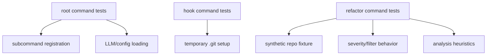

# Test Architecture

## Overview

The repository’s test architecture is organized around three main validation layers:

1. **CLI contract tests** — These verify that Cobra command registration, flags, and command trees are wired correctly at the top level in `go/cmd/rekipedia/cmd`. Representative examples include [`TestRootCommandHasSubcommands`](go/cmd/rekipedia/cmd/root_test.go#L19), [`TestRefactorCmdRegistered`](go/cmd/rekipedia/cmd/refactor_test.go#L15), and [`TestHookInstall`](go/cmd/rekipedia/cmd/hook_test.go#L20).
2. **Analysis engine tests** — These exercise the refactor detectors directly under `go/internal/analysis`, ensuring the heuristics are stable for circular dependencies, dead code, fan-in/fan-out, and inheritance depth. A key example is [`TestDetectCircularDeps_NoCycle`](go/internal/analysis/refactor_detector_test.go#L77).
3. **Fixture-backed integration-style tests** — These use temporary repositories and repository-like test inputs to simulate real-world scanning conditions, such as custom repos created by helpers like [`makeTestRepo`](go/cmd/rekipedia/cmd/refactor_test.go#L50) and fixture content under `tests/fixtures/mini-py-repo` and `tests/fixtures/mini-ts-repo`.

Taken together, these layers validate the repository from the outside in: the CLI surface is registered correctly, the analysis code classifies issues correctly, and filesystem/repo fixtures exercise behavior close to production usage. This structure is especially visible in the `go/cmd/rekipedia/cmd` tests, which check whether commands are present and properly parameterized, while `go/internal/analysis` tests focus on the mechanics of detection and enrichment.

> **Sources:** `go/cmd/rekipedia/cmd/root_test.go` · `go/cmd/rekipedia/cmd/refactor_test.go` · `go/cmd/rekipedia/cmd/hook_test.go` · `go/internal/analysis/refactor_detector_test.go`

## Test Areas and Responsibilities

The repository groups tests by behavioral area rather than by only source package boundaries. The table below summarizes the major clusters visible in the analysis data.

| Area | Representative Test Symbols | What It Validates | Typical Test Style |
|------|-----------------------------|-------------------|--------------------|
| Root command wiring | [`TestRootCommandHasSubcommands`](go/cmd/rekipedia/cmd/root_test.go#L19), [`TestRootVersionFlag`](go/cmd/rekipedia/cmd/root_test.go#L9) | Root command exists, exposes subcommands, and surfaces version behavior | CLI tree inspection |
| Hook lifecycle | [`TestHookInstall`](go/cmd/rekipedia/cmd/hook_test.go#L20), [`TestHookUninstall`](go/cmd/rekipedia/cmd/hook_test.go#L52), [`TestHookStatusInstalled`](go/cmd/rekipedia/cmd/hook_test.go#L91) | Git hook install/uninstall/status flows | Temp `.git` directory setup |
| Refactor command registration | [`TestRefactorCmdRegistered`](go/cmd/rekipedia/cmd/refactor_test.go#L15), [`TestRefactorCmdFlags`](go/cmd/rekipedia/cmd/refactor_test.go#L28), [`TestRefactorCmdUseLine`](go/cmd/rekipedia/cmd/refactor_test.go#L40) | `refactor` command is exported with the expected CLI shape | Cobra command assertions |
| Refactor detection heuristics | [`TestStaticWalkFindsTODO`](go/cmd/rekipedia/cmd/refactor_test.go#L65), [`TestStaticWalkSkipsGitDir`](go/cmd/rekipedia/cmd/refactor_test.go#L106), [`TestApplyFilterHigh`](go/cmd/rekipedia/cmd/refactor_test.go#L173) | Static scan pipeline and filtering behavior | Synthetic temp repo with files |
| Circular dependency detection | [`TestDetectCircularDeps_NoCycle`](go/internal/analysis/refactor_detector_test.go#L77), [`TestDetectCircularDeps_SimpleCycle`](go/internal/analysis/refactor_detector_test.go#L88) | Cycle detection correctness and deduplication | Table-driven graph fixtures |
| Dead code and complexity heuristics | [`TestDetectDeadCode_PrivatePythonFlagged`](go/internal/analysis/refactor_detector_test.go#L135), [`TestDetectHighFanIn_Detected`](go/internal/analysis/refactor_detector_test.go#L201), [`TestDetectDeepInheritance_Detected`](go/internal/analysis/refactor_detector_test.go#L281) | Classification thresholds and language-specific rules | Mock symbols/relationships |
| Root configuration loading | [`TestLoadLLMConfig`](go/cmd/rekipedia/cmd/root_test.go#L91), [`TestLoadLLMConfigDefaults`](go/cmd/rekipedia/cmd/root_test.go#L104) | Config fallback and parsing from root-level settings | Config/file loading |

> **Sources:** `go/cmd/rekipedia/cmd/root_test.go` · `go/cmd/rekipedia/cmd/hook_test.go` · `go/cmd/rekipedia/cmd/refactor_test.go` · `go/internal/analysis/refactor_detector_test.go`

## CLI Behavior Validation

The CLI tests are concentrated in `go/cmd/rekipedia/cmd` and are structured to ensure the command hierarchy remains stable. The most important pattern is command registration verification: tests such as [`TestRootCommandHasSubcommands`](go/cmd/rekipedia/cmd/root_test.go#L19) and [`TestRefactorCmdRegistered`](go/cmd/rekipedia/cmd/refactor_test.go#L15) assert that command constructors and `init()`-time registration logic actually attach commands to the root tree.

The hook commands receive their own lifecycle coverage through [`TestHookInstall`](go/cmd/rekipedia/cmd/hook_test.go#L20), [`TestHookUninstall`](go/cmd/rekipedia/cmd/hook_test.go#L52), and [`TestHookStatusInstalled`](go/cmd/rekipedia/cmd/hook_test.go#L91). These tests use helper setup like [`makeGitDir`](go/cmd/rekipedia/cmd/hook_test.go#L10) to create a realistic `.git` layout before invoking command logic. That makes the tests less about isolated function correctness and more about end-user command semantics: can the command find the repository, does it report status, and does it behave safely when state is missing or already present?

The refactor command tests are broader. They validate the command’s interface, but also its execution path when pointed at a temporary repository created by [`makeTestRepo`](go/cmd/rekipedia/cmd/refactor_test.go#L50). In this area, the tests demonstrate how CLI behavior is coupled to repo scanning: once the command is registered, it must also produce meaningful output when scanning TODO/FIXME markers, ignoring `.git` and `node_modules`, and applying severity filters.

> **Sources:** `go/cmd/rekipedia/cmd/root_test.go` · `go/cmd/rekipedia/cmd/hook_test.go` · `go/cmd/rekipedia/cmd/refactor_test.go`

## Detector and Analysis Test Coverage

The analysis layer is validated in `go/internal/analysis/refactor_detector_test.go`, which focuses on the actual issue detection algorithms in [`DetectCircularDeps`](go/internal/analysis/refactor_detector.go#L103), [`DetectDeadCode`](go/internal/analysis/refactor_detector.go#L204), [`DetectHighFanIn`](go/internal/analysis/refactor_detector.go#L234), [`DetectHighFanOut`](go/internal/analysis/refactor_detector.go#L279), [`DetectDeepInheritance`](go/internal/analysis/refactor_detector.go#L323), and [`DetectAll`](go/internal/analysis/refactor_detector.go#L404).

A useful pattern here is that the tests cover both positive and negative cases:

- **Positive detections** prove the detector fires when the condition is present.
- **Negative cases** prove thresholds and exclusions are respected, such as no-cycle scenarios, below-threshold fan-in/fan-out, and non-inheritance symbols being ignored.
- **Deduplication and edge behavior** confirm the detector does not double-report cycles or self-loops.

For example, [`TestDetectCircularDeps_NoCycle`](go/internal/analysis/refactor_detector_test.go#L77) establishes the baseline “no findings” case, while [`TestDetectCircularDeps_SimpleCycle`](go/internal/analysis/refactor_detector_test.go#L88) and [`TestDetectCircularDeps_TwoCyclesDeduplicated`](go/internal/analysis/refactor_detector_test.go#L109) verify that cycle detection both finds actual loops and avoids redundant reporting. Similarly, [`TestDetectDeadCode_PrivatePythonFlagged`](go/internal/analysis/refactor_detector_test.go#L135) and [`TestDetectDeadCode_PublicPythonExcluded`](go/internal/analysis/refactor_detector_test.go#L154) capture the language-sensitive distinction between private and public symbols.

The broader `DetectAll` entry point is also covered by [`TestDetectAll_ReturnsMultipleKinds`](go/internal/analysis/refactor_detector_test.go#L350), which ensures the dispatcher aggregates multiple issue kinds rather than only one class of result.

> **Sources:** `go/internal/analysis/refactor_detector.go` · `go/internal/analysis/refactor_detector_test.go`

## Fixture Usage and Repository Simulation

Repository fixtures are used to move beyond pure unit tests and validate behavior against realistic file layouts. The analysis data includes explicit repo-shaped entry points such as `tests/fixtures/mini-py-repo/main.py` and `tests/fixtures/mini-ts-repo/src/index.ts`, which indicate that the test suite is intended to exercise Python and TypeScript repository shapes, not just Go code.

Within the Go tests, this fixture philosophy appears in helpers like [`makeTestRepo`](go/cmd/rekipedia/cmd/refactor_test.go#L50), which creates temporary directories with representative files and folder structures. The refactor tests then verify important file-system rules:

- `.git` directories are skipped
- `node_modules` directories are skipped
- Empty repos are handled safely
- Marker scanning finds TODO/FIXME patterns in expected files

This fixture strategy matters because the repo’s functionality is strongly filesystem-driven. The CLI and analysis layers both depend on walking repositories, classifying files, and generating reports. A small but realistic repo fixture gives much better confidence than mocking only function inputs.

Although the static analysis payload does not enumerate every fixture-specific assertion in the Python/TypeScript fixtures, it is clear that the repository intentionally includes cross-language sample repos to validate language-aware scanning and extraction behavior across the broader system.

> **Sources:** `go/cmd/rekipedia/cmd/refactor_test.go` · `tests/fixtures/mini-py-repo/main.py` · `tests/fixtures/mini-ts-repo/src/index.ts`

## Root Configuration Loading

The root command tests also cover configuration loading behavior, especially via [`TestLoadLLMConfig`](go/cmd/rekipedia/cmd/root_test.go#L91) and [`TestLoadLLMConfigDefaults`](go/cmd/rekipedia/cmd/root_test.go#L104). These tests ensure that command startup can derive an LLM configuration from available root-level settings and fall back to defaults when necessary.

This is important because configuration is not isolated to one command. In the CLI surface, configuration loading affects interactive or LLM-backed commands such as ask/refactor/update flows, so validating root-level config behavior protects multiple downstream code paths. The tests do not appear to exhaust every possible configuration combination, but they do cover the essential contract: configuration should be loadable, and defaults should be sensible when no explicit config is provided.

In architectural terms, this makes the root tests the “entry gate” for the rest of the command tree. If root config parsing breaks, downstream commands may still be registered but fail at runtime with incomplete context.

> **Sources:** `go/cmd/rekipedia/cmd/root_test.go` · `go/cmd/rekipedia/cmd/scan.go`

## Relationship Between Layers

The test suite is layered so that each tier validates a different failure mode:

| Layer | Primary Risk It Catches | Example Symbols |
|------|-------------------------|-----------------|
| Command registration | Missing or miswired CLI commands | [`TestRootCommandHasSubcommands`](go/cmd/rekipedia/cmd/root_test.go#L19), [`TestRefactorCmdRegistered`](go/cmd/rekipedia/cmd/refactor_test.go#L15) |
| Runtime command behavior | Bad flags, missing hook operations, broken repo traversal | [`TestHookInstall`](go/cmd/rekipedia/cmd/hook_test.go#L20), [`TestStaticWalkSkipsGitDir`](go/cmd/rekipedia/cmd/refactor_test.go#L106) |
| Analyzer correctness | Incorrect heuristics or regressions in detection logic | [`TestDetectCircularDeps_NoCycle`](go/internal/analysis/refactor_detector_test.go#L77), [`TestDetectHighFanIn_Detected`](go/internal/analysis/refactor_detector_test.go#L201) |
| Configuration bootstrapping | Startup failures due to missing defaults or parsing issues | [`TestLoadLLMConfig`](go/cmd/rekipedia/cmd/root_test.go#L91) |

This design is good test architecture because the cheapest checks happen first: the repository verifies command registration and basic config loading before moving into the more expensive repo fixture and detector tests. It also keeps failure localization straightforward: if a test fails in registration, the issue is likely in CLI wiring; if it fails in detector tests, the issue is likely in analysis logic.

> **Sources:** `go/cmd/rekipedia/cmd/root_test.go` · `go/cmd/rekipedia/cmd/hook_test.go` · `go/cmd/rekipedia/cmd/refactor_test.go` · `go/internal/analysis/refactor_detector_test.go`