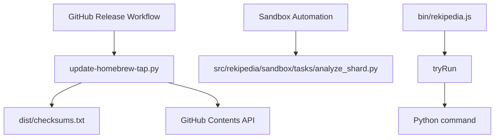

# Python-Facing Surface Reference

## Overview

This page documents the repository’s Python-facing automation surface: standalone scripts, sandbox helpers, and Python-accessible repository utilities that are intended to be invoked as part of local automation or CI workflows. The strongest Python-specific entry point is the Homebrew tap updater in [`.github/scripts/update-homebrew-tap.py`](.github/scripts/update-homebrew-tap.py), which contains the repository’s explicit Python helper functions for release automation. The other notable Python asset is the sandbox task runner [``src/rekipedia/sandbox/tasks/analyze_shard.py``](src/rekipedia/sandbox/tasks/analyze_shard.py), which appears in the repository’s entry points list and is therefore part of the automation surface even though symbol-level analysis was not provided for its internals.

Because the analysis data is heavily Go-oriented, this page is intentionally not a general Python programming guide. Instead, it focuses on what is actually observable: file-level responsibilities, callable helper functions, and how those pieces fit into the broader automation and sandbox workflow.

### Scope of what is documented

- Python scripts used for automation
- Sandbox helper modules/tasks that are invoked by the repository
- Automation-oriented Python symbols that can be called by tooling or CI
- The calling contexts that are visible from the repository structure and cross-module summaries

> **Sources:** `.github/scripts/update-homebrew-tap.py` · L1–L87 · [`read_checksums_from_dist`](.github/scripts/update-homebrew-tap.py#L36), [`gh_get_sha`](.github/scripts/update-homebrew-tap.py#L58), [`gh_put`](.github/scripts/update-homebrew-tap.py#L71); `src/rekipedia/sandbox/tasks/analyze_shard.py` · entry point listed in analysis data

## Package / Module Overview

The repository does not expose a large Python package hierarchy in the analysis payload. Instead, the Python-facing surface is concentrated in two areas:

| Python module / script | Main functions / responsibilities | Calling context |
|---|---|---|
| [`.github/scripts/update-homebrew-tap.py`](.github/scripts/update-homebrew-tap.py) | `read_checksums_from_dist()`, `gh_get_sha(path)`, `gh_put(path, content, sha, message)` | Release automation / GitHub tap update workflow |
| [`src/rekipedia/sandbox/tasks/analyze_shard.py`](src/rekipedia/sandbox/tasks/analyze_shard.py) | Sandbox task entry point (symbols not provided in analysis) | Entry point for shard analysis inside the sandbox workflow |
| [`tests/fixtures/mini-py-repo/main.py`](tests/fixtures/mini-py-repo/main.py) | Fixture-only sample Python program | Test fixture, not production automation |
| [`bin/rekipedia.js`](bin/rekipedia.js) | `tryRun(cmd, cmdArgs)` is a Node wrapper around command execution | Cross-language launcher; relevant because it can dispatch Python or other automation commands |

A practical way to think about this surface is that Python is used in two roles here:

1. **Repository automation script** — the Homebrew updater script performs a narrow release-maintenance job.
2. **Sandbox task module** — `analyze_shard.py` participates in repository automation by being an executable task in the sandboxed analysis pipeline.

The repository’s core orchestration is otherwise implemented in Go, so the Python surface is intentionally narrow and task-oriented.



> **Sources:** `.github/scripts/update-homebrew-tap.py` · L1–L87; `bin/rekipedia.js` · `tryRun(cmd, cmdArgs)`; `src/rekipedia/sandbox/tasks/analyze_shard.py` · entry point listed in analysis data

## Key Functions

### `.github/scripts/update-homebrew-tap.py`

The automation script exposes three concrete helpers:

- [`read_checksums_from_dist()`](.github/scripts/update-homebrew-tap.py#L36) reads SHA-256 values from Goreleaser’s `dist/checksums.txt`, explicitly avoiding a download step.
- [`gh_get_sha(path)`](.github/scripts/update-homebrew-tap.py#L58) retrieves the current blob SHA for a file path in the GitHub-hosted tap repository.
- [`gh_put(path, content, sha, message)`](.github/scripts/update-homebrew-tap.py#L71) writes updated content back to GitHub using the expected SHA and commit message.

These functions show a very targeted workflow: derive release checksums locally, inspect the remote file state, then update the tap file atomically using the GitHub API’s SHA-based concurrency model.

| Function | Purpose | Notable behavior |
|---|---|---|
| `read_checksums_from_dist()` | Parse generated release checksums | Uses `dist/checksums.txt`; avoids re-downloading artifacts |
| `gh_get_sha(path)` | Read remote object SHA | Enables safe update semantics |
| `gh_put(path, content, sha, message)` | Update remote content | Requires the current SHA and a commit message |

### Sandbox task surface

The analysis data lists [`src/rekipedia/sandbox/tasks/analyze_shard.py`](src/rekipedia/sandbox/tasks/analyze_shard.py) as an entry point. While symbol-level internals were not provided, its presence as an entry point indicates that it is intended to be run directly by the sandbox automation pipeline, not imported as a general-purpose library.

### Cross-language launcher

The repository also contains the Node helper [`tryRun(cmd, cmdArgs)`](bin/rekipedia.js#L4) in `bin/rekipedia.js`. Even though it is not Python, it matters to Python automation because it likely serves as a command runner for scripts invoked from tooling or local developer workflows.

> **Sources:** `.github/scripts/update-homebrew-tap.py` · L36–L87 · [`read_checksums_from_dist`](.github/scripts/update-homebrew-tap.py#L36), [`gh_get_sha`](.github/scripts/update-homebrew-tap.py#L58), [`gh_put`](.github/scripts/update-homebrew-tap.py#L71); `src/rekipedia/sandbox/tasks/analyze_shard.py` · entry point listed in analysis data; `bin/rekipedia.js` · [`tryRun`](bin/rekipedia.js#L4)

## Calling Contexts

The repository’s Python surface is used in a few distinct contexts:

### 1. Release automation

The Homebrew updater script fits a CI/release pipeline use case. It is specifically concerned with reading generated artifacts, updating tap metadata, and synchronizing with GitHub. The use of `read_checksums_from_dist()` is especially telling: it assumes a prior build step has already produced `dist/checksums.txt`.

### 2. Sandbox task execution

`analyze_shard.py` is treated as a task entry point inside `src/rekipedia/sandbox/tasks/`. That suggests the file is invoked by a higher-level runner rather than being a utility library.

### 3. Test fixtures

`tests/fixtures/mini-py-repo/main.py` is a fixture, not an automation module. It exists to support tests around repository scanning/extraction and should not be confused with the production Python surface.

### 4. Launcher-mediated execution

The Node helper [`tryRun`](bin/rekipedia.js#L4) can serve as a bridge for executing scripts from the repository’s command-line tooling. This is relevant when Python scripts are invoked indirectly rather than by hand.

> **Sources:** `tests/fixtures/mini-py-repo/main.py` · fixture entry point listed in analysis data; `bin/rekipedia.js` · [`tryRun`](bin/rekipedia.js#L4); `.github/scripts/update-homebrew-tap.py` · L36–L87

## Example Usage

### Update the Homebrew tap from release artifacts

The observable purpose of [`.github/scripts/update-homebrew-tap.py`](.github/scripts/update-homebrew-tap.py) is to consume release output and refresh the tap repository state. A typical flow is:

1. Build the release artifacts so `dist/checksums.txt` exists.
2. Run the checksum reader.
3. Retrieve the remote SHA for the target tap file.
4. Write the updated content back with the expected SHA.

Conceptually:

```python
from .github.scripts.update_homebrew_tap import read_checksums_from_dist, gh_get_sha, gh_put

checksums = read_checksums_from_dist()
current_sha = gh_get_sha("Formula/rekipedia.rb")
gh_put(
    path="Formula/rekipedia.rb",
    content="new formula content here",
    sha=current_sha,
    message="Update Homebrew formula for new release",
)
```

This is illustrative, but it matches the actual function boundaries in the script: local checksum parsing plus GitHub-backed update operations.

### Invoke sandbox shard analysis

Since [`src/rekipedia/sandbox/tasks/analyze_shard.py`](src/rekipedia/sandbox/tasks/analyze_shard.py) is an entry point, it should be executed in the sandbox task context rather than imported as a library. The exact CLI shape is not available in the analysis data, so the safe repository-specific guidance is simply:

```bash
python src/rekipedia/sandbox/tasks/analyze_shard.py
```

If the sandbox runner passes arguments, those are controlled by the repository’s automation layer rather than by a stable public Python API.

### Automation from the launcher

If a workflow needs to dispatch a Python script through the repository launcher, `tryRun(cmd, cmdArgs)` in [`bin/rekipedia.js`](bin/rekipedia.js#L4) is the relevant hook. In practice, that means the Python surface may be invoked as an implementation detail of higher-level commands.

> **Sources:** `.github/scripts/update-homebrew-tap.py` · L36–L87 · [`read_checksums_from_dist`](.github/scripts/update-homebrew-tap.py#L36), [`gh_get_sha`](.github/scripts/update-homebrew-tap.py#L58), [`gh_put`](.github/scripts/update-homebrew-tap.py#L71); `src/rekipedia/sandbox/tasks/analyze_shard.py` · entry point listed in analysis data; `bin/rekipedia.js` · [`tryRun`](bin/rekipedia.js#L4)

## Notes on Repository Fit

This repository’s Python surface is deliberately lightweight. The main codebase is Go, and the Python files serve supporting roles: release automation and sandbox task execution. That means the most important contract is not a general importable API, but rather **stable script behavior**, **predictable file locations**, and **integration with surrounding automation**.

For maintainers, the key takeaway is that the Python code should be treated as operational glue:
- keep the Homebrew updater aligned with release artifact generation,
- preserve the sandbox task entry point location,
- and avoid turning these scripts into broad utility modules unless the repository’s automation model expands.

> **Sources:** `.github/scripts/update-homebrew-tap.py` · L1–L87; `src/rekipedia/sandbox/tasks/analyze_shard.py` · entry point listed in analysis data