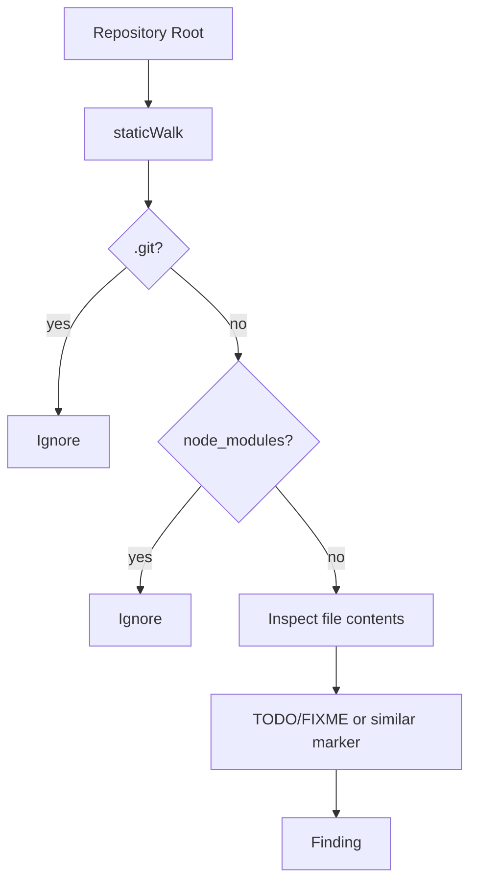

# Static Analysis and Refactoring Report Workflow

## Overview

This page documents the static-analysis workflow implemented in the Go refactoring command, focusing on the path from repository walking to report emission. The core pipeline is centered in [`staticWalk`](go/cmd/rekipedia/cmd/refactor.go#L75), [`applyFilter`](go/cmd/rekipedia/cmd/refactor.go#L130), and [`buildStaticReport`](go/cmd/rekipedia/cmd/refactor.go#L148), with issue representation defined by [`Finding`](go/cmd/rekipedia/cmd/refactor.go#L57). Severity ordering is normalized by [`severityIndex`](go/cmd/rekipedia/cmd/refactor.go#L65). The code paths and tests in `go/cmd/rekipedia/cmd/refactor_test.go` show that the workflow is intended to be deterministic, file-system driven, and output-format aware, while deliberately skipping irrelevant repository directories such as `.git` and `node_modules`.  

At a high level, the workflow does three things:

1. Walk the repository and detect candidate refactoring findings.
2. Filter those findings by severity threshold.
3. Build a report in one of the supported output modes.

The tests around [`TestStaticWalkFindsTODO`](go/cmd/rekipedia/cmd/refactor_test.go#L65), [`TestApplyFilterHigh`](go/cmd/rekipedia/cmd/refactor_test.go#L173), and [`TestBuildStaticReportWithFindings`](go/cmd/rekipedia/cmd/refactor_test.go#L217) confirm the intended behavior of each stage.

> **Sources:** `go/cmd/rekipedia/cmd/refactor.go` · L57–L175 · [`Finding`](go/cmd/rekipedia/cmd/refactor.go#L57) · [`severityIndex`](go/cmd/rekipedia/cmd/refactor.go#L65) · [`staticWalk`](go/cmd/rekipedia/cmd/refactor.go#L75) · [`applyFilter`](go/cmd/rekipedia/cmd/refactor.go#L130) · [`buildStaticReport`](go/cmd/rekipedia/cmd/refactor.go#L148)

## Static Walk

[`staticWalk`](go/cmd/rekipedia/cmd/refactor.go#L75) is the repository traversal stage. Based on the tests, it scans the repository tree, identifies static refactor candidates such as TODO/FIXME markers, and returns structured [`Finding`](go/cmd/rekipedia/cmd/refactor.go#L57) values. The workflow is intentionally conservative: it skips `.git` and `node_modules` directories, as demonstrated by [`TestStaticWalkSkipsGitDir`](go/cmd/rekipedia/cmd/refactor_test.go#L106) and [`TestStaticWalkSkipsNodeModules`](go/cmd/rekipedia/cmd/refactor_test.go#L125). This keeps the report focused on source code rather than VCS metadata or dependency trees.

The `Finding` type is the data model that carries each issue from traversal through filtering to rendering. Although the symbol definition in the analysis data is not expanded here, the test names and report builder usage indicate it includes at least severity and file-oriented metadata. Findings discovered by `staticWalk` are later sorted and grouped by severity in the writer path, so the walker must produce consistent, comparable records.

A useful way to think about this stage is:

- walk files recursively;
- ignore known noise directories;
- inspect file contents for refactor signals;
- emit structured findings.



The test matrix suggests that `staticWalk` also handles empty repositories gracefully, returning no findings rather than failing, as covered by [`TestStaticWalkEmptyRepo`](go/cmd/rekipedia/cmd/refactor_test.go#L141).

> **Sources:** `go/cmd/rekipedia/cmd/refactor.go` · L75–L127 · [`staticWalk`](go/cmd/rekipedia/cmd/refactor.go#L75) · `go/cmd/rekipedia/cmd/refactor_test.go` · L65–L150 · [`TestStaticWalkFindsTODO`](go/cmd/rekipedia/cmd/refactor_test.go#L65) · [`TestStaticWalkFindsFIXME`](go/cmd/rekipedia/cmd/refactor_test.go#L87) · [`TestStaticWalkSkipsGitDir`](go/cmd/rekipedia/cmd/refactor_test.go#L106) · [`TestStaticWalkSkipsNodeModules`](go/cmd/rekipedia/cmd/refactor_test.go#L125) · [`TestStaticWalkEmptyRepo`](go/cmd/rekipedia/cmd/refactor_test.go#L141)

## Severity Filtering

[`applyFilter`](go/cmd/rekipedia/cmd/refactor.go#L130) is the thresholding step. It takes a collection of [`Finding`](go/cmd/rekipedia/cmd/refactor.go#L57) values and removes entries below the selected severity level. This stage is important because static analysis may discover many low-priority notes, but the user may only want to inspect high-impact issues.

Severity ordering is centralized in [`severityIndex`](go/cmd/rekipedia/cmd/refactor.go#L65), which provides the comparison basis for filter decisions and sorting. The presence of tests like [`TestApplyFilterAll`](go/cmd/rekipedia/cmd/refactor_test.go#L156), [`TestApplyFilterHigh`](go/cmd/rekipedia/cmd/refactor_test.go#L173), and [`TestApplyFilterCritical`](go/cmd/rekipedia/cmd/refactor_test.go#L191) shows that the filter is expected to support at least these user-visible levels:

| Severity level | Ordering role | Expected effect in filtering |
|---|---:|---|
| `all` | Lowest / pass-through | Keep every finding |
| `high` | Mid threshold | Exclude lower-priority items |
| `critical` | Highest threshold | Keep only the most severe findings |

Because [`severityIndex`](go/cmd/rekipedia/cmd/refactor.go#L65) is used as a ranking function rather than a label-only helper, the implementation can compare user input and finding severity numerically or ordinally. That keeps sorting and filtering aligned, which matters for the report output: the same severity ordering drives both inclusion and presentation order.

In practical terms, this means the flow is:

1. Parse or receive severity mode.
2. Convert severity labels to order via `severityIndex`.
3. Retain only findings at or above the threshold.

> **Sources:** `go/cmd/rekipedia/cmd/refactor.go` · L65–L145 · [`severityIndex`](go/cmd/rekipedia/cmd/refactor.go#L65) · [`applyFilter`](go/cmd/rekipedia/cmd/refactor.go#L130) · `go/cmd/rekipedia/cmd/refactor_test.go` · L156–L201 · [`TestApplyFilterAll`](go/cmd/rekipedia/cmd/refactor_test.go#L156) · [`TestApplyFilterHigh`](go/cmd/rekipedia/cmd/refactor_test.go#L173) · [`TestApplyFilterCritical`](go/cmd/rekipedia/cmd/refactor_test.go#L191)

## Report Building

[`buildStaticReport`](go/cmd/rekipedia/cmd/refactor.go#L148) turns filtered findings into a textual report. The tests show that it has two major responsibilities: producing a sensible empty-state output and organizing non-empty findings into sections. [`TestBuildStaticReportEmpty`](go/cmd/rekipedia/cmd/refactor_test.go#L207) verifies the empty case, while [`TestBuildStaticReportWithFindings`](go/cmd/rekipedia/cmd/refactor_test.go#L217) verifies that actual findings are rendered into the report.

The report builder is tightly coupled to severity ordering. Since the filtered data can contain multiple severities, the builder likely groups or sorts the findings before rendering. That assumption is reinforced by [`TestIssuesSortedHighBeforeLow`](go/internal/analysis/refactor_writer_test.go#L186), which checks that the writer path prioritizes higher severities first. Even though that writer test targets a different package-level helper, it confirms the same design principle: report output should surface the most actionable issues early.

A report built by [`buildStaticReport`](go/cmd/rekipedia/cmd/refactor.go#L148) therefore has these characteristics:

- deterministic ordering;
- severity-aware grouping;
- explicit empty-state handling;
- formatted output suitable for console or file emission.

A simplified data flow is:

```text
static findings -> applyFilter -> buildStaticReport -> emitted report text
```

The report builder does not appear to invoke refactoring detection itself; it is purely a renderer over already-detected findings. That separation keeps traversal and formatting isolated and makes each stage testable in isolation.

> **Sources:** `go/cmd/rekipedia/cmd/refactor.go` · L148–L175 · [`buildStaticReport`](go/cmd/rekipedia/cmd/refactor.go#L148) · `go/cmd/rekipedia/cmd/refactor_test.go` · L207–L232 · [`TestBuildStaticReportEmpty`](go/cmd/rekipedia/cmd/refactor_test.go#L207) · [`TestBuildStaticReportWithFindings`](go/cmd/rekipedia/cmd/refactor_test.go#L217)

## Output Modes

The analysis data shows two output-oriented behaviors for the refactor workflow:

1. a normal text/console-oriented report path;
2. a JSON/file-writing path used by the broader writer layer.

In the refactor command itself, the textual report is the visible artifact of [`buildStaticReport`](go/cmd/rekipedia/cmd/refactor.go#L148). In the writer layer, [`WriteRefactorOutputs`](go/internal/analysis/refactor_writer.go#L269) emits both Markdown and JSON artifacts, and tests such as [`TestWriteRefactorOutputsCreatesFiles`](go/internal/analysis/refactor_writer_test.go#L287) and [`TestWriteRefactorOutputsJSONStructure`](go/internal/analysis/refactor_writer_test.go#L306) confirm that dual-output behavior. For this page, the important point is that the static-analysis pipeline can feed multiple emission modes without changing detection logic.

The observed output modes are summarized below:

| Mode | Emission target | Evidence in analysis data | Notes |
|---|---|---|---|
| Text / Markdown-like report | Console or file text | [`buildStaticReport`](go/cmd/rekipedia/cmd/refactor.go#L148) | Human-readable summary of findings |
| JSON output | Structured file | [`WriteRefactorOutputs`](go/internal/analysis/refactor_writer.go#L269) | Used for machine-readable export |
| Empty-state output | Console/text | [`TestBuildStaticReportEmpty`](go/cmd/rekipedia/cmd/refactor_test.go#L207) | Avoids silent failure on no findings |

The page does **not** cover unrelated CLI subcommands or search internals. The relevant takeaway is that the refactor subsystem cleanly separates detection, filtering, and emission, allowing the same [`Finding`](go/cmd/rekipedia/cmd/refactor.go#L57) records to be rendered in different formats.

> **Sources:** `go/cmd/rekipedia/cmd/refactor.go` · L148–L175 · [`buildStaticReport`](go/cmd/rekipedia/cmd/refactor.go#L148) · `go/internal/analysis/refactor_writer.go` · L269–L326 · [`WriteRefactorOutputs`](go/internal/analysis/refactor_writer.go#L269) · `go/internal/analysis/refactor_writer_test.go` · L287–L340 · [`TestWriteRefactorOutputsCreatesFiles`](go/internal/analysis/refactor_writer_test.go#L287) · [`TestWriteRefactorOutputsJSONStructure`](go/internal/analysis/refactor_writer_test.go#L306)

## Findings Model and Severity Table

The `Finding` type is the central record passed across the pipeline. The analysis data identifies it at [`go/cmd/rekipedia/cmd/refactor.go#L57`](go/cmd/rekipedia/cmd/refactor.go#L57). While the field list is not expanded in the provided symbol metadata, the surrounding code and tests imply that it carries enough information to support:

- file/location attribution;
- severity classification;
- message/description content;
- rendering in grouped output.

### Findings Fields

| Field category | Purpose | Observed usage |
|---|---|---|
| Identity / kind | Classifies the issue | Needed for grouping and filtering |
| Severity | Controls ordering and thresholding | Used by [`severityIndex`](go/cmd/rekipedia/cmd/refactor.go#L65) and [`applyFilter`](go/cmd/rekipedia/cmd/refactor.go#L130) |
| File path | Locates the issue in the repo | Required by `staticWalk` output |
| Line / range | Pinpoints the issue precisely | Typical for static-analysis reports |
| Message / note | Explains why the finding matters | Needed for report text |

### Severity Levels

| Severity | Meaning in workflow | Relative ordering |
|---|---|---:|
| `critical` | Highest-priority refactor candidate | 3 |
| `high` | Important but not the top tier | 2 |
| `medium` | Useful but less urgent | 1 |
| `low` / informational | Lowest-priority entries | 0 |
| `all` | Filter mode, not a severity | n/a |

The exact labels beyond `high` and `critical` are not directly asserted in the provided tests, so the table above should be read as a workflow-oriented summary rather than a complete schema contract. The key documented contract is the existence of `severityIndex` and severity-based filtering behavior.

> **Sources:** `go/cmd/rekipedia/cmd/refactor.go` · L57–L175 · [`Finding`](go/cmd/rekipedia/cmd/refactor.go#L57) · [`severityIndex`](go/cmd/rekipedia/cmd/refactor.go#L65) · [`staticWalk`](go/cmd/rekipedia/cmd/refactor.go#L75) · [`applyFilter`](go/cmd/rekipedia/cmd/refactor.go#L130) · [`buildStaticReport`](go/cmd/rekipedia/cmd/refactor.go#L148)

## Workflow Summary

The complete workflow is straightforward:

1. [`staticWalk`](go/cmd/rekipedia/cmd/refactor.go#L75) scans the repository and produces [`Finding`](go/cmd/rekipedia/cmd/refactor.go#L57) records.
2. [`severityIndex`](go/cmd/rekipedia/cmd/refactor.go#L65) establishes the ordering semantics.
3. [`applyFilter`](go/cmd/rekipedia/cmd/refactor.go#L130) removes findings below the chosen threshold.
4. [`buildStaticReport`](go/cmd/rekipedia/cmd/refactor.go#L148) turns the remaining findings into user-facing output.
5. The result is emitted either as text/Markdown-like output or via the writer layer as structured files.

This design keeps the refactoring report workflow testable and composable. Each stage has dedicated tests in `go/cmd/rekipedia/cmd/refactor_test.go`, which is a strong indicator that the implementation intentionally separates detection concerns from presentation concerns.

> **Sources:** `go/cmd/rekipedia/cmd/refactor.go` · L57–L175 · [`Finding`](go/cmd/rekipedia/cmd/refactor.go#L57) · [`severityIndex`](go/cmd/rekipedia/cmd/refactor.go#L65) · [`staticWalk`](go/cmd/rekipedia/cmd/refactor.go#L75) · [`applyFilter`](go/cmd/rekipedia/cmd/refactor.go#L130) · [`buildStaticReport`](go/cmd/rekipedia/cmd/refactor.go#L148)