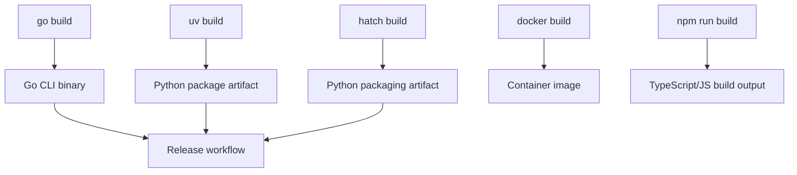
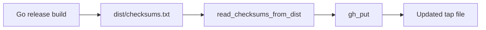

# Release and Update Workflow

This repository contains two closely related delivery paths:

1. the **Python package / generic project build path** driven by `uv` and `hatch`, and  
2. the **Go release path** that produces distributable binaries and then feeds downstream update automation, including a Homebrew tap update script.

The observable workflow in the repository is therefore less a single “release system” and more a chain of build, package, publish, and updater steps spanning multiple ecosystems. The sections below only describe what is visible in the repository files and commands.

## Versioning Signals

The repository exposes versioning primarily through runtime flags and release-oriented CI files rather than through an explicit policy document.

The clearest runtime signal is the root command’s version flag coverage in [`TestRootVersionFlag`](go/cmd/rekipedia/cmd/root_test.go#L9), which confirms that the CLI is expected to expose version information on the root command defined in [`go/cmd/rekipedia/cmd/root.go`](go/cmd/rekipedia/cmd/root.go). That is a strong indicator that build artifacts are intended to carry a version string into the binary.

Release-oriented configuration is also visible in workflow files such as `.github/workflows/go-release.yml`, `.github/workflows/npm-publish.yml`, and `.github/workflows/python-release.yml`. Those files are present in the repository, but the analysis data does not include their full contents, so it is only safe to say that separate release automation exists for Go, npm, and Python.

A second versioning signal appears in the repository’s release notes files: `RELEASE-NOTES.md`, `go/RELEASE-NOTES.md`, and `RELEASE-NOTES.md` at the repository root. Their presence suggests that release metadata is maintained alongside the codebase, but the exact format or process cannot be inferred from the analysis alone.

### What is actually observable

| Signal | Evidence | What it tells us |
|---|---|---|
| CLI version exposure | [`TestRootVersionFlag`](go/cmd/rekipedia/cmd/root_test.go#L9) | The Go CLI is expected to surface version data |
| Go release automation | `.github/workflows/go-release.yml` | There is a dedicated release workflow for Go artifacts |
| Python publish automation | `.github/workflows/python-release.yml` | There is a dedicated release workflow for Python packaging |
| npm publish automation | `.github/workflows/npm-publish.yml` | There is a dedicated publish workflow for JavaScript artifacts |
| Release notes files | `RELEASE-NOTES.md`, `go/RELEASE-NOTES.md` | Release-related documentation is maintained in-repo |

> **Sources:** `go/cmd/rekipedia/cmd/root.go` · [`TestRootVersionFlag`](go/cmd/rekipedia/cmd/root_test.go#L9) · `RELEASE-NOTES.md` · `go/RELEASE-NOTES.md` · `.github/workflows/go-release.yml` · `.github/workflows/npm-publish.yml` · `.github/workflows/python-release.yml`

## Build Steps

The repository shows multiple build entry points, with the most explicit command-level evidence in the top-level build commands list:

```bash
uv build
CGO_ENABLED=0 go build -ldflags "-s -w" -o /tmp/reki ./cmd/rekipedia
hatch build
docker build .
npm run build  # tsc
```

These commands indicate that build output is produced in several forms:

- a Python package via `uv build`
- a Go binary via `go build`
- another Python packaging route via `hatch build`
- a container image via `docker build .`
- JavaScript/TypeScript compilation via `npm run build`

For the Go binary, the `CGO_ENABLED=0` environment variable and linker flags `-s -w` indicate a statically oriented binary build that strips symbol/debug information. The output path `/tmp/reki` is simply the example shown in the command list; no further packaging policy should be inferred.

There is also a small JavaScript launcher in [`bin/rekipedia.js`](bin/rekipedia.js), where [`tryRun`](bin/rekipedia.js#L4) exists as a helper for invoking commands. The analysis does not show its full integration path, so it is best treated as a lightweight executable wrapper rather than a full release pipeline component.

### Observed build flow



> **Sources:** build commands list in analysis data · [`tryRun`](bin/rekipedia.js#L4) · `.github/workflows/go-release.yml` · `.github/workflows/python-release.yml` · `.github/workflows/npm-publish.yml`

## Artifact Generation

Artifact generation is visible in both the Go and Python sides of the repository.

### Go artifacts

The Go release path centers on the CLI entry point [`main`](go/cmd/rekipedia/main.go#L6), which delegates into the command tree in [`go/cmd/rekipedia/cmd/root.go`](go/cmd/rekipedia/cmd/root.go). The build command `CGO_ENABLED=0 go build -ldflags "-s -w" -o /tmp/reki ./cmd/rekipedia` produces the binary artifact that release workflows can distribute.

The Go side also contains a Goreleaser configuration file at `go/.goreleaser.yaml`, which is the strongest evidence that release artifacts are assembled and packaged through standard Go release tooling. The analysis does not show the file contents, so we cannot claim specific archive formats, checksum rules, or naming conventions beyond the existence of a Goreleaser configuration.

### Python and npm artifacts

Python package generation is visible through both `uv build` and `hatch build`, implying wheel/sdist-style packaging in the ecosystem supported by those tools. The repo also has a `pyproject.toml` and `uv.lock`, which are consistent with packaging and reproducible dependency resolution, although the exact package metadata is not expanded in the analysis.

On the npm side, `package.json` and `npm run build  # tsc` show that TypeScript compilation is part of the artifact generation path. The repository also contains `bin/rekipedia.js`, which indicates that some distributable JavaScript entrypoint or wrapper exists.

### Artifact-related files and commands

| Artifact type | Evidence | Build input |
|---|---|---|
| Go binary | `CGO_ENABLED=0 go build -ldflags "-s -w" -o /tmp/reki ./cmd/rekipedia` | `go/cmd/rekipedia/main.go` and command tree under `go/cmd/rekipedia/cmd/` |
| Go release packages | `go/.goreleaser.yaml` | Go binary and release metadata |
| Python package | `uv build`, `hatch build` | `pyproject.toml` |
| npm/TS output | `npm run build  # tsc` | `package.json`, TypeScript sources |
| Container image | `docker build .` | `Dockerfile`, repository contents |

> **Sources:** `go/cmd/rekipedia/main.go` · `go/.goreleaser.yaml` · `pyproject.toml` · `package.json` · `bin/rekipedia.js` · build commands list in analysis data

## Update Automation

The most concrete update automation is the Homebrew tap updater in [`.github/scripts/update-homebrew-tap.py`](.github/scripts/update-homebrew-tap.py). This script contains three key functions:

- [`read_checksums_from_dist`](.github/scripts/update-homebrew-tap.py#L36) reads `dist/checksums.txt` produced by Goreleaser.
- [`gh_get_sha`](.github/scripts/update-homebrew-tap.py#L58) fetches the current SHA for a file in GitHub.
- [`gh_put`](.github/scripts/update-homebrew-tap.py#L71) updates the file contents in GitHub with a commit message.

This tells us a lot about the update sequence without guessing policy:

1. a release build is produced, apparently by Goreleaser, into `dist/`
2. the updater reads checksums from `dist/checksums.txt`
3. the script compares or retrieves existing content via GitHub APIs
4. the tap file is updated using `gh_put`

That is a distribution-oriented automation path: the build pipeline generates release assets and checksums, and a downstream script propagates those artifacts into a package repository.

There is also a Go CLI command [`go/cmd/rekipedia/cmd/update.go`](go/cmd/rekipedia/cmd/update.go) with an `init` registration function at lines 47–53, and corresponding tests [`TestUpdateCmdRegistered`](go/cmd/rekipedia/cmd/embed_export_update_test.go#L85) / [`TestUpdateCmdFlags`](go/cmd/rekipedia/cmd/embed_export_update_test.go#L98) / [`TestUpdateManifestFileWrite`](go/cmd/rekipedia/cmd/embed_export_update_test.go#L141). These tests show that the `update` command is an intentional user-facing command in the CLI, and that it writes manifest-like output files. However, the analysis data does not include the implementation of `RunUpdate` details beyond the symbol presence in [`go/internal/orchestrator/run_update.go`](go/internal/orchestrator/run_update.go#L30), so we should only say that update orchestration exists and is tested, not speculate on every side effect.

### Build-to-update connection

| Step | Component | Observable connection |
|---|---|---|
| 1 | Go release build | `go/.goreleaser.yaml` and `go build ...` |
| 2 | Dist output | `dist/checksums.txt` referenced by [`read_checksums_from_dist`](.github/scripts/update-homebrew-tap.py#L36) |
| 3 | Updater script | [`.github/scripts/update-homebrew-tap.py`](.github/scripts/update-homebrew-tap.py) |
| 4 | GitHub tap update | [`gh_get_sha`](.github/scripts/update-homebrew-tap.py#L58) and [`gh_put`](.github/scripts/update-homebrew-tap.py#L71) |



> **Sources:** `.github/scripts/update-homebrew-tap.py` · [`read_checksums_from_dist`](.github/scripts/update-homebrew-tap.py#L36) · [`gh_get_sha`](.github/scripts/update-homebrew-tap.py#L58) · [`gh_put`](.github/scripts/update-homebrew-tap.py#L71) · `go/.goreleaser.yaml` · [`RunUpdate`](go/internal/orchestrator/run_update.go#L30) · [`TestUpdateCmdRegistered`](go/cmd/rekipedia/cmd/embed_export_update_test.go#L85) · [`TestUpdateManifestFileWrite`](go/cmd/rekipedia/cmd/embed_export_update_test.go#L141)

## End-to-End Distribution Summary

The repository’s release/update story is best understood as a chain of ecosystem-specific build outputs feeding into release automation:

1. **Build** via `uv build`, `hatch build`, `go build`, `docker build`, and `npm run build`.
2. **Package** through Go release tooling in `go/.goreleaser.yaml` and Python/npm packaging configuration.
3. **Publish** through dedicated GitHub workflows for Go, Python, and npm.
4. **Update downstream distribution** using `.github/scripts/update-homebrew-tap.py`, which reads Goreleaser checksums and writes updated tap content.

The repository clearly supports this workflow, but it does not expose a single universal policy document in the available analysis. So the safest conclusion is: the codebase contains build artifacts, release automation, and a downstream update script, but the exact policy governing when releases happen is not visible here.

> **Sources:** `go/.goreleaser.yaml` · `.github/workflows/go-release.yml` · `.github/workflows/python-release.yml` · `.github/workflows/npm-publish.yml` · `.github/scripts/update-homebrew-tap.py` · build commands list in analysis data