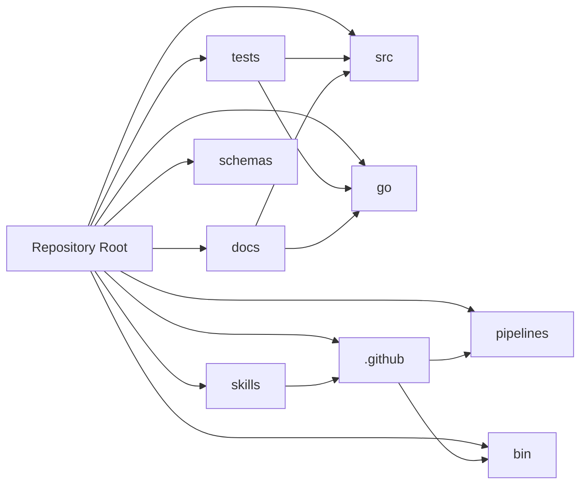

# Repository Map

## Overview

This repository is organized as a multi-language workspace with a clear separation between the Python package under [`src/rekipedia`](src/rekipedia/__init__.py), the Go implementation under [`go/`](go/README.md), test coverage under [`tests/`](tests/test_server.py), and support assets such as docs, skills, pipelines, schemas, scripts, and GitHub automation. The top-level layout reflects two overlapping goals:

1. A Python-distributed CLI/library surface built from [`pyproject.toml`](pyproject.toml).
2. A Go-based implementation and tooling stack under [`go/`](go/go.mod), including CLI commands, orchestration, storage, server, RAG, synthesis, and analysis packages.

The repository also carries operational metadata for CI, release, linting, and agent guidance: [`Makefile`](Makefile), [`.github/workflows/go-ci.yml`](.github/workflows/go-ci.yml), [`pipelines/harness-ci.yaml`](pipelines/harness-ci.yaml), and prompt/rules files in [`skills/`](skills/shared/rules.md) and [`.github/`](.github/copilot-instructions.md).

## Annotated Top-Level Tree

```text
.
├── src/                      # Primary Python package: CLI, analysis, storage, server, synthesis, RAG, watcher
│   └── rekipedia/            # Core application modules and runtime package
├── go/                       # Go implementation of the toolchain and service surface
│   ├── cmd/rekipedia/        # Cobra-style CLI entrypoint and subcommands
│   ├── internal/             # Analysis, extraction, storage, server, orchestrator, synthesis, RAG
│   └── pkg/                  # Shared Go utilities (currently fs walking helpers)
├── tests/                    # Python test suite plus fixture repositories
├── docs/                     # Product docs, plans, and rewrite strategy notes
├── skills/                   # Agent skill/rule documents used by automation and review flows
├── pipelines/                # Harness pipeline definitions for CI and gated workflows
├── schemas/                  # JSON schema definitions for structured artifacts
├── scripts/                  # Utility scripts for lint/report workflows
├── bin/                      # Node/JS wrapper entrypoints and CLI shims
└── .github/                  # GitHub Actions workflows, instructions, and maintenance scripts
```

A few root files are also worth noting because they define repository behavior rather than application code:

- [`package.json`](package.json), [`bin/rekipedia.js`](bin/rekipedia.js): Node packaging and CLI shim.
- [`pyproject.toml`](pyproject.toml), [`uv.lock`](uv.lock): Python packaging and lockfile.
- [`go/go.mod`](go/go.mod), [`go/go.sum`](go/go.sum): Go module metadata.
- [`Dockerfile.sandbox`](Dockerfile.sandbox): Sandbox runtime image.
- [`Makefile`](Makefile): Top-level task entrypoints.
- [`README.md`](README.md), [`CONTRIBUTING.md`](CONTRIBUTING.md), [`RELEASE-NOTES.md`](RELEASE-NOTES.md): user-facing documentation and release notes.

> **Sources:** `files_seen` inventory; notable repository root files including `pyproject.toml`, `package.json`, `go/go.mod`, `README.md`, `Makefile`, `Dockerfile.sandbox`

## Top-Level Areas Table

| Path | Type | Purpose | Notable Files |
|---|---|---|---|
| `src/` | Python package root | Main Python implementation of the tool: CLI, analysis, extractors, LLM client, orchestrator, server, storage, RAG, synthesis, sandbox, and watcher | `src/rekipedia/__main__.py`, `src/rekipedia/cli/ask.py`, `src/rekipedia/server/app.py`, `src/rekipedia/storage/sqlite_store.py` |
| `go/` | Go module root | Parallel Go implementation of the CLI/service stack and lower-level engine packages | `go/cmd/rekipedia/main.go`, `go/internal/server/server.go`, `go/internal/orchestrator/run_update.go`, `go/internal/synthesis/page_builder.go` |
| `tests/` | Test suite | Python tests for CLI behavior, graph analysis, RAG, server, storage, synthesis, and extractors; also includes fixture repos for multi-language coverage | `tests/test_server.py`, `tests/test_graph_analysis.py`, `tests/fixtures/mini-py-repo/`, `tests/fixtures/mini-ts-repo/` |
| `docs/` | Documentation | Product plans, migration notes, customization guidance, and roadmap material | `docs/PLAN.md`, `docs/customizing.md`, `docs/plans/golang-rewrite.md` |
| `skills/` | Agent guidance | Instructional documents and reusable rule sets for harness, linting, observability, test review, and delivery workflows | `skills/harness/observability.md`, `skills/shared/rules.md` |
| `pipelines/` | Pipeline configs | Harness pipeline definitions for CI, feature-flag gating, and canary workflows | `pipelines/harness-ci.yaml`, `pipelines/harness-canary.yaml` |
| `schemas/` | Schemas | JSON schema contracts for structured outputs and validation | `schemas/analysis_result.schema.json` |
| `bin/` | Runtime shim | Node launcher script for invoking the tool from npm/pnpm environments | `bin/rekipedia.js` |
| `.github/` | GitHub automation | Copilot instructions, review guidance, and workflow automation for CI/release and tap maintenance | `.github/workflows/go-ci.yml`, `.github/scripts/update-homebrew-tap.py` |

> **Sources:** repository root inventory; `bin/rekipedia.js`, `docs/PLAN.md`, `skills/shared/rules.md`, `pipelines/harness-ci.yaml`, `schemas/analysis_result.schema.json`, `.github/workflows/go-ci.yml`

## Directory-by-Directory Notes

### `src/`

The Python package root is the most important application-facing tree for Python consumers. It contains the package namespace [`rekipedia`](src/rekipedia/__init__.py) and subdivides functionality by responsibility: CLI entrypoints under [`src/rekipedia/cli`](src/rekipedia/cli/ask.py), analysis under [`src/rekipedia/analysis`](src/rekipedia/analysis/graph_analysis.py), extractors under [`src/rekipedia/extractors`](src/rekipedia/extractors/base.py), orchestration under [`src/rekipedia/orchestrator`](src/rekipedia/orchestrator/run_update.py), server rendering under [`src/rekipedia/server`](src/rekipedia/server/app.py), and persistence under [`src/rekipedia/storage`](src/rekipedia/storage/sqlite_store.py).

The package also includes prompts, sandbox helpers, and RAG support, which suggests the Python distribution is meant to be fully usable on its own rather than only as a thin wrapper.

> **Sources:** `src/rekipedia/__init__.py` · `src/rekipedia/cli/ask.py` · `src/rekipedia/server/app.py` · `src/rekipedia/storage/sqlite_store.py`

### `go/`

The Go tree mirrors much of the Python functionality but is structured as an internalized application module. The main entrypoint is [`go/cmd/rekipedia/main.go`](go/cmd/rekipedia/main.go), while subcommands live in [`go/cmd/rekipedia/cmd`](go/cmd/rekipedia/cmd/root.go). Major subsystems include analysis (`go/internal/analysis`), extraction (`go/internal/extractor`), orchestrator flows (`go/internal/orchestrator`), storage (`go/internal/storage`), search/RAG (`go/internal/rag`), synthesis (`go/internal/synthesis`), and HTTP server logic (`go/internal/server`).

Because these packages are under `internal/`, they are intentionally scoped to the module and support a cohesive application binary rather than a library-style API surface.

> **Sources:** `go/cmd/rekipedia/main.go` · `go/cmd/rekipedia/cmd/root.go` · `go/internal/server/server.go` · `go/internal/orchestrator/run_update.go`

### `tests/`

The test tree is broad and behavior-driven. It includes end-to-end and unit tests such as [`tests/test_server.py`](tests/test_server.py), [`tests/test_storage.py`](tests/test_sqlite_store.py), [`tests/test_synthesis.py`](tests/test_page_builder.py), and extractor coverage in [`tests/test_multilang_extractors.py`](tests/test_multilang_extractors.py). The fixture repositories under `tests/fixtures/` are especially important because they model a small Python project and a small TypeScript project, allowing the extractor and scanner logic to be exercised against realistic source trees.

> **Sources:** `tests/test_server.py` · `tests/test_sqlite_store.py` · `tests/test_page_builder.py` · `tests/fixtures/mini-py-repo/main.py`

### `docs/`

Documentation is split between user-facing customization guidance and longer-term planning files. The presence of [`docs/plans/golang-rewrite.md`](docs/plans/golang-rewrite.md) and [`go/README.md`](go/README.md) indicates the repository has been through, or is actively in, a rewrite/migration phase where both implementations and transition notes need to be preserved.

> **Sources:** `docs/customizing.md` · `docs/plans/golang-rewrite.md` · `docs/PLAN.md`

### `skills/`

The `skills/` directory packages reusable policy and prompting content for harness-oriented workflows. Files like [`skills/harness/observability.md`](skills/harness/observability.md) and [`skills/shared/lint-report-prompt.md`](skills/shared/lint-report-prompt.md) suggest this repo is designed to be operated in a guided, semi-agentic environment where rules can be injected consistently across tasks.

> **Sources:** `skills/harness/observability.md` · `skills/shared/rules.md` · `skills/shared/lint-report-prompt.md`

### `pipelines/`

The pipeline definitions appear to support Harness-based delivery workflows. The filenames imply distinct pipeline concerns: canary rollout, CI, and feature flag gating. This complements the GitHub Actions workflows and suggests the project uses more than one automation plane: GitHub for repo-native checks and Harness for deployment or release orchestration.

> **Sources:** `pipelines/harness-ci.yaml` · `pipelines/harness-canary.yaml` · `pipelines/harness-feature-flag-gate.yaml`

### `schemas/`

Schemas provide machine-readable contracts. The most visible artifact is [`schemas/analysis_result.schema.json`](schemas/analysis_result.schema.json), which likely defines the shape of analysis output used by tooling, exporters, or validation steps.

> **Sources:** `schemas/analysis_result.schema.json`

### `bin/`

The `bin/` directory contains the Node shim [`bin/rekipedia.js`](bin/rekipedia.js). This is typically used to launch the tool from npm packaging or to bridge into another runtime, and it confirms that the repository’s distribution strategy spans beyond just Python and Go.

> **Sources:** `bin/rekipedia.js`

### `.github/`

GitHub automation is clearly first-class here. The workflows include Go, Python, and npm publishing pipelines, while the instruction files describe how automated reviewers or copilots should behave. The maintenance script [` .github/scripts/update-homebrew-tap.py`](.github/scripts/update-homebrew-tap.py) indicates release artifacts are also synced to external package distribution.

> **Sources:** `.github/workflows/go-ci.yml` · `.github/workflows/python-ci.yml` · `.github/workflows/npm-publish.yml` · `.github/scripts/update-homebrew-tap.py`

## Dependency Sketch

At a high level, the top-level areas relate as follows:



This sketch intentionally stays at the repository-structure level: `tests/` exercises `src/` and `go/`, `docs/` explains them, `skills/` and `.github/` shape developer and automation behavior, and `pipelines/`/`schemas/` provide delivery and validation scaffolding.

> **Sources:** `tests/` fixtures and test files; `docs/` plan files; `.github/workflows/*.yml`; `skills/*.md`; `pipelines/*.yaml`

## Practical Reading Order

If you are new to the repo, a useful reading order is:

1. Start with [`README.md`](README.md) and [`CONTRIBUTING.md`](CONTRIBUTING.md).
2. Inspect [`src/rekipedia/__main__.py`](src/rekipedia/__main__.py) for the Python entrypoint.
3. Review [`go/cmd/rekipedia/main.go`](go/cmd/rekipedia/main.go) and [`go/cmd/rekipedia/cmd/root.go`](go/cmd/rekipedia/cmd/root.go) for the Go CLI surface.
4. Use [`tests/test_*.py`](tests/test_server.py) to understand expected behavior.
5. Consult [`docs/plans/golang-rewrite.md`](docs/plans/golang-rewrite.md) for the broader migration context.

This page intentionally avoids deep API or architecture internals and instead serves as a repository map for orientation.

> **Sources:** `README.md` · `CONTRIBUTING.md` · `src/rekipedia/__main__.py` · `go/cmd/rekipedia/main.go`