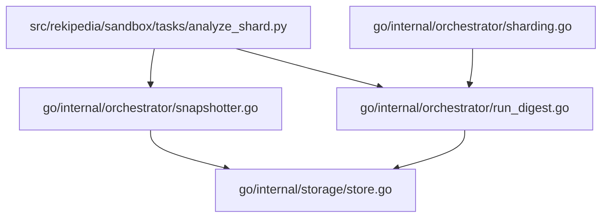
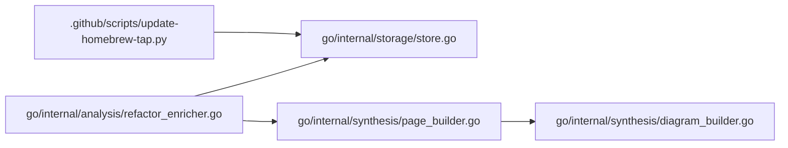

# Non-CLI Support Workflows: Sandbox Tasks, Test Fixtures, and Skills/Automation

This page focuses on the non-CLI support code that helps drive analysis workflows, test data, and automation around the repository. It intentionally avoids rehashing the main command-line surface or the broader system architecture. Instead, it highlights the “working parts” that make analysis repeatable: sandbox tasks, repository fixtures used in tests, and automation/skill workflows such as repository maintenance scripts and LLM-assisted synthesis helpers.

## Overview

The repository contains several support pathways that are not user-facing CLI commands but still power core workflows. On the Go side, the most visible analysis pipeline is orchestrated through [`RunDigest`](go/internal/orchestrator/run_digest.go#L48) and related helpers in [`go/internal/orchestrator/sharding.go`](go/internal/orchestrator/sharding.go) and [`go/internal/orchestrator/snapshotter.go`](go/internal/orchestrator/snapshotter.go). On the Python side, there is support for analysis and search automation in modules like [`rekipedia.analysis.cross_repo_search`](src/rekipedia/analysis/cross_repo_search.py) and [`rekipedia.analysis.refactor_enricher`](src/rekipedia/analysis/refactor_enricher.py).

A useful mental model is:

- **Sandbox tasks** = isolated analysis entry points for experiments or shard-based runs.
- **Test fixtures** = miniature repositories and repo-like structures used to validate extractors, orchestrators, and search logic.
- **Skills/automation** = helper scripts and workflows that update external artifacts, generate outputs, or support AI-assisted analysis tasks.

### Support Workflow Map

| Entry point | Purpose | Notes |
|---|---|---|
| `src/rekipedia/sandbox/tasks/analyze_shard.py` | Sandbox analysis task runner | A task-oriented entry point for isolated shard analysis workflows. |
| `go/internal/orchestrator/RunDigest` | Build a digest over shards and combine results | Central orchestration path for analysis runs in Go. |
| `go/internal/orchestrator/RunUpdate` | Refresh stored analysis state | Used to recompute and persist updated repository state. |
| `.github/scripts/update-homebrew-tap.py` | Update Homebrew tap metadata | Maintains external packaging metadata by reading dist checksums and patching GitHub content. |
| `go/internal/synthesis/PageBuilder` | Build wiki pages from structured data | Automation-oriented synthesis helper that emits page content from analysis data. |
| `go/internal/synthesis/DiagramBuilder` | Build Mermaid diagrams from analysis data | Produces architecture/class diagrams used in generated documentation. |

> **Sources:** `go/internal/orchestrator/run_digest.go` · L48–L309 · [`RunDigest`](go/internal/orchestrator/run_digest.go#L48) · `go/internal/orchestrator/run_update.go` · L30–L179 · [`RunUpdate`](go/internal/orchestrator/run_update.go#L30) · `go/internal/synthesis/page_builder.go` · L71–L133 · [`(b *PageBuilder).BuildAll`](go/internal/synthesis/page_builder.go#L71) · `go/internal/synthesis/diagram_builder.go` · L23–L36 · [`(d *DiagramBuilder).Build`](go/internal/synthesis/diagram_builder.go#L23) · `.github/scripts/update-homebrew-tap.py` · L36–L87 · [`read_checksums_from_dist`](.github/scripts/update-homebrew-tap.py#L36)

## Sandbox Tasks

The analysis payload includes a dedicated sandbox entry point at `src/rekipedia/sandbox/tasks/analyze_shard.py`. The file itself is referenced as an entry point, which indicates it is meant to run a bounded analysis task rather than the full application workflow. Although the static symbol inventory does not expose the file’s internal functions, its placement under `sandbox/tasks` strongly suggests it is designed for one-off or controlled analysis runs over a shard of repository data.

This is consistent with the surrounding Go orchestration code. [`ShardPlanner`](go/internal/orchestrator/sharding.go#L17) divides manifests into shards, [`Snapshotter`](go/internal/orchestrator/snapshotter.go#L57) turns filesystem inputs into structured snapshots, and [`RunDigest`](go/internal/orchestrator/run_digest.go#L48) coordinates extraction, enrichment, and output aggregation. A sandbox task like `analyze_shard.py` would fit naturally into that flow as a way to exercise one shard at a time.

### How sandbox tasks fit the analysis pipeline

The main value of a sandbox task is isolation: it lets maintainers validate a slice of the pipeline without needing the whole end-to-end execution path. That is especially useful when working on sharding, extractor behavior, or output generation, because each phase has its own shape of data and failure modes.

### Observable support components around sandboxing

- [`(sp *ShardPlanner).Plan`](go/internal/orchestrator/sharding.go#L31) groups manifests into shard units.
- [`(s *Snapshotter).Snapshot`](go/internal/orchestrator/snapshotter.go#L89) walks the filesystem and captures file metadata.
- [`RunDigest`](go/internal/orchestrator/run_digest.go#L48) combines extraction, analysis, and synthesis.
- [`RunUpdate`](go/internal/orchestrator/run_update.go#L30) persists refreshed state to the backing store.

Because the sandbox task file is not symbol-indexed here, the exact function names inside `analyze_shard.py` are not visible in the analysis data. What is observable is that the repository has explicit infrastructure for shard-based execution, which makes the sandbox task a support entry point rather than a primary application command.

> **Sources:** `src/rekipedia/sandbox/tasks/analyze_shard.py` · entry point listed in payload · `go/internal/orchestrator/sharding.go` · L17–L106 · [`ShardPlanner`](go/internal/orchestrator/sharding.go#L17) · `go/internal/orchestrator/snapshotter.go` · L57–L172 · [`Snapshotter`](go/internal/orchestrator/snapshotter.go#L57) · `go/internal/orchestrator/run_digest.go` · L48–L396 · [`RunDigest`](go/internal/orchestrator/run_digest.go#L48)

## Test Fixtures

The repository includes miniature sample repositories under `tests/fixtures`, specifically `tests/fixtures/mini-py-repo/main.py` and `tests/fixtures/mini-ts-repo/src/index.ts`. These fixtures are important because the extractor and orchestrator tests need realistic but compact codebases to inspect. Instead of mocking every filesystem and AST interaction, the tests use actual repository-shaped content.

The Go extractor tests demonstrate this pattern clearly. [`TestPythonFunctions`](go/internal/extractor/extractor_test.go#L62), [`TestPythonClass`](go/internal/extractor/extractor_test.go#L83), and [`TestPythonEntryPoint`](go/internal/extractor/extractor_test.go#L140) exercise the Python extractor against real Python-like fixtures. Likewise, [`TestTSFunctions`](go/internal/extractor/extractor_test.go#L189), [`TestTSClass`](go/internal/extractor/extractor_test.go#L215), and [`TestTSInterface`](go/internal/extractor/extractor_test.go#L237) validate TypeScript extraction behavior. The tests rely on helper utilities such as [`writeTempFile`](go/internal/extractor/extractor_test.go#L13), [`symbolNames`](go/internal/extractor/extractor_test.go#L21), [`hasSymbol`](go/internal/extractor/extractor_test.go#L29), and [`hasRelationship`](go/internal/extractor/extractor_test.go#L38) to turn fixture content into assertions.

### How the fixtures are used in tests

| Fixture | Typical test usage | What it validates |
|---|---|---|
| `tests/fixtures/mini-py-repo/main.py` | Input to Python extractor tests | Function discovery, class detection, import relationships, entry-point handling. |
| `tests/fixtures/mini-ts-repo/src/index.ts` | Input to TypeScript extractor tests | Function/class/interface discovery and import extraction. |

The fixtures also support higher-level pipeline tests. For example, orchestrator and RAG tests benefit from realistic file trees when validating snapshotting, file token estimation, and chunking behavior. The snapshotter tests such as [`TestSnapshotterBasic`](go/internal/orchestrator/orchestrator_test.go#L13), [`TestSnapshotterLanguageDetection`](go/internal/orchestrator/orchestrator_test.go#L68), and [`TestSnapshotterSHA256Stable`](go/internal/orchestrator/orchestrator_test.go#L97) rely on temporary repositories that mirror real project layouts, and the extractor tests make similar use of small code samples.

This fixture-driven approach matters because many of the support workflows are filesystem-sensitive. Extractors behave differently for Python, TypeScript, Go, config files, or unreadable files, and the tests need concrete on-disk inputs to exercise those branches.

> **Sources:** `tests/fixtures/mini-py-repo/main.py` · entry point listed in payload · `tests/fixtures/mini-ts-repo/src/index.ts` · entry point listed in payload · `go/internal/extractor/extractor_test.go` · L13–L516 · [`writeTempFile`](go/internal/extractor/extractor_test.go#L13) · [`TestPythonFunctions`](go/internal/extractor/extractor_test.go#L62) · [`TestTSFunctions`](go/internal/extractor/extractor_test.go#L189) · `go/internal/orchestrator/orchestrator_test.go` · L13–L302 · [`TestSnapshotterBasic`](go/internal/orchestrator/orchestrator_test.go#L13)

## Skills / Automation

Automation in this repository is split across a few layers: repository maintenance scripts, synthesis helpers, and analysis-time orchestration logic.

### GitHub and release automation

The script [`update-homebrew-tap.py`](.github/scripts/update-homebrew-tap.py) is a compact automation utility for packaging maintenance. Its documented purpose is to read SHA-256 values from Goreleaser output via [`read_checksums_from_dist`](.github/scripts/update-homebrew-tap.py#L36), then query and update GitHub content using [`gh_get_sha`](.github/scripts/update-homebrew-tap.py#L58) and [`gh_put`](.github/scripts/update-homebrew-tap.py#L71). This is not analysis logic, but it is still support automation: it keeps external distribution metadata synchronized without requiring a manual upload workflow.

### Synthesis helpers for wiki/documentation generation

The Go synthesis package contains the building blocks for documentation automation. [`DiagramBuilder`](go/internal/synthesis/diagram_builder.go#L16) creates diagrams through [`(d *DiagramBuilder).Build`](go/internal/synthesis/diagram_builder.go#L23), and [`PageBuilder`](go/internal/synthesis/page_builder.go#L60) materializes wiki content via [`(b *PageBuilder).BuildAll`](go/internal/synthesis/page_builder.go#L71) and [`(b *PageBuilder).BuildPage`](go/internal/synthesis/page_builder.go#L113). These helpers are strongly aligned with “skills” or AI-driven automation workflows: they take structured analysis results and generate human-readable artifacts.

The page builder also contains payload shaping utilities such as [`buildPayload`](go/internal/synthesis/page_builder.go#L174) and [`slicePayload`](go/internal/synthesis/page_builder.go#L243), which imply that generated pages are assembled from a normalized internal representation rather than ad hoc string concatenation. That makes them suitable for repeatable automation.

### Analysis/enrichment automation

For analysis workflows, the repository’s automation layer is the orchestrator and enricher pipeline. [`DetectIssues`](go/internal/analysis/refactor_enricher.go#L99) classifies issues, [`AttachCallers`](go/internal/analysis/refactor_enricher.go#L249) adds call-site context, and [`AttachNotes`](go/internal/analysis/refactor_enricher.go#L268) adds related notes. The object-oriented wrapper [`RefactorEnricher`](go/internal/analysis/refactor_enricher.go#L296) exposes [`(e *RefactorEnricher).EnrichAll`](go/internal/analysis/refactor_enricher.go#L308) and [`(e *RefactorEnricher).Enrich`](go/internal/analysis/refactor_enricher.go#L324), which coordinate concurrent enrichment through LLM-backed calls.

### Automation flow

### Why these count as “skills/automation”

These workflows automate repetitive expert tasks:

- **Package metadata maintenance** via `.github/scripts/update-homebrew-tap.py`
- **Documentation synthesis** via [`PageBuilder`](go/internal/synthesis/page_builder.go#L60) and [`DiagramBuilder`](go/internal/synthesis/diagram_builder.go#L16)
- **Issue detection and enrichment** via [`DetectIssues`](go/internal/analysis/refactor_enricher.go#L99) and [`RefactorEnricher`](go/internal/analysis/refactor_enricher.go#L296)
- **Data persistence** through [`Store`](go/internal/storage/store.go#L18) and its helper aliases in [`go/internal/storage/aliases.go`](go/internal/storage/aliases.go)

This is the layer where “skills” become operational: code extracts signals, enriches them with context, and emits durable artifacts for downstream use.

> **Sources:** `.github/scripts/update-homebrew-tap.py` · L36–L87 · [`read_checksums_from_dist`](.github/scripts/update-homebrew-tap.py#L36) · [`gh_get_sha`](.github/scripts/update-homebrew-tap.py#L58) · [`gh_put`](.github/scripts/update-homebrew-tap.py#L71) · `go/internal/synthesis/page_builder.go` · L60–L266 · [`PageBuilder`](go/internal/synthesis/page_builder.go#L60) · [`(b *PageBuilder).BuildAll`](go/internal/synthesis/page_builder.go#L71) · [`buildPayload`](go/internal/synthesis/page_builder.go#L174) · `go/internal/synthesis/diagram_builder.go` · L16–L209 · [`DiagramBuilder`](go/internal/synthesis/diagram_builder.go#L16) · `go/internal/analysis/refactor_enricher.go` · L99–L533 · [`DetectIssues`](go/internal/analysis/refactor_enricher.go#L99) · [`RefactorEnricher`](go/internal/analysis/refactor_enricher.go#L296) · `go/internal/storage/store.go` · L18–L335 · [`Store`](go/internal/storage/store.go#L18)

## Cross-Module Relationships

Even though this page is focused on support workflows, it helps to see how the relevant modules connect.

| Module | Imports From | Called By | Calls Into | Inherits From |
|--------|-------------|-----------|------------|---------------|
| `go/internal/orchestrator` | `go/internal/storage`, `go/internal/rag`, `go/internal/analysis`, `go/internal/synthesis`, `go/internal/llm`, `go/internal/models` | CLI commands and support workflows | storage, synthesis, RAG, analysis | — |
| `go/internal/synthesis` | `go/internal/models`, `go/internal/llm`, `golang.org/x/sync/errgroup` | orchestration and generation workflows | page/diagram builders, LLM prompt shaping | — |
| `go/internal/analysis` | `go/internal/models`, `go/internal/llm` | orchestration and refactor workflows | issue detection, enrichment, writer logic | — |
| `go/internal/rag` | `go/internal/llm`, `go/internal/models`, `pkg/fsutil` | embedding and ask flows | chunking, vector store, scan metadata | — |
| `go/internal/storage` | `go/internal/models` | orchestrator, server, CLI, export tooling | SQLite persistence helpers | — |
| `go/internal/extractor` | `go/internal/models` | orchestrator digest/update flows | language/config extractors and merge logic | — |
| `.github/scripts/update-homebrew-tap.py` | standard library only | release automation | GitHub content API | — |

The table shows that support workflows are intentionally modular: fixture-driven extraction, shard-based orchestration, synthesis, and persistence are separated so they can be exercised independently in tests or automation runs.

> **Sources:** `go/internal/orchestrator/run_ask.go` · L59–L261 · [`RunAsk`](go/internal/orchestrator/run_ask.go#L59) · `go/internal/orchestrator/run_digest.go` · L48–L396 · [`RunDigest`](go/internal/orchestrator/run_digest.go#L48) · `go/internal/synthesis/page_builder.go` · L71–L266 · [`(b *PageBuilder).BuildAll`](go/internal/synthesis/page_builder.go#L71) · `go/internal/analysis/refactor_enricher.go` · L99–L533 · [`DetectIssues`](go/internal/analysis/refactor_enricher.go#L99) · `go/internal/rag/vector_store.go` · L15–L118 · [`VectorStore`](go/internal/rag/vector_store.go#L15)