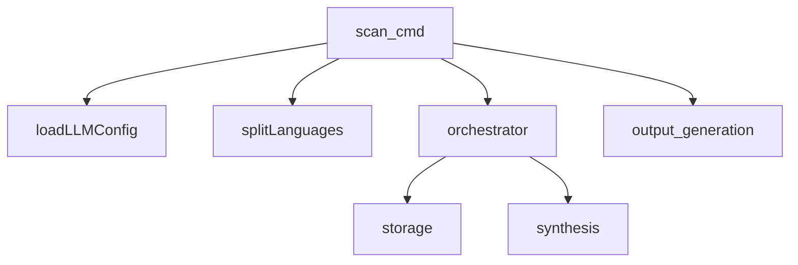
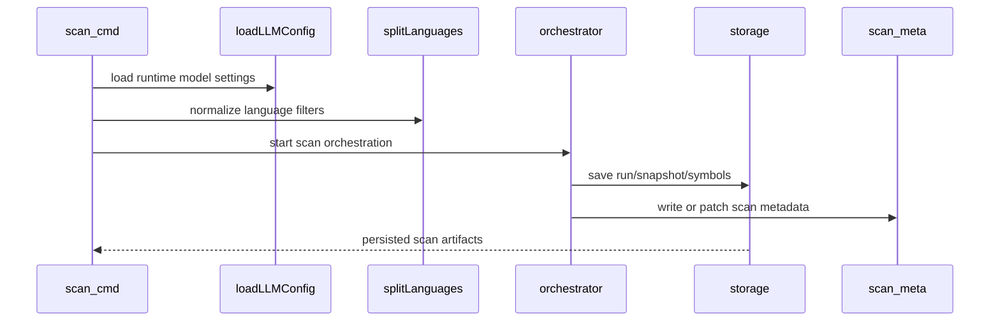

# Scan Workflow Core Module

## Overview

The scan workflow is the entry path that turns a repository snapshot into structured analysis inputs for the rest of Rekipedia. In the Go CLI, this behavior is centered in [`go/cmd/rekipedia/cmd/scan.go`](go/cmd/rekipedia/cmd/scan.go), where the scan command wires together configuration loading, language selection, orchestration, persistence, and output emission. The most important helper functions exposed by the symbol index are [`loadLLMConfig`](go/cmd/rekipedia/cmd/scan.go#L143) and [`splitLanguages`](go/cmd/rekipedia/cmd/scan.go#L165), while the command itself is registered through the package `init` function in the same file ([`init`](go/cmd/rekipedia/cmd/scan.go#L128)). The command depends on core data contracts such as [`LLMConfig`](go/internal/models/contracts.go#L6), [`Config`](go/internal/config/loader.go#L34), [`ScanMeta`](go/internal/models/contracts.go#L147), [`Shard`](go/internal/models/contracts.go#L97), and storage/orchestration APIs in [`go/internal/orchestrator`](go/internal/orchestrator/run_digest.go) and [`go/internal/storage`](go/internal/storage/store.go).

At a high level, the scan workflow does four things:

1. Discover a target repository and build scan context.
2. Split the scan across one or more languages.
3. Load LLM-related configuration into a typed runtime config.
4. Emit scan outputs to storage and/or the filesystem.

> **Sources:** `go/cmd/rekipedia/cmd/scan.go` · L128–L180 · [`loadLLMConfig`](go/cmd/rekipedia/cmd/scan.go#L143) · [`splitLanguages`](go/cmd/rekipedia/cmd/scan.go#L165)

## Input Discovery

The scan flow begins from the CLI layer, which is composed in [`go/cmd/rekipedia/cmd/scan.go`](go/cmd/rekipedia/cmd/scan.go) and invoked from the top-level command tree rooted at [`Execute`](go/cmd/rekipedia/cmd/root.go#L44). Although the analysis payload does not include the full body of the scan command, the symbol index shows the command imports [`internal/config`](go/internal/config/loader.go), [`internal/models`](go/internal/models/contracts.go), [`internal/orchestrator`](go/internal/orchestrator/run_digest.go), [`internal/rag`](go/internal/rag/chunker.go), and [`internal/storage`](go/internal/storage/store.go), which strongly indicates the scan path is responsible for locating the repository, deriving scan metadata, and initializing the downstream processing pipeline.

The observable “discovery” side of the workflow is built around repository-level state rather than per-file interactive behavior. The contracts exposed in [`ScanMeta`](go/internal/models/contracts.go#L147) and [`FileManifest`](go/internal/models/contracts.go#L111) define the shape of information that scan produces and hands off. In practice, scan behavior is likely to start by resolving a root path, reading existing config, and determining which file sets are in scope before orchestration begins. The storage layer’s run lifecycle APIs—such as [`CreateRun`](go/internal/storage/store.go#L116), [`FinishRun`](go/internal/storage/store.go#L125), and [`LatestRunID`](go/internal/storage/store.go#L134)—suggest that scanning is recorded as an explicit run, with outputs associated to a durable run identifier.

The broader repository evidence also shows the orchestrator’s snapshotting machinery in [`Snapshotter`](go/internal/orchestrator/snapshotter.go#L57) and its core method [`(s *Snapshotter).Snapshot`](go/internal/orchestrator/snapshotter.go#L89). That component is responsible for walking a repo, detecting languages, and building manifests. While this page stays focused on scan behavior, it is important that scan consumes such discovered state rather than implementing low-level file traversal itself.

### Discovery boundaries

What is clearly observable:
- Scan is a CLI command in [`go/cmd/rekipedia/cmd/scan.go`](go/cmd/rekipedia/cmd/scan.go).
- It consumes typed config and model contracts from `internal/config` and `internal/models`.
- It feeds into orchestration and persistence rather than directly rendering UI.

What is not directly visible in the payload:
- The exact argument parsing and path-resolution logic in `scan.go`.
- Whether discovery is performed locally in the command or delegated entirely to orchestrator helpers.

> **Sources:** `go/cmd/rekipedia/cmd/scan.go` · L128–L180 · [`Config`](go/internal/config/loader.go#L34) · [`ScanMeta`](go/internal/models/contracts.go#L147) · [`FileManifest`](go/internal/models/contracts.go#L111) · [`Snapshotter`](go/internal/orchestrator/snapshotter.go#L57) · [`(s *Snapshotter).Snapshot`](go/internal/orchestrator/snapshotter.go#L89) · [`CreateRun`](go/internal/storage/store.go#L116) · [`FinishRun`](go/internal/storage/store.go#L125)

## Language Splitting

Language splitting is implemented by [`splitLanguages`](go/cmd/rekipedia/cmd/scan.go#L165), and it is one of the few scan-specific helpers that is explicitly indexed. The presence of a dedicated splitter implies that scan can operate across multiple language targets while keeping each lane separate for downstream handling. This is consistent with the repository’s extractor and orchestrator model, where file type and language are used to route work to the correct handlers.

The symbol index does not expose the function body, but the function name and test coverage in [`TestSplitLanguages`](go/cmd/rekipedia/cmd/root_test.go#L66) suggest the behavior is deterministic and string-driven. The most plausible purpose is to normalize a user-provided language list into a canonical set or slice that can be passed into scan orchestration. That is a critical boundary because later stages—especially snapshotting and sharding—depend on language tags to filter files and batch work sensibly.

There is strong supporting evidence elsewhere in the codebase that language-specific processing is a first-class concern:
- [`detectLanguage`](go/internal/orchestrator/snapshotter.go#L162) identifies languages during snapshot creation.
- [`(r *Registry).ExtractFile`](go/internal/extractor/extractor.go#L37) routes file extraction by extension.
- Language-specific extractors exist for Go, Python, and TypeScript in [`go/internal/extractor/golang.go`](go/internal/extractor/golang.go), [`go/internal/extractor/python.go`](go/internal/extractor/python.go), and [`go/internal/extractor/typescript.go`](go/internal/extractor/typescript.go).

This means `splitLanguages` is best understood as a scan input normalization layer: it prepares the language filter set before snapshotting and extraction, but it does not itself perform semantic extraction.

### Practical role in the scan path

1. User provides one or more languages, often via CLI flags.
2. `splitLanguages` canonicalizes the representation.
3. Orchestrator and snapshotter use the result to restrict which files are considered part of the scan.
4. Extractors consume those files through [`NewRegistry`](go/internal/extractor/extractor.go#L24) and [`MergeResults`](go/internal/extractor/extractor.go#L50).

> **Sources:** `go/cmd/rekipedia/cmd/scan.go` · L165–L180 · [`splitLanguages`](go/cmd/rekipedia/cmd/scan.go#L165) · [`TestSplitLanguages`](go/cmd/rekipedia/cmd/root_test.go#L66) · [`detectLanguage`](go/internal/orchestrator/snapshotter.go#L162) · [`(r *Registry).ExtractFile`](go/internal/extractor/extractor.go#L37) · [`NewRegistry`](go/internal/extractor/extractor.go#L24) · [`MergeResults`](go/internal/extractor/extractor.go#L50)

## LLM Configuration Loading

The scan workflow loads model settings through [`loadLLMConfig`](go/cmd/rekipedia/cmd/scan.go#L143). This is a central piece of scan behavior because the scan command is not just a filesystem operation; it prepares later LLM-driven analysis and synthesis steps that depend on a fully populated [`LLMConfig`](go/internal/models/contracts.go#L6). The function sits in the CLI layer, which means it is the bridge between user-provided flags, configuration files, and the runtime structs consumed by orchestrator and synthesis code.

The contract type itself is defined in [`go/internal/models/contracts.go`](go/internal/models/contracts.go) and includes model/provider-oriented fields; the default values come from [`DefaultLLMConfig`](go/internal/models/contracts.go#L18). On the CLI side, the scan command imports [`internal/config`](go/internal/config/loader.go), so configuration loading is likely layered: file/environment config is resolved first, then projected into the LLM-specific subset needed for scan.

The existence of tests such as [`TestLoadLLMConfig`](go/cmd/rekipedia/cmd/root_test.go#L91) and [`TestLoadLLMConfigDefaults`](go/cmd/rekipedia/cmd/root_test.go#L104) is valuable because it confirms the loader is expected to honor defaults when explicit settings are absent. That aligns with the nearby config-loading logic in [`go/internal/config/loader.go`](go/internal/config/loader.go), which exposes [`Load`](go/internal/config/loader.go#L55), [`DefaultConfig`](go/internal/config/loader.go#L43), and [`applyEnvOverrides`](go/internal/config/loader.go#L74). In other words, `loadLLMConfig` is not the global config engine; it is the scan-specific adapter that extracts and validates the subset required for model usage.

This matters for scan because downstream orchestration passes LLM config into components like:
- [`RunDigest`](go/internal/orchestrator/run_digest.go#L48)
- [`RunUpdate`](go/internal/orchestrator/run_update.go#L30)
- [`RunAsk`](go/internal/orchestrator/run_ask.go#L59)
- synthesis helpers in [`go/internal/synthesis/page_builder.go`](go/internal/synthesis/page_builder.go)

### Configuration flow summary

| Layer | Responsibility | Evidence |
|---|---|---|
| `internal/config` | Load base config from disk/env | [`Load`](go/internal/config/loader.go#L55), [`DefaultConfig`](go/internal/config/loader.go#L43) |
| `cmd/scan.go` | Produce scan-ready LLM subset | [`loadLLMConfig`](go/cmd/rekipedia/cmd/scan.go#L143) |
| `internal/models` | Define typed LLM runtime config | [`LLMConfig`](go/internal/models/contracts.go#L6), [`DefaultLLMConfig`](go/internal/models/contracts.go#L18) |

> **Sources:** `go/cmd/rekipedia/cmd/scan.go` · L143–L161 · [`loadLLMConfig`](go/cmd/rekipedia/cmd/scan.go#L143) · [`LLMConfig`](go/internal/models/contracts.go#L6) · [`DefaultLLMConfig`](go/internal/models/contracts.go#L18) · [`Load`](go/internal/config/loader.go#L55) · [`DefaultConfig`](go/internal/config/loader.go#L43) · [`TestLoadLLMConfig`](go/cmd/rekipedia/cmd/root_test.go#L91) · [`TestLoadLLMConfigDefaults`](go/cmd/rekipedia/cmd/root_test.go#L104)

## Output Generation

Scan output generation is the final stage where the workflow persists results for later use. The analysis payload shows this responsibility split across several subsystems rather than a single monolithic writer:

- [`WriteScanMeta`](go/internal/rag/scan_meta.go#L24) and [`PatchScanMeta`](go/internal/rag/scan_meta.go#L52) manage scan metadata files.
- [`WriteRefactorOutputs`](go/internal/analysis/refactor_writer.go#L269) is for refactor outputs, but it demonstrates the repository’s general output-writing pattern.
- [`WriteAgentFiles`](go/internal/config/agent.go#L76) writes generated agent files when the config workflow requires it.
- The storage layer persists durable records via [`UpsertRun`](go/internal/storage/aliases.go#L9), [`UpsertSnapshot`](go/internal/storage/aliases.go#L14), [`UpsertSymbols`](go/internal/storage/aliases.go#L49), and [`UpsertRelationships`](go/internal/storage/aliases.go#L54).

For scan specifically, the important point is that output generation is not just “printing results.” It is a structured emission step that stores both scan metadata and derived analysis artifacts. The `ScanMeta` type in [`go/internal/rag/scan_meta.go`](go/internal/rag/scan_meta.go) includes timestamps and file pointers, and its helper functions suggest scan completion is tracked through a metadata file that can later be updated by downstream steps.

A practical scan output sequence likely looks like this:
1. Run is created in storage.
2. Repository snapshot and extracted symbols/relationships are persisted.
3. Scan metadata is written or patched.
4. Downstream synthesis or embedding steps consume those outputs.

The key design observation is that output generation is storage-first and artifact-driven. That makes scan reusable for other commands, because later operations can rely on persisted run state rather than recomputing everything from scratch.

> **Sources:** `go/internal/rag/scan_meta.go` · L12–L81 · [`WriteScanMeta`](go/internal/rag/scan_meta.go#L24) · [`ReadScanMeta`](go/internal/rag/scan_meta.go#L39) · [`PatchScanMeta`](go/internal/rag/scan_meta.go#L52) · `go/internal/storage/store.go` · L116–L171 · [`CreateRun`](go/internal/storage/store.go#L116) · [`SaveSymbols`](go/internal/storage/store.go#L149) · [`SaveRelationships`](go/internal/storage/store.go#L200) · [`UpsertSnapshot`](go/internal/storage/aliases.go#L14) · [`UpsertSymbols`](go/internal/storage/aliases.go#L49)

## Cross-Module Dependency Table

| Module | Imports From | Called By | Calls Into | Inherits From |
|--------|-------------|-----------|------------|---------------|
| `go/cmd/rekipedia/cmd/scan.go` | `internal/config`, `internal/models`, `internal/orchestrator`, `internal/rag`, `internal/storage` | CLI root command tree | Orchestrator, config loader, storage, RAG metadata helpers | — |
| `go/internal/config/loader.go` | `internal/models` | `scan.go`, other CLI commands | Model config defaults, env/file loaders | — |
| `go/internal/orchestrator` | `internal/analysis`, `internal/extractor`, `internal/llm`, `internal/models`, `internal/storage`, `internal/synthesis` | CLI commands including scan | Snapshotting, sharding, extraction, synthesis, persistence | — |
| `go/internal/rag/scan_meta.go` | `encoding/json`, `os`, `path/filepath`, `time` | scan/embedding workflows | Filesystem metadata I/O | — |
| `go/internal/storage/store.go` | `database/sql`, `modernc.org/sqlite`, `internal/models` | orchestrator, CLI export paths | Durable run/snapshot/symbol/page persistence | — |

## Module Coupling

The scan workflow is tightly coupled to orchestrator and storage, and only loosely coupled to the rest of the command set. The strongest coupling is between [`loadLLMConfig`](go/cmd/rekipedia/cmd/scan.go#L143) and the config/model contracts in [`LLMConfig`](go/internal/models/contracts.go#L6), plus the handoff from scan into storage-backed run management. This makes sense: scan is the top-level coordinating action, and almost every useful result needs to be persisted.

### Tightly coupled pairs
- `scan.go` ↔ `internal/orchestrator`
- `scan.go` ↔ `internal/config`
- `orchestrator` ↔ `internal/storage`
- `orchestrator` ↔ `internal/extractor`

### Loosely coupled or isolated from scan
- Search-specific helpers such as [`tokenizeSymbol`](go/cmd/rekipedia/cmd/search.go#L20) and [`scoreBM25`](go/cmd/rekipedia/cmd/search.go#L54)
- Refactor-only logic such as [`staticWalk`](go/cmd/rekipedia/cmd/refactor.go#L75) and [`buildStaticReport`](go/cmd/rekipedia/cmd/refactor.go#L148)

### Circular dependencies
No scan-specific circular dependency is directly evidenced in the provided analysis data.

> **Sources:** `go/cmd/rekipedia/cmd/scan.go` · L128–L180 · [`loadLLMConfig`](go/cmd/rekipedia/cmd/scan.go#L143) · [`splitLanguages`](go/cmd/rekipedia/cmd/scan.go#L165) · `go/internal/orchestrator/run_digest.go` · [`RunDigest`](go/internal/orchestrator/run_digest.go#L48) · `go/internal/config/loader.go` · [`Load`](go/internal/config/loader.go#L55) · `go/internal/storage/store.go` · [`SaveSymbols`](go/internal/storage/store.go#L149)