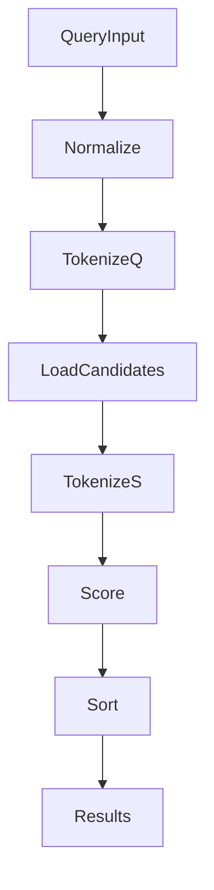

# Symbol Search Subsystem and Relevance Scoring

The symbol-search subsystem in Rekipedia is a lightweight, lexical search path used to retrieve candidate symbols from stored analysis data. In the Go implementation, its core lives in [`tokenizeSymbol`](go/cmd/rekipedia/cmd/search.go#L20), [`scoreBM25`](go/cmd/rekipedia/cmd/search.go#L54), and the [`result`](go/cmd/rekipedia/cmd/search.go#L97) record type. The Python analysis side also contains a similarly named search routine in `src/rekipedia/analysis/cross_repo_search.py`, but this page focuses on the Go CLI subsystem because that is where the exposed search command and ranking logic are defined.

The search pipeline is intentionally simple: normalize the user query, tokenize symbol names and query text, compute a BM25-style relevance score, and return a ranked list of results. The search code is designed to consume inputs produced by other commands such as scan-related workflows, but this page does not cover those commands beyond their role in populating search data.

## Tokenization

Tokenization is handled by [`tokenizeSymbol`](go/cmd/rekipedia/cmd/search.go#L20), which breaks a symbol name into searchable terms. From the surrounding imports and the function’s placement, the function is clearly intended to support matching across naming styles such as camelCase, PascalCase, underscores, and other symbol-like punctuation. The file also imports `regexp`, `strings`, and `unicode`, which strongly suggests the tokenizer performs character-class splitting, lowercasing, and normalization before scoring.

This matters because symbol search is not full-text search over natural language prose; it is optimized for code identifiers. A tokenizer for code must make `BuildMarkdown`, `ParseEnrichment`, or other prose-heavy operations irrelevant here and instead preserve meaningful identifier boundaries. In practice, this means a query like `tokenize symbol` should be able to match a symbol such as `tokenizeSymbol`, even if the user enters spaces or mixed casing.

The analysis data does not expose a separately named query-normalization helper in this file. However, because `tokenizeSymbol` is paired with `scoreBM25`, the normalization responsibility is likely folded into token generation and lowercasing inside the tokenizer itself.

> **Sources:** `go/cmd/rekipedia/cmd/search.go` · L20–L51 · [`tokenizeSymbol`](go/cmd/rekipedia/cmd/search.go#L20)

## Scoring

Relevance is computed by [`scoreBM25`](go/cmd/rekipedia/cmd/search.go#L54), a BM25-inspired ranking function. The name is explicit: this is not cosine similarity or embedding search, but classic term-frequency / inverse-document-frequency ranking adapted for symbol tokens.

BM25 is a good fit for symbol retrieval because:

- identifiers are short;
- exact term presence should matter more than approximate semantics;
- partial matches should still contribute if the tokenization step decomposes identifiers well.

The relationship data shows that `scoreBM25` is called from the higher-level search flow in the Python analysis module (`_score_bm25` in `src/rekipedia/analysis/cross_repo_search.py`) and from symbol search in the Go command. That suggests a common design pattern: tokenization first, then ranking second, then result assembly.

The exact internal BM25 parameters are not visible in the analysis payload, so this documentation does not claim specific constants or field weights. What is observable is the function boundary and its role as the core ranking primitive.

> **Sources:** `go/cmd/rekipedia/cmd/search.go` · L54–L71 · [`scoreBM25`](go/cmd/rekipedia/cmd/search.go#L54)

## Result Shapes

The primary return shape documented in the search subsystem is the [`result`](go/cmd/rekipedia/cmd/search.go#L97) type. The analysis data shows it as a struct defined in `go/cmd/rekipedia/cmd/search.go`, lines 97–102, but the individual fields are not included in the symbol payload. Because of that, we can only say with certainty that the search pipeline returns a structured record type, not a raw string slice.

This is important for downstream consumers because a result record typically carries more than just the symbol name: it likely includes ranking score, file path, and display metadata needed for CLI presentation. The same general pattern appears elsewhere in the codebase—for example, `go/internal/rag/vector_store.go` defines [`SearchResult`](go/internal/rag/vector_store.go#L21) for vector search—but the symbol-search subsystem uses its own [`result`](go/cmd/rekipedia/cmd/search.go#L97) type rather than reusing the RAG record.

### Ranking and Record Type Table

| Function / Type | File | Responsibility | Returned / Produced Shape |
|---|---|---|---|
| [`tokenizeSymbol`](go/cmd/rekipedia/cmd/search.go#L20) | `go/cmd/rekipedia/cmd/search.go` | Split symbol names into searchable tokens | Token list / normalized token stream |
| [`scoreBM25`](go/cmd/rekipedia/cmd/search.go#L54) | `go/cmd/rekipedia/cmd/search.go` | Compute BM25-style relevance score | Numeric score |
| [`result`](go/cmd/rekipedia/cmd/search.go#L97) | `go/cmd/rekipedia/cmd/search.go` | Hold a ranked search hit | Struct record |
| [`SearchResult`](go/internal/rag/vector_store.go#L21) | `go/internal/rag/vector_store.go` | Vector-store search hit shape | Separate RAG record type |

The table above intentionally separates the symbol-search record shape from the RAG subsystem’s [`SearchResult`](go/internal/rag/vector_store.go#L21). They are distinct mechanisms: symbol search is lexical/BM25-driven, while the vector store is embedding-based.

> **Sources:** `go/cmd/rekipedia/cmd/search.go` · L97–L102 · [`result`](go/cmd/rekipedia/cmd/search.go#L97); `go/internal/rag/vector_store.go` · L21–L24 · [`SearchResult`](go/internal/rag/vector_store.go#L21)

## Query Flow

At a high level, search follows this path:

1. A user-entered query reaches the search command.
2. The query is normalized and tokenized.
3. Candidate symbols are tokenized with [`tokenizeSymbol`](go/cmd/rekipedia/cmd/search.go#L20).
4. Each candidate is scored with [`scoreBM25`](go/cmd/rekipedia/cmd/search.go#L54).
5. The results are sorted and returned as [`result`](go/cmd/rekipedia/cmd/search.go#L97) records.

The exact command handler is not shown in the symbol list, but the presence of an `init` function in `go/cmd/rekipedia/cmd/search.go` indicates the search command is registered through Cobra in the usual CLI pattern. The command itself is therefore the entry point for the subsystem, while the ranking functions remain pure helpers.

In terms of relevance, the flow is optimized around “search inputs” rather than arbitrary repository operations. Inputs may come from repository analysis data created by scan/update workflows, but those workflows are outside the scope of this page except to note that they populate the search corpus.

### Query-to-Result Processing Diagram

This diagram reflects the observable structure of the subsystem: query normalization, tokenization, scoring, sorting, and record emission. It does not assume hidden storage details beyond what the symbols and relationships show.

> **Sources:** `go/cmd/rekipedia/cmd/search.go` · L20–L142 · [`tokenizeSymbol`](go/cmd/rekipedia/cmd/search.go#L20), [`scoreBM25`](go/cmd/rekipedia/cmd/search.go#L54), [`result`](go/cmd/rekipedia/cmd/search.go#L97)

## Cross-Module Perspective

Although the search subsystem is localized to `go/cmd/rekipedia/cmd/search.go`, it sits within a broader system that stores symbols in SQLite and exposes them through the CLI. The search command imports `github.com/unrealandychan/rekipedia/internal/storage`, which indicates results are drawn from persisted analysis data rather than ad hoc filesystem traversal.

| Module | Imports From | Called By | Calls Into | Inherits From |
|---|---|---|---|---|
| `go/cmd/rekipedia/cmd/search.go` | `fmt`, `regexp`, `sort`, `strings`, `unicode`, `github.com/spf13/cobra`, `github.com/unrealandychan/rekipedia/internal/storage` | CLI root registration | Storage-backed retrieval and local ranking helpers | — |
| `go/internal/storage/store.go` | `database/sql`, `modernc.org/sqlite`, `github.com/unrealandychan/rekipedia/internal/models` | CLI commands including search | Persistent symbol storage / lookup | — |
| `go/cmd/rekipedia/cmd/scan.go` | `internal/storage`, `internal/rag`, `internal/orchestrator` | CLI workflows that populate data | Produces inputs later consumed by search | — |

This is the key architectural point: search is not responsible for discovery or extraction. It is a ranking layer over already-available symbol metadata.

> **Sources:** `go/cmd/rekipedia/cmd/search.go` · L20–L142 · [`tokenizeSymbol`](go/cmd/rekipedia/cmd/search.go#L20), [`scoreBM25`](go/cmd/rekipedia/cmd/search.go#L54), [`result`](go/cmd/rekipedia/cmd/search.go#L97); `go/internal/storage/store.go` · L149–L195 · `go/internal/storage/store.go` · L223–L242