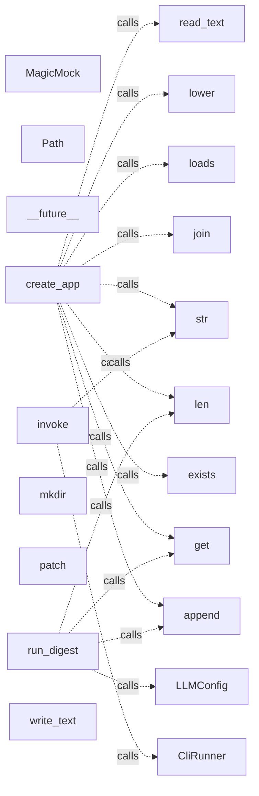

```mermaid
flowchart LR
  CliRunner["CliRunner"]
  LLMConfig["LLMConfig"]
  MagicMock["MagicMock"]
  Path["Path"]
  __future__["__future__"]
  append["append"]
  create_app["create_app"]
  exists["exists"]
  get["get"]
  invoke["invoke"]
  join["join"]
  len["len"]
  loads["loads"]
  lower["lower"]
  mkdir["mkdir"]
  patch["patch"]
  read_text["read_text"]
  run_digest["run_digest"]
  str["str"]
  write_text["write_text"]

  create_app -.->|calls| append
  create_app -.->|calls| exists
  create_app -.->|calls| get
  create_app -.->|calls| join
  create_app -.->|calls| len
  create_app -.->|calls| loads
  create_app -.->|calls| lower
  create_app -.->|calls| read_text
  create_app -.->|calls| str
  invoke -.->|calls| CliRunner
  invoke -.->|calls| str
  run_digest -.->|calls| LLMConfig
  run_digest -.->|calls| append
  run_digest -.->|calls| get
  run_digest -.->|calls| len

```
